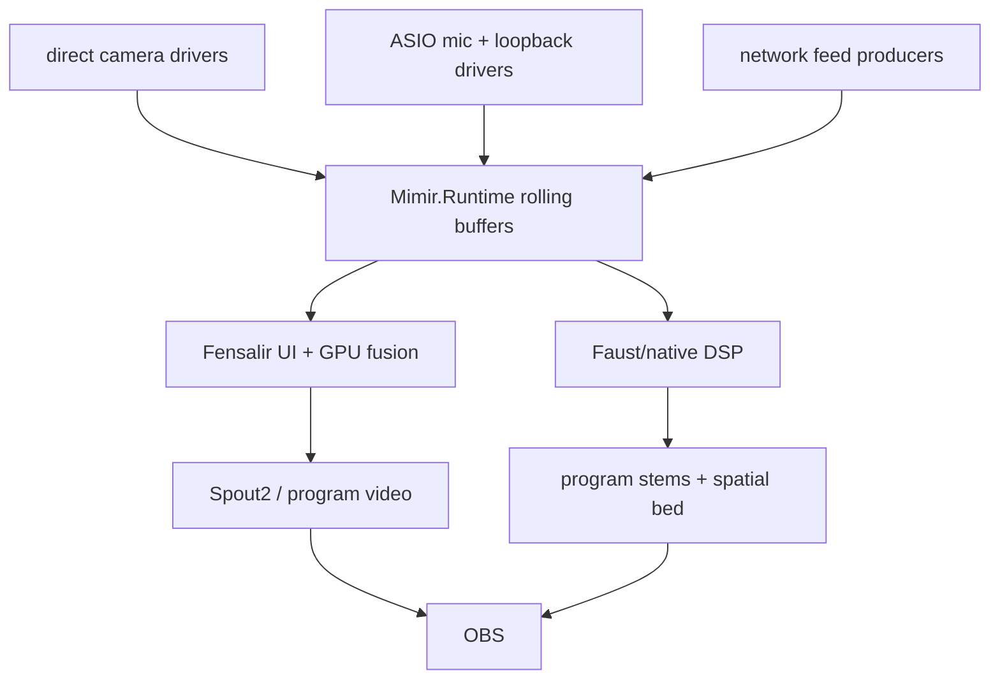
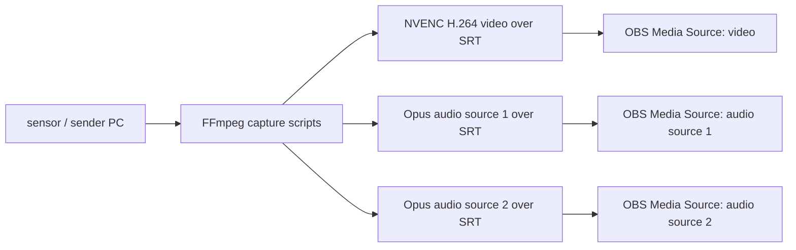

# Mimir


Mimir is the realtime field machine for turning a roomful of cameras,
microphones, speakers, loopbacks, and network feeds into one coherent
OBS-facing program surface.

The plain version: Mimir is trying to make a room computable.

A normal streaming setup sees loose devices. A webcam has its clock, a mic has
another clock, speakers add their own delay, and OBS receives whatever arrives.
That is enough for a flat livestream. It is not enough to know where a voice
came from, how a sound moved through the room, where a hand was in space, or how
multiple cameras should agree about the same body.

Mimir treats the room as one measured field instead. If the system can line up
audio and video evidence tightly enough, the computer can stop guessing from
isolated feeds and start reconstructing events in space and time.

That unlocks the real value:

- volumetric sound fields, where voices and reflections can be placed in the
  room instead of flattened into left/right audio;
- realtime voice separation, because each microphone hears the same source at a
  slightly different time and frequency shape;
- precise localization of chirp emitters and receivers, because a coded chirp
  can act like an acoustic ruler through the room;
- marker-free, or preferably marker-assisted, motion capture from synchronized
  cameras and timing sensors;
- realtime "4D" Gaussian splatting, where Fensalir can update a live volumetric
  scene over time instead of rendering a static reconstruction;
- augmented reality and virtual avatar mapping that are anchored to the actual
  room, not just a camera overlay.

The work is not to collect impressive device counts. The work is to recover a
live field: synchronized video evidence for Fensalir GPU fusion, synchronized
audio evidence for a volumetric sound field, and final outputs that OBS can use
without pretending raw unsynchronized sources are a world.

Start with:

- [docs/perfect-machine.md](docs/perfect-machine.md) for the target machine.
- [docs/viable-stream-app.md](docs/viable-stream-app.md) for the first usable
  app cut.
- [docs/audio-field.md](docs/audio-field.md) for the current audio-side map.
- [docs/native-capture-cadence.md](docs/native-capture-cadence.md) for measured
  camera/sensor evidence.
- [docs/code-algorithm-map.md](docs/code-algorithm-map.md) for the current
  source-level code map.

Naming note: **Fensalir** is the engine/windowing/rendering/D3D12 layer. Older
research notes may still use the previous engine name.

## Machine Shape



Ownership is deliberately narrow:

- `Mimir.Runtime` owns stream identity, bounded rolling buffers, timing state,
  and synchronization contracts.
- Native capture workers own device reads and append typed sample handles.
- Fensalir owns the window, UI, D3D12 bridge, visual fusion, and program video
  publication.
- Faust/native DSP owns hot audio alignment, resampling, suppression,
  separation, spatialization, and stems.
- OBS owns broadcast composition. It does not own synchronization.

The default runtime window is five seconds. That is not accidental latency. It
is the compute budget for lining up independent clocks, absorbing late network
feeds, and extracting a coherent field before the audience sees it.

## Why The Precision Matters

Mimir's sync work is not audiophile fussing. At room scale, tiny timing errors
turn directly into location errors. Sound moves about 34 centimeters in one
millisecond. At microsecond precision, delay already becomes useful spatial
evidence. At the nanosecond-precision target, timing is no longer a vague
latency number; it is a measurement surface.

The active audio calibration uses coded chirps. A chirp sweeps through
frequencies; a chirplet transform lets Mimir identify exactly which little sweep
arrived, when it arrived, and how the speaker, room, and microphone changed its
frequency response. That gives the system two useful facts at once:

- timing: how late each microphone or receiver is relative to the reference;
- coloration: which frequencies each path hears clearly, weakly, or falsely.

Timing alignment lets voices separate because the same voice reaches each mic
at a different moment. Frequency-response normalization makes those microphones
more comparable, so the separation and spatialization code is not constantly
fooled by one device being brighter, duller, or more room-colored than another.

The same idea applies to chirp emitters and receivers in space. If Mimir knows
when a coded sound was emitted and when each receiver heard it, the delay
measurements become distance constraints. Enough constraints let the system
localize where emitters and receivers are inside the room.

On the visual side, Fensalir's sensor fusion and reservoir sampling work are
the matching half of the same argument. Instead of treating every camera frame
as a disposable picture, Fensalir can preserve a rolling, sampled memory of
visual evidence across time: features, surfaces, splats, confidence, and
motion. Combined with synchronized cameras and timing sensors, that reservoir
is what can support live "4D" Gaussian splatting, marker-assisted or
marker-free motion capture, AR anchoring, and avatar mapping.

## Current Audio Spine

Starfire, the main Mimir host, now has a Scarlett Solo 4th Gen on Focusrite USB
ASIO:

- 4 ASIO inputs / 2 outputs at up to `192 kHz`
- `Input 1`, `Input 2`, `Loopback 1`, `Loopback 2`
- `Int32LSB` sample format
- 192-frame preferred ASIO buffers

The important result is local ownership of the timing reference. We do not need
Raven, the game machine, to carry the soundfield workload just to get program
loopback. Raven can run games; Starfire can capture ASIO mic inputs plus ASIO
loopback and do the alignment work.

Raven also has a loopback-capable Scarlett at `192 kHz` for the co-streamer
side. Its Focusrite USB ASIO path exposes `Input 1`, `Input 2`, `Loopback 1`,
and `Loopback 2`, so Raven can publish precise game/co-streamer timing evidence
back to Starfire without owning the heavy soundfield or sensor-fusion workload.

The repo contains a native ASIO probe:

```powershell
cmake -S native/probes/asio_audio_cadence -B native/probes/asio_audio_cadence/build
cmake --build native/probes/asio_audio_cadence/build --config Release

.\native\probes\asio_audio_cadence\build\Release\asio_audio_cadence.exe `
  --set-sample-rate 192000 `
  --capture-seconds 5
```

It also has a monitor sweep mode:

```powershell
.\native\probes\asio_audio_cadence\build\Release\asio_audio_cadence.exe `
  --set-sample-rate 192000 `
  --monitor-sweep `
  --sweep-gain 0.02
```

That sweep proved the digital ASIO loopback path cleanly detects emitted tones
through `40 kHz`, while the current studio-monitor-to-mic acoustic path falls
off hard above the high audible band. Translation: ASIO loopback is an excellent
local timing reference; strong ultrasonic room sync still needs measured
hardware that earns the claim.

Next audio cuts:

1. Use ASIO loopback as the canonical program/timing reference.
2. Learn per output/mic chirp-bin response models and adapt the codebook to the
   bands that survive the actual room.
3. Align all mic streams with fractional-delay and sample-rate-offset state.
4. Move the hot actuator into Faust/native DSP.
5. Emit separately controllable OBS stems plus a spatial bed from the same
   synchronized window.

## Chirplet And Watermark Sync

Mimir has three audio timing modes:

- `passive`: stay silent and estimate delay from program audio using
  PHAT-weighted cross-spectrum correlation.
- `chirp-only`: emit the deterministic calibration timeline and decode timing
  from active chirplet evidence.
- `hybrid`: prefer passive timing, then emit a low-gain coded watermark only
  while passive confidence is weak.

The active sync machine is intentionally codebook-shaped. The research trail
showed that generic dense chirplet matching is the wrong hot path for our
controlled beacon. The current hybrid watermark uses `MimirChirpBinTimeline`: a
fixed-slope chirp-bin codebook decoded by dechirp plus a small Goertzel/bin
bank, then code-valid de Bruijn triplets become canonical timeline anchors.
Reports expose fractional delay and `delayUs`; the synthetic 192 kHz proof now
recovers a delayed stream below printed microsecond precision. Physical
calibration persists usable bands, expected/observed bin confusion, phase,
group-delay, delay hypotheses, and an adaptive codebook plan per output/mic
path.

For the long-form reasoning and source trail, read:

- [docs/audio-field.md](docs/audio-field.md) for the live decoder model,
  timing modes, and ASIO/acoustic measurements.
- [research/chirplet-sync-decoder/summary.md](research/chirplet-sync-decoder/summary.md)
  for the dechirp/FFT correction and what got cut.
- [research/chirplet-sync-decoder/bibliography.md](research/chirplet-sync-decoder/bibliography.md)
  for mirrored papers and code references.
- [research/live-adaptive-sync/summary.md](research/live-adaptive-sync/summary.md)
  for passive sync and sample-rate-offset research.
- [research/feedback-calibration/summary.md](research/feedback-calibration/summary.md)
  for room/speaker/mic feedback calibration.

## Current Visual Spine

The local camera rig is being pulled close to the drivers, not through OpenCV or
general-purpose media stacks in the hot loop. Current evidence lives in
[docs/native-capture-cadence.md](docs/native-capture-cadence.md).

Known shape:

- Leap stereo IR is the timing-camera candidate.
- PS3 Eyes are high-rate tracking witnesses.
- Kiyo/Kiyo Pro provide RGB context, with the Kiyo Pro still limited by its
  current USB/cadence behavior.
- Fensalir owns the GPU fusion work: feature extraction, temporal accumulation,
  splats/surface claims, material fitting, rendering, UI, and Spout2 output.

Next visual cuts:

1. Replace diagnostic frame-event probes with direct native capture workers.
2. Preserve device or immediate receipt timestamps at the driver boundary.
3. Feed typed frame handles into `Mimir.Runtime` and the native reservoir.
4. Let Fensalir consume the synchronized window for volumetric sensor fusion.

## Bridge Scripts

The repo still keeps FFmpeg/SRT scripts because they are useful OBS-compatible
edges. They are not the final synchronization authority.



Use the bridge when OBS needs a stable LAN input today. Do not mistake it for
the coherent field machine.

## Repo Shape

- `Mimir.slnx`: C# app/runtime solution.
- `src/Mimir.App`: Fensalir-hosted window/render app.
- `src/Mimir.Runtime`: rolling buffers, stream sources, synchronization state,
  and runtime contracts.
- `native/reservoir`: lower native rolling-buffer ABI for Fensalir/Faust
  integration.
- `native/probes`: direct hardware probes and cadence witnesses.
- `config/*.example.json`: live system profiles.
- `state/` and `notes/`: current map, handoff, and evidence ledger.

## Quick Start

Build the app/runtime:

```powershell
dotnet build .\Mimir.slnx
```

Build the current ASIO probe:

```powershell
cmake -S native/probes/asio_audio_cadence -B native/probes/asio_audio_cadence/build
cmake --build native/probes/asio_audio_cadence/build --config Release
```

Run the synthetic sync proofs:

```powershell
dotnet run --project .\src\Mimir.BufferSmoke\Mimir.BufferSmoke.csproj -- --hybrid-sync-self-test
dotnet run --project .\src\Mimir.BufferSmoke\Mimir.BufferSmoke.csproj -- --chirp-bin-self-test
dotnet run --project .\src\Mimir.BufferSmoke\Mimir.BufferSmoke.csproj -- --passive-sync-self-test
```

Run the old OBS bridge only when you need the compatibility path:

```powershell
.\scripts\sender-discover.ps1
.\scripts\sender-start.ps1 -Config .\config\localcast.json -DryRun
```

## Helping

Audio-side help is especially useful around:

- Fractional-delay lines and variable-rate resampling.
- Sample-rate-offset estimation over a rolling window.
- GCC-PHAT/passive program-audio timing under music/game audio.
- Low-annoyance watermark design that remains decodable under room coloration.
- Faust/native DSP integration for aligned stems and spatial bed generation.

Visual-side help is useful around:

- Direct Windows camera capture paths and timestamp preservation.
- GPU-resident frame handles and D3D12 interop.
- Cross-camera feature matching, temporal accumulation, splats, and surface
  confidence.
- Fensalir UI surfaces for buffer depth, health, drift, and calibration state.

## Rehydrate State

For current local truth, read the map and evidence rather than guessing from
old scars:

```powershell
git status --short --branch
git log --oneline -5
Get-Content .\state\map.yaml
Get-Content .\notes\fresh-workspace-handoff.md
Get-Content .\notes\current-system-map.md
Get-Content .\state\evidence.jsonl -Tail 12
```

Mimir is also the repo Face: a persistent agent identity that uses the VoidBot
layer for communication and heartbeats. Its birth memory, jurisdiction, voice,
and heartbeat contract live in [docs/mimir-face.md](docs/mimir-face.md); its
VoidBot-facing identity and typed Face state live under `.voidbot/voice/` and
`.voidbot/state/`.
