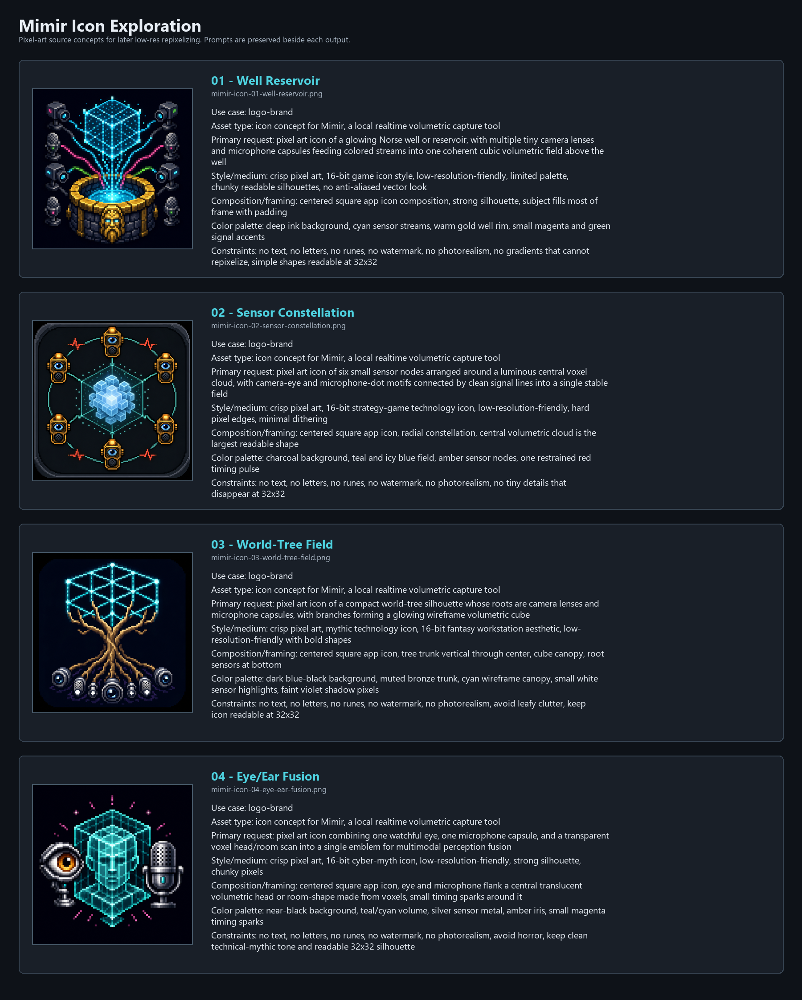
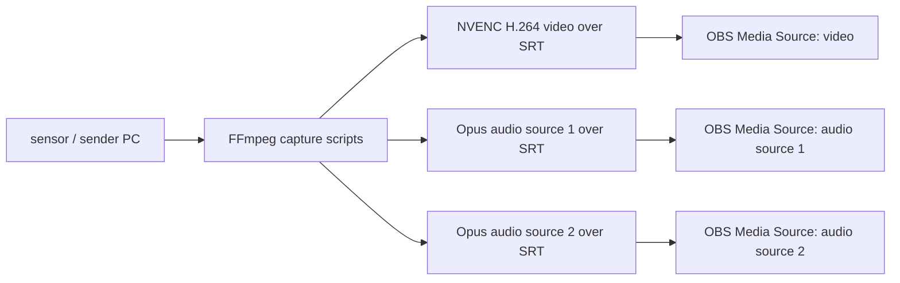

# Mimir

Mimir turns a roomful of local cameras, microphones, speakers, and timing
signals into one realtime coherent volumetric field.

The public job is simple: make the physical room available as a synchronized
OBS-facing program surface. The actual machine stays disciplined. Mimir owns
configuration, calibration, launch, status, and typed contracts; Aquarium owns
GPU fusion and Spout publication; Faust owns hot audio DSP; OBS owns broadcast
composition. The old SRT bridge is compatibility scaffolding over the same
boring truth: stable endpoints beat theatrical plumbing.

Start with `docs/perfect-machine.md` for the live architecture.

## Branding

Working display name: **Mimir**.

Short pitch:

> Local sensors, coherent field.

Icon exploration lives in `assets/branding/`. The current contact sheet pairs
four pixel-art Imagegen outputs with the prompts used to make them:




Mimir is also the repo Face: a persistent agent identity that uses the VoidBot
layer for communication and heartbeats. Its birth memory, jurisdiction, voice,
and heartbeat contract live in `docs/mimir-face.md`; its VoidBot-facing identity
and typed Face state live under `.voidbot/voice/` and `.voidbot/state/`.

V1 does not fork OBS. OBS already accepts SRT Media Sources, and FFmpeg can
capture Windows desktop/audio while encoding video with `h264_nvenc`. The first
LAN bridge is:



The video stream is encoded on the sender. Audio sources are separate endpoints
so OBS can mix, mute, filter, and monitor them independently.

## Audio Field

The expanded rig has a separate audio-field spine for six microphones and two calibration speakers. Start with `docs/audio-field.md` and `config/audio-field.example.json`.

That path is stricter than the OBS endpoint path: microphones feeding the Ambisonic field need one synchronized capture device, explicit geometry, and calibration before they become an AmbiX FOA bus. Separate USB microphones can still be investigated, but they do not get waved through as a coherent field just because the JSON is feeling brave.

## Current Status

This repo is the first coherent scaffold for Mimir: architecture docs,
persistence machinery, and Windows scripts for device discovery, config
validation, and FFmpeg command generation. The deeper target is the native
five-second reservoir feeding Aquarium and Faust; the bridge scripts remain the
plain, inspectable path into OBS while the field machine grows teeth.

## Quick Start

1. Install OBS on the receiver.
2. Install FFmpeg on the sender, with `srt` protocol and `h264_nvenc` encoder enabled.
3. Copy `config/localcast.example.json` to `config/localcast.json`.
4. On the sender, list capture devices:

```powershell
.\scripts\sender-discover.ps1
```

5. Edit `config/localcast.json` with the receiver IP and chosen DirectShow audio device names.
6. Dry-run the generated FFmpeg commands:

```powershell
.\scripts\sender-start.ps1 -Config .\config\localcast.json -DryRun
```

7. Start the sender:

```powershell
.\scripts\sender-start.ps1 -Config .\config\localcast.json
```

8. In OBS on the receiver, add one Media Source per URL from `docs/obs-receiver-setup.md`.
9. Before expanding the receiver path, run the bounded OBS smoke ledger in
   `docs/obs-v1-smoke-test.md`.

## Why SRT Media Sources First

OBS documents SRT playback through VLC Source or Media Source, and Media Source can listen on `srt://0.0.0.0:PORT?mode=listener&timeout=5000000` with `mpegts` input format. FFmpeg also documents SRT protocol support and Windows capture devices through `dshow`/`gdigrab`. That gives us a standard, inspectable path before native OBS code starts making expensive promises.

## Repo State

Rehydrate with the bundled Python from this Codex workstation, or any normal Python 3:

```powershell
& 'C:\Users\Meta\.cache\codex-runtimes\codex-primary-runtime\dependencies\python\python.exe' .\tools\localcast_state.py status
Get-Content .\state\map.yaml
Get-Content .\notes\fresh-workspace-handoff.md
Get-Content .\notes\current-system-map.md
```
