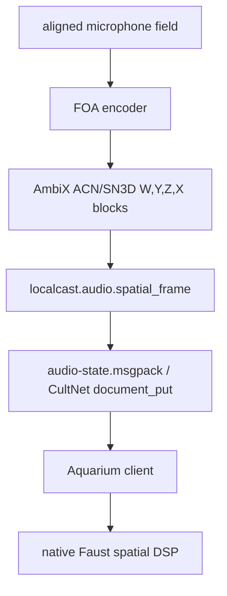

# Aquarium Spatial Audio

## Objective

Publish the live spatial audio field through the same typed state discipline as the splat renderer. Aquarium consumes the AmbiX bus and hands it to native Faust DSP; LocalCastBridge owns capture, sync, calibration, and stream timing.

## Current Mechanism



Live files:

- `calibration/runs/audio-state.msgpack`: latest typed AmbiX audio block.
- `calibration/runs/audio-stream-status.msgpack`: audio publisher heartbeat.

Document type:

- `localcast.audio.spatial_frame`
- schema id: `gamecult.localcast.audio.spatial_frame.v1`
- key: `localcast.audio.spatial-frame.live`
- payload: MessagePack array decoded as `CultSpatialAudioFrame`
- audio format: interleaved `float32`, 48 kHz, AmbiX ACN/SN3D channels `W,Y,Z,X`

Publisher smoke command:

```powershell
.\.venv\Scripts\python.exe .\scripts\stream_spatial_audio.py --input .\calibration\runs\audio-full-sync-20260518-165751\field-foa-ambix.wav --loop --duration 5 --smoke-readback
```

## Invariants

- Aquarium owns rendering and Faust DSP, not microphone capture or clock correction.
- LocalCastBridge publishes declared AmbiX blocks, not undecoded heterogeneous microphone channels.
- The audio frame carries `start_sample` and `audio_time_ns` so visual packets can align against the same bounded-latency timeline.
- OBS may receive a rendered monitor output later, but OBS is not the spatial bus authority.
