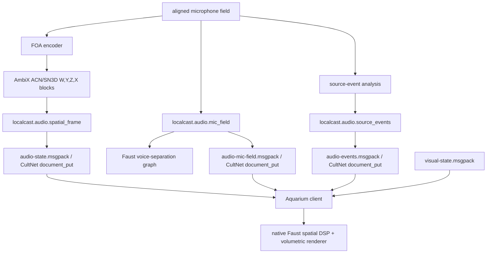

# Aquarium Spatial Audio

## Objective

Publish the live spatial audio field through the same typed state discipline as the splat renderer. Aquarium consumes the AmbiX bus and hands it to native Faust DSP; LocalCastBridge owns capture, sync, calibration, and stream timing.

## Current Mechanism



Live files:

- `calibration/runs/audio-state.msgpack`: latest typed AmbiX audio block.
- `calibration/runs/audio-mic-field.msgpack`: latest aligned six-mic block for Faust voice separation.
- `calibration/runs/audio-stream-status.msgpack`: audio publisher heartbeat.
- `calibration/runs/audio-events.msgpack`: latest typed dialogue-focus and transient vector field.
- `calibration/runs/av-sync-status.json`: current Aquarium/Spout publisher view of visual frame id, audio frame id, audio delta, and synchronized event overlay count.

Document type:

- `localcast.audio.spatial_frame`
- schema id: `gamecult.localcast.audio.spatial_frame.v1`
- key: `localcast.audio.spatial-frame.live`
- payload: MessagePack array decoded as `CultSpatialAudioFrame`
- audio format: interleaved `float32`, 48 kHz, AmbiX ACN/SN3D channels `W,Y,Z,X`

Source event document type:

- `localcast.audio.source_events`
- schema id: `gamecult.localcast.audio.source_events.v1`
- key: `localcast.audio.source-events.live`
- payload: MessagePack array decoded as `CultAudioSourceEvents`
- contents: dialogue anchor weights plus witness-dominant transient events with sample time, estimated room position, direction, energy, confidence, and kind.

Mic-field document type:

- `localcast.audio.mic_field`
- schema id: `gamecult.localcast.audio.mic_field.v1`
- key: `localcast.audio.mic-field.live`
- payload: MessagePack array decoded as `CultAudioMicFieldFrame`
- audio format: interleaved `float32`, 48 kHz, aligned mic channels
- default channel order: `host-focusrite`, `co-streamer-focusrite`, `kiyo-0`, `kiyo-1`, `ps-eye-0`, `ps-eye-1`
- graph id: `localcast.faust.voice_separation.v1`
- Faust source: `faust/localcast_voice_separation.dsp`

AmbiX replay smoke command:

```powershell
.\.venv\Scripts\python.exe .\scripts\stream_spatial_audio.py --input .\calibration\runs\audio-full-sync-20260518-165751\field-foa-ambix.wav --loop --duration 5 --smoke-readback
```

Faust mic-field replay smoke command:

```powershell
.\.venv\Scripts\python.exe -m localcast.diagnostics.faust_mic_field --input .\calibration\runs\audio-full-sync-20260518-165751\field-cleaned.wav --loop --duration 5 --smoke-readback
```

This exercises the old mic-field document shape. Production voice separation should read typed reservoir/CultNet data from the native live path; Python is not the hot publisher.

Source-event analysis command:

```powershell
.\.venv\Scripts\python.exe .\scripts\audio_field.py analyze-source-events --profile .\calibration\runs\audio-field-loud-profile.json --input .\calibration\runs\<run-folder>\field-cleaned.wav --cache .\calibration\runs\audio-events.msgpack
```

Synchronized Aquarium/Spout publisher command:

The old Python/OpenGL Spout diagnostic launcher has been deleted. Aquarium is
the next OBS-facing publisher.

## Invariants

- Aquarium owns rendering and Faust DSP, not microphone capture or clock correction.
- LocalCastBridge publishes declared AmbiX blocks for the spatial bed and aligned six-mic blocks for Faust voice separation. Unaligned heterogeneous microphones still do not cross this boundary.
- LocalCastBridge publishes source-event geometry separately from AmbiX audio; render effects do not have to infer transient positions from the sound bed.
- Faust owns the voice-separation graph once the aligned mic field has crossed into Aquarium. Python may publish controls and telemetry, but it must not become the hot separation engine.
- Aquarium/Spout packaging selects audio source events against each visual frame's `audio_alignment_time_ns`; OBS should receive the already synchronized output rather than trying to align independent media sources.
- The audio frame carries `start_sample` and `audio_time_ns` so visual packets can align against the same bounded-latency timeline.
- OBS may receive a rendered monitor output later, but OBS is not the spatial bus authority.
