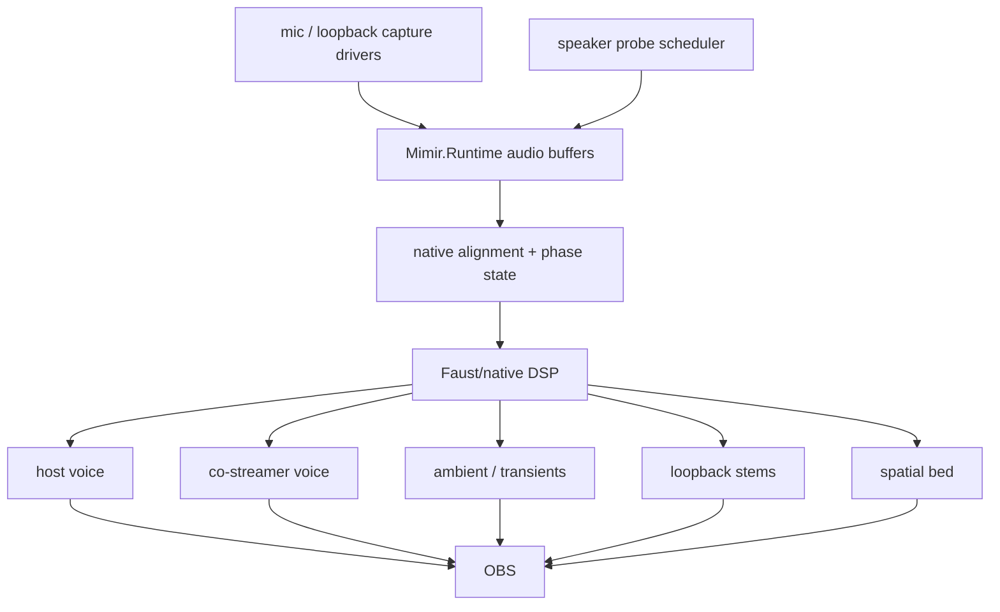

# Audio Field

Mimir's audio field is six microphones, loopback/program reference, and two
calibration speakers aligned into one presentation timeline.

## Live Target

## Invariants

- Scarlett speaker loopback is the timing authority when calibration chirplets
  are playing.
- Focusrite dialogue mics are the voice anchors.
- Camera mics are spatial/context witnesses.
- Loopback/program audio is timing evidence where available; it outranks
  acoustic mics for clock/timing because it is the emitted program surface.
- Distributed inputs must be aligned and resampled before they become program
  stems.
- The five-second runtime window is allowed to be spent on alignment,
  resampling, separation, and spatial-field extraction. Low latency loses to a
  coherent volumetric sound field here.
- Probe signals are budgeted telemetry, not a permanent audio bed.
- Faust/native DSP owns the hot separation and spatialization graph.

## Next Cut

The current diagnostic witness is `native/probes/wasapi_audio_cadence`, which
emits timestamped WASAPI `audio-block` metadata into `Mimir.Runtime` through the
frame-event adapter. It has proven Focusrite mic, Kiyo Pro mic, Kiyo mic, both
USB Camera / PS3 Eye mics, and Scarlett speaker loopback in rolling buffers when
loopback audio is actively playing. One PS3 Eye mic previously enumerated but
produced zero WASAPI packets until that Eye was unplugged and replugged.

The full probe runtime config now enables sample-bearing blocks for every local
audio source. `MimirRuntime` emits short 9-16 kHz calibration chirplets through
Aquarium audio every 1.5 seconds. `MimirAudioSynchronizationAnalyzer` resamples
candidate mic windows into the loopback sample-rate timeline, projects them
through the same chirplet shape, contrast-normalizes the resulting energy
trace, and estimates current delay against `loopback-scarlett-speakers`.

`MimirSynchronizationHub.BuildAlignedAudioFrame` returns a provisional aligned
mono frame: loopback is always channel zero, and other channels enter only when
their chirplet confidence clears the gate. Delay estimates compare loopback and
candidate mic windows at a shared timestamp edge; positive delay means the
candidate mic is late relative to loopback. This is still integer-delay
alignment at 64-sample chirplet-hop granularity. SRO smoothing, fractional-delay
correction, and the hot resampler are the actuator still ahead of us.

Next, replace the diagnostic bridge with native audio capture workers that
append typed blocks into `Mimir.Runtime`, then expose buffer depth, clock state,
delay estimates, and stem routing in Aquarium UI.
