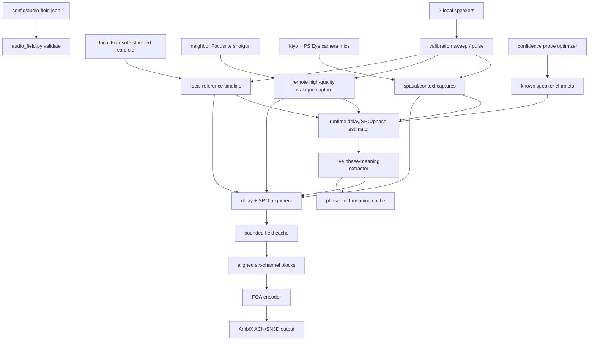

# Audio Field Spine

## Objective

Build the audio side around the real six-microphone rig: two Kiyo camera mics, two PS Eye camera mics, the local Focusrite ADC with a shielded cardioid near the host's face, and the neighbor Focusrite ADC with a shotgun mic pointed at the co-streamer.

The Focusrite channels are the dialogue anchors. The camera mics are spatial context, calibration evidence, and fallback texture. Treating all six as equal would be tidy on paper and stupid in the room, which is the classic way paper gets someone fired by physics.

## Current Mechanism

The repo has a profile and tool:

- `config/audio-field.example.json` declares each mic source, machine, device query, clock domain, field channel, quality priority, placeholder geometry, two local speaker channels, calibration sweep settings, and FOA AmbiX bus format.
- `scripts/audio_field.py` validates shared or distributed profiles, lists PortAudio devices, checks local distributed sources, generates calibration sweeps, summarizes the sync plan, preserves shared-input capture helpers, and encodes an already aligned six-channel WAV into first-order AmbiX.

The default profile is `distributed-clocks`. The coherent field is not captured directly. It is assembled after delay and sampling-rate-offset alignment.

Latency is allowed. The live goal is bounded buffered real-time: hold enough audio to estimate delay and slow clock drift, emit blocks behind the live edge, and converge instead of chasing instant output with bad math. The profile owns that latency policy.

Runtime sync is not optional for the real show. Static sweep calibration gives the first estimate; the live system must keep updating delay, sampling-rate offset, polarity, and phase confidence as devices drift. Known speaker output is telemetry: every calibration chirplet or intentionally embedded probe gives the estimator a fresh phase-field observation.

If passive telemetry is not enough, the system should emit extra chirplets automatically. That is an optimization loop: spend the smallest audible probe budget that raises sync confidence enough to protect the field.

## Pipeline



## Commands

Create a local profile first:

```powershell
Copy-Item .\config\audio-field.example.json .\config\audio-field.json
```

List audio devices:

```powershell
.\.venv\Scripts\python.exe .\scripts\audio_field.py devices
```

Probe whether a Focusrite path accepts high-rate capture:

```powershell
.\.venv\Scripts\python.exe .\scripts\audio_field.py probe-rates --device-query Scarlett --hostapi WASAPI --direction input --channels 1 --rate 48000 --rate 96000
```

Probe the speaker output path separately:

```powershell
.\.venv\Scripts\python.exe .\scripts\audio_field.py probe-rates --device-query Scarlett --hostapi WASAPI --direction output --channels 2 --rate 44100 --rate 48000 --rate 96000
```

Validate the profile and local device matches:

```powershell
.\.venv\Scripts\python.exe .\scripts\audio_field.py validate --profile .\config\audio-field.json --check-devices
```

Summarize the clock domains and required alignment path:

```powershell
.\.venv\Scripts\python.exe .\scripts\audio_field.py sync-plan --profile .\config\audio-field.json
```

Generate a calibration sweep without touching hardware:

```powershell
.\.venv\Scripts\python.exe .\scripts\audio_field.py make-stimulus --profile .\config\audio-field.json
```

Create a distributed run folder that can accept one WAV per mic:

```powershell
.\.venv\Scripts\python.exe .\scripts\audio_field.py init-run --profile .\config\audio-field.json
```

Record all locally visible distributed mics for a deadline calibration pass:

```powershell
.\.venv\Scripts\python.exe .\scripts\audio_field.py record-local-calibration --profile .\config\audio-field.json --seconds 10
```

For passive runtime sync against ground-truth program output, capture the Scarlett loopback with the local mics:

```powershell
.\.venv\Scripts\python.exe .\scripts\audio_field.py record-local-calibration --profile .\config\audio-field.json --seconds 20 --record-loopback --loopback-query Scarlett --loopback-rate 48000
.\.venv\Scripts\python.exe .\scripts\audio_field.py analyze-reference-sync --profile .\config\audio-field.json --run .\calibration\runs\<run-folder> --window-seconds 4 --hop-seconds 1 --method normalized --min-score 0.08
```

The loopback path is ground-truth content, but not automatically a perfect ground-truth clock. If WASAPI loopback reports discontinuities, use the stable windows and treat the rest as suspect.

For dense runtime calibration, emit a low-level multiband chirplet texture instead of one big sweep:

```powershell
.\.venv\Scripts\python.exe .\scripts\audio_field.py record-probe-train --profile .\config\audio-field.json --seconds 8 --chirp-seconds 0.03 --chirps-per-second 16 --probe-band 180:500 --probe-band 600:1200 --probe-band 1500:3000 --probe-band 3500:7000 --probe-band 8000:14000 --probe-level-offset-db -18 --output-rate 44100 --loopback-rate 48000
.\.venv\Scripts\python.exe .\scripts\audio_field.py analyze-probe-train --profile .\config\audio-field.json --run .\calibration\runs\<run-folder>
```

`analyze-probe-train` is the offline live-fit evidence path: it uses each event's band-specific chirplet, gates weak loopback/mic detections, estimates phase-derived delay deltas across frequency bands, and updates a smoothed phase/frequency mapping. Coarse delays still include device latency; the volumetric room solve must fit latency, drift, phase response, and acoustic path jointly.

Publish live extracted phase-field meaning from an aligned field and known program/loopback reference:

```powershell
.\.venv\Scripts\python.exe .\scripts\stream_phase_field.py --field .\calibration\runs\<run-folder>\field-program-cleaned.wav --reference .\calibration\runs\<run-folder>\ground_truth_loopback.wav --cache .\calibration\runs\audio-phase-field.msgpack
```

This is not a phase oscilloscope. Raw phase bands stay internal. The live cache publishes consequences: per-source delay correction, distance-equivalent delta, coherence, fit error, confidence, reference-bleed estimate, suppression weight, correction energy, and whether the active probe optimizer should spend chirps.

Close the confidence loop by letting the phase-field stream schedule strategic active probes:

```powershell
.\.venv\Scripts\python.exe .\scripts\stream_phase_field.py --field .\calibration\runs\<run-folder>\field-program-cleaned.wav --reference .\calibration\runs\<run-folder>\ground_truth_loopback.wav --cache .\calibration\runs\audio-phase-field.msgpack --maintain-confidence --ultrasonic-probes --play-probes
```

`--maintain-confidence` converts low-confidence phase-field state into `ActiveProbeOptimizer` requests, writes emitted chirplets under `calibration/runs/active-probes`, and appends `active-probes.jsonl`. Probe files rotate through fixed slots and the manifest rotates at a byte cap, because a calibration loop that creates infinite tiny WAV files is just a storage leak with a physics degree. `--play-probes` sends the emitted chirplet to the selected output device through `sounddevice`; omit it for dry-run scheduling. `--ultrasonic-probes` uses the highest safe band under Nyquist, roughly `18.5-22 kHz` at 48 kHz. This can fail silently in the physical world if the speaker, mic, driver, or resampler refuses to carry that band; the confidence feedback is the judge, not the command line's self-esteem.

For the current deadline rig, `scripts/stream_live_audio_field.py` owns the live local path:

```powershell
.\.venv\Scripts\python.exe .\scripts\stream_live_audio_field.py --profile .\config\audio-field.example.json --loopback-query Scarlett --maintain-confidence --play-probes --probe-output-query Scarlett
```

It publishes both `audio-mic-field.msgpack` and `audio-phase-field.msgpack` from visible local mics, records missing distributed channels as explicit placeholders, captures Scarlett loopback as the known reference, and resamples probe playback when the Scarlett output is exposed as 44.1 kHz while the capture field remains 48 kHz.

For the current live app, start the dense harmonic confidence-maintenance loop:

```powershell
.\scripts\start-live-audio-phase-field.ps1
```

That launcher runs `stream_phase_field.py` in realtime loop mode with playback enabled, dense harmonic probes, a near-ultrasonic band, `-24 dBFS` level cap, 80 ms probe textures, and 48 harmonic voices. Stop it with:

```powershell
.\scripts\stop-live-audio-phase-field.ps1
```

Record local mics while playing one speaker sweep. Use the output rate that the device probe says is real:

```powershell
.\.venv\Scripts\python.exe .\scripts\audio_field.py record-local-calibration --profile .\config\audio-field.json --seconds 10 --play-sweep --speaker-channel 0 --output-rate 44100
```

After dropping the neighbor Focusrite WAV into the run's `sources/` folder, estimate sweep arrivals and assemble the aligned field:

```powershell
.\.venv\Scripts\python.exe .\scripts\audio_field.py analyze-distributed --profile .\config\audio-field.json --run .\calibration\runs\<run-folder>
.\.venv\Scripts\python.exe .\scripts\audio_field.py assemble-aligned --profile .\config\audio-field.json --run .\calibration\runs\<run-folder>
```

For the stream-day compensated field, use the sweep-derived response pass during assembly:

```powershell
.\.venv\Scripts\python.exe .\scripts\audio_field.py assemble-aligned --profile .\config\audio-field.json --run .\calibration\runs\<run-folder> --compensate-response
```

This estimates each mic's magnitude response from the calibration sweep relative to the reference Focusrite, smooths the inverse curve, clips it to bounded boost/cut limits, and writes `response-compensation.json`. It deliberately corrects magnitude only; phase stays owned by the timing/sync path.

Record the neighbor Focusrite shotgun directly into an existing distributed run over SSH/SFTP:

```powershell
.\.venv\Scripts\python.exe .\scripts\audio_field.py record-remote-focusrite --profile .\config\audio-field.json --run .\calibration\runs\<run-folder> --seconds 10 --sample-rate 48000
```

This records `Analogue 1 + 2 (Focusrite USB Audio)` on `192.168.1.84` with remote FFmpeg, pulls it back as `sources/mic_focusrite_neighbor.wav`, and updates the run manifest. Use this for calibration imports; the existing OBS SRT source is still the live monitoring/streaming path.

`analyze-distributed` now does a deadline-grade chirplet refinement by default: it uses the coarse sweep matched-filter peak as the initial time-of-arrival, then searches a small fractional-delay and chirp-rate neighborhood with chirplet atoms. Tune the local search when needed:

```powershell
.\.venv\Scripts\python.exe .\scripts\audio_field.py analyze-distributed --profile .\config\audio-field.json --run .\calibration\runs\<run-folder> --chirplet-refine --search-samples 3 --fractional-steps 8 --rate-ppm 150
```

This is not a full adaptive chirplet decomposition engine. It is the stream-day version: enough chirplet parameter search to get sub-sample timing refinement without turning calibration into a thesis defense in the middle of setup.

Encode an offline aligned six-channel WAV to FOA AmbiX:

```powershell
.\.venv\Scripts\python.exe .\scripts\audio_field.py encode-foa --profile .\config\audio-field.json --input .\calibration\runs\<run-folder>\field-aligned.wav --output .\calibration\runs\<run-folder>\field-foa-ambix.wav
```

Publish the same aligned six-channel field directly to Aquarium/Faust for voice separation:

```powershell
.\scripts\start-live-faust-mic-field.ps1
```

This writes `localcast.audio.mic_field` into `calibration/runs/audio-mic-field.msgpack` with channel roles and graph id `localcast.faust.voice_separation.v1`. The Faust graph lives at `faust/localcast_voice_separation.dsp` and has six inputs plus six stem outputs: host voice, co-streamer voice, ambient, transients, local loopback placeholder, and co-streamer loopback placeholder.

Suppress room/transient witness energy before FOA encoding:

```powershell
.\.venv\Scripts\python.exe .\scripts\audio_field.py suppress-room --profile .\config\audio-field.json --input .\calibration\runs\<run-folder>\field-aligned.wav --output .\calibration\runs\<run-folder>\field-cleaned.wav
.\.venv\Scripts\python.exe .\scripts\audio_field.py encode-foa --profile .\config\audio-field.json --input .\calibration\runs\<run-folder>\field-cleaned.wav --output .\calibration\runs\<run-folder>\field-cleaned-foa-ambix.wav
```

This first suppression pass treats the Focusrite dialogue anchors as wanted direct sources and the camera mics as room/transient witnesses. It attenuates witness-heavy broadband transients, lightly subtracts witness room energy from anchors, and writes a JSON report. It is deliberately a stream-side cleanup stage, not physical cancellation in the room.

Suppress known speaker/program bleed using output loopback as ground truth:

```powershell
.\.venv\Scripts\python.exe .\scripts\audio_field.py suppress-reference --profile .\config\audio-field.json --input .\calibration\runs\<run-folder>\field-aligned.wav --reference .\calibration\runs\<run-folder>\ground_truth_loopback.wav --output .\calibration\runs\<run-folder>\field-program-suppressed.wav
```

This is the music-as-both-enemy-and-teacher path. The reference program audio is transformed into a time/frequency transfer estimate per mic channel, reconstructed as predicted bleed, subtracted from the aligned field, and exported as phase/frequency mapping evidence. A future live loop should publish the known program stem as its own OBS/Aquarium channel while using the same ground truth to keep learning the room.

Estimate dialogue focus and volumetric transient events:

```powershell
.\.venv\Scripts\python.exe .\scripts\audio_field.py analyze-source-events --profile .\config\audio-field.json --input .\calibration\runs\<run-folder>\field-cleaned.wav --cache .\calibration\runs\audio-events.msgpack
```

This emits `localcast.audio.source_events` for Aquarium. Dialogue anchors produce voice-focus weights; camera/context mics produce witness-dominant transient events with sample time, estimated room position, direction, energy, and confidence. This is the boundary between a clean vocal bed and renderer-visible clutter: clicks, taps, and other spatial transients should become geometry instead of being smeared into the voice mix.

The `play-record` and `record-field` commands remain for a `shared-input-device` profile only. They deliberately refuse the distributed rig until an alignment stage emits one coherent six-channel WAV.

## Invariants

- Each physical microphone declares its machine, device query, clock domain, field channel, geometry, gain, delay, polarity, directivity, and role.
- The local Focusrite shielded cardioid is the default reference mic.
- The neighbor Focusrite shotgun is the co-streamer dialogue anchor and should be captured losslessly for calibration.
- Focusrite captures should use the best available native/exclusive path and high-rate calibration capture when practical, then resample into the field timeline after alignment.
- Playback sample rate is its own device fact. Probe it separately; do not assume the Scarlett input and output paths accept the same rates through PortAudio/WASAPI.
- Distributed-clock microphones must be aligned and resampled into one reference timeline before FOA encoding.
- Output may run behind live input by the configured latency budget, but it must converge toward real-time instead of letting cache depth grow without bound.
- Sweep arrival estimates should use chirplet refinement when calibration signal quality allows it; plain matched-filter peaks are a fallback, not the precision path.
- Runtime sync updates delay/SRO/phase estimates from known speaker chirplets every block/frame, gated by confidence so a bad observation freezes rather than poisons the field.
- Active chirplet probes are scheduled by an optimization loop, not by panic. It should prefer masked windows, respect minimum spacing and level caps, and maximize expected confidence gain per audible intrusion.
- Ultrasonic probes are allowed only as a bounded optimization strategy. They must stay below Nyquist, remain level-capped, and prove themselves by raising measured confidence; hardware may distort or discard them.
- Dense probe textures should be harmonically organized so any lower-band aliases land closer to musical relationships than arbitrary squeal. This is damage control, not a license to trust aliasing.
- FOA output is AmbiX: ACN channel order, SN3D normalization, channels `W,Y,Z,X`.
- The Faust voice-separation input is the aligned six-mic field, not the AmbiX collapse. Voice separation needs anchor and witness channels before spatial rendering destroys useful evidence.
- Speaker calibration is a measurement path, not a generic monitor output.
- Source-event geometry is published beside the AmbiX bed; render effects do not have to infer transient positions from mixed audio.
- Phase/chirplet evidence is reduced into alignment, correction, suppression, and probe-control meaning before it crosses the live cache boundary. Raw phase is an estimator detail, not a renderer API.
- Camera fusion may publish listener or source pose later, but it does not own audio channel timing.

## Module Boundaries

The audio code is split so the hard parts can be tested without the room, drivers, or neighbor machine:

- `audio_field.buffering` owns source buffers and ordered field assembly.
- `audio_field.latency` owns the bounded-delay real-time convergence policy.
- `audio_field.ports` declares injectable capture, alignment, encoder, and sink protocols.
- `audio_field.pipeline` wires those ports together without knowing whether the source is a real Focusrite, an SRT receiver, a WAV fixture, or a test double.
- The next runtime estimator module should own chirplet observations, delay/SRO/phase state, confidence gates, and phase-field updates. It should feed the aligner; it should not be hidden inside the FOA encoder.
- The active probe optimizer owns whether to emit extra chirplets. It reads sync confidence and probe budget, then decides when and where an intentional chirplet is worth the cost.
- `audio_field.active_probe` owns the runtime join between phase-field confidence and emitted chirplet probes. It converts extracted source confidence into sync states, applies masking/spacing policy, writes bounded probe WAV slots plus a rotating manifest, and optionally plays them.
- `audio_field.phase_meaning` owns live extraction of meaning from phase/chirplet evidence. It consumes known reference audio plus aligned mic windows, keeps the smoothed phase/frequency state internal, and emits only actionable state for alignment, suppression, and probe control.
- Room suppression owns stream-side cleanup: dialogue anchors define desired direct energy, spatial/context mics act as witnesses for room and transient clutter, and the cleaned aligned field feeds FOA/Aquarium/Faust.
- Source-event analysis owns non-vocal spatial facts: dialogue focus weights and localized transient vectors are published beside the AmbiX bed, not hidden inside it.
- Aquarium/Faust owns the hot voice-separation graph after `localcast.audio.mic_field`; LocalCastBridge owns alignment, timing, roles, and control publication.
- `scripts/audio_field.py` stays as the operator CLI and hardware probe surface.

This is the portfolio-piece line: each module owns one invariant, and the tests use mocks/fakes instead of asking a driver stack to please be emotionally available.

## First Cut Limits

The current encoder is a source-style FOA mix from calibrated microphone channels and declared orientations. It accepts an already aligned six-channel WAV. It does not capture or align independent USB/network clocks by itself, and it is not a full arbitrary-array sound-field reconstruction.

Next honest steps:

1. Confirm local Kiyo, PS Eye, local Focusrite, and local speaker device matches.
2. Confirm the neighbor Focusrite capture path, preferably native/exclusive or the best FFmpeg/driver route available on that machine.
3. Probe the local and neighbor Focusrites for 48 kHz and 96 kHz capture support through the best available driver path.
4. Capture the two Focusrite anchors losslessly during calibration; prefer 96 kHz when driver/device support is real, then resample after sync.
5. Replace placeholder mic/speaker geometry with measured world coordinates.
6. Build the delay/SRO alignment stage that feeds `audio_field.buffering.FieldAssemblyCache`.
7. Emit aligned six-channel blocks under the configured latency policy.
8. Encode the first FOA AmbiX test only after that aligned WAV/block stream exists.
