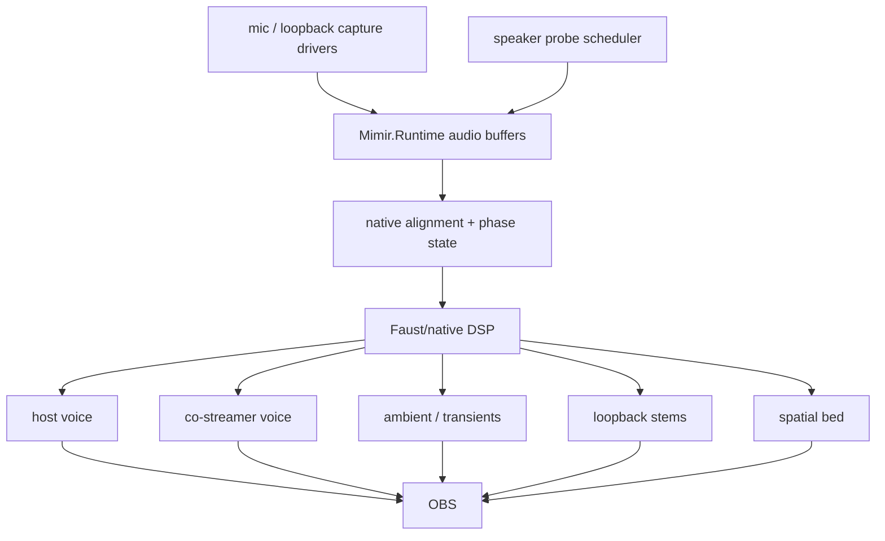
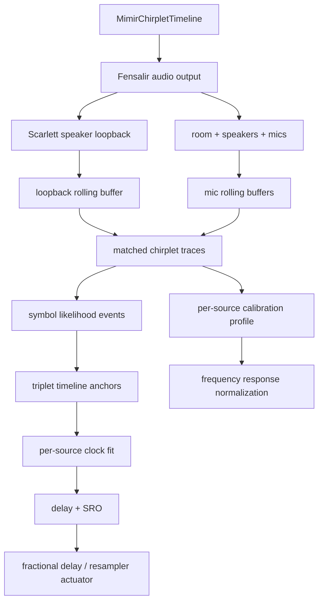

# Audio Field

Mimir's audio field is six microphones, loopback/program reference, and two
calibration speakers aligned into one presentation timeline.

## Live Target



## Invariants

- Scarlett speaker loopback is the timing authority when calibration chirplets
  are playing.
- Focusrite dialogue mics are the voice anchors.
- Camera mics are spatial/context witnesses.
- Loopback/program audio is timing evidence where available; it outranks
  acoustic mics for clock/timing because it is the emitted program surface.
- Distributed inputs must be aligned and resampled before they become program
  stems.
- The five-second runtime window is allowed to be spent on alignment,
  resampling, separation, and spatial-field extraction. Low latency loses to a
  coherent volumetric sound field here.
- Probe signals are budgeted telemetry, not a permanent audio bed.
- Faust/native DSP owns the hot separation and spatialization graph.

## Synchronization Modes

`MimirAudioSynchronizationSettings.Mode` is the runtime authority for what
timing evidence Mimir is allowed to emit:

- `chirp-only`: emit the deterministic calibration timeline and decode timing
  only from that active witness. This is the lab/debug mode and the fallback for
  silent program material.
- `passive`: do not emit calibration audio. Use loopback/program audio as the
  timing witness by estimating delay between the loopback buffer and each mic
  buffer.
- `hybrid`: prefer passive program-audio evidence when confidence is high, then
  emit a watermark when confidence falls. The passive side uses bounded
  GCC-PHAT-style phase correlation.

The mode belongs to the runtime, not the decoder. The decoder should consume
known timing evidence; it should not decide whether Mimir is allowed to make
sound.

The passive estimator is the first real program-audio path, not the final DSP
actuator. It removes DC, pre-emphasizes the window, applies a Hann taper, runs a
PHAT-weighted cross spectrum, and reports the strongest loopback-to-mic lag
inside a bounded window. Positive delay still means the candidate mic is late
relative to loopback. Negative lags are treated as contradictory passive
evidence and carry zero confidence. A single passive window is also capped below
certainty; full confidence belongs to repeated coherent state over time, not
one attractive correlation peak.

The active calibration path is deliberately receiver-cheap in both `chirp-only`
and `hybrid`. `MimirChirpBinTimeline` uses a common chirp duration, chirp slope,
and window for every symbol. Acquisition is a cheap bounded energy/onset pass;
classification is dechirp plus a fixed Goertzel bin bank; timeline placement is
the de Bruijn triplet trellis. A constrained local waveform correlation around
the decoded anchor delay provides the final fractional offset. The decoder keeps
the full bin-energy surface for each classified chirp and aggregates it into
per-band response evidence, so the same stream can calibrate timing and the
speaker/room/mic transfer function. `MimirChirpBinCalibrationModel` is the live
surface for that evidence. It stores measured usable bands per source,
expected-symbol versus observed-bin confusion observations, timing residuals,
delay hypotheses, phase summaries, and an adaptive codebook plan per
output/mic path. The raw profile is kept even when a timing report is rejected,
because a failed sync window can still teach us which bands survived the
speaker/room/mic path. The decoder can consume the persisted model to weight
reliable symbols, downweight dead bands, apply phase-coherence weighting,
apply first-order group-delay correction, and search joint global delay/bin-shift
hypotheses before selecting the coherent anchor path. The model also owns the
active emission plan: if the measured path only leaves a smaller alphabet, Mimir
emits that reliable symbol set and raises the de Bruijn order so the timeline
remains unique without pretending the dead bins still carry code.
The synthetic invariant is
`dotnet run --project .\src\Mimir.BufferSmoke\Mimir.BufferSmoke.csproj -- --chirp-bin-self-test`;
it renders the chirp-bin timeline, decodes by dechirp plus Goertzel bins, and
requires code-valid triplet anchors plus a stable source clock. `chirp-only`
emits this witness continuously; `hybrid` emits one low-gain half-second coded
burst every two seconds only while passive confidence is weak. Default hybrid
watermark gain is intentionally low (`watermarkGain`, or `MIMIR_WATERMARK_GAIN`)
and separate from the louder chirp-only lab gain.

Research notes:

- `research/chirplet-sync-decoder/summary.md` explains why the hot hybrid path
  moved from dense chirplet matching to dechirp plus FFT/Goertzel bin decoding.
- `research/chirplet-sync-decoder/bibliography.md` links the mirrored chirplet,
  LoRa/chirp-decoder, and fast-transform references.
- `research/live-adaptive-sync/summary.md` covers passive program-audio sync,
  GCC-PHAT, and sample-rate-offset estimation.
- `research/feedback-calibration/summary.md` covers online speaker/room/mic
  response calibration.

## Next Cut

The current diagnostic witness is `native/probes/wasapi_audio_cadence`, which
emits timestamped WASAPI `audio-block` metadata into `Mimir.Runtime` through the
frame-event adapter. It can request and verify specific shared or exclusive
formats for device diagnosis, but it is not the Focusrite hot path. Scarlett
capture belongs on ASIO so the runtime can use the interface clock and the
24-bit/192 kHz modes instead of the Windows shared engine. The probe has proven
Focusrite mic, Kiyo Pro mic, Kiyo mic, both USB Camera / PS3 Eye mics, and
Scarlett speaker loopback in rolling buffers when loopback audio is actively
playing. One PS3 Eye mic previously enumerated but produced zero WASAPI packets
until that Eye was unplugged and replugged.

`native/probes/asio_audio_cadence` is the first direct ASIO witness. It opens
the registered `Focusrite USB ASIO` COM driver, reports channel counts, buffer
size, sample-rate support, input sample type, and can run a short callback
capture. With the Scarlett Solo 4th Gen attached to Starfire, Focusrite USB
ASIO exposes 4 inputs and 2 outputs: `Input 1`, `Input 2`, `Loopback 1`, and
`Loopback 2`. It accepts 44.1 through 192 kHz, reports a 192-frame preferred
buffer, and captures nonzero 4-channel `Int32LSB` input callbacks at 192 kHz.
Raven also has a loopback-capable Scarlett ASIO path at 192 kHz for
co-streamer/game timing evidence, but Starfire owns the heavy local alignment,
soundfield, and sensor-fusion work.
The runtime hot path is now `native/asio_capture` plus
`MimirAsioStreamSource`. The native DLL owns the Focusrite ASIO COM driver and
keeps callback buffers in process; the managed source drains one 192 kHz Float32
block per ASIO input channel into `Mimir.Runtime` buffers (`asio-ch0` through
`asio-ch3`). The older `--emit-json-blocks` worker path remains a diagnostic
probe, not the live Scarlett ingest path.

The probe also has a `--monitor-sweep` mode for measuring the acoustic ceiling.
At 192 kHz, ASIO loopback detected emitted 8-40 kHz tones cleanly, but the
current studio-monitor-to-Scarlett-mic acoustic path was already weak by
14-16 kHz and very weak above 20 kHz. Treat ultrasonic acoustic sync as
unproven until a measured transducer/mic path earns it.

The synthetic chirp-bin timing proof now runs at arbitrary sample rates with
`--hybrid-sync-self-test --sample-rate N`. On the same physical delay, measured
in memory, the active chirp-bin path recovered about 0.369 us error at 48 kHz,
0.168 us at 96 kHz, and below printed microsecond precision at 192 kHz. That
proves the timing kernel benefits from the Scarlett ASIO rate. The live ingest
proof now feeds ASIO callbacks into `Mimir.Runtime` without a process/stdout
bridge: a two-second BufferSmoke run at 192 kHz ingested more than 12,000
sample-bearing blocks and retained 2,048 blocks per channel across `asio-ch0`
through `asio-ch3`.

The full probe runtime config now enables sample-bearing blocks for every local
audio source. `MimirChirpletTimeline` owns the emitted calibration stream and
the matched-filter shape used to analyze it. The default timeline is a
deterministic order-3 de Bruijn symbol sequence over 32 chirp symbols. Any three
consecutive correctly detected symbols identify the event index inside the
current operating horizon, so a receiver can place its audio window on the
canonical timeline without being handed Mimir's runtime clock. Mimir queues
half-second PCM segments ahead of the audio cursor. Each symbol is a small
time/frequency constellation: start band, glide direction/range, duration, and
the following inter-chirp gap all carry code. The point is not ornament. The
timing code is carried by both frequency and rhythm, so it behaves more like a
quiet birdsong texture than a repeated sweep.

The intended decoder is a constrained chirplet transform, not a generic
time-frequency explorer and not an outlier filter around bad guesses. Mimir owns
the emitter, so the receiver projects each mic stream against the known chirplet
dictionary, produces transform frames with multiple symbol candidates, and
scores candidate triplets through the de Bruijn map. A triplet only becomes a
canonical timeline anchor when its symbol likelihoods, measured inter-chirp
gaps, and neighboring anchors agree on one local sample clock. A decoded anchor
means observed sample offset `S` corresponds to emitted event time `T`. A stream
of anchors fits the source clock directly:

```text
observed_sample = source_offset + canonical_seconds * effective_sample_rate
```

Delay and sampling-rate offset are derived by comparing the loopback clock fit
to each mic clock fit over common canonical time. The state tracker is not
allowed to launder invalid codewords into plausible timing. If a stream cannot
produce at least three matched canonical anchors, it has not decoded timing for
that window. Reports carry rounded integer delay, fractional delay, and the
count/confidence of timeline-symbol anchors used to derive the report.

The same timeline also starts the frequency-response path. Each active chirp-bin
decode can emit a persisted calibration model for the source set, whether or
not each source earns a timing report. That model is not a finished room/mic
normalizer yet, but it is the live surface that will become response-curve
estimation: loopback carries what was emitted, each mic carries what survived
speaker, air, room, and capsule, and the ratio over the continuous timeline
becomes gain/phase correction evidence. Use
`Mimir.BufferSmoke --calibrate-chirp-bin-asio-f32` to render the calibration
timeline, optionally capture it through the ASIO worker with `--capture-asio`,
compute the response/confusion/delay model, and persist it for runtime decode.

`MimirAudioSynchronizationStateTracker` turns continuous observations into
state. It confidence-gates reports, smooths fractional delay per source, and
estimates delay slope as sampling-rate offset in ppm. This is the control input
for the coming actuator. The state can survive a brief weak report, but it is
not a license to run blind: loopback must keep receiving the emitted timeline or
fresh reports will stop.

The actual Mimir app path now runs this online: `MimirRuntime.Update` keeps the
chirplet timeline queued, polls sources, and updates sync analysis on a fixed cadence.
`MIMIR_SYNC_TELEMETRY_SECONDS` enables console telemetry for live tests. Current
runtime testing proves Fensalir output wakes the Scarlett loopback and the mic
buffers stay live. The decoder now uses quadrature chirplet atoms so symbol
classification is phase-invariant at the transform layer. The next failure is
physical capture proof: the same canonical anchors need to stay stable through
loopback, room mics, device clocks, and codec/network paths.

## Chirplet Calibration Model



The chirplet timeline owns three facts:

- **Emission**: the PCM that Fensalir sends to the speakers.
- **Timing witness**: the matched-filter atom bank used to find the stream in
  loopback and mic buffers.
- **Response witness**: the per-band atoms used to measure how strongly each
  mic hears each emitted band.

Continuous chirplet evidence gives both the current delay and the drift/SRO by
watching delay change over time. Per-band energy over the same stream gives the
normalization curve. The important constraint is that all three measurements
must be tied to the same emitted timeline, not three separately invented probes.
The current ASIO artifact proves why this matters: Scarlett loopback channel 2
and loopback channel 3 both decode 12 anchors with 0.996 clock confidence, while
physical input 1 decodes a noisier independent clock and a different strongest
band set but still fails pairwise timing because no canonical events overlap
the loopback path. That is not a blank failure anymore; it is calibration data
for the next codebook/weighting cut.

The symbol layer is intentionally redundant. It does not rely on one fixed
frequency shelf: timing gaps, chirp duration, start band, and glide shape all
contribute so poor mic frequency response does not erase the whole code.
`MimirChirpletSymbolCodebook` owns the symbol definitions so timeline ordering
does not smuggle acoustic shape decisions into bit arithmetic. Every symbol has
a unique chirp shape; rhythm remains additional evidence, not a substitute for
symbol separability. The transform uses sine/cosine chirplet kernels for each
symbol, so timing does not depend on the receiver preserving the emitter's
absolute phase. Run `dotnet run --project .\src\Mimir.BufferSmoke\Mimir.BufferSmoke.csproj -- --chirplet-self-test`
to render two seconds of canonical timeline audio and decode it back to
timeline anchors. Current synthetic proof detects all 15 emitted chirps, keeps
13 possible triplet anchors for events 0 through 12, fits the clock at
47999.999990 Hz, and holds mean absolute anchor error to 0.000014 samples. Real
device runs still depend on loopback capture staying live; the local Scarlett
loopback has intermittently stopped advancing during short headless sniffs.

The older `MimirChirpletTimeline` matcher is a diagnostic/reference artifact,
not the active runtime path. `BuildChirpletEnergyTrace` still behaves like a
dense sliding matched-filter bank and should not retake authority.

Next, use the in-process ASIO source as the local Scarlett authority, prove
stable acoustic anchors against real mics, then expose buffer depth, clock
state, delay estimates, and stem routing in Fensalir UI. The analyzer accepts
Float32, Int16, Int24, and Int32 PCM windows so direct driver paths can preserve
real interface formats before Faust/native DSP owns the hot resampling and
alignment.
