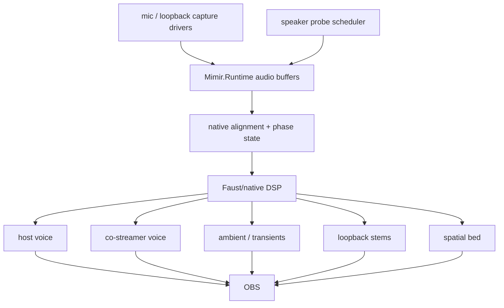
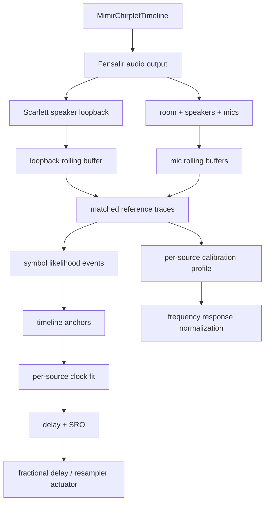

# Audio Field

Mimir's audio field is six microphones, loopback/program reference, and two
calibration speakers aligned into one presentation timeline.

## Live Target



## Invariants

- Starfire Realtek is the active chirp speaker and loopback-measurement path in
  the current routing. The Windows system default output is now Scarlett for
  monitoring, so default-output chirps are wrong unless they explicitly target
  Realtek.
- Scarlett ASIO is the professional mic and monitor interface. Its outputs are
  not the current active chirp-emission authority.
- Focusrite dialogue mics are the voice anchors.
- Camera mics are spatial/context witnesses.
- Loopback/program audio is timing evidence where available; it outranks
  acoustic mics for clock/timing because it is the emitted program surface.
- Distributed inputs must be aligned and resampled before they become program
  stems.
- The five-second runtime window is allowed to be spent on alignment,
  resampling, separation, and spatial-field extraction. Low latency loses to a
  coherent volumetric sound field here.
- Probe signals are budgeted telemetry, not a permanent audio bed.
- Faust/native DSP owns the hot separation and spatialization graph.

## Synchronization Modes

`MimirAudioSynchronizationSettings.Mode` is the runtime authority for what
timing evidence Mimir is allowed to emit:

- `chirp-only`: emit the deterministic calibration timeline and decode timing
  only from that active witness. This is the lab/debug mode and the fallback for
  silent program material.
- `passive`: do not emit calibration audio. Use loopback/program audio as the
  timing witness by estimating delay between the loopback buffer and each mic
  buffer.
- `hybrid`: prefer passive program-audio evidence when confidence is high, then
  emit a watermark when confidence falls. The passive side uses bounded
  GCC-PHAT-style phase correlation.

The mode belongs to the runtime, not the decoder. The decoder should consume
known timing evidence; it should not decide whether Mimir is allowed to make
sound.

The passive estimator is the first real program-audio path, not the final DSP
actuator. It removes DC, pre-emphasizes the window, applies a Hann taper, runs a
PHAT-weighted cross spectrum, and reports the strongest loopback-to-mic lag
inside a bounded window. Positive delay still means the candidate mic is late
relative to loopback. Negative lags are treated as contradictory passive
evidence and carry zero confidence. A single passive window is also capped below
certainty; full confidence belongs to repeated coherent state over time, not
one attractive correlation peak.

The active calibration path is deliberately receiver-cheap in both `chirp-only`
and `hybrid`. `MimirBioacousticTimeline` is the live runtime witness: it emits
low-gain log-frequency words made from short formant-rich syllables, rhythm
offsets, and speaker-specific variants. Acquisition is an energy proposal pass
plus bounded motif matching; timeline placement comes from direct word identity,
and a constrained local waveform correlation around the decoded delay
provides the final fractional offset. The decoder keeps per-band response
evidence for each detected motif so the same stream can calibrate timing and the
speaker/room/mic transfer function.

`MimirChirpBinTimeline` remains as the older controlled calibration/reference
artifact. Its full bin-energy surface and `MimirChirpBinCalibrationModel` still
matter for measured usable bands, expected-symbol versus observed-bin confusion,
timing residuals, delay hypotheses, phase summaries, and adaptive codebook
plans. That evidence is allowed to shape the bioacoustic receiver next; it is
not the active runtime sound.

The raw profile is kept even when a timing report is rejected, because a failed
sync window can still teach us which bands survived the speaker/room/mic path.
`MimirBioacousticProbeScheduler` is now the runtime-side cadence owner for that
feedback loop: it consumes smoothed sync states plus per-band frequency response
residuals, schedules a targeted probe only when confidence pressure and duty
budget allow it, and publishes aggregate/per-source sync and frequency-response
confidence telemetry. `MimirSynchronizationHub.UpdateBioacousticProbeSchedule`
is the live hub surface; `MimirRuntime` prints
`mimir-bioacoustic-probe-schedule` and `mimir-bioacoustic-probe-source` lines so
operators can watch confidence climb as probes are spent. The scheduler owns
when to spend active sound. It does not own the output device: Starfire Realtek
still must be selected explicitly by the eventual live renderer.
The first explicit Realtek renderer proof now lives in the repo tooling:
`Mimir.WasapiLoopback` can enumerate render endpoints, select one by friendly
name substring, and play mono Float32 probe audio through shared-mode WASAPI.
`Mimir.BufferSmoke --targeted-bioacoustic-probe-realtk-live` renders a targeted
probe plan, starts Scarlett ASIO capture, plays the probe through
`Speakers (Realtek(R) Audio)`, and scores the captured shotgun/cardioid bands.
The targeted probe planner now caps default acoustic probe selection at 12 kHz
and mildly biases low/mid measurable bands, because commodity speakers and the
current Scarlett mics have little reason to carry useful calibration evidence
above that range. The 2026-06-01 proof at gain `0.75` selected the Realtek speaker endpoint and
captured `artifacts/wasapi/targeted-bioacoustic-realtk-live/20260601-033851`.
The physical mics heard the burst, but the scored confidence still concentrated
in low/mid evidence: shotgun peak `0.407887`, cardioid peak `0.074494`, 18.6 kHz
confidence near zero, and the best reported band was cardioid 3.6 kHz at
confidence `0.098`. Treat high-band probes as poor questions for this route
until a better speaker/mic/path proves otherwise.
The live exploration path is scheduler-driven, not a blind sweep:
`Mimir.BufferSmoke --bioacoustic-realtk-scheduled-calibration-live` repeatedly
asks `MimirBioacousticProbeScheduler` for the next probe plan, emits that plan
through Realtek, captures Scarlett, updates residuals, and asks again. This is
a live physical I/O diagnostic harness seeded from the current Scarlett residual
model; the production runtime still needs to feed measured confidence state into
the same scheduler/emitter path. The 2026-06-01 receipt at
`artifacts/wasapi/realtk-scheduled-calibration-live/20260601-035354` ran four
scheduled probe steps at gain `1.15` and wrote `scheduled-response-bands.csv`
plus `balance-plan.md`. Local peak-versus-percentile-floor scoring found strong
usable response near `910 Hz`, `3.6 kHz`, and `9.84-9.87 kHz` on both Scarlett
mics.
The scheduler and planner share the same measurable frequency boundary
(`120 Hz` through `12 kHz` by default). Residuals above that window may remain
diagnostic scars, but they no longer own live probe cadence or the weakest-band
status when the current room path cannot answer them.
The receiver must consume persisted models to weight reliable symbols,
downweight dead bands, apply phase-coherence weighting, apply first-order
group-delay correction, and search joint global delay/frequency-shift hypotheses
before selecting the coherent anchor path. If the measured path only leaves a
smaller alphabet, Mimir should use that reliable symbol set and raise the
sequence order so the timeline remains unique without pretending dead bands
still carry code.
The first concrete two-mic cancellation owner is
`MimirCalibratedAudioCompositeBuilder`: after fractional alignment and measured
band correction, it scores calibrated-band coherence across mics, suppresses
incoherent measured-band components, then performs the confidence/noise-weighted
sum. `Mimir.BufferSmoke --dual-mic-coherence-cancellation-smoke` proves the
contract on synthetic shotgun/cardioid witnesses: coherent shared tones survive,
a mic-local `3.52 kHz` interferer is suppressed, and SNR rises from `1.366 dB`
to `16.304 dB`. This is still the C# diagnostic/offline contract; Faust/native
DSP owns the production hot lane.
The first listenable bridge receipt is
`scripts/record-kiyo-dual-mic-composite.ps1`. It records Kiyo video and
Scarlett ASIO raw channels together, converts Scarlett channels 0/1 into a
computed dual-mic composite WAV with `--asio-dual-mic-composite-wav`, then muxes
that WAV with the Kiyo video. The 2026-06-01 receipt at
`artifacts/runtime/kiyo-dual-mic-composite/kiyo-dual-mic-composite-latest.mp4`
contains 10.000 s of 640x480 30 fps Kiyo video and 9.994 s of mono AAC from the
computed composite. Treat it as a bridge proof of audibility/sync, not the final
native live DSP path.
The synthetic invariant is
`dotnet run --project .\src\Mimir.BufferSmoke\Mimir.BufferSmoke.csproj -- --bioacoustic-self-test`;
it renders the bioacoustic timeline, decodes direct word anchors, and requires a
stable source clock. The standalone invariant is
`--standalone-bioacoustic-self-test --sample-rate 48000 --delay-samples 1269.5`;
it proves that a delayed receiver can recover canonical source time from the
known codebook and schedule alone. `--bioacoustic-cepstral-smoke` proves the
next receiver shape: degraded mel-cepstral calls are decoded through an
augmented MFCC/projection-hash word index, not through dense waveform
brute-force. `chirp-only` emits this witness continuously;
`hybrid` still prefers passive program-audio evidence, then emits the low-gain
bioacoustic witness only when passive confidence is weak. Default hybrid
watermark gain is intentionally low (`watermarkGain`, or `MIMIR_WATERMARK_GAIN`).

Research notes:

- [[research/chirplet-sync-decoder/summary|Chirplet Sync Decoder Summary]]
  explains why the hot hybrid path
  moved from dense chirplet matching to dechirp plus FFT/Goertzel bin decoding.
- [[research/chirplet-sync-decoder/bibliography|Chirplet Sync Decoder Bibliography]]
  links the mirrored chirplet,
  LoRa/chirp-decoder, and fast-transform references.
- [[research/live-adaptive-sync/summary|Live Adaptive Sync Summary]] covers
  passive program-audio sync,
  GCC-PHAT, and sample-rate-offset estimation.
- [[research/feedback-calibration/summary|Feedback Calibration Summary]] covers
  online speaker/room/mic
  response calibration.

## Next Cut

The current diagnostic witness is `native/probes/wasapi_audio_cadence`, which
emits timestamped WASAPI `audio-block` metadata into `Mimir.Runtime` through the
frame-event adapter. It can request and verify specific shared or exclusive
formats for device diagnosis, but it is not the Focusrite hot path. Scarlett
capture belongs on ASIO so the runtime can use the interface clock and the
24-bit/192 kHz modes instead of the Windows shared engine. The probe has proven
Focusrite mic, Kiyo Pro mic, Kiyo mic, both USB Camera / PS3 Eye mics, and
Scarlett speaker loopback in rolling buffers when loopback audio is actively
playing. One PS3 Eye mic previously enumerated but produced zero WASAPI packets
until that Eye was unplugged and replugged.

`native/probes/asio_audio_cadence` is the first direct ASIO witness. It opens
the registered `Focusrite USB ASIO` COM driver, reports channel counts, buffer
size, sample-rate support, input sample type, and can run a short callback
capture. With the Scarlett Solo 4th Gen attached to Starfire, Focusrite USB
ASIO exposes 4 inputs and 2 outputs: `Input 1`, `Input 2`, `Loopback 1`, and
`Loopback 2`. It accepts 44.1 through 192 kHz, reports a 192-frame preferred
buffer, and captures nonzero 4-channel `Int32LSB` input callbacks at 192 kHz.
Raven also has a loopback-capable Scarlett ASIO path at 192 kHz for
co-streamer/game timing evidence, but Starfire owns the heavy local alignment,
soundfield, and sensor-fusion work.
The runtime hot path is now `native/asio_capture` plus
`MimirAsioStreamSource`. The native DLL owns the Focusrite ASIO COM driver and
keeps callback buffers in process; the managed source drains one 192 kHz Float32
block per ASIO input channel into `Mimir.Runtime` buffers (`asio-ch0` through
`asio-ch3`). The older `--emit-json-blocks` worker path remains a diagnostic
probe, not the live Scarlett ingest path.

The probe also has a `--monitor-sweep` mode for measuring the acoustic ceiling.
At 192 kHz, ASIO loopback detected emitted 8-40 kHz tones cleanly, but the
current studio-monitor-to-Scarlett-mic acoustic path was already weak by
14-16 kHz and very weak above 20 kHz. Treat ultrasonic acoustic sync as
unproven until a measured transducer/mic path earns it.

The active bioacoustic timing proof now runs in memory through the same runtime
analyzer path. `--bioacoustic-self-test` proves direct word anchors,
`--standalone-bioacoustic-self-test --sample-rate 48000 --delay-samples 1269.5`
proves a receiver can recover canonical source time from delayed audio alone,
and `--chirp-only-sync-self-test --sample-rate 48000` recovers a 317.375-sample
delay with printed 0.000 us error using `evidence=bioacoustic`.
`--bioacoustic-cepstral-smoke` runs an automated degradation panel over
mel-cepstral warping and separable 5-tap blur; the current indexed MFCC decoder
recovers word identity through the panel, while timing error remains a visible
pressure for the global clock-hypothesis stage. The live ingest
proof now feeds ASIO callbacks into `Mimir.Runtime` without a process/stdout
bridge: a two-second BufferSmoke run at 192 kHz ingested more than 12,000
sample-bearing blocks and retained 2,048 blocks per channel across `asio-ch0`
through `asio-ch3`.

The full probe runtime config now enables sample-bearing blocks for every local
audio source. `MimirBioacousticTimeline` owns the emitted calibration stream and
the motif-matching shape used to analyze it. The default timeline is a
deterministic set of self-identifying log-frequency words with separate left and
right speaker variants. Any correctly detected word identifies the event index
inside the current operating horizon, so a receiver can place its audio window
on the canonical timeline without being handed Mimir's runtime clock. Mimir queues
half-second PCM segments ahead of the audio cursor. Each motif is a short phrase
of formant-rich syllables with log-frequency contour and rhythm offsets, so the
code is carried by both spectral shape and timing.

The intended decoder is a compact constrained song-contour transform, not a
generic time-frequency explorer and not an outlier filter around bad guesses.
Mimir owns the emitter, so the receiver keeps its ear open for known song words
and maps each successful call directly to canonical time. A word is not a
single scalar event: syllable onsets, bends, formants, rhythm offsets, payload
ornaments, speaker tint, and log-mel contour all expose local time/frequency
constraints. One call can pin a cluster of anchors at once. A decoded anchor
means observed sample offset `S` corresponds to emitted event time `T`. A stream
of anchors fits the source clock directly:

```text
observed_sample = source_offset + canonical_seconds * effective_sample_rate
```

Delay and sampling-rate offset are derived by comparing the loopback clock fit
to each mic clock fit over common canonical time. The state tracker is not
allowed to launder invalid words into plausible timing. If a stream cannot
produce at least one matched canonical song word, it has not decoded timing for
that window. Reports carry rounded integer delay, fractional delay, and the
count/confidence of contour anchors used to derive the report.

The same song starts the frequency-response path. Each active bioacoustic decode
carries per-band and per-contour response evidence for the source set, whether
or not each source earns a timing report. The older chirp-bin calibration model
remains the controlled ASIO reference surface for response/confusion/delay
captures:
use `Mimir.BufferSmoke --calibrate-chirp-bin-asio-f32` to render that reference
timeline, optionally capture it through the ASIO worker with `--capture-asio`,
compute the response/confusion/delay model, and persist it for decoder tuning.

`MimirAudioSynchronizationStateTracker` turns continuous observations into
state. It confidence-gates reports, smooths fractional delay per source, and
estimates delay slope as sampling-rate offset in ppm. This is the control input
for the coming actuator. The state can survive a brief weak report, but it is
not a license to run blind: loopback must keep receiving the emitted timeline or
fresh reports will stop.

The actual Mimir app path now runs this online: `MimirRuntime.Update` keeps the
bioacoustic timeline queued, polls sources, and updates sync analysis on a fixed cadence.
`MIMIR_SYNC_TELEMETRY_SECONDS` enables console telemetry for live tests. Current
runtime testing proves Fensalir output wakes the Scarlett loopback and the mic
buffers stay live. The next failure is physical capture proof: the same
canonical song-contour anchors need to stay stable through loopback, room mics, device
clocks, and codec/network paths.

## Retained Reference Calibration



The retained chirplet/chirp-bin timelines own three reference facts:

- **Emission**: the PCM that Fensalir sends to the speakers.
- **Timing witness**: the matched-filter atom bank used to find the stream in
  loopback and mic buffers.
- **Response witness**: the per-band atoms used to measure how strongly each
  mic hears each emitted band.

Continuous active song evidence should give both the current delay and the drift/SRO by
watching delay change over time. Per-band energy over the same stream gives the
normalization curve. The important constraint is that all three measurements
must be tied to the same emitted timeline, not three separately invented probes.
The current ASIO artifact proves why this matters: Scarlett loopback channel 2
and loopback channel 3 both decode 12 anchors with 0.996 clock confidence, while
physical input 1 decodes a noisier independent clock and a different strongest
band set but still fails pairwise timing because no canonical events overlap
the loopback path. That is not a blank failure anymore; it is calibration data
for the next codebook/weighting cut.

The active symbol layer is now the song contour. It does not rely on one fixed
frequency shelf or a coded sequence: syllable timing, contour bends, formants,
payload ornaments, speaker tint, and local spectral flux all contribute so poor
mic response does not erase the whole code. The old chirplet self-test remains
available as historical proof of sub-frame math, but it must not retake
authority over the active runtime path.

The older `MimirChirpletTimeline` matcher is a diagnostic/reference artifact,
not the active runtime path. `BuildChirpletEnergyTrace` still behaves like a
dense sliding matched-filter bank and should not retake authority.

Next, use the in-process ASIO source as the local Scarlett authority, prove
stable acoustic anchors against real mics, then expose buffer depth, clock
state, delay estimates, and stem routing in Fensalir UI. The analyzer accepts
Float32, Int16, Int24, and Int32 PCM windows so direct driver paths can preserve
real interface formats before Faust/native DSP owns the hot resampling and
alignment.
