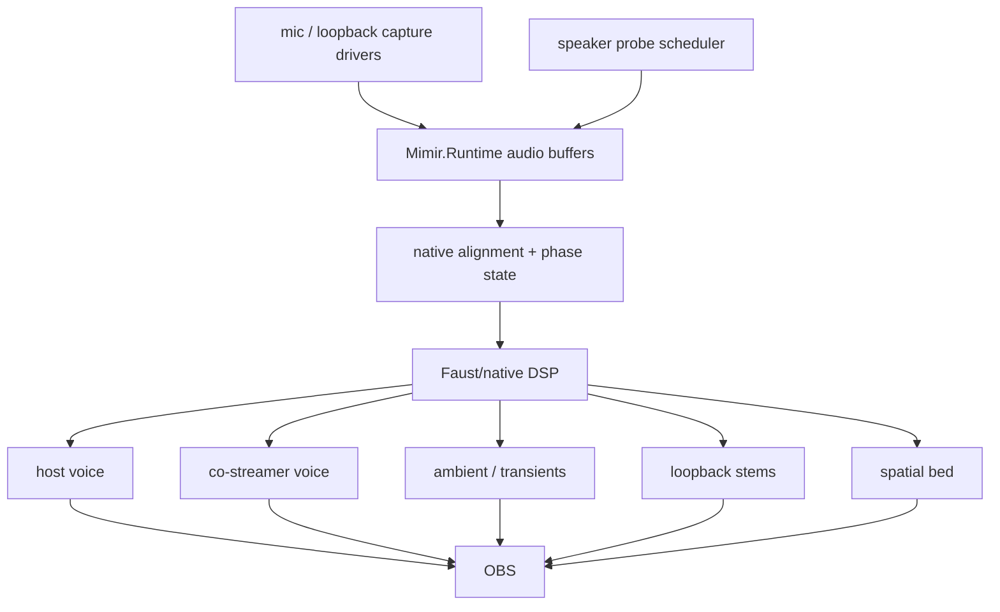
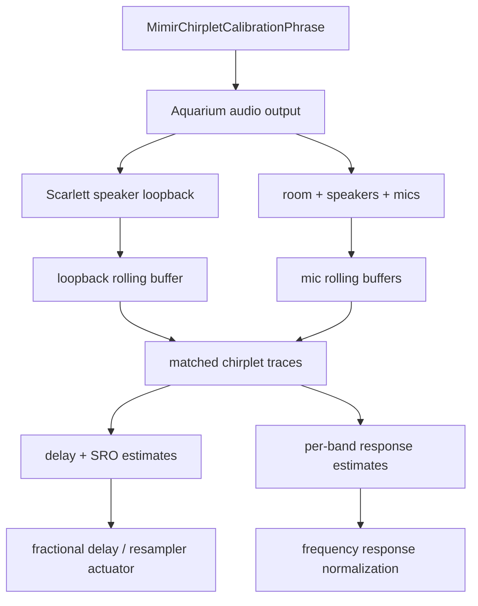

# Audio Field

Mimir's audio field is six microphones, loopback/program reference, and two
calibration speakers aligned into one presentation timeline.

## Live Target

## Invariants

- Scarlett speaker loopback is the timing authority when calibration chirplets
  are playing.
- Focusrite dialogue mics are the voice anchors.
- Camera mics are spatial/context witnesses.
- Loopback/program audio is timing evidence where available; it outranks
  acoustic mics for clock/timing because it is the emitted program surface.
- Distributed inputs must be aligned and resampled before they become program
  stems.
- The five-second runtime window is allowed to be spent on alignment,
  resampling, separation, and spatial-field extraction. Low latency loses to a
  coherent volumetric sound field here.
- Probe signals are budgeted telemetry, not a permanent audio bed.
- Faust/native DSP owns the hot separation and spatialization graph.

## Next Cut

The current diagnostic witness is `native/probes/wasapi_audio_cadence`, which
emits timestamped WASAPI `audio-block` metadata into `Mimir.Runtime` through the
frame-event adapter. It has proven Focusrite mic, Kiyo Pro mic, Kiyo mic, both
USB Camera / PS3 Eye mics, and Scarlett speaker loopback in rolling buffers when
loopback audio is actively playing. One PS3 Eye mic previously enumerated but
produced zero WASAPI packets until that Eye was unplugged and replugged.

The full probe runtime config now enables sample-bearing blocks for every local
audio source. `MimirChirpletCalibrationPhrase` owns the emitted calibration
phrase and the matched-filter shape used to analyze it. The default phrase is a
short harmonic-ish pattern around 8 kHz, 10 kHz, 12 kHz, and 16 kHz, repeated
every 1.5 seconds through Aquarium audio. That makes the telemetry less like a
single sterile squeal and more like a small, identifiable timing signature.

`MimirAudioSynchronizationAnalyzer` resamples candidate mic windows into the
loopback sample-rate timeline, projects loopback and candidate windows through
the same phrase, contrast-normalizes the resulting energy traces, and estimates
current delay against `loopback-scarlett-speakers`. Reports carry both rounded
integer delay and fractional delay from parabolic peak interpolation over the
chirplet correlation peak.

`MimirSynchronizationHub.BuildAlignedAudioFrame` returns a provisional aligned
mono frame: loopback is always channel zero, and other channels enter only when
their chirplet confidence clears the gate. Delay estimates compare loopback and
candidate mic windows at a shared timestamp edge; positive delay means the
candidate mic is late relative to loopback. The current chirplet trace uses a
16-sample hop and parabolic peak interpolation. The aligned-frame application
still rounds to integer samples; the fractional estimate exists so the next
actuator can drive a real fractional-delay line.

The same phrase also starts the frequency-response path. Each report includes
per-band matched energy for the phrase tones. That is not a finished room/mic
normalizer yet, but it is the live surface that will become response-curve
estimation: loopback carries what was emitted, each mic carries what survived
speaker, air, room, and capsule, and the ratio over repeated chirplet phrases
becomes gain/phase correction evidence.

## Chirplet Calibration Model

The calibration phrase owns three facts:

- **Emission**: the PCM that Aquarium sends to the speakers.
- **Timing witness**: the matched-filter kernel used to find the phrase in
  loopback and mic buffers.
- **Response witness**: the per-tone kernels used to measure how strongly each
  mic hears each emitted band.

One chirplet phrase gives a delay estimate. Repeated phrases give drift/SRO by
watching delay change over time. Per-band energy over many phrases gives the
normalization curve. The important constraint is that all three measurements
must be tied to the same emitted phrase, not three separately invented probes.

Next, replace the diagnostic bridge with native audio capture workers that
append typed blocks into `Mimir.Runtime`, then expose buffer depth, clock state,
delay estimates, and stem routing in Aquarium UI.
