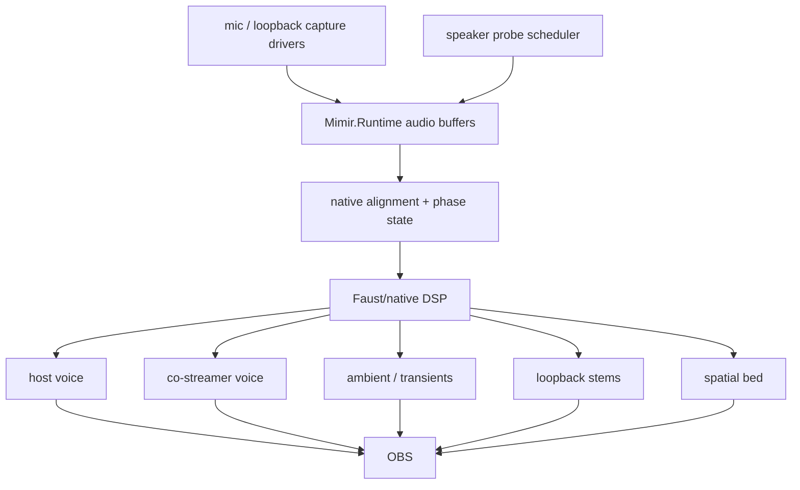
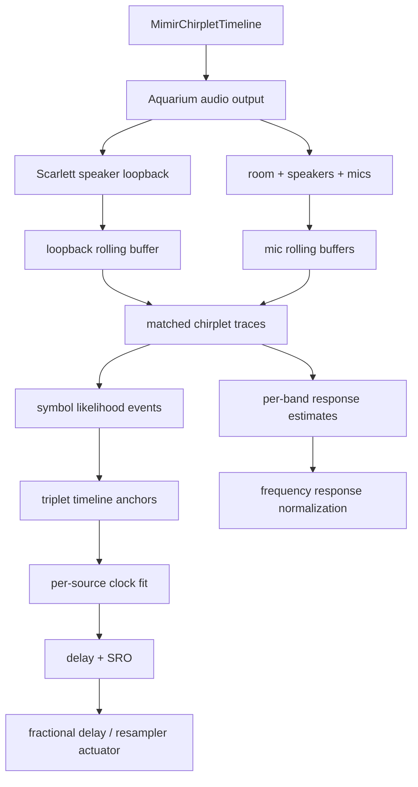

# Audio Field

Mimir's audio field is six microphones, loopback/program reference, and two
calibration speakers aligned into one presentation timeline.

## Live Target



## Invariants

- Scarlett speaker loopback is the timing authority when calibration chirplets
  are playing.
- Focusrite dialogue mics are the voice anchors.
- Camera mics are spatial/context witnesses.
- Loopback/program audio is timing evidence where available; it outranks
  acoustic mics for clock/timing because it is the emitted program surface.
- Distributed inputs must be aligned and resampled before they become program
  stems.
- The five-second runtime window is allowed to be spent on alignment,
  resampling, separation, and spatial-field extraction. Low latency loses to a
  coherent volumetric sound field here.
- Probe signals are budgeted telemetry, not a permanent audio bed.
- Faust/native DSP owns the hot separation and spatialization graph.

## Synchronization Modes

`MimirAudioSynchronizationSettings.Mode` is the runtime authority for what
timing evidence Mimir is allowed to emit:

- `chirp-only`: emit the deterministic calibration timeline and decode timing
  only from that active witness. This is the lab/debug mode and the fallback for
  silent program material.
- `passive`: do not emit calibration audio. Use loopback/program audio as the
  timing witness by estimating delay between the loopback buffer and each mic
  buffer.
- `hybrid`: prefer passive program-audio evidence when confidence is high, then
  emit a watermark when confidence falls. Today the passive side uses bounded
  GCC-PHAT-style phase correlation and the fallback still uses the old active
  chirplet pilot in half-second chunks. The intended watermark is the
  dechirp/FFT-friendly chirp-bin codebook from the decoder research notes,
  shaped and low-gain enough to sit inside the program audio instead of
  announcing itself like a lab sweep.

The mode belongs to the runtime, not the decoder. The decoder should consume
known timing evidence; it should not decide whether Mimir is allowed to make
sound.

The passive estimator is the first real program-audio path, not the final DSP
actuator. It removes DC, pre-emphasizes the window, applies a Hann taper, runs a
PHAT-weighted cross spectrum, and reports the strongest loopback-to-mic lag
inside a bounded window. Positive delay still means the candidate mic is late
relative to loopback.

## Next Cut

The current diagnostic witness is `native/probes/wasapi_audio_cadence`, which
emits timestamped WASAPI `audio-block` metadata into `Mimir.Runtime` through the
frame-event adapter. It has proven Focusrite mic, Kiyo Pro mic, Kiyo mic, both
USB Camera / PS3 Eye mics, and Scarlett speaker loopback in rolling buffers when
loopback audio is actively playing. One PS3 Eye mic previously enumerated but
produced zero WASAPI packets until that Eye was unplugged and replugged.

The full probe runtime config now enables sample-bearing blocks for every local
audio source. `MimirChirpletTimeline` owns the emitted calibration stream and
the matched-filter shape used to analyze it. The default timeline is a
deterministic order-3 de Bruijn symbol sequence over 32 chirp symbols. Any three
consecutive correctly detected symbols identify the event index inside the
current operating horizon, so a receiver can place its audio window on the
canonical timeline without being handed Mimir's runtime clock. Mimir queues
half-second PCM segments ahead of the audio cursor. Each symbol is a small
time/frequency constellation: start band, glide direction/range, duration, and
the following inter-chirp gap all carry code. The point is not ornament. The
timing code is carried by both frequency and rhythm, so it behaves more like a
quiet birdsong texture than a repeated sweep.

The intended decoder is a constrained chirplet transform, not a generic
time-frequency explorer and not an outlier filter around bad guesses. Mimir owns
the emitter, so the receiver projects each mic stream against the known chirplet
dictionary, produces transform frames with multiple symbol candidates, and
scores candidate triplets through the de Bruijn map. A triplet only becomes a
canonical timeline anchor when its symbol likelihoods, measured inter-chirp
gaps, and neighboring anchors agree on one local sample clock. A decoded anchor
means observed sample offset `S` corresponds to emitted event time `T`. A stream
of anchors fits the source clock directly:

```text
observed_sample = source_offset + canonical_seconds * effective_sample_rate
```

Delay and sampling-rate offset are derived by comparing the loopback clock fit
to each mic clock fit over common canonical time. The state tracker is not
allowed to launder invalid codewords into plausible timing. If a stream cannot
produce at least three matched canonical anchors, it has not decoded timing for
that window. Reports carry rounded integer delay, fractional delay, and the
count/confidence of timeline-symbol anchors used to derive the report.

The same timeline also starts the frequency-response path. Each report includes
per-band matched energy for the chirplet atoms. That is not a finished room/mic
normalizer yet, but it is the live surface that will become response-curve
estimation: loopback carries what was emitted, each mic carries what survived
speaker, air, room, and capsule, and the ratio over the continuous chirplet
timeline becomes gain/phase correction evidence.

`MimirAudioSynchronizationStateTracker` turns continuous observations into
state. It confidence-gates reports, smooths fractional delay per source, and
estimates delay slope as sampling-rate offset in ppm. This is the control input
for the coming actuator. The state can survive a brief weak report, but it is
not a license to run blind: loopback must keep receiving the emitted timeline or
fresh reports will stop.

The actual Mimir app path now runs this online: `MimirRuntime.Update` keeps the
chirplet timeline queued, polls sources, and updates sync analysis on a fixed cadence.
`MIMIR_SYNC_TELEMETRY_SECONDS` enables console telemetry for live tests. Current
runtime testing proves Aquarium output wakes the Scarlett loopback and the mic
buffers stay live. The decoder now uses quadrature chirplet atoms so symbol
classification is phase-invariant at the transform layer. The next failure is
physical capture proof: the same canonical anchors need to stay stable through
loopback, room mics, device clocks, and codec/network paths.

## Chirplet Calibration Model



The chirplet timeline owns three facts:

- **Emission**: the PCM that Aquarium sends to the speakers.
- **Timing witness**: the matched-filter atom bank used to find the stream in
  loopback and mic buffers.
- **Response witness**: the per-band atoms used to measure how strongly each
  mic hears each emitted band.

Continuous chirplet evidence gives both the current delay and the drift/SRO by
watching delay change over time. Per-band energy over the same stream gives the
normalization curve. The important constraint is that all three measurements
must be tied to the same emitted timeline, not three separately invented probes.

The symbol layer is intentionally redundant. It does not rely on one fixed
frequency shelf: timing gaps, chirp duration, start band, and glide shape all
contribute so poor mic frequency response does not erase the whole code.
`MimirChirpletSymbolCodebook` owns the symbol definitions so timeline ordering
does not smuggle acoustic shape decisions into bit arithmetic. Every symbol has
a unique chirp shape; rhythm remains additional evidence, not a substitute for
symbol separability. The transform uses sine/cosine chirplet kernels for each
symbol, so timing does not depend on the receiver preserving the emitter's
absolute phase. Run `dotnet run --project .\src\Mimir.BufferSmoke\Mimir.BufferSmoke.csproj -- --chirplet-self-test`
to render two seconds of canonical timeline audio and decode it back to
timeline anchors. Current synthetic proof detects all 15 emitted chirps, keeps
13 possible triplet anchors for events 0 through 12, fits the clock at
47999.999990 Hz, and holds mean absolute anchor error to 0.000014 samples. Real
device runs still depend on loopback capture staying live; the local Scarlett
loopback has intermittently stopped advancing during short headless sniffs.

This matcher is a proof, not the final hot path. `BuildChirpletEnergyTrace`
still behaves like a dense sliding matched-filter bank. The current research
note at `research/chirplet-sync-decoder/summary.md` points at the better
receiver shape: design the emitted symbol codebook so a mic can dechirp a
candidate event window and classify symbols by FFT or Goertzel bins. The
transmitter is ours; do not preserve arbitrary symbol shapes if they force the
receiver to spend a CPU core proving they exist.

Next, replace the diagnostic bridge with native audio capture workers that
append typed blocks into `Mimir.Runtime`, then expose buffer depth, clock state,
delay estimates, and stem routing in Aquarium UI.
