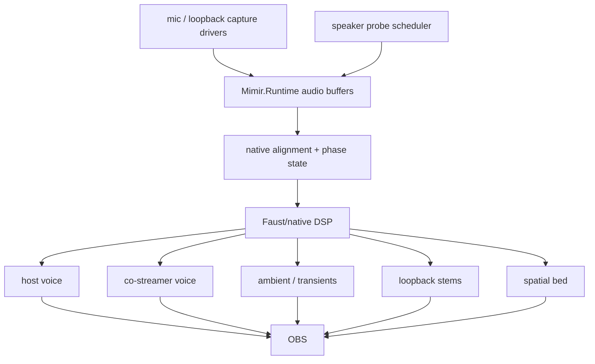

# Audio Field

Mimir's audio field is six microphones, loopback/program reference, and two
calibration speakers aligned into one presentation timeline.

## Live Target

## Invariants

- Focusrite dialogue mics are the voice anchors.
- Camera mics are spatial/context witnesses.
- Loopback/program audio is timing evidence where available.
- Distributed inputs must be aligned and resampled before they become program
  stems.
- Probe signals are budgeted telemetry, not a permanent audio bed.
- Faust/native DSP owns the hot separation and spatialization graph.

## Next Cut

The current diagnostic witness is `native/probes/wasapi_audio_cadence`, which
emits timestamped WASAPI `audio-block` metadata into `Mimir.Runtime` through the
frame-event adapter. It has proven Focusrite mic, Kiyo Pro mic, Kiyo mic, one
USB Camera mic, and Scarlett speaker loopback in rolling buffers when loopback
audio is actively playing. A second USB Camera microphone endpoint enumerates
but currently produces zero WASAPI packets.

Next, replace the diagnostic bridge with native audio capture workers that
append typed blocks into `Mimir.Runtime`, then expose buffer depth, clock state,
delay estimates, and stem routing in Aquarium UI.
