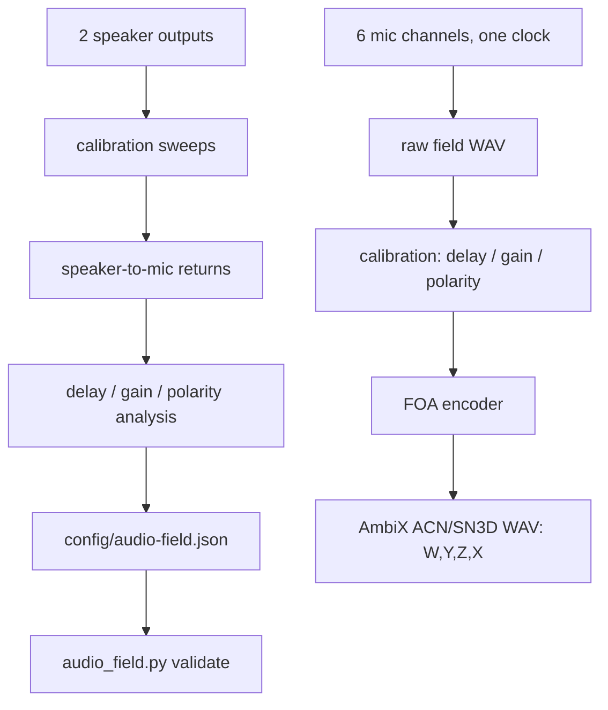

# Audio Field Spine

## Objective

Build the audio side as one synchronized six-microphone capture path, a declared first-order Ambisonic field, and a two-speaker calibration/feedback path.

This is not the old OBS endpoint model. OBS can still receive rendered stems later, but microphones that participate in the field belong to the audio-field pipeline first. The six channels need one clock, one profile, and one calibration ledger. Otherwise the system is just six microphones telling six slightly different lies at once.

## Current Mechanism

The repo now has a profile and tool:

- `config/audio-field.example.json` declares the six microphone channels, two speaker channels, geometry, calibration sweep settings, and FOA AmbiX bus format.
- `scripts/audio_field.py` validates the profile, lists PortAudio devices, records six-channel fields, plays speaker calibration sweeps, analyzes speaker-to-mic returns, and encodes a recorded six-channel WAV into first-order AmbiX.

The profile assumes one input device exposes at least six synchronized input channels and one output device exposes at least two output channels. If the mics are split across separate USB clocks, stop there. Do not pretend that drift is ambience with better branding.

## Pipeline



## Commands

Create a local profile first:

```powershell
Copy-Item .\config\audio-field.example.json .\config\audio-field.json
```

List audio devices:

```powershell
.\.venv\Scripts\python.exe .\scripts\audio_field.py devices
```

Validate the profile and device match:

```powershell
.\.venv\Scripts\python.exe .\scripts\audio_field.py validate --profile .\config\audio-field.json --check-devices
```

Generate a calibration sweep without touching hardware:

```powershell
.\.venv\Scripts\python.exe .\scripts\audio_field.py make-stimulus --profile .\config\audio-field.json
```

Play each speaker and record all six microphones:

```powershell
.\.venv\Scripts\python.exe .\scripts\audio_field.py play-record --profile .\config\audio-field.json
```

Analyze the calibration run:

```powershell
.\.venv\Scripts\python.exe .\scripts\audio_field.py analyze-calibration --profile .\config\audio-field.json --run .\calibration\runs\<run-folder>
```

Record the raw field:

```powershell
.\.venv\Scripts\python.exe .\scripts\audio_field.py record-field --profile .\config\audio-field.json --seconds 30
```

Encode an offline raw field WAV to FOA AmbiX:

```powershell
.\.venv\Scripts\python.exe .\scripts\audio_field.py encode-foa --profile .\config\audio-field.json --input .\calibration\runs\<run-folder>\field-raw.wav --output .\calibration\runs\<run-folder>\field-foa-ambix.wav
```

## Invariants

- One synchronized capture device owns the six microphone channels.
- `audio-field.json` owns channel identity, geometry, gain, delay, polarity, and bus format.
- FOA output is AmbiX: ACN channel order, SN3D normalization, channels `W,Y,Z,X`.
- Speaker calibration is a measurement path, not a generic monitor output.
- Speaker-to-mic feedback belongs to calibration/echo-path estimation before it is used for live correction.
- Camera fusion may publish listener or source pose later, but it does not own audio channel timing.

## First Cut Limits

The current encoder is a source-style FOA mix from calibrated microphone channels and declared orientations. It is useful for proving the wiring, timing, and interchange format. It is not a full arbitrary-array sound-field reconstruction.

The next honest steps are:

1. Confirm one device exposes all six mic channels at 48 kHz.
2. Replace placeholder geometry with measured positions in the shared world coordinate system.
3. Run speaker sweeps and copy measured delay/gain/polarity back into `config/audio-field.json`.
4. Record a six-channel field and encode a first FOA WAV.
5. Only after that, decide whether the field needs a measured arbitrary-array encoder instead of the source-style FOA mix.
