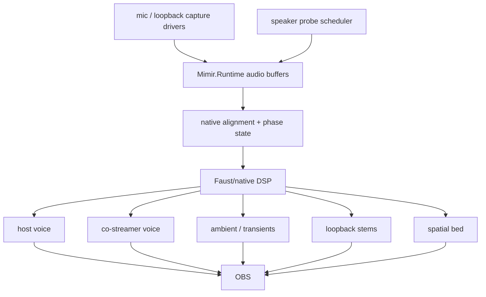

# Audio Field

Mimir's audio field is six microphones, loopback/program reference, and two
calibration speakers aligned into one presentation timeline.

## Live Target

## Invariants

- Focusrite dialogue mics are the voice anchors.
- Camera mics are spatial/context witnesses.
- Loopback/program audio is timing evidence where available.
- Distributed inputs must be aligned and resampled before they become program
  stems.
- Probe signals are budgeted telemetry, not a permanent audio bed.
- Faust/native DSP owns the hot separation and spatialization graph.

## Next Cut

Add native audio capture workers that append typed blocks into
`Mimir.Runtime`, then expose buffer depth, clock state, delay estimates, and
stem routing in Aquarium UI.
