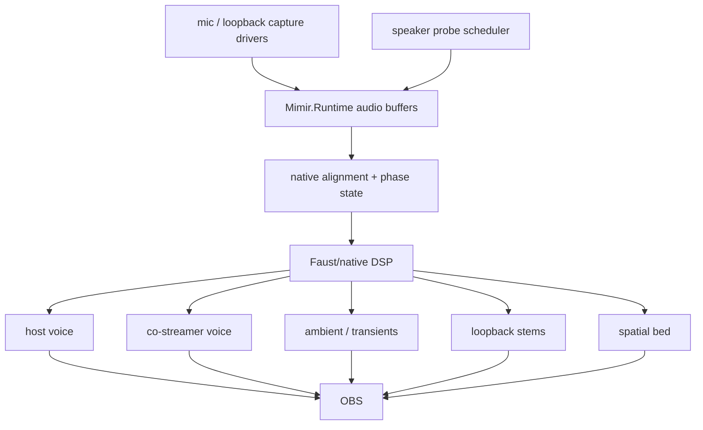
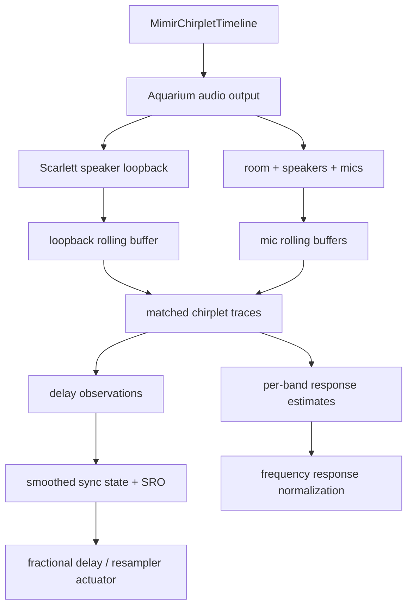

# Audio Field

Mimir's audio field is six microphones, loopback/program reference, and two
calibration speakers aligned into one presentation timeline.

## Live Target

## Invariants

- Scarlett speaker loopback is the timing authority when calibration chirplets
  are playing.
- Focusrite dialogue mics are the voice anchors.
- Camera mics are spatial/context witnesses.
- Loopback/program audio is timing evidence where available; it outranks
  acoustic mics for clock/timing because it is the emitted program surface.
- Distributed inputs must be aligned and resampled before they become program
  stems.
- The five-second runtime window is allowed to be spent on alignment,
  resampling, separation, and spatial-field extraction. Low latency loses to a
  coherent volumetric sound field here.
- Probe signals are budgeted telemetry, not a permanent audio bed.
- Faust/native DSP owns the hot separation and spatialization graph.

## Next Cut

The current diagnostic witness is `native/probes/wasapi_audio_cadence`, which
emits timestamped WASAPI `audio-block` metadata into `Mimir.Runtime` through the
frame-event adapter. It has proven Focusrite mic, Kiyo Pro mic, Kiyo mic, both
USB Camera / PS3 Eye mics, and Scarlett speaker loopback in rolling buffers when
loopback audio is actively playing. One PS3 Eye mic previously enumerated but
produced zero WASAPI packets until that Eye was unplugged and replugged.

The full probe runtime config now enables sample-bearing blocks for every local
audio source. `MimirChirpletTimeline` owns the emitted calibration stream and
the matched-filter shape used to analyze it. The default timeline is
deterministic and unbounded: event `N` is generated directly from `N`, with no
registry, remembered random state, or repeat cycle. Mimir queues half-second PCM
segments ahead of the audio cursor, and each segment contains short asymmetric
chirplets chosen from a harmonic high-frequency vocabulary. The point is not
ornament. The timing code is carried by both frequency and rhythm, so it behaves
more like a quiet birdsong texture than a repeated sweep.

`MimirAudioSynchronizationAnalyzer` resamples candidate mic windows into the
loopback sample-rate timeline, projects loopback and candidate windows through a
continuous chirplet atom bank, contrast-normalizes the resulting energy traces,
and estimates current delay against `loopback-scarlett-speakers`. The lag search
is wide enough for ordinary remote/network delay, not just local speaker-to-mic
delay. Reports carry both rounded integer delay and fractional delay from
parabolic peak interpolation over the chirplet correlation peak.

`MimirSynchronizationHub.BuildAlignedAudioFrame` returns a provisional aligned
mono frame: loopback is always channel zero, and other channels enter only when
their chirplet confidence clears the gate. Delay estimates compare loopback and
candidate mic windows at a shared timestamp edge; positive delay means the
candidate mic is late relative to loopback. The current chirplet trace uses a
16-sample hop and parabolic peak interpolation. The aligned-frame application
still rounds to integer samples; the fractional estimate exists so the next
actuator can drive a real fractional-delay line.

The same timeline also starts the frequency-response path. Each report includes
per-band matched energy for the chirplet atoms. That is not a finished room/mic
normalizer yet, but it is the live surface that will become response-curve
estimation: loopback carries what was emitted, each mic carries what survived
speaker, air, room, and capsule, and the ratio over the continuous chirplet
timeline becomes gain/phase correction evidence.

`MimirAudioSynchronizationStateTracker` turns continuous observations into
state. It confidence-gates reports, smooths fractional delay per source, and
estimates delay slope as sampling-rate offset in ppm. This is the control input
for the coming actuator. The state can survive a brief weak report, but it is
not a license to run blind: loopback must keep receiving the emitted timeline or
fresh reports will stop.

The actual Mimir app path now runs this online: `MimirRuntime.Update` keeps the
chirplet timeline queued, polls sources, and updates sync analysis on a fixed cadence.
`MIMIR_SYNC_TELEMETRY_SECONDS` enables console telemetry for live tests. Current
runtime testing proves Aquarium output wakes the Scarlett loopback, the mic
buffers stay live, and the continuous timeline can produce confident online sync
states in the app. The next failure is no longer lock/no-lock; it is stabilizing
state filtering enough for the actuator.

## Chirplet Calibration Model

The chirplet timeline owns three facts:

- **Emission**: the PCM that Aquarium sends to the speakers.
- **Timing witness**: the matched-filter atom bank used to find the stream in
  loopback and mic buffers.
- **Response witness**: the per-band atoms used to measure how strongly each
  mic hears each emitted band.

Continuous chirplet evidence gives both the current delay and the drift/SRO by
watching delay change over time. Per-band energy over the same stream gives the
normalization curve. The important constraint is that all three measurements
must be tied to the same emitted timeline, not three separately invented probes.

Next, replace the diagnostic bridge with native audio capture workers that
append typed blocks into `Mimir.Runtime`, then expose buffer depth, clock state,
delay estimates, and stem routing in Aquarium UI.
