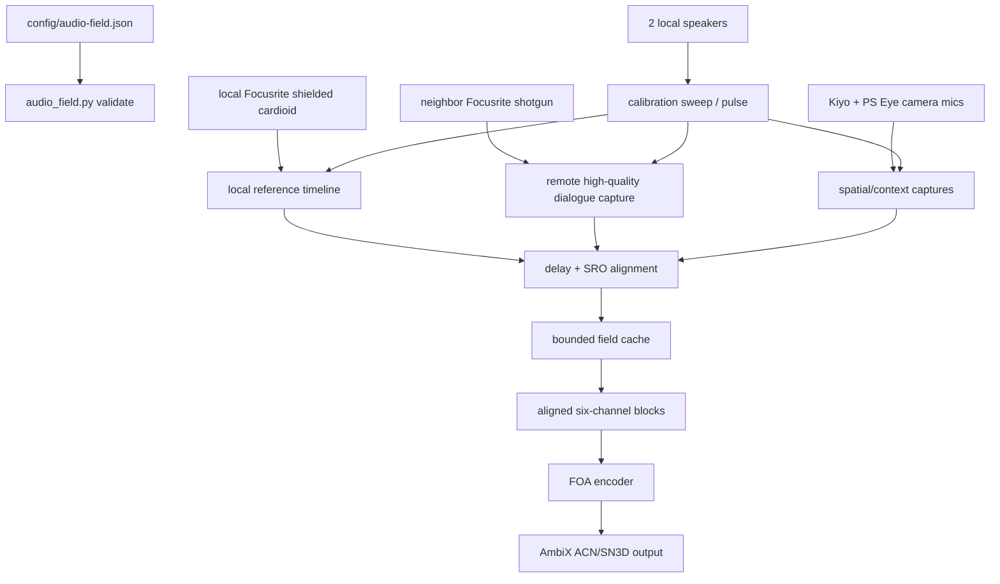

# Audio Field Spine

## Objective

Build the audio side around the real six-microphone rig: two Kiyo camera mics, two PS Eye camera mics, the local Focusrite ADC with a shielded cardioid near the host's face, and the neighbor Focusrite ADC with a shotgun mic pointed at the co-streamer.

The Focusrite channels are the dialogue anchors. The camera mics are spatial context, calibration evidence, and fallback texture. Treating all six as equal would be tidy on paper and stupid in the room, which is the classic way paper gets someone fired by physics.

## Current Mechanism

The repo has a profile and tool:

- `config/audio-field.example.json` declares each mic source, machine, device query, clock domain, field channel, quality priority, placeholder geometry, two local speaker channels, calibration sweep settings, and FOA AmbiX bus format.
- `scripts/audio_field.py` validates shared or distributed profiles, lists PortAudio devices, checks local distributed sources, generates calibration sweeps, summarizes the sync plan, preserves shared-input capture helpers, and encodes an already aligned six-channel WAV into first-order AmbiX.

The default profile is `distributed-clocks`. The coherent field is not captured directly. It is assembled after delay and sampling-rate-offset alignment.

Latency is allowed. The live goal is bounded buffered real-time: hold enough audio to estimate delay and slow clock drift, emit blocks behind the live edge, and converge instead of chasing instant output with bad math. The profile owns that latency policy.

## Pipeline



## Commands

Create a local profile first:

```powershell
Copy-Item .\config\audio-field.example.json .\config\audio-field.json
```

List audio devices:

```powershell
.\.venv\Scripts\python.exe .\scripts\audio_field.py devices
```

Probe whether a Focusrite path accepts high-rate capture:

```powershell
.\.venv\Scripts\python.exe .\scripts\audio_field.py probe-rates --device-query Scarlett --hostapi WASAPI --direction input --channels 1 --rate 48000 --rate 96000
```

Probe the speaker output path separately:

```powershell
.\.venv\Scripts\python.exe .\scripts\audio_field.py probe-rates --device-query Scarlett --hostapi WASAPI --direction output --channels 2 --rate 44100 --rate 48000 --rate 96000
```

Validate the profile and local device matches:

```powershell
.\.venv\Scripts\python.exe .\scripts\audio_field.py validate --profile .\config\audio-field.json --check-devices
```

Summarize the clock domains and required alignment path:

```powershell
.\.venv\Scripts\python.exe .\scripts\audio_field.py sync-plan --profile .\config\audio-field.json
```

Generate a calibration sweep without touching hardware:

```powershell
.\.venv\Scripts\python.exe .\scripts\audio_field.py make-stimulus --profile .\config\audio-field.json
```

Encode an offline aligned six-channel WAV to FOA AmbiX:

```powershell
.\.venv\Scripts\python.exe .\scripts\audio_field.py encode-foa --profile .\config\audio-field.json --input .\calibration\runs\<run-folder>\field-aligned.wav --output .\calibration\runs\<run-folder>\field-foa-ambix.wav
```

The `play-record` and `record-field` commands remain for a `shared-input-device` profile only. They deliberately refuse the distributed rig until an alignment stage emits one coherent six-channel WAV.

## Invariants

- Each physical microphone declares its machine, device query, clock domain, field channel, geometry, gain, delay, polarity, directivity, and role.
- The local Focusrite shielded cardioid is the default reference mic.
- The neighbor Focusrite shotgun is the co-streamer dialogue anchor and should be captured losslessly for calibration.
- Focusrite captures should use the best available native/exclusive path and high-rate calibration capture when practical, then resample into the field timeline after alignment.
- Playback sample rate is its own device fact. Probe it separately; do not assume the Scarlett input and output paths accept the same rates through PortAudio/WASAPI.
- Distributed-clock microphones must be aligned and resampled into one reference timeline before FOA encoding.
- Output may run behind live input by the configured latency budget, but it must converge toward real-time instead of letting cache depth grow without bound.
- FOA output is AmbiX: ACN channel order, SN3D normalization, channels `W,Y,Z,X`.
- Speaker calibration is a measurement path, not a generic monitor output.
- Camera fusion may publish listener or source pose later, but it does not own audio channel timing.

## Module Boundaries

The audio code is split so the hard parts can be tested without the room, drivers, or neighbor machine:

- `audio_field.buffering` owns source buffers and ordered field assembly.
- `audio_field.latency` owns the bounded-delay real-time convergence policy.
- `audio_field.ports` declares injectable capture, alignment, encoder, and sink protocols.
- `audio_field.pipeline` wires those ports together without knowing whether the source is a real Focusrite, an SRT receiver, a WAV fixture, or a test double.
- `scripts/audio_field.py` stays as the operator CLI and hardware probe surface.

This is the portfolio-piece line: each module owns one invariant, and the tests use mocks/fakes instead of asking a driver stack to please be emotionally available.

## First Cut Limits

The current encoder is a source-style FOA mix from calibrated microphone channels and declared orientations. It accepts an already aligned six-channel WAV. It does not capture or align independent USB/network clocks by itself, and it is not a full arbitrary-array sound-field reconstruction.

Next honest steps:

1. Confirm local Kiyo, PS Eye, local Focusrite, and local speaker device matches.
2. Confirm the neighbor Focusrite capture path, preferably native/exclusive or the best FFmpeg/driver route available on that machine.
3. Probe the local and neighbor Focusrites for 48 kHz and 96 kHz capture support through the best available driver path.
4. Capture the two Focusrite anchors losslessly during calibration; prefer 96 kHz when driver/device support is real, then resample after sync.
5. Replace placeholder mic/speaker geometry with measured world coordinates.
6. Build the delay/SRO alignment stage that feeds `audio_field.buffering.FieldAssemblyCache`.
7. Emit aligned six-channel blocks under the configured latency policy.
8. Encode the first FOA AmbiX test only after that aligned WAV/block stream exists.
