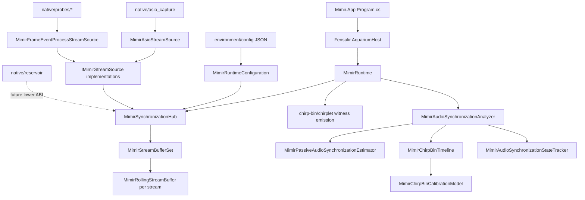

# Mimir Code Algorithm Map

## What This File Is

This is a source-grounded map of the code currently in this repo. It follows the
style of `repixelizer/docs/lean-optimizer-algorithm-map.md`: stage-oriented,
plain about ownership, and explicit about which blocks deserve to live.

Generated build trees under `native/**/build/` are not mapped as source. Stored
calibration artifacts are mapped as evidence surfaces, not as executable code.

Timestamp for this pass: 2026-05-23, starting at 23:24 Europe/London.

## One-Sentence Machine

Mimir collects local and network audio/video samples into bounded rolling
runtime buffers, uses active/passive timing evidence to place audio streams on a
canonical timeline, and leaves Fensalir/Faust/OBS with clear ownership over
rendering, DSP, and broadcast composition.

## Current Mechanism

Inputs enter through `IMimirStreamSource` implementations. The
`MimirSynchronizationHub` polls those sources and appends `MimirStreamSample`
records into one `MimirRollingStreamBuffer` per stream. `MimirRuntime` owns the
Fensalir-facing lifecycle: boot, update, empty scene render plan, audio witness
emission, UI readouts, telemetry, and scheduled audio synchronization analysis.

The audio sync analyzer extracts recent mono PCM windows from the rolling
buffers, resamples candidates to the reference rate, and chooses evidence by
mode:

- `passive`: PHAT-weighted cross-spectrum correlation on program audio.
- `chirp-only`: active chirp-bin timeline decode.
- `hybrid`: passive first, chirp-bin watermark when passive confidence is weak.

Active chirp-bin decode uses known codebook/schedule state. It proposes event
times from local energy, classifies symbols by dechirp plus fixed Goertzel/bin
scoring, constrains candidates through de Bruijn code-valid triplets, fits a
clock, and records band/confusion/delay/phase evidence for calibration.

## Invariants

- Stream identity is `SourceId + Kind + Origin`.
- A rolling buffer owns retention for exactly one stream identity.
- The five-second default buffer is compute budget, not accidental delay.
- Loopback/reference audio is timing authority; network feeds are producers, not
  clock authorities.
- UI and telemetry read cached sync state; they do not run analysis.
- Native capture owns hardware calls. Runtime owns sample identity and buffer
  placement.
- Fensalir owns windowing, rendering, D3D12, UI, visual fusion, and program
  video output.
- Faust/native DSP will own hot resampling, fractional delay, separation,
  spatialization, and stems.
- OBS owns broadcast composition.

## Diagram

## Stable Core

- `Mimir.slnx` is the public solution surface.
- `src/Mimir.App` is only the Fensalir host launcher.
- `src/Mimir.Runtime` is the runtime machine.
- `src/Mimir.BufferSmoke` is the executable proof/test harness.
- `native/asio_capture` is the production-shaped Scarlett ASIO source.
- `native/reservoir` is the lower native rolling-buffer ABI.
- `native/probes/*` are measurement and diagnostic tools.
- `scripts/*` are bridge utilities, not the final synchronized program path.

## Stage 0: Solution And App Host

### `Mimir.slnx`

Source: `Mimir.slnx`

Owns:

- The three C# projects in the repo: app, runtime, and smoke/proof harness.

Inputs:

- MSBuild/project references.

Outputs:

- A build graph that keeps host, runtime, and harness distinct.

What source actually does:

- Declares a `/src/` folder with `Mimir.App`, `Mimir.Runtime`, and
  `Mimir.BufferSmoke`.

Invariant:

- The app and runtime remain separable. The window host is not allowed to become
  the synchronization machine.

### `src/Mimir.App/Mimir.App.csproj`

Owns:

- The Windows executable app project.

Inputs:

- `Mimir.Runtime`.
- Fensalir `Aquarium.Engine`.

Outputs:

- `Mimir.App.exe`, a Fensalir-hosted executable.

What source actually does:

- Targets `net10.0`.
- Uses `WinExe` output.
- References Mimir runtime and Fensalir engine.

### `src/Mimir.App/Program.cs`

Owns:

- Host argument shaping before Fensalir starts.

Blocks:

- Top-level host args block: copies CLI args and injects
  `--client-assembly Mimir.Runtime.dll` unless the caller already supplied
  `--client-assembly` or `--live-assembly`.
- `HasOption`: case-insensitive option check.
- `ResolveRuntimeAssemblyPath`: lets `MIMIR_RUNTIME_ASSEMBLY` override the
  runtime DLL path, otherwise uses `AppContext.BaseDirectory/Mimir.Runtime.dll`.

Invariant:

- Mimir does not copy Fensalir host code. It points Fensalir at the runtime
  assembly and gets out of the way.

## Stage 1: Fensalir Runtime Surface

### `src/Mimir.Runtime/Mimir.Runtime.csproj`

Owns:

- Runtime library build settings.

Inputs:

- Fensalir engine contracts.

Outputs:

- `Mimir.Runtime.dll`.

What source actually does:

- Targets `net10.0`.
- Enables nullable/implicit usings.
- Enables unsafe blocks for native function-pointer ASIO bridge.
- Copies local lockfile assemblies so Fensalir can load the runtime assembly.

### `src/Mimir.Runtime/MimirRuntimeFactory.cs`

Owns:

- The Fensalir runtime factory seam.

Blocks:

- `MimirRuntimeFactory : IAquariumRuntimeFactory`: constructs `MimirRuntime`
  from `AquariumRuntimeOptions`.

Invariant:

- Fensalir asks for an `IAquariumRuntime`; Mimir supplies exactly one runtime
  owner.

### `src/Mimir.Runtime/MimirRuntime.cs`

Owns:

- The live app runtime loop and Fensalir-facing state.

Core state:

- `MimirSynchronizationHub synchronization`: source polling, buffers, reports.
- `AquariumUiDocument ui`: runtime readout panel.
- `AquariumAudioDocument audio`: queued calibration/watermark audio.
- `MimirAudioSynchronizationSettings audioSyncSettings`: timing mode and gains.
- Runtime clocks: `runtimeSeconds`, `nextAudioSyncSeconds`,
  `nextTelemetrySeconds`, `calibrationSegmentIndex`.
- Last observations: poll count, passive confidence, analysis time, reports.

Blocks:

- Constructors: load config, create hub, cache audio settings, register stream
  sources, create UI.
- `Frame`: returns an empty scene state with starfield and heightfield disabled.
- `RenderPlan`: creates a minimal render graph with HDR target, perspective
  camera, fullscreen scene pass, presentation, DirectWrite overlay, and debug
  view.
- `Start`: prints buffer and sync mode summary.
- `Update`: advances runtime time, queues calibration timeline, polls sources,
  updates audio sync, emits telemetry.
- `ComposeFrame`: returns the input frame unchanged; Mimir owns no app-specific
  scene yet.
- `FlushState`: currently empty.
- `Dispose`: disposes the synchronization hub.
- `CreateUi`: builds a "Mimir Sync" panel with buffer, source, sync, aligned
  audio, and chirplet reference readouts.
- `QueueCalibrationTimeline`: decides whether to emit active timing audio,
  chooses continuous chirp-only batches or sparse hybrid watermark segments, and
  enqueues PCM16 base64 into Fensalir audio.
- `CurrentCalibrationSegmentIndex`: maps runtime time to canonical timeline
  segment.
- `DescribeChirpletReference`: explains current active/passive emission state.
- `RenderCalibrationBatchPcm16Base64`: renders chirp-bin or legacy chirplet
  timeline segments as mono PCM16 and base64-encodes them for Fensalir audio.
- `UseChirpBinTimeline`: routes chirp-only and hybrid to the chirp-bin machine.
- `UpdateAudioSynchronization`: runs one bounded analyzer step on cadence and
  stores cached reports.
- `EmitTelemetry`: prints buffer, report, state, and decode-trace lines when
  `MIMIR_SYNC_TELEMETRY_SECONDS` is set.
- `ParseTelemetryIntervalSeconds` and `ParseAudioSyncIntervalSeconds`: clamp
  environment-controlled telemetry/analysis cadence.
- `ShouldEmitCalibrationTimeline`: chirp-only always emits when reference
  buffer exists; passive never emits; hybrid emits only below confidence
  threshold.
- `HasReferenceAudioBuffer`: verifies the reference stream is present.
- `Describe*` helpers: produce UI/telemetry strings from cached runtime state.

Invariant:

- Runtime update owns when analysis happens. UI and telemetry only read the
  cached result. That matters; re-entrant analysis in a readout would be a
  stupid little self-DOS wearing a nice shirt.

## Stage 2: Stream Identity, Samples, And Buffer Ownership

### `MimirStreamKind.cs`

Owns:

- Stream type and origin enums.

Blocks:

- `MimirStreamKind`: currently `Video` and `Audio`.
- `MimirStreamOrigin`: local device versus network producer.

Invariant:

- "What kind of signal is this?" and "where did it originate?" are explicit
  identity fields, not inferred from adapter names.

### `MimirStreamDescriptor.cs`

Owns:

- Declarative stream identity.

Blocks:

- `MimirStreamDescriptor`: `SourceId`, `Kind`, `Origin`, `Enabled`.
- `BufferKey`: stable key `Kind:Origin:SourceId`.

Invariant:

- One descriptor identity maps to one rolling buffer.

### `MimirStreamSample.cs`

Owns:

- Runtime sample envelope.

Fields:

- Source identity: `SourceId`, `Kind`, `Origin`.
- Timing: `TimestampNs`, `ArrivalNs`, `Sequence`.
- Payload handle: `PayloadHandle`, `ByteLength`, optional copied `Data`.
- Typed metadata: optional `MimirVideoFrameDescriptor`, optional
  `MimirAudioBlockDescriptor`.

Invariant:

- Runtime can reason about time and identity even when payload bytes live in
  native/GPU memory.

### `MimirVideoFrameDescriptor.cs`

Owns:

- Video payload metadata.

Blocks:

- `MimirVideoPixelFormat`: unknown, grayscale, raw, packed/compressed camera
  formats, BGRA/NV12, and Leap stereo IR.
- `MimirVideoFrameDescriptor`: dimensions, pixel format, stride, device time,
  native handle, native handle kind.

### `MimirAudioBlockDescriptor.cs`

Owns:

- Audio payload metadata.

Blocks:

- `MimirAudioSampleFormat`: unknown, float32, int16, int24, int32.
- `MimirAudioBlockDescriptor`: sample rate, channels, format, frame count,
  device time, native handle, native handle kind.

### `MimirRollingStreamBuffer.cs`

Owns:

- One bounded in-memory rolling window for one stream identity.

Blocks:

- Constructor: clamps invalid durations to five seconds.
- `EdgeNs`: latest timestamp edge in the buffer.
- `WindowStartNs`: edge minus duration.
- `Append`: rejects samples that do not match the descriptor, advances edge,
  enqueues sample, stores latest, evicts expired samples.
- `Snapshot`: returns an array copy for analysis/readers.
- `EvictExpired`: removes samples older than the rolling window.

Invariant:

- Retention belongs to the buffer edge. A stream sample cannot silently enter
  the wrong stream.

### `MimirStreamBufferSet.cs`

Owns:

- Buffer lookup and lazy creation.

Blocks:

- Constructor: owns default duration.
- `EnsureBuffer`: creates a `MimirRollingStreamBuffer` keyed by descriptor.
- `Append`: derives descriptor identity from a sample and appends to that
  buffer.

Invariant:

- The set owns the dictionary; individual buffers own retention and membership.

## Stage 3: Runtime Configuration

### `MimirSynchronizationSettings.cs`

Owns:

- Environment-shaped synchronization settings.

Blocks:

- `MimirSynchronizationSettings`: buffer duration, audio settings, stream list.
- `FromEnvironment`: reads buffer duration and local/network audio/video stream
  env vars.
- `ReadDuration`: reads `MIMIR_SYNC_BUFFER_SECONDS` or
  `MIMIR_RESERVOIR_SECONDS`, clamps to `0.25..60` seconds, defaults to five.
- `AddStreams`: splits comma/semicolon stream ids into descriptors.
- `MimirAudioSynchronizationSettings`: mode, reference source, chirp gain,
  watermark gain, calibration model path.
- `FromEnvironment` / `WithEnvironmentOverrides`: applies env overrides.
- `ParseMode`: accepts chirp-only/passive/hybrid aliases.
- `ReadReferenceSourceId`, `ReadCalibrationGain`, `ReadWatermarkGain`,
  `ReadCalibrationModelPath`: clamp and normalize env values.
- `MimirAudioSyncMode`: `ChirpOnly`, `Passive`, `Hybrid`.

Invariant:

- Mode belongs to runtime policy, not to the decoder. The decoder consumes
  signal evidence; runtime decides whether active evidence is allowed.

### `MimirRuntimeConfiguration.cs`

Owns:

- JSON config loading and adapter construction.

Blocks:

- `Load`: resolves config path, deserializes config, computes buffer duration,
  audio settings, descriptors, and source objects.
- `ResolveConfigPath`: honors `MIMIR_RUNTIME_CONFIG`, then walks upward looking
  for `config/mimir-runtime.json`.
- `ToDescriptor`: converts one stream config to one descriptor.
- `ToDescriptors`: expands `acceptSourceIds` into per-channel descriptors.
- `TryCreateSource`: adapter factory for `native`, `asio`, `frame-events`,
  `json-lines`, and raw `process`.
- `ResolveCommand`: makes relative command paths relative to the config file.
- `ParseKind` / `ParseOrigin`: fail fast on unknown enum text.
- `MimirRuntimeConfigFile`: buffer seconds, audio sync block, stream configs.
- `MimirAudioSyncConfig`: config-shaped audio settings plus `ToSettings`.
- `MimirStreamConfig`: source id, kind, origin, adapter, command, args, accepted
  source ids, chunk size, sample rate, driver CLSID.

Invariant:

- Configuration creates producers and descriptors. It does not own live state.

### `config/mimir-runtime.asio.example.json`

Owns:

- Minimal continuous Scarlett runtime ingest example.

Blocks:

- `bufferSeconds`: five-second runtime window.
- `audioSync`: chirp-only mode, `asio-ch2` as reference, gain/model path.
- `streams`: one ASIO adapter instance accepting `asio-ch0..asio-ch3` from the
  native DLL at 192 kHz.

### `config/perfect-machine.example.json`

Owns:

- Declarative target-shape contract.

Blocks:

- `reservoir`: five-second shared-edge native reservoir policy.
- `viableStreamApp`: Mimir app/runtime/Fensalir ownership.
- `authorities`: Mimir, Fensalir, Faust, OBS boundaries.
- `visualSensors` / `audioSensors`: target rig identities.
- `reservoirRings`: typed native sample views.
- `outputs`: Spout2 video and audio stem targets.
- `runtimePolicy`: live-only owners and forbidden compatibility-edge work.

Invariant:

- The target machine is not "whatever the current adapters happen to do." The
  config says who owns what.

## Stage 4: Source Adapters

### `IMimirStreamSource.cs`

Owns:

- Runtime source interface.

Blocks:

- `Descriptor`: the source's descriptor buffer identity.
- `ExposesDescriptorBuffer`: true by default; multi-channel sources can return
  false when accepted source ids create buffers instead.
- `TryRead`: nonblocking sample dequeue/poll.

### `MimirNativeIngestStreamSource.cs`

Owns:

- Direct push source for native/runtime callers.

Blocks:

- Queue and sequence state.
- `Push`: enqueues a sample with descriptor identity and optional payload data.
- `PushVideoFrame`: validates video kind and wraps frame metadata.
- `TryRead`: dequeues.
- `Dispose`: empty because the source owns no hardware.

Invariant:

- Direct native ingest can enter the same runtime machinery without pretending
  to be a process or JSON stream.

### `MimirAsioStreamSource.cs`

Owns:

- In-process Scarlett ASIO sample ingestion from `mimir_asio_capture.dll`.

Blocks:

- `MimirAsioStreamSourceOptions`: native DLL path, driver CLSID, sample rate,
  source ids.
- Constructor: starts a background STA capture thread, waits up to five seconds
  for native startup, throws on start error.
- `TryRead`: drains queued `MimirStreamSample` blocks.
- `Dispose`: cancels the capture loop and joins the thread.
- `CaptureLoop`: loads native library, creates ASIO capture, starts it, reads
  channel blocks, converts each channel block to Float32 bytes, assigns source
  id, enqueues audio samples, bounds queued blocks.
- `Native.Load`: loads DLL and resolves exported function pointers.
- `Native.Create`, `Start`, `Read`, `Destroy`: unsafe stdcall bridge methods.

Invariant:

- ASIO callback timing stays in native code. C# receives already-separated
  sample-bearing channel blocks with one interface clock domain.

### `MimirProcessStreamSource.cs`

Owns:

- Raw stdout byte source for bridge/network diagnostics.

Blocks:

- Options record: command, args, chunk size.
- Constructor: starts process and async stdout/stderr tasks.
- `StartProcess`: hidden redirected child process.
- `ReadStdout`: reads byte chunks, timestamps by local stopwatch, enqueues raw
  samples.
- `DrainStderr`: consumes stderr so the child does not block.
- `StopwatchTicksToNs`: monotonic timestamp conversion.
- `Dispose`: cancels and kills process tree if needed.

Cut line:

- This is not a camera hot loop. It is acceptable for bridge feeds and
  diagnostics only.

### `MimirFrameEventProcessStreamSource.cs`

Owns:

- JSON-line diagnostic event adapter for native probes.

Blocks:

- Options record: command, args, accepted source ids.
- JSON options: case-insensitive, string enums.
- Constructor/process startup.
- `ExposesDescriptorBuffer`: false when accepted source ids fan out.
- `ReadStdout`: ignores non-JSON lines and parses known events.
- `TryParseFrameEvent`: validates event type, source acceptance, timestamps,
  video/audio metadata, sequence, optional base64 samples, and sample creation.
- `DecodePayload`: base64 decode with byte-length guard.
- `AcceptsSourceId`: exact filter or descriptor source id.
- `ParsePixelFormat`, `InferStride`, `ParseSampleFormat`: diagnostic format
  normalization.
- `StopwatchTicksToNs`: monotonic timestamp conversion.
- `Dispose`: cancels and kills process tree if needed.
- Nested `MimirFrameEvent`: JSON schema for `video-frame` and `audio-block`.

Cut line:

- This proves cadence and buffer plumbing. It is not the final pixel/audio
  transport for local devices.

### `IMimirVideoCaptureDriver.cs`

Owns:

- The live direct video driver seam.

Blocks:

- `DriverName`: diagnostic identity.
- `TryCapture`: returns one frame descriptor and optional data payload.

### `MimirVideoCaptureDriverSource.cs`

Owns:

- Adapter from a direct video driver to `IMimirStreamSource`.

Blocks:

- Constructor: enforces video descriptor, stores driver and arrival clock.
- `TryRead`: drains already-pushed sample first, otherwise asks driver for a
  frame, pushes it into native source, then reads it back.
- `Dispose`: disposes native source and driver.

Invariant:

- Direct camera drivers plug into the same sample envelope and buffer machinery
  without gaining buffer ownership.

## Stage 5: Synchronization Hub And State

### `MimirSynchronizationHub.cs`

Owns:

- Runtime synchronization authority for buffers, sources, cached reports, and
  calibration model wiring.

Blocks:

- Fields: source list, analyzer, state tracker, latest reports dictionary,
  optional chirp-bin calibration model, ingest count, round-robin candidate.
- Constructor: creates buffer set, loads optional calibration model, pre-creates
  configured stream buffers.
- `Settings`, `Buffers`, `IngestedSamples`, `SourceCount`: read-only public
  state.
- `AudioSynchronizationReports`, `AudioSynchronizationStates`,
  `AudioSynchronizationDecodeTraces`, `ChirpBinEmissionPlan`: cached analyzer
  and calibration outputs.
- `Summary`: short buffer/source summary.
- `AddSource`: registers source and ensures descriptor buffer if exposed.
- `PollSources`: drains all currently available samples from all sources into
  buffers and increments ingested count.
- `AnalyzeAudioSynchronization`: full analyzer pass over audio buffers.
- `AnalyzeAudioSynchronizationStep`: bounded rotating analyzer pass, so one
  candidate can be analyzed per tick instead of torching a frame.
- `TryLoadCalibrationModel`: loads persisted chirp-bin response model.
- `StoreAudioSynchronizationReports`: updates report cache and smoothed state,
  removing contradictory passive-negative-lag states.
- `Dispose`: disposes all sources once.

Invariant:

- The hub owns cached runtime belief. The analyzer is a worker; the hub decides
  what current belief the rest of the app can read.

### `MimirAudioSynchronizationReport.cs`

Owns:

- One accepted timing report.

Fields:

- Reference/source ids, sample rate, integer and fractional delay, confidence,
  matched timeline events, timeline confidence, band responses, sequence ids,
  analysis timestamp, evidence kind.
- `DelayMilliseconds` and `DelayMicroseconds` derived from fractional delay.

### `MimirAudioSynchronizationDecodeTrace.cs`

Owns:

- Diagnostic trace for a sync comparison whether or not a report is accepted.

Fields:

- Reference/source ids, status, compared samples, sample rate, reference and
  candidate frame/anchor/clock/energy counts, matched events, confidence.

### `MimirAudioSynchronizationState.cs`

Owns:

- Smoothed per-source sync belief.

Blocks:

- `MimirAudioSynchronizationState`: latest delay, smoothed delay, milliseconds,
  microseconds, confidence, SRO ppm, band responses, updated time, sequences.
- `MimirAudioSynchronizationStateTracker.States`: sorted cached states.
- `Update`: ignores low-confidence reports, creates new state, skips duplicate
  sequence pairs, smooths delay and sample-rate offset by confidence.
- `Remove`: deletes a source state.
- `NewState`: report-to-state projection.
- `EstimateSroPpm`: derives sampling-rate-offset from smoothed delay drift over
  wall-clock analysis time.

Invariant:

- State smoothing is belief tracking, not proof. Raw reports still carry the
  actual evidence.

## Stage 6: Passive Audio Synchronization

### `MimirPassiveAudioSynchronizationEstimator.cs`

Owns:

- Program-audio delay estimation without emitted chirps.

Blocks:

- `MimirPassiveAudioSynchronizationEstimate`: delay, confidence, peak,
  noise floor, second peak, compared samples, status.
- `Estimate`: takes reference/candidate mono windows, trims to a target window,
  computes PHAT-weighted cross-spectrum, searches lags, refines the peak, and
  computes confidence from peak ratio, z-score, dominance, and positive-lag
  sanity.
- `FillWindow`: mean removal, preemphasis, Hann window.
- `CorrelationAt`: lag-indexed correlation lookup.
- `RefinePeak`: parabolic sub-sample peak interpolation.
- `FindSecondPeak`: peak-dominance support.
- `NextPowerOfTwo`: FFT sizing.
- `FastFourierTransform`: in-place radix-2 FFT/inverse FFT.

Invariant:

- Passive sync can suggest delay from real program audio, but one window is
  capped below certainty and negative lags are treated as contradictory.

## Stage 7: Audio Synchronization Analyzer

### `MimirAudioSynchronizationAnalyzer.cs`

Owns:

- Per-window conversion from buffers to accepted timing reports and decode
  traces.

Blocks:

- Constants: active/passive window floors, maximum clock-fit delay horizon,
  passive confidence floor.
- `Analyze`: finds reference/candidate audio buffers, extracts mono windows,
  aligns common edge, resamples to reference rate, chooses passive/chirp-bin/
  legacy chirplet mode, stores calibration profiles, estimates delay from
  decoded anchors or passive correlation, refines active delay with local
  waveform correlation, and returns accepted reports.
- `LastDecodeTraces`: diagnostic traces from the last analysis.
- `LastCalibrationProfiles`: per-source chirp-bin band response profiles even
  when pairwise sync fails.
- `StoreCalibrationProfile`: keeps chirp-bin profile evidence by source id.
- `MinWindowSamples`: converts seconds to sample count.
- `InsufficientWindowTrace`: structured trace for not-enough-audio cases.
- `BestFrameEnergy`: trace helper.
- `EstimateDelayFromDecodedTimeline`: first matches same event-index anchors,
  then uses clock-fit offsets inside the latency horizon, then overlapping
  timeline ranges.
- `RefineDelayFromWaveform`: local normalized-correlation refinement around
  decoded delay.
- `NormalizedLagScore`: lag-scored waveform similarity.
- `ExtractMonoWindow`: walks buffer snapshots from newest backward into a mono
  window ending at or before a common edge.
- `IsSupportedPcmFormat`: accepted PCM formats.
- `ExtractFirstChannel`: Float32/Int16/Int24/Int32 first-channel conversion.
- `ReadInt24LittleEndian`: signed 24-bit decode.
- `ResampleToRate`: simple linear-rate conversion for analysis windows.

Invariant:

- A source without enough accepted evidence does not get a fake delay. Failed
  timing can still leave useful calibration evidence.

## Stage 8: Chirp-Bin Active Timeline

### `MimirChirpBinTimeline.cs`

Owns:

- The current active timing/calibration codebook and receiver.

Core state:

- Fixed symbol count and de Bruijn order.
- Static timeline symbol sequence and triplet index.
- Fixed chirp-bin symbol definitions.
- Cached kernel sets by sample rate.
- Cached adaptive timeline plans by codebook plan.

Blocks:

- Symbol/kernel records: `MimirChirpBinSymbolDefinition`,
  `ChirpBinKernel`, `ChirpBinKernelSet`, `ChirpBinScore`,
  `ChirpBinTimelinePlan`.
- `RenderSegmentMonoFloat`: renders one timeline segment, optionally using an
  adaptive codebook plan.
- `DecodeStreamWindow`: detects frames, decodes anchors, fits a clock, refines
  source offset, and emits a `MimirChirpletStreamDecode` shaped result.
- `CalibrationObservations`: maps decoded frames to expected/observed symbol
  confusion and timing residual evidence.
- `EventForIndex`: returns canonical event metadata.
- `EventsOverlapping`: lists expected events over a sample window.
- `DetectFrames`: builds energy trace, proposes event windows, classifies, and
  suppresses nearby duplicates.
- `ClassifyAt`: scores a local event candidate and returns transform frame.
- `ScoreBins`: dechirps against all bins, applies calibration weighting,
  creates symbol candidates including ambiguity.
- `ScoreSymbolEnergy`: direct symbol energy helper.
- `RefineOffset`: sub-frame local timing refinement.
- `PreferLaterPlateauOffset`: tie-breaking for broad energy plateaus.
- `DechirpedBin`: chirp multiplication plus Goertzel/bin scoring.
- `DecodeAnchors`: turns frame candidate paths into code-valid anchors.
- `CandidateSymbolPaths`: bounded candidate combinations per triplet/window.
- `GlobalBinShiftHypotheses`: pulls likely frequency-bin shifts from
  calibration.
- `SelectCoherentAnchorPath`: chooses anchors agreeing on delay/clock.
- `CandidateDelaySeeds`: delay hypotheses for path selection.
- `FitClock`: affine source-clock fit from anchors.
- `EstimateBandResponse`: aggregates per-bin response evidence.
- `RefineSourceOffset`: scheduled-waveform source offset refinement.
- `ScheduledWaveformScore`: compares the observed window to expected scheduled
  chirps at a candidate offset.
- `BuildWindowEnergyTrace`: cheap onset/energy proposal trace.
- `AdaptiveThreshold`: local threshold from trace statistics.
- `SuppressNearbyFrames`: keeps strongest frame in a neighborhood.
- `IsConsecutive`: sequence sanity helper.
- `AddChirp`: renderer for one fixed-slope chirp.
- `Envelope`, `BasePhase`, `SymbolCenterHz`: chirp shape math.
- `ShiftSymbol`, `SymbolShift`, `BinShiftSamples`: frequency-shift helpers.
- `BuildKernelSet`: precomputes sine/cosine/dechirp kernels per sample rate.
- `BuildSymbols`: creates fixed symbol frequency bins.
- `SymbolForEvent`, `EventStartSeconds`, `TryExpectedEventForSample`: schedule
  lookup.
- `GetTimelinePlan`: builds/caches adaptive de Bruijn sequence for reliable
  symbols.
- `BuildDeBruijn`, `RotateToDistinctOpening`, `BuildTripleIndex`,
  `TripleCode`, `BuildCodeIndex`, `CodeKey`: codebook machinery.

Invariant:

- The receiver is constrained by the emitted codebook and schedule. It is not a
  generic "find something chirpy" machine laundering noise into time.

## Stage 9: Chirp-Bin Calibration Model

### `MimirChirpBinCalibrationProfile.cs`

Owns:

- Lightweight band-response summary.

Blocks:

- `MimirChirpBinCalibrationBand`: symbol id, center frequency, matched energy,
  observed energy, reliability.
- `MimirChirpBinCalibrationProfile`: sample rate and ordered bands.

### `MimirChirpBinCalibrationModel.cs`

Owns:

- Persisted output/mic response, confusion, delay, phase, and adaptive codebook
  model.

Blocks:

- `MimirChirpBinCalibrationModel`: created time, output source, path list,
  shared emission plan.
- `PathFor`: source-id lookup.
- `Load` / `Save`: JSON persistence.
- `FromDecodes`: build a model from decoded source windows.
- `MimirChirpBinPathCalibration`: per output/mic path with profile, emission
  plan, codebook plan, symbol calibration, confusion observations, delay
  hypotheses.
- `SymbolWeight`: reliability lookup for learned response weighting.
- `GroupDelayCorrectionSamples`: first-order timing correction by symbol.
- `PhaseWeight`: downweights phase-incoherent observations.
- `FromDecode`: creates one path calibration from one decoded stream.
- `BuildDelayHypotheses`: aggregates anchor/clock delay hypotheses.
- `DominantBinShift`: likely observed-vs-expected symbol shift.
- `CircularMean`, `PhaseCoherence`, `AngularDistance`: phase summary math.
- `MimirChirpBinCodebookPlan`: reliable symbol alphabet and recommended order.
- `FromSymbols`: path-local reliable symbol plan.
- `ForSharedEmission`: shared emission plan across paths.
- `MimirChirpBinSymbolCalibration`: reliability, mean energy, phase, group
  delay, counts.
- `MimirChirpBinConfusionObservation`: expected symbol, observed symbol/bin,
  energies, residual, confidence, delay hypothesis.
- `MimirChirpBinDelayHypothesis`: delay/bin-shift/confidence/support.

Invariant:

- Acoustic path learning is first-class. Dead bins should be downweighted or
  removed from the emitted alphabet instead of worshipped because the original
  table had 32 slots.

## Stage 10: Legacy Chirplet Reference Path

### `MimirChirpletSymbolCodebook.cs`

Owns:

- Older arbitrary chirplet symbol definitions.

Blocks:

- `MimirChirpletSymbolDefinition`: symbol id, start/end frequency, duration,
  gap.
- `MimirChirpletSymbolCodebook`: builds 32 start-band/glide/duration/gap
  symbols.

Status:

- Diagnostic/reference. The chirp-bin path is the hot active receiver.

### `MimirChirpletTimeline.cs`

Owns:

- Structured birdsong-like chirplet timeline renderer/decoder.

Blocks:

- Tone/band/event records.
- Default timeline and symbol sequence.
- Segment rendering.
- Event lookup and overlapping event queries.
- Dense-ish chirplet transform frames and anchor decoding.
- Per-band response estimation.

Status:

- Useful as reference and synthetic proof history. It is not the active
  physical-path decoder.

### `MimirChirpletStreamDecoder.cs`

Owns:

- Bounded streaming wrapper around the chirplet timeline.

Blocks:

- PCM window state.
- Append/drain behavior.
- Decode call that tracks absolute sample offsets.

### `MimirChirpletStreamDecode.cs`

Owns:

- Shared decode result records used by both chirplet and chirp-bin paths.

Blocks:

- `MimirChirpletSymbolCandidate`: symbol, score, offset, phase/bin data.
- `MimirChirpletTransformFrame`: candidate set at a detected frame.
- `MimirChirpletSymbolObservation`: expected/observed diagnostic symbol data.
- `MimirChirpletTimelineAnchor`: decoded canonical event anchor.
- `MimirChirpletClockFit`: affine clock fit and confidence.
- `MimirChirpletStreamDecode`: frames, anchors, clock fit, band responses,
  source offset, status.

Invariant:

- Result shape is shared; algorithm authority is not. Chirp-bin can reuse the
  records without inheriting legacy dense matching.

## Stage 11: BufferSmoke Proof Harness

### `src/Mimir.BufferSmoke/Mimir.BufferSmoke.csproj`

Owns:

- Console proof executable.

Inputs:

- `Mimir.Runtime`.

Outputs:

- `Mimir.BufferSmoke.exe`.

### `src/Mimir.BufferSmoke/Program.cs`

Owns:

- Runtime smoke tests, synthetic decoder tests, ASIO artifact analysis, and
  calibration command surface.

Top-level block:

- Parses arguments and dispatches to self-tests, renderers, ASIO capture,
  artifact analyzer, calibration, or runtime buffer polling.

Function blocks:

- `ParseDoubleOption`, `ParseStringOption`, `ParseIntOption`: CLI helpers.
- `DescribeBands`: compact band-response summary.
- `DescribeCalibrationProfile`: prints calibration profile details.
- `RunChirpletSelfTest`: legacy chirplet synthetic decode proof.
- `RunChirpBinSelfTest`: chirp-bin codebook/schedule synthetic proof.
- `RunStandaloneChirpBinSelfTest`: delayed receiver proof with only codebook
  and schedule state.
- `RunPassiveSyncSelfTest`: PHAT passive proof.
- `RunHybridSyncSelfTest`: hybrid mode proof.
- `RunActiveSyncSelfTest`: chirp-only/hybrid rolling-buffer analyzer proof.
- `SyncModeLabel`: CLI label helper.
- `RenderChirpletFloat32`: writes legacy timeline Float32 samples.
- `RenderChirpBinFloat32`: writes chirp-bin timeline Float32 samples.
- `LoadOptionalCalibration`: loads model from CLI path.
- `AnalyzeAsioFloat32`: reads interleaved ASIO artifact and feeds runtime
  analyzer.
- `CalibrateChirpBinAsioFloat32`: renders/captures/ingests a calibration
  session and writes model JSON.
- `RunAsioProbeCapture`: drives native ASIO probe capture.
- `ReadInterleavedFloat32`: artifact reader.
- `ApplyFractionalDelay`: synthetic fractional delay helper.
- `AppendFloatBlock`: feeds a rolling buffer with Float32 audio blocks.
- `DisposableConfiguration`: owns a runtime config plus detachable sources for
  smoke runs.

Invariant:

- BufferSmoke can prove machinery and artifacts. It does not become the runtime
  architecture.

## Stage 12: Native ASIO Capture DLL

### `native/asio_capture/CMakeLists.txt`

Owns:

- Build recipe for `mimir_asio_capture.dll`.

Blocks:

- CMake minimum and project.
- Shared library target.
- C++20, Windows lean definitions, Windows 10 target.
- Links `ole32` and `oleaut32`.

### `native/asio_capture/mimir_asio_capture.cpp`

Owns:

- Production-shaped in-process Focusrite ASIO callback bridge.

Blocks:

- ASIO ABI structs/interfaces: local minimal definitions for driver calls.
- `MimirAsioBlock`: channel, rate, frame count, sequence, timestamp, Float32
  samples.
- `MimirAsioCapture`: driver pointer, callbacks, buffers, channel info, queue,
  mutex, counts, sample rate, frame/sequence cursors, running flag.
- `bytesPerSample`: ASIO sample type to byte width.
- `readSample`: ASIO sample type to normalized double/Float32.
- `clsidFromString`: CLSID parse helper.
- `pushInputBlocks`: called from ASIO callback, copies every input channel into
  queued Float32 blocks with monotonic sample-derived timestamps.
- `bufferSwitch`: callback entry.
- `sampleRateDidChange`: callback stub.
- `asioMessage`: callback stub.
- `bufferSwitchTimeInfo`: callback entry with time info.
- Exported C API:
  - `mimir_asio_create`: instantiate COM ASIO driver, set sample rate, create
    input buffers, return capture handle and selected rate/count/buffer size.
  - `mimir_asio_start`: starts driver.
  - `mimir_asio_read`: nonblocking queue read into caller-provided Float32
    buffer, with channel/timestamp/sequence/frame count.
  - `mimir_asio_destroy`: stops driver, disposes buffers, releases COM object,
    frees capture state.

Invariant:

- Native owns driver callback pressure. Managed code gets bounded block reads,
  not a COM callback problem disguised as C#.

## Stage 13: Native Probes

### `native/probes/asio_audio_cadence`

Owns:

- ASIO diagnostics and artifact capture/playback.

Blocks:

- CMake target for `asio_audio_cadence`.
- Minimal ASIO ABI definitions.
- `CaptureState`: callback-owned buffers, counters, playback/capture state.
- COM helpers.
- CLI `main`: driver open, sample-rate probe/set, channel info, capture
  duration, monitor sweep, Float32 playback, interleaved Float32 recording.

Use:

- Proves Focusrite ASIO capabilities, records artifacts for BufferSmoke, and
  measures output/mic frequency response. It is a witness, not the runtime
  source now that `native/asio_capture` exists.

### `native/probes/wasapi_audio_cadence`

Owns:

- WASAPI diagnostic capture and JSON audio-block event emission.

Blocks:

- COM/WAVEFORMAT RAII helpers.
- Encoding/helpers: narrow/widen, sample format, CLI parsing, base64.
- Endpoint listing.
- `main`: opens capture or loopback endpoint, negotiates shared/exclusive
  format where possible, starts capture, emits audio-block JSON with optional
  base64 samples.

Use:

- Format/state diagnostic. Scarlett production capture belongs on ASIO.

### `native/probes/ks_camera_cadence`

Owns:

- Direct Kernel Streaming camera enumeration, control probing, USB topology
  sniffing, and frame cadence measurement.

Blocks:

- Handle/device RAII structs.
- Capture/control structs: pin candidates, multi-KS profiles, control sets,
  saved controls, control scenarios.
- Windows helpers: last error, UTF conversion, GUID/FourCC text.
- KS property get/set helpers.
- Device interface enumeration.
- VideoProcAmp and CameraControl get/set/save/restore.
- Topology/extension-unit inspection.
- USB hub/device/configuration descriptor parsing.
- Pin inspection and data range parsing.
- `measureCandidate`: creates KS pin, queues asynchronous reads, measures
  frames after warmup, optionally emits video-frame JSON.
- `measureScenario`: applies camera-control scenario and measures.
- `runMultiKsBaseline`: opens multiple selected camera streams concurrently.
- `main`: CLI modes for USB inventory, descriptors, multi-KS, single-device
  probe, Leap/Kiyo/Kiyo Pro scenarios.

Use:

- Current direct-driver evidence for Leap, Kiyo, Kiyo Pro, and camera topology.
  The eventual runtime driver should steal the learned shape, not the diagnostic
  process transport.

### `native/probes/ps3eye_cadence`

Owns:

- Direct PS3 Eye dual-camera cadence probe through `ps3eye_capi`.

Blocks:

- `nowNs`, `hasArg`: timing/CLI helpers.
- `Stats`: per-camera frame/byte/time counters.
- `main`: opens requested number of PS3 Eyes, starts worker threads, pulls raw
  frames, prints cadence and optional video-frame JSON.

Use:

- Proves PS3 Eye throughput and driver binding. It is a measurement tool.

## Stage 14: Native Reservoir

### `native/reservoir/Cargo.toml`

Owns:

- Rust crate identity and library artifact types.

Outputs:

- `rlib`, `cdylib`, `staticlib`.

### `native/reservoir/include/localcast_reservoir.h`

Owns:

- C ABI contract for the native reservoir.

Blocks:

- Sample kind enum: camera frame, camera feature, scene ray, surface/material
  claims, audio block, phase/event claims, render packet.
- Flags and audio sample format enums.
- Opaque handles for reservoir/runtime/producer.
- Sample, audio block, render packet, render point, status structs.
- Create/destroy, push, edge/window query, typed view reads, latest-for-sensor,
  runtime typed push functions, producer helpers.

### `native/reservoir/src/lib.rs`

Owns:

- Shared-edge native rolling reservoir and C ABI implementation.

Blocks:

- Constants: default five-second reservoir, diagnostic flag, audio format.
- `SampleKind`: typed view identity with numeric ABI values.
- `ReservoirSample<T>`: timestamp/arrival/sequence/source/payload metadata.
- `RollingReservoir<T>`: one retention queue plus shared edge and typed views.
- `LocalcastSampleHandle`, `LocalcastAudioBlockDescriptor`,
  `LocalcastRenderPacketDescriptor`, `LocalcastRenderPoint`: ABI payload
  descriptors.
- `LocalcastReservoir`, `LocalcastRuntime`, `LocalcastProducer`,
  `LocalcastRuntimeStatus`: opaque runtime state.
- `sample_from_handle`: validates live sample handles.
- `is_live_sample`: rejects diagnostic/flagged samples for live reservoir.
- `hash_source_id`: FNV-1a source id hash.
- Reservoir C API: create/destroy, push, set/query edge, window start, counts,
  sample reads, typed view reads, latest sample.
- Runtime C API: create/destroy, typed push functions for all sample kinds,
  status, counts, sample reads, typed reads, latest sample.
- Producer C API: create by hash or source bytes, destroy, next sequence,
  generic push, audio-block push, render-packet push.
- `localcast_runtime_push_typed`: shared typed push implementation.

Invariant:

- One reservoir owns the timing edge. Typed views index the shared window; they
  do not own separate retention.

## Stage 15: Bridge Scripts

### `scripts/install-sender-ffmpeg.ps1`

Owns:

- Detached FFmpeg install via winget with logs.

Blocks:

- Parameters/log paths.
- `winget install Gyan.FFmpeg`.
- Hidden `Start-Process`.
- JSON output with PID/stdout/stderr.

### `scripts/sender-discover.ps1`

Owns:

- FFmpeg capability/device discovery.

Blocks:

- `Invoke-Checked`: run FFmpeg command and warn on nonzero exit.
- Version, SRT protocol, NVENC encoder, DirectShow devices.

### `scripts/sender-start.ps1`

Owns:

- Legacy LAN bridge sender startup.

Blocks:

- Config/log path setup.
- `Assert-Value`: required config guard.
- `Get-SrtUrl`: receiver URL and passphrase query.
- `Format-CommandLine`, `Format-ArgumentList`: display/start argument quoting.
- `Start-SourceProcess`: hidden FFmpeg process with per-source logs.
- Video sender: GDI capture to NVENC H.264 MPEG-TS over SRT.
- Audio senders: DirectShow capture to AAC/selected codec MPEG-TS over SRT.

Cut line:

- Bridge utility only. It does not own synchronized program output.

### `scripts/sender-stop.ps1`

Owns:

- Stop FFmpeg SRT bridge processes.

Blocks:

- Resolve log directory.
- Find `ffmpeg.exe` processes whose command line contains `srt://`.
- Force stop each.

### `scripts/start-localcast-desktop.ps1`

Owns:

- Local desktop bridge convenience launcher.

Blocks:

- Hard-coded SoundVolumeView/FFmpeg/config paths.
- Sets Focusrite playback/capture defaults when SoundVolumeView exists.
- Runs `sender-start.ps1`.

### `scripts/stop-localcast-desktop.ps1`

Owns:

- Local desktop bridge convenience stopper.

Blocks:

- Runs `sender-stop.ps1`.
- Restores Focusrite playback defaults if possible.
- Stops Voicemeeter process.

### `scripts/wasapi-loopback-capture.ps1`

Owns:

- Inline C# WASAPI loopback capture utility.

Blocks:

- PowerShell parameters: output, duration, sample rate, channels, endpoint role.
- Embedded C# COM declarations for MMDevice, IAudioClient, IAudioCaptureClient.
- `Capture`: opens default render endpoint in loopback mode, negotiates format,
  captures packets, converts to Float32 interleaved output.
- `Check`: HRESULT guard.
- `RoleFromName`: endpoint role mapping.
- `MakeWaveFormatPcm`: fallback format allocation.
- `ReadSample`: Float32/Int16/Int24/Int32 sample conversion.

Use:

- Diagnostic utility. The runtime Scarlett path is ASIO.

## Stage 16: Calibration And Evidence Surfaces

### `calibration/chirp-bin/*.json`

Owns:

- Persisted response/confusion/delay models produced by BufferSmoke.

Live role:

- Loaded by `MimirSynchronizationHub` through
  `MimirAudioSynchronizationSettings.CalibrationModelPath`.
- Supplies learned symbol weights, phase weights, group-delay correction,
  global bin-shift hypotheses, and adaptive emission plan.

### `calibration/runs/**`

Owns:

- Historical hardware and audio measurement artifacts.

Live role:

- Evidence only. Runtime state must remain in memory or native handles, not
  recovered from old capture folders.

## Stage 17: Research Notes And Perfect-Machine Hypotheses

Linked notes:

- `research/chirplet-sync-decoder/summary.md`: why the active path moved from
  dense chirplet matching to dechirp plus FFT/Goertzel-style bin classification.
- `research/chirplet-sync-decoder/bibliography.md`: chirplet, LoRa/CSS, and
  transform references.
- `research/live-adaptive-sync/summary.md`: passive timing, drift, and SRO.
- `research/feedback-calibration/summary.md`: room/speaker/mic calibration.
- `research/perfect-machine-hypotheses/summary.md`: hypotheses added by this
  documentation pass.

Hypotheses:

- Treat chirp-bin active sync like a controlled acoustic CSS modem: dechirp to
  collapse a chirp into a narrow spectral decision, then let code constraints
  and clock-fit consistency carry identity.
- Keep passive sync as a separate evidence source. GCC-PHAT-like correlation is
  useful for program audio and drift hints, but it should not mint codebook
  anchors.
- Learn each output/mic path as a response surface, not just a delay. The same
  observations should support timing, magnitude equalization, phase/group-delay
  correction, and symbol alphabet adaptation.
- Move the hot actuator below C#: the runtime can estimate delay/SRO, but the
  fractional delay line and variable-rate resampler belong in Faust/native DSP.
- For phone/Raven receivers, ship codebook/schedule/calibration state and let
  them decode canonical time locally. The central host should not need to
  stream ground-truth timestamps for every event.

## Guardrails

- Do not reintroduce OpenCV/Python into the hot path.
- Do not preserve old pipelines as decorative ruins.
- Do not route local camera pixels through stdout/base64.
- Do not make a UI readout run synchronization analysis.
- Do not add a new adapter layer unless it owns a clear invariant.
- Do not let calibration artifacts become runtime state.

## Documentation Boundaries

This map describes the repo's code shape. It is not a replacement for:

- `docs/audio-field.md` for the audio-side algorithm and measurement narrative.
- `docs/native-capture-cadence.md` for camera/USB evidence.
- `docs/implementation-plan.md` for current build plan.
- `state/map.yaml` for canonical repo state.

