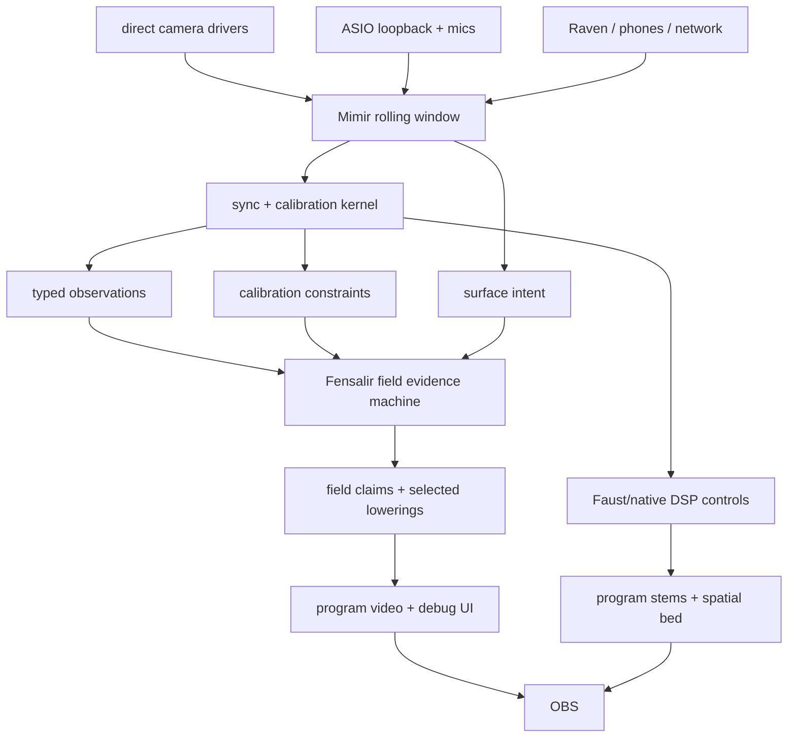

# Fensalir Rendering Rebuild Migration

## Objective

Keep Mimir from becoming a second renderer while Fensalir rebuilds itself into
the field-evidence machine Mimir needs.

Mimir's job is to make the room measurable: cameras, microphones, speakers,
loopbacks, phones, Raven, and Starfire all feed one bounded temporal window.
Fensalir's job is to turn that measured evidence into a coherent visible field
and program surface. OBS should receive the final result, not be asked to
pretend loose feeds are a world.

## Current Mechanism

Mimir currently has the correct broad cut:

```text
drivers / ASIO / network feeds
-> Mimir.Runtime rolling buffers
-> synchronization, calibration, response models
-> Fensalir scene state and debug surfaces
-> Fensalir D3D12 presentation / Spout / program output
-> OBS
```

But the current debug-spectrum path still exposes the pressure leak:

```text
ASIO spectrum history
-> AquariumSplineFrame
-> direct Fensalir spline tube debug surface
```

That path is allowed as a deterministic diagnostic. It is not yet the full
Perfect Machine. The production shape is:

```text
rolling buffer slice + source identity + calibration + surface intent
-> Fensalir field claim
-> selected lowering under budget
-> evidence lanes and temporal guide
-> presentation
```

Mimir must not send "draw these lines" as a production order. It should say
"this rolling buffer slice is a spectrum field with stable axes, identities,
support, and material intent." Fensalir then chooses direct tube SDF, mesh,
field splats, or another lowering.

## Invariants

- Mimir owns raw retention. Fensalir may snapshot or import the five-second
  window, but it does not silently become history owner.
- Mimir owns physical provenance: device ids, sample clocks, calibration ids,
  path response, confidence, network arrival, and decoded timing evidence.
- Fensalir owns dense visual fusion, temporal field evidence, selected cuts,
  residency, D3D12 resources, debug UI, and program video.
- Faust/native DSP owns hot audio movement, resampling, alignment, separation,
  spatialization, and stems.
- OBS owns broadcast composition only.
- Render packets are cached lowerings. They are not scene truth.
- TAA may validate pixel history. It does not own source identity.
- Networked phones and Raven may publish local observations and decoded timing
  state. They do not become independent clock authorities.

## Authority Map

Owner:

- `Mimir.Runtime` owns stream identity, rolling buffers, synchronization state,
  calibration loading, and observation publication.
- Fensalir's future `FieldEvidenceMachine` owns field claims after Mimir
  publishes observations and intent.

Inputs:

- local direct-driver video frames;
- local ASIO loopback and mic blocks;
- Raven/phone/network observations;
- calibration receipts, response surfaces, codebooks, path ids, sensor poses;
- user/app policy for what should enter the live field.

Outputs:

- typed observation surfaces for Fensalir;
- timing, response, and calibration constraints;
- audio actuator control for Faust/native DSP;
- health/telemetry state for UI and logs;
- final program output from Fensalir and stems from Faust/native DSP.

Derived state:

- spectrum lines, debug views, screenshots, OBS bridge endpoints, FFmpeg/SRT
  helpers, and Eve dashboard feeds are views or diagnostics.
- The direct spline-spectrum dashboard is useful because it reveals buffers; it
  is not the architectural owner of field rendering.

Forbidden writers:

- any Mimir-side D3D12 render graph;
- app-specific stable Gaussian/evidence cache;
- JSON/base64 hot path for live media;
- OBS raw source timing as synchronization authority;
- per-debug-view geometry deciding production truth.

Shared paths:

- live cameras, audio timing anchors, acoustic response surfaces, spectrum
  diagnostics, calibration events, and future volumetric room claims all publish
  typed observations/constraints into the same Mimir-to-Fensalir bridge.

Deletion line:

- If a Mimir feature wants visual output, first define the observation, claim,
  or surface intent. A direct draw is allowed only when it is named as fallback
  or diagnostic and cannot override field evidence.

## Target Mimir -> Fensalir Contract

### 1. Raw Window

Mimir keeps one retention authority:

```text
RollingStreamWindow {
  windowId
  duration = 5 seconds by default
  streamId
  sourceKind
  sampleDescriptors
  nativeHandle or payload view
  deviceTimestamp
  canonicalTimestampEstimate
  sequenceId
  status
}
```

Typed views may index this window. They do not own retention.

### 2. Observation Surface

Mimir publishes physical evidence, not render commands:

```text
MimirObservation {
  observationKey
  streamId
  sensorId
  calibrationId
  modality: camera | audio | network | timing | response
  observedTime
  canonicalTimeEstimate
  uncertainty
  payloadHandle
  provenance
  confidence
}
```

### 3. Calibration Constraint

Calibration and sync become explicit constraints:

```text
MimirCalibrationConstraint {
  constraintKey
  pathId
  sourceId
  receiverId
  evidenceKind: loopback | bioacoustic | passive | visual | network
  delayEstimate
  delayUncertainty
  phaseOrGroupDelay
  frequencyResponse
  usableBandMask
  confidence
}
```

### 4. Surface Intent

Debug and production visualization share intent:

```text
MimirSurfaceIntent {
  intentKey
  sourceObservationKeys
  domain
  axes
  supportPolicy
  materialGraph
  updateBudget
  purpose: debug | calibration | production
}
```

The spectrum dashboard becomes one instance of this: a rolling audio spectrum
field whose frequency axis maps to X, amplitude to Y, age to Z, and stream
identity to stacked lanes.

## Fresh Dataflow



## Migration Plan

### Phase 0: Freeze The Current Debug Surface

Keep the direct `AquariumSplineFrame` dashboard because it exposes live audio
buffers and is useful for sanity checks. Label it as deterministic debug
surface, not production field evidence.

Delete or keep dead any point-splat spectrum path. It already proved the wrong
owner.

### Phase 1: Add Bridge DTOs In Mimir.Runtime

Create pure mapping types for:

- rolling stream windows;
- observations;
- calibration constraints;
- surface intent.

The bridge must not read devices, render, allocate per sample, or own timers.
It maps existing runtime state into Fensalir-facing contracts.

Acceptance:

- one synthetic buffer can produce observations and surface intent in a unit
  test;
- the mapping can run repeatedly without growing allocations;
- stream/source ids remain stable across frames.

### Phase 2: Move Spectrum Dashboard To Surface Intent

Represent the current spectrum view as a `MimirSurfaceIntent`:

- stable source lanes;
- stable frequency bins;
- monotonic history sequence ids;
- Z as continuous sample age;
- tube/material intent from amplitude/confidence.

Fensalir may still lower it to direct spline tubes at first. The ownership
changes before the backend does.

Acceptance:

- app code no longer chooses point splats, direct tubes, or mesh ribbons;
- row/band/history identity is the same whether the engine lowers direct tubes
  or another representation.

### Phase 3: Camera Observation Bridge

Lower native camera descriptors into observation surfaces:

- source id and calibration id;
- dimensions, format, stride;
- native CPU/GPU handle;
- device timestamp and canonical estimate;
- lens model and confidence/status.

Acceptance:

- at least one local camera stream appears as Fensalir sensor observations;
- missing frames are absence, not zero-valued evidence;
- Fensalir owns any feature extraction result.

### Phase 4: Audio Field Observation Bridge

Lower sync and calibration state into audio field constraints:

- ASIO loopback clock fit;
- mic delay and SRO state;
- per-path frequency response and group delay;
- bioacoustic anchor clusters;
- passive correlation confidence;
- Raven/phone decoded timing observations.

Acceptance:

- Fensalir can visualize acoustic confidence and constraints without receiving
  raw PCM as production truth;
- Faust/native DSP remains the actuator for sample movement.

### Phase 5: Sensor Fusion Claims

Let Fensalir fuse Mimir observations into field claims:

- sparse feature tracks first;
- calibrated camera rays and marker/feature candidates;
- acoustic source candidates and confidence volumes;
- surface/material claims only after cross-modal evidence earns them.

Acceptance:

- one synthetic multi-camera marker creates a stable world-space claim;
- one synthetic audio source creates a localizable confidence field;
- claims can be inspected by source observation and calibration id.

### Phase 6: Program Output Receipts

Once field identity is coherent, wire final program output:

- D3D12 shared texture or Spout for OBS/EVE surfaces;
- separately controllable Faust/native DSP stems;
- telemetry proving timing, evidence confidence, dropped/late observations, and
  current selected cuts.

Acceptance:

- OBS sees final program surfaces/stems only;
- raw feeds remain debug inputs, not synchronization truth;
- a recorded receipt can explain how each visible surface was derived.

## Verification Matrix

| Check | Expected Result |
| --- | --- |
| Stable buffer identity | Source lanes do not reorder or phase-rotate by render frame. |
| Missing data | No sample means no observation; no zero-fill masquerade. |
| Direct debug path | Can be disabled without changing runtime timing state. |
| Observation bridge | Produces typed evidence without device reads or rendering. |
| Fensalir lowering swap | Direct tube vs future splat/mesh lowering preserves claim ids. |
| TAA guide | Pixel history follows evidence validity, not producer folklore. |
| OBS output | OBS receives final program surfaces, not raw clock chaos. |

## Research And Maps

Primary local references:

- `docs/perfect-machine.md`
- `docs/perfect-machine-domain-index.md`
- `docs/sensor-fusion-architecture.md`
- `research/perfect-machine-study-2026-05-23/fensalir-integration-map.md`
- `research/visual-spatial-map/brushstroke-fusion-rendering.md`
- Fensalir `docs/rendering-teardown-rebuild-protocol.md`
- Fensalir `docs/perfect-machine-architecture.md`
- Fensalir `docs/temporal-spatial-evidence-reservoir.md`

The next implementation pass should cut Phase 1 first. A bridge DTO that owns
nothing but mapping is boring in the best possible way: it makes the rest of
the machine harder to lie about.
