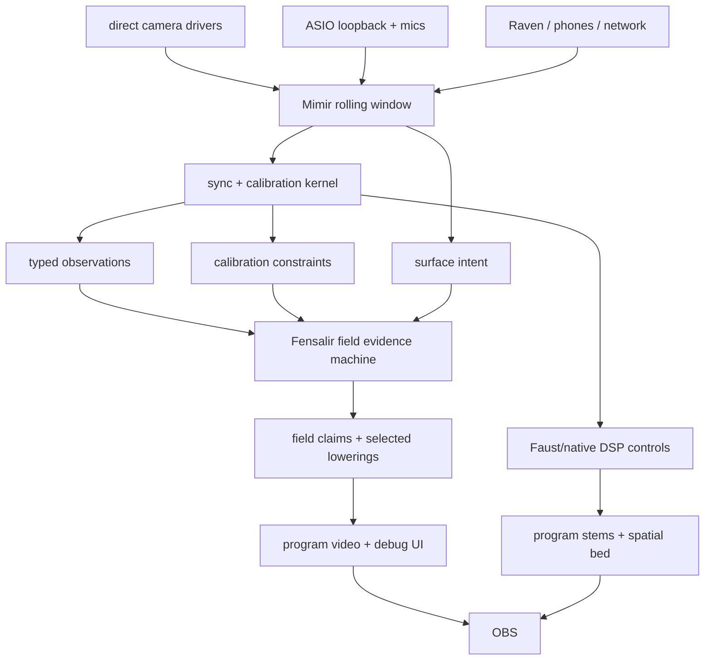

# Fensalir Rendering Rebuild Migration

## Objective

Keep Mimir from becoming a second renderer while Fensalir rebuilds itself into
the field-evidence machine Mimir needs.

Mimir's job is to make the room measurable: cameras, microphones, speakers,
loopbacks, phones, Raven, and Starfire all feed one bounded temporal window.
Fensalir's job is to turn that measured evidence into a coherent visible field
and program surface. OBS should receive the final result, not be asked to
pretend loose feeds are a world.

## Current Mechanism

Mimir currently has the correct broad cut:

```text
drivers / ASIO / network feeds
-> Mimir.Runtime rolling buffers
-> synchronization, calibration, response models
-> Fensalir scene state and debug surfaces
-> Fensalir D3D12 presentation / Spout / program output
-> OBS
```

The old direct debug-spectrum pressure leak has been cut. Current spectrum
debug output is already in the production-shaped bridge:

```text
rolling buffer slice + source identity + calibration + surface intent
-> Fensalir field claim
-> selected lowering under budget
-> evidence lanes and temporal guide
-> presentation
```

Mimir must not send "draw these lines" as a production order. It should say
"this rolling buffer slice is a spectrum field with stable axes, identities,
support, and material intent." Fensalir then chooses direct tube SDF, mesh,
field splats, or another lowering.

## Invariants

- Mimir owns raw retention. Fensalir may snapshot or import the five-second
  window, but it does not silently become history owner.
- Mimir owns physical provenance: device ids, sample clocks, calibration ids,
  path response, confidence, network arrival, and decoded timing evidence.
- Fensalir owns dense visual fusion, temporal field evidence, selected cuts,
  residency, D3D12 resources, debug UI, and program video.
- Faust/native DSP owns hot audio movement, resampling, alignment, separation,
  spatialization, and stems.
- OBS owns broadcast composition only.
- Render packets are cached lowerings. They are not scene truth.
- TAA may validate pixel history. It does not own source identity.
- Networked phones and Raven may publish local observations and decoded timing
  state. They do not become independent clock authorities.

## Authority Map

Owner:

- `Mimir.Runtime` owns stream identity, rolling buffers, synchronization state,
  calibration loading, and observation publication.
- Fensalir's future `FieldEvidenceMachine` owns field claims after Mimir
  publishes observations and intent.

Inputs:

- local direct-driver video frames;
- local ASIO loopback and mic blocks;
- Raven/phone/network observations;
- calibration receipts, response surfaces, codebooks, path ids, sensor poses;
- user/app policy for what should enter the live field.

Outputs:

- typed observation surfaces for Fensalir;
- timing, response, and calibration constraints;
- audio actuator control for Faust/native DSP;
- health/telemetry state for UI and logs;
- final program output from Fensalir and stems from Faust/native DSP.

Derived state:

- spectrum lines, debug views, screenshots, OBS bridge endpoints, FFmpeg/SRT
  helpers, and Eve dashboard feeds are views or diagnostics.
- The old direct spline-spectrum dashboard and old direct GPU sensor frame
  bridge are silent. FieldEvidence owns spectrum and camera observation
  publication; screenshots and logs remain diagnostics.

Forbidden writers:

- any Mimir-side D3D12 render graph;
- app-specific stable Gaussian/evidence cache;
- JSON/base64 hot path for live media;
- OBS raw source timing as synchronization authority;
- per-debug-view geometry deciding production truth.

Shared paths:

- live cameras, audio timing anchors, acoustic response surfaces, spectrum
  diagnostics, calibration events, and future volumetric room claims all publish
  typed observations/constraints into the same Mimir-to-Fensalir bridge.

Deletion line:

- If a Mimir feature wants visual output, first define the observation, claim,
  or surface intent. A direct draw is allowed only when it is named as fallback
  or diagnostic and cannot override field evidence.

## Target Mimir -> Fensalir Contract

### 1. Raw Window

Mimir keeps one retention authority:

```text
RollingStreamWindow {
  windowId
  duration = 5 seconds by default
  streamId
  sourceKind
  sampleDescriptors
  nativeHandle or payload view
  deviceTimestamp
  canonicalTimestampEstimate
  sequenceId
  status
}
```

Typed views may index this window. They do not own retention.

### 2. Observation Surface

Mimir publishes physical evidence, not render commands:

```text
MimirObservation {
  observationKey
  streamId
  sensorId
  calibrationId
  modality: camera | audio | network | timing | response
  observedTime
  canonicalTimeEstimate
  uncertainty
  payloadHandle
  provenance
  confidence
}
```

The payload handle is not authority. It must resolve through a declared
resource before shader lowering can consume it.

### 2.5. Resource Declaration

Live payloads have an explicit Fensalir resource contract:

```text
FensalirResource {
  resourceKey
  kind: structured-buffer | texture2d | rolling-texture | mesh | surface-page | volume
  residency: gpu-resident | shared-gpu
  shaderAccess: SRV | UAV | vertex-buffer | index-buffer | indirect-args
  format
  dimensions / count / stride
  nativeHandle and nativeHandleKind
  valid time range
  version / sequence
}
```

Mimir may mint stable resource keys from native/GPU handles, but Fensalir owns
resolution. A DSL packet may reference `mimir:resource:*`; it may not treat a
bare string as payload truth. In the same runtime, a Mimir-declared buffer is a
Fensalir resource slot once the declaration is accepted; native/shared handle
metadata is an import edge, not a separate payload authority. Rendering-relevant
buffers move to GPU residency as early as possible and stay there; Fensalir
passes resource handles/SRVs/UAVs between compute and render lowerings instead
of copying samples back to CPU. If the resource contract is absent, expired,
duplicated, CPU-only, or incompatible with the selected backend, lowering must
defer instead of rendering a lie with nice lighting.

Current proof surface:

- `Mimir.BufferSmoke --fensalir-field-evidence-smoke` maps a Mimir rolling
  window/observation/spectrum intent into one declared resource, three claims,
  one planned resource-backed `TubeField` packet, and two deferred non-backend
  claims.
- `Mimir.BufferSmoke --fensalir-field-dsl-resource-smoke` uses Fensalir's field
  evidence DSL to bind the declared resource directly and produce one planned
  `TubeField` packet with no deferred requests.
- `Mimir.BufferSmoke --fensalir-camera-observation-smoke` maps one
  GPU-backed video frame and one metadata-only cadence witness into field
  evidence. Only the shared D3D12 video handle becomes a declared `Texture2D`
  resource and camera surface intent; the metadata-only frame remains
  observation evidence with no render payload.

Fensalir now owns the first D3D12 resource resolver cut below this contract:
shared structured/curve buffers import/alias GPU-resident resources by handle,
while Fensalir-created resources allocate GPU slots only when Fensalir is the
producer. The DSL can describe a 2D rolling float buffer as Catmull-Rom XY
tubes with modulo column addressing, amplitude power/normalization, radius,
ramp texture path, and emission scale. TubeField now consumes those resources
through a GPU compute/render path, local Texture2D resources can bind as ramps,
SurfacePage and VolumeTexture declarations resolve into shader-readable GPU
textures, and Mesh declarations package `Mesh.Vertices`/`Mesh.Indices` GPU
buffer shape under one resource key. The evidence DSL can now plan generic
resource-backed claims over those declarations. Current blocker for the
remaining visual surface is not resource ownership; it is the selected render
lowerings that interpret mesh/page/volume resources as geometry, height/SDF/
material pages, or density/extinction/SDF3D domains. Mesh layout authority is
split by source: imported/user meshes use the standard `PositionNormalUvColor`
layout, while generated meshes can be `PipelinePrivate` and leave byte
semantics to their selected lowering. TubeField now uses that generated-mesh
lane explicitly: compute emits private geometry/indirect buffers and render
binds them as a pipeline-private generated mesh before applying TubeField
material state. The generated-mesh DrawIndexed indirect command signature is
shared ABI; TubeField only owns the argument buffer it emits. TubeField
expansion is now gated by selected backend packets, so explicit lowering
metadata cannot bypass validation/planning authority. Validation also rejects
TubeSpline metadata whose claim is not Tube-encoded or whose resource differs
from the claim payload. Mimir's typed surface-intent lowering now emits the
matching TubeSpline metadata for audio spectrum/waveform Tube claims. That is
engine ownership, not a reason for Mimir to create a parallel renderer.
Mimir also uploads normalized spectral frames as Float32 data into a
Fensalir-owned structured buffer resource, so the TubeField path consumes live
GPU buffer contents rather than an empty declaration. The runtime-level receipt
is `Mimir.BufferSmoke --mimir-spectrum-upload-smoke`: it boots Mimir's frame
path, advances spectrum analysis, and verifies one newest-slot Float32 upload,
planned TubeField packets, a resource-bound local blackbody ramp Texture2D, and
no live legacy spline/buffer-field dashboard input. The runtime resource is no
longer a latest-frame row dump: it is a rolling column matrix where physical
columns are flattened `(history age, source lane)` pairs under fixed history
and source-lane capacities. Mimir emits one TubeField claim per active source
lane; lowerings use the fixed lane capacity as `ColumnStride`,
`ColumnStep.z=0.1`, and `RollingOffset` so each source renders its own age
trail from newest to older samples without reshuffling the GPU buffer. New
frames upload only the newest ring slot with an explicit element offset.
Fensalir owns structured-buffer slot validity and clamps TubeField dispatch so
invalid older slots do not reach shader sampling after allocation, reset, or
partial update. TubeField metadata now carries stable claim-derived field ids
inside the TubeField family range, so temporal/reprojection/reservoir consumers
can distinguish source-lane claims. Mimir exposes
`MIMIR_SPECTRUM_SOURCE_LANES` as the source-lane capacity lever and
`MIMIR_SPECTRUM_TUBE_SUBDIVISIONS` as the geometry cost lever for responding to
Fensalir's requested/dispatched/truncated/invalid TubeField budget report.
Camera descriptors now follow the same evidence/resource boundary:
`MimirFensalirFieldLowering.BuildCameraObservationFrame` lowers latest video
buffers into observation claims and declares GPU-backed frames as shared
`Texture2D` resources. Metadata-only/process-cadence frames do not create
surface intents, so a missing payload cannot become a fake `latest-window`
render request. Fensalir can now resolve those shared `Texture2D` declarations
by native D3D12 handle and accepts Mimir video format names such as `Bgra8`,
`Gray8`, `Rg8`, `Nv12`, and `LeapStereoIr`. Camera image claims currently
defer because Fensalir has not selected a visual-fusion/render lowering for
camera textures yet.

### 3. Calibration Constraint

Calibration and sync become explicit constraints:

```text
MimirCalibrationConstraint {
  constraintKey
  pathId
  sourceId
  receiverId
  evidenceKind: loopback | bioacoustic | passive | visual | network
  delayEstimate
  delayUncertainty
  phaseOrGroupDelay
  frequencyResponse
  usableBandMask
  confidence
}
```

### 4. Surface Intent

Debug and production visualization share intent:

```text
MimirSurfaceIntent {
  intentKey
  sourceObservationKeys
  domain
  axes
  supportPolicy
  materialGraph
  updateBudget
  purpose: debug | calibration | production
}
```

The spectrum dashboard becomes one instance of this: a rolling audio spectrum
field whose frequency axis maps to X, amplitude to Y, age to Z, and stream
identity to stacked lanes.

## Fresh Dataflow



## Migration Plan

### Phase 0: Silence Legacy Debug Surfaces

The direct `AquariumSplineFrame` spectrum dashboard and point-splat spectrum
path are no longer scene writers. Live spectrum rendering flows through
FieldEvidence TubeField claims and generated mesh expansion.

### Phase 1: Add Bridge DTOs In Mimir.Runtime

Create pure mapping types for:

- rolling stream windows;
- resource declarations for live GPU/native payload views;
- observations;
- calibration constraints;
- surface intent.

The bridge must not read devices, render, allocate per sample, or own timers.
It maps existing runtime state into Fensalir-facing contracts.

Acceptance:

- one synthetic buffer can produce observations and surface intent in a unit
  test;
- claims that reference live payloads also declare a typed Fensalir resource;
- the mapping can run repeatedly without growing allocations;
- stream/source ids remain stable across frames.

### Phase 2: Move Spectrum Dashboard To Surface Intent

Represent the current spectrum view as a `MimirSurfaceIntent`:

- stable source lanes;
- stable frequency bins;
- monotonic history sequence ids;
- Z as continuous sample age;
- tube/material intent from amplitude/confidence.

Fensalir may still lower it to direct spline tubes at first. The ownership
changes before the backend does.

Acceptance:

- app code no longer chooses point splats, direct tubes, or mesh ribbons;
- row/band/history identity is the same whether the engine lowers direct tubes
  or another representation.

### Phase 3: Camera Observation Bridge

Lower native camera descriptors into observation surfaces:

- source id and calibration id;
- dimensions, format, stride;
- native CPU/GPU handle;
- device timestamp and canonical estimate;
- lens model and confidence/status.

Acceptance:

- implemented bridge proof: GPU-backed video descriptors become declared
  shared `Texture2D` resources plus camera observation/surface claims;
- metadata-only cadence descriptors remain observation evidence and do not
  become render payloads;
- no selected camera-image lowering exists yet, so Fensalir defers those claims
  until visual fusion/feature extraction owns them.

### Phase 4: Audio Field Observation Bridge

Lower sync and calibration state into audio field constraints:

- ASIO loopback clock fit;
- mic delay and SRO state;
- per-path frequency response and group delay;
- bioacoustic anchor clusters;
- passive correlation confidence;
- Raven/phone decoded timing observations.

Acceptance:

- Fensalir can visualize acoustic confidence and constraints without receiving
  raw PCM as production truth;
- Faust/native DSP remains the actuator for sample movement.

### Phase 5: Sensor Fusion Claims

Let Fensalir fuse Mimir observations into field claims:

- sparse feature tracks first;
- calibrated camera rays and marker/feature candidates;
- acoustic source candidates and confidence volumes;
- surface/material claims only after cross-modal evidence earns them.

Acceptance:

- one synthetic multi-camera marker creates a stable world-space claim;
- one synthetic audio source creates a localizable confidence field;
- claims can be inspected by source observation and calibration id.

### Phase 6: Program Output Receipts

Once field identity is coherent, wire final program output:

- D3D12 shared texture or Spout for OBS/EVE surfaces;
- separately controllable Faust/native DSP stems;
- telemetry proving timing, evidence confidence, dropped/late observations, and
  current selected cuts.

Acceptance:

- OBS sees final program surfaces/stems only;
- raw feeds remain debug inputs, not synchronization truth;
- a recorded receipt can explain how each visible surface was derived.

## Verification Matrix

| Check | Expected Result |
| --- | --- |
| Stable buffer identity | Source lanes do not reorder or phase-rotate by render frame. |
| Missing data | No sample means no observation; no zero-fill masquerade. |
| Direct debug path | Can be disabled without changing runtime timing state. |
| Observation bridge | Produces typed evidence without device reads or rendering. |
| Fensalir lowering swap | Direct tube vs future splat/mesh lowering preserves claim ids. |
| TAA guide | Pixel history follows evidence validity, not producer folklore. |
| OBS output | OBS receives final program surfaces, not raw clock chaos. |

## Research And Maps

Primary local references:

- `docs/perfect-machine.md`
- `docs/perfect-machine-domain-index.md`
- `docs/sensor-fusion-architecture.md`
- `research/perfect-machine-study-2026-05-23/fensalir-integration-map.md`
- `research/visual-spatial-map/brushstroke-fusion-rendering.md`
- Fensalir `docs/rendering-teardown-rebuild-protocol.md`
- Fensalir `docs/perfect-machine-architecture.md`
- Fensalir `docs/temporal-spatial-evidence-reservoir.md`

The next implementation pass should cut Phase 1 first. A bridge DTO that owns
nothing but mapping is boring in the best possible way: it makes the rest of
the machine harder to lie about.
