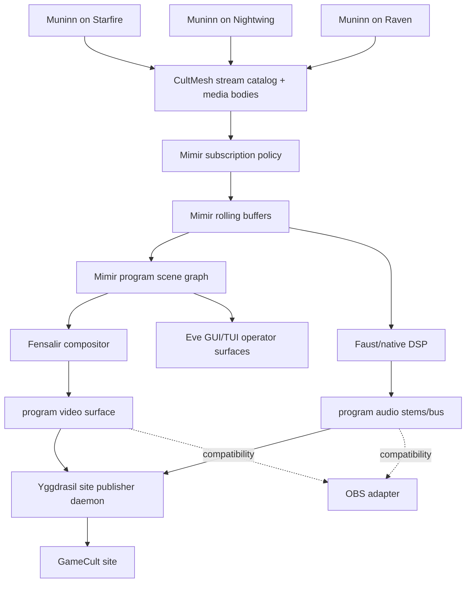

# Mimir Program Composition

## Objective

Mimir owns the live stream program: selected capture feeds, calibration feeds,
scene composition, preview/control surfaces, stats, and publication. OBS is a
temporary compatibility sink only.

## Authority Map

- Owner: Mimir owns the program scene graph and subscription policy.
- Inputs: Muninn-published local and remote monitor, window, camera, audio,
  loopback, and health streams.
- Outputs: a Mimir program video surface, aligned audio stems or final bus, Eve
  GUI/TUI operator surfaces, and a Yggdrasil-facing site publication feed.
- Derived state: OBS receives a compatibility feed when useful; it does not own
  scene truth, broadcast truth, preview truth, stats, source selection, or
  publication.
- Forbidden writers: OBS scenes, browser dashboards, site daemons, and Muninn
  capture hosts must not independently decide the program composition.
- Shared paths: direct operator edits, remote Eve commands, preset loads,
  calibration-driven source selection, and recovery scripts must commit through
  the same Mimir scene graph command surface.
- Deletion line: old OBS-owned composition docs and config names are demoted to
  diagnostic bridge language. Any OBS adapter delegates to the Mimir program
  scene instead of carrying its own opinion.

## Machine Shape



## Composition Contract

The scene graph carries layers with:

- source reference, such as `muninn:starfire:monitor:primary` or
  `muninn:starfire:window:discord`;
- source kind, such as monitor, window, camera, network monitor, or generated
  Mimir visual field;
- visibility, layer order, transform, crop, and optional chroma key;
- enough timing identity for Mimir to align media inside the rolling window.

The current OBS scene can be mirrored as an initial Mimir scene:

- Starfire monitor capture, cropped at the bottom when needed.
- Discord window capture, cropped to chat and keyed with chroma filters.
- Raven primary monitor plus Realtek loopback as a subscribed remote Muninn
  stream.
- Mimir/Fensalir program texture as a generated layer when the field renderer is
  active.

After import, OBS is not the editor of record. It may display the Mimir program
feed, but operator edits happen through Mimir/Eve command surfaces.

## Eve Operator Surface

Mimir publishes Eve GUI/TUI documents for:

- live program preview;
- source catalog and subscription state;
- layer transform, crop, chroma key, visibility, and ordering;
- audio stem gain/mute/route controls;
- stream health, latency, buffer depth, timing confidence, and publication
  status;
- emergency scene selection and publisher recovery commands.

Eve lowerers render those controls on any device without owning the underlying
scene graph.

## Site Publisher

The Yggdrasil-facing publisher consumes Mimir program output and publishes it to
the GameCult site. It owns transport, encoding/session state, reconnect policy,
and public edge health. It does not own composition.

The publisher's input contract is the same Mimir program output used by local
preview and OBS compatibility adapters, so the public stream cannot silently
diverge from the operator preview.

## Runtime Contracts

The first typed contracts live in `src/Mimir.Runtime/Synchronization`:

- `mimir.program_scene.v1`
- `mimir.program_output.v1`
- `mimir.eve_operator_surface.v1`

The proof path is:

```powershell
dotnet run --project .\src\Mimir.BufferSmoke\Mimir.BufferSmoke.csproj -- --perfect-machine-contract-smoke
dotnet run --project .\src\Mimir.BufferSmoke\Mimir.BufferSmoke.csproj -- --perfect-machine-profile-smoke
```
