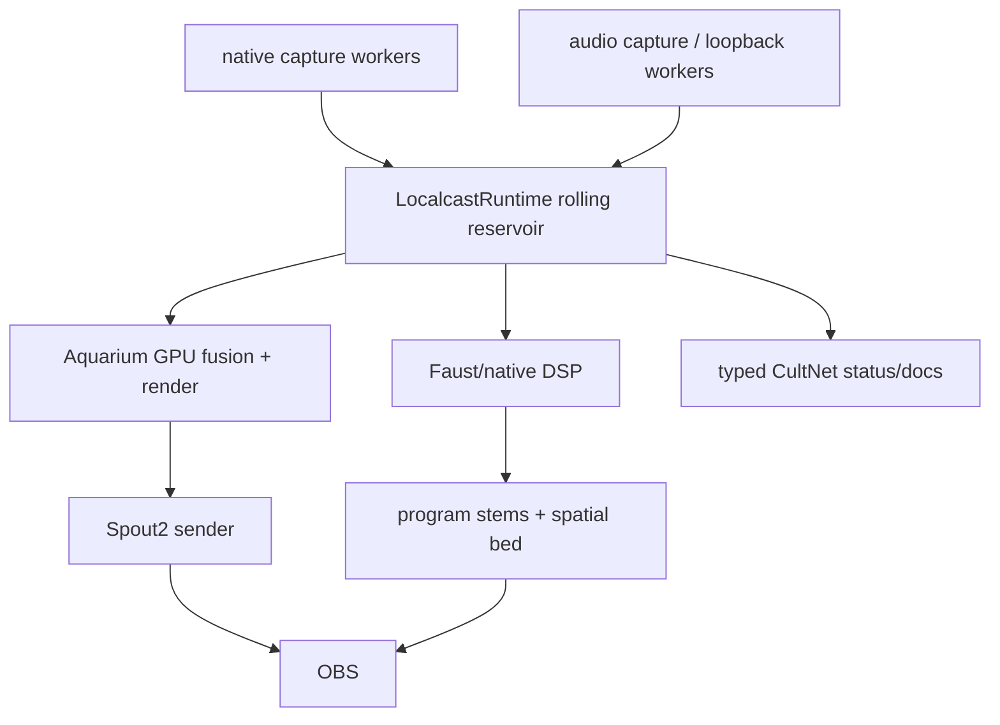

# Native Rebuild Plan

This is the cut line after the architectural teardown.

The live system must be rebuilt around one native rolling reservoir. Python and
OpenGL are no longer acceptable live foundations. They may remain as offline
calibration, schema tests, device discovery, migration probes, and forensic
tools only. If a future change needs Python or the current OpenGL Spout sink in
the live path, treat that as evidence the native boundary is missing, not as
permission to extend the deadline bridge.

## Objective

Make the second PC available in OBS as synchronized program video plus
separately controllable audio while preserving the real ownership model:

- LocalCastBridge owns config, calibration, contract tests, launch, status, and
  CultNet schema.
- One native runtime owns live sample timing and retention.
- Aquarium owns GPU visual fusion, material/brush/splat rendering, and Spout2
  publication.
- Faust/native DSP owns hot audio alignment, suppression, voice separation,
  stems, and spatial bed generation.
- OBS owns broadcast controls.

## Durable State Model

Durable state is declarative or evidentiary. It is not the live machine.

- `config/localcast.json`: LAN sender/receiver endpoints, OBS source names, and
  FFmpeg/NVENC settings for simple bridge mode.
- `config/sensor-fusion.json`: measured camera identity, intrinsics, extrinsics,
  capture hints, and calibration timestamps.
- `config/audio-field.json`: measured mic/speaker identity, geometry, clock
  domains, channel order, roles, gain, delay, and polarity.
- CultNet schema JSON: edge schema only. The actual runtime documents are typed
  CultNet documents, not JSON data files.
- Calibration artifacts: WAVs, images, manifests, solves, and evidence ledgers.
- `state/*` and `notes/*`: rehydration memory for agents, never runtime truth.

## Runtime State Model

The runtime state is one native rolling buffer with a single edge.

The reservoir stores sample handles in one time-ordered rolling buffer. Each
sample has:

- kind: camera frame, camera feature, scene ray, surface claim, material claim,
  audio block, phase claim, event claim, render packet, or status claim
- source id
- source timestamp
- arrival timestamp
- sequence
- payload handle

Typed ring views may exist as indexes over the rolling buffer, but they do not
own retention. Expiry happens once, against the reservoir edge. No private
history outlives the rolling buffer.

Payload memory belongs to the producing domain. Aquarium owns GPU image,
feature, surface, material, and render payloads. Faust/native DSP owns audio
buffers and stem payloads. The reservoir owns timing, identity, ordering,
retention, and handle lookup.

## Authoritative Boundaries

- Config/calibration crosses into runtime as immutable measured truth plus
  explicit profile version.
- Capture workers cross into runtime by appending typed sample handles.
- Aquarium crosses the reservoir boundary by sampling typed visual/audio timing
  handles and publishing a Spout2 texture.
- Faust/native DSP crosses the reservoir boundary by sampling audio/phase/event
  handles and publishing typed stem/spatial-bed documents or OBS-facing audio
  surfaces.
- CultNet carries typed process/network documents for status, control, and
  external consumers. JSON exists only to declare schema or export diagnostics.
- OBS receives final program surfaces. It does not own synchronization or scene
  reconstruction.

## Derived, Not Stored

- Render packets are derived from reservoir claims.
- LOD cells are derived from current reservoir contents.
- Brush/splat packets are derived by Aquarium.
- Audio event overlays are derived from event claims and presentation time.
- Point budgets are derived from typed claim metadata, not string prefixes.
- JSON heartbeat/status files are diagnostic exports only, if they survive at
  all.

## Delete Early

Delete or quarantine these before adding new live features:

- Python live producers.
- Python live audio/visual hot loops.
- OpenGL Spout renderer.
- Synthetic/fallback visual evidence in the production path.
- JSON render-frame and LOD stores as live data.
- Renderer-owned semantic priority based on stable-key prefixes.
- Multiple Python copies of reservoir-window clipping.
- File mtime caches used as lifecycle or data freshness authority.

## Impossible By Construction

- A sample older than the reservoir window is visible to live consumers.
- A diagnostic/fallback source enters a ground-truth reservoir kind.
- A renderer invents scene priority from display names or string prefixes.
- JSON becomes live data transport.
- Python becomes the production hot path.
- OpenGL becomes the production Spout sink.
- OBS broadcasts raw unsynchronized sources as the synchronized program.
- Two modules own the reservoir edge.

## Migration Order

1. Freeze this plan in persistence and stop feature work on the Python/OpenGL
   bridge.
2. Rewrite `native/reservoir` from typed independent rings to one rolling buffer
   with typed indexes/views.
3. Add contract tests proving single-edge expiry, typed view queries, latest
   lookup, and impossible fallback admission.
4. Add the minimal Aquarium/Faust C ABI over the rolling buffer.
5. Move any remaining useful Python packet/schema code into diagnostics or
   contract tests.
6. Remove production imports of `scripts/live_sensor_fusion.py` and
   `localcast.sensor_fusion.spout_output`.
7. Replace the OpenGL Spout path with an Aquarium-owned Spout publisher.
8. Move audio hot path into Faust/native DSP behind typed reservoir handles.
9. Keep FFmpeg/SRT scripts only as simple V1 LAN bridge and capture utilities.
10. Delete dead compatibility files once no diagnostic command depends on them.

Small commits are allowed. Small evasions are not. If a commit preserves the
deadline bridge by adding an adapter around it, it is probably feeding the old
machine again.
