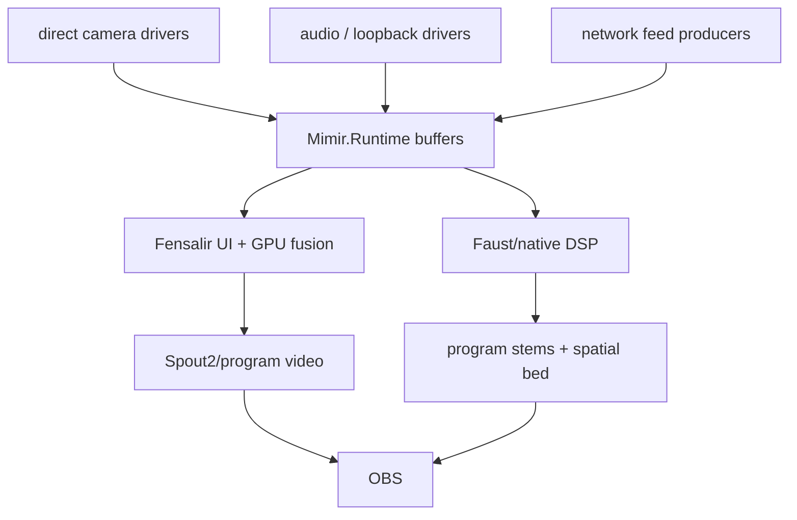

# Native Rebuild Plan

This is the live cut line: Mimir is a direct-driver, native-buffer, Fensalir
hosted stream machine.

## Objective

Make the room available in OBS as synchronized program video plus separately
controllable audio while preserving ownership:

- Mimir owns configuration, calibration truth, runtime contracts, launch,
  status, and persistence.
- Mimir.Runtime owns in-memory stream buffers and runtime synchronization.
- Native capture workers own device reads and append typed sample handles.
- Fensalir owns GPU fusion, rendering, D3D12 interop, UI, and Spout2 output.
- Faust/native DSP owns hot audio alignment, suppression, separation, stems, and
  spatial bed generation.
- OBS owns broadcast controls.

## Runtime State Model

The app-level runtime initializes one rolling buffer per configured audio or
video stream, defaulting to five seconds. The lower native reservoir keeps the
single-edge typed-handle invariant for Fensalir/Faust integration.

Payload memory belongs to the producing domain, but rendering inputs should be
Fensalir-owned GPU resources whenever the device path allows it. The camera hot
path is: ask Fensalir for a keyed `Texture2D` lease, speak to the device stack
as directly as possible, populate that lease, signal the producer fence, and
publish the resource key through Mimir's rolling buffers and FieldEvidence. The
reservoir and runtime own timing, identity, ordering, retention, and lookup.
They do not become pixel middlemen.

## Authoritative Boundaries

- Config/calibration crosses into runtime as measured truth plus profile
  version.
- Capture drivers cross into runtime by appending typed samples.
- Fensalir consumes current visual/audio timing state and publishes the program
  video surface.
- Faust/native DSP consumes audio/phase/event handles and publishes stems.
- OBS receives final program surfaces. It does not own synchronization.

## Impossible By Construction

- A sample older than the rolling window is visible to live consumers.
- A process bridge becomes the six-camera local capture foundation.
- File polling becomes the native runtime API.
- OBS broadcasts raw unsynchronized sources as the synchronized program.
- Two modules own the reservoir edge.

## Migration Order

1. Keep the C# app/runtime as the public Mimir surface.
2. Implement Leap stereo IR direct ingest first and measure sustained cadence.
   Record the unavoidable copy count; do not hide CPU upload behind a friendly
   adapter name.
3. Add the remaining local camera drivers through the same source seam,
   preferring device-direct producers that populate Fensalir texture leases.
4. Add native audio capture workers and feed aligned blocks to Faust/native DSP.
5. Bind Fensalir UI to stream health, buffer depth, source timestamps, settings,
   and output management.
6. Move GPU fusion and Spout2 publication fully into Fensalir.
7. Keep FFmpeg/SRT scripts only as bridge utilities until direct program output
   makes them unnecessary.
