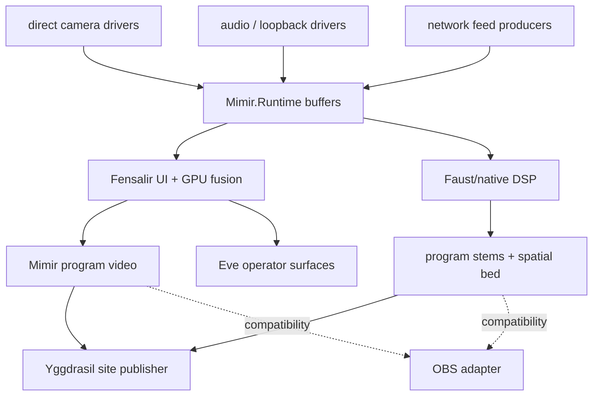

# Native Rebuild Plan

This is the live cut line: Mimir is a direct-driver, native-buffer, Fensalir
hosted stream machine.

## Objective

Make the room available as a Mimir-owned synchronized program with separately
controllable audio while preserving ownership:

- Mimir owns configuration, calibration truth, runtime contracts, launch,
  status, and persistence.
- Mimir.Runtime owns in-memory stream buffers and runtime synchronization.
- Native capture workers own device reads and append typed sample handles.
- Mimir owns stream subscription, scene composition, preview/control state,
  stats, and program publication intent.
- Fensalir owns GPU fusion, rendering, D3D12 interop, UI lowering, and local
  program texture output.
- Faust/native DSP owns hot audio alignment, suppression, separation, stems, and
  spatial bed generation.
- Eve GUI/TUI lowerers expose operator controls and preview without owning
  scene truth.
- The Yggdrasil-facing publisher daemon consumes Mimir program output and
  publishes it to the site without owning composition.
- OBS is a temporary compatibility sink.

## Runtime State Model

The app-level runtime initializes one rolling buffer per configured audio or
video stream, defaulting to five seconds. The lower native reservoir keeps the
single-edge typed-handle invariant for Fensalir/Faust integration.

Payload memory belongs to the producing domain. The reservoir and runtime own
timing, identity, ordering, retention, and lookup. They do not pretend to own
camera driver buffers, GPU textures, or DSP audio memory.

## Authoritative Boundaries

- Config/calibration crosses into runtime as measured truth plus profile
  version.
- Capture drivers cross into runtime by appending typed samples.
- Fensalir consumes current visual/audio timing state and publishes the program
  video surface.
- Faust/native DSP consumes audio/phase/event handles and publishes stems.
- OBS compatibility adapters may receive final program surfaces. They do not
  own synchronization, composition, preview/control, or publication.

## Impossible By Construction

- A sample older than the rolling window is visible to live consumers.
- A process bridge becomes the six-camera local capture foundation.
- File polling becomes the native runtime API.
- OBS broadcasts raw unsynchronized sources as the synchronized program.
- Two modules own the reservoir edge.

## Migration Order

1. Keep the C# app/runtime as the public Mimir surface.
2. Implement Leap stereo IR direct ingest first and measure sustained cadence.
3. Add the remaining local camera drivers through the same source seam.
4. Add native audio capture workers and feed aligned blocks to Faust/native DSP.
5. Bind Fensalir UI to stream health, buffer depth, source timestamps, settings,
   and output management.
6. Move GPU fusion and Spout2 publication fully into Fensalir.
7. Keep FFmpeg/SRT scripts only as bridge utilities until direct program output
   makes them unnecessary.
