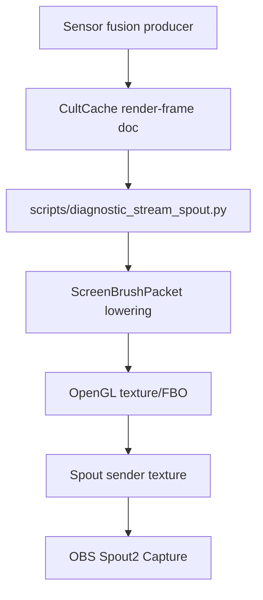

# OBS Spout Streaming

## Objective

Publish the live visual fusion state as a named GPU texture that OBS can receive through the Spout2 plugin.

This is the deadline stream surface. It is not a preview window and it is not a desktop-capture workaround. LocalCastBridge emits a typed render-frame packet; the Spout sink turns that packet into a GPU texture named for OBS.

## Current Mechanism



Aquarium Engine remains the intended authority for dense brush/splat rendering. The useful boundary is the typed `localcast.visual.render_frame` CultCache document: Aquarium can replace the OpenGL renderer behind the same packet contract without changing capture, fusion, timing, or OBS ingestion.

The deadline sink borrows the Zyphos brush rule rather than pretending points are enough: each render point lowers into a compact anisotropic screen brush with center, radii, rotation, and color. That shape mirrors Aquarium's bounded brush/splat direction while keeping the stream path simple enough to verify under pressure.

## Run

Install calibration/runtime dependencies once:

```powershell
.\.venv\Scripts\python.exe -m pip install -r .\requirements-calibration.txt
```

Start the Spout sender:

```powershell
.\.venv\Scripts\python.exe .\scripts\diagnostic_stream_spout.py `
  --source cultcache `
  --frame-cache .\calibration\runs\visual-state.msgpack `
  --demo-if-missing `
  --sender-name "LocalCastBridge Point Cloud" `
  --width 1920 `
  --height 1080 `
  --fps 60 `
  --status .\calibration\runs\stream-spout-status.json `
  --status-cache .\calibration\runs\visual-stream-status.msgpack `
  --audio-cache .\calibration\runs\audio-state.msgpack `
  --audio-events-cache .\calibration\runs\audio-events.msgpack `
  --remote-video-url "srt://0.0.0.0:5100?mode=listener&latency=120000&timeout=5000000" `
  --remote-video-latency-ms 250
```

Start the current live fusion producer:

```powershell
.\.venv\Scripts\python.exe .\scripts\diagnostic_live_sensor_fusion.py `
  --cache .\calibration\runs\visual-state.msgpack `
  --fps 30 `
  --points 256
```

For OBS, add a Spout2 Capture source and select `LocalCastBridge Point Cloud`. On this workstation, OBS websocket was enabled locally and the Off World Live `win-spout` plugin was installed under `C:\ProgramData\obs-studio\plugins\win-spout`.

## Status

The sender writes a heartbeat JSON file:

```powershell
Get-Content .\calibration\runs\stream-spout-status.json
```

Fields:

- `sender_name`: the Spout sender OBS should see.
- `frames_sent`: count of successful `sendTexture` calls.
- `point_count`: number of packet points in the last status update.
- `frame_path`: packet source path.
- `last_error`: `null` during healthy output.

The typed status document is written to `calibration/runs/visual-stream-status.msgpack`. The JSON file is only the blunt terminal heartbeat.

The sync heartbeat is written to `calibration/runs/av-sync-status.json`. It includes the audio frame delta and the remote SRT video artifact:

- `remote_video.source_name`: OBS/Aquarium-facing source name.
- `remote_video.url`: the SRT listener URL for the neighbor feed.
- `remote_video.expected_latency_ns`: configured presentation delay, not just the SRT socket latency.
- `remote_video.delta_ns`: difference between the render presentation clock and the expected remote video presentation time.
- `remote_video.synchronized`: whether the delta is inside tolerance.

## Invariants

- OBS receives a named Spout texture.
- The Spout sink owns presentation only; it does not own camera calibration, fusion, or scene truth.
- CultCache MessagePack documents are diagnostic local state. Production visual
  state crosses native/CultNet typed document boundaries; the Python file
  adapter is not live authority.
- JSON render-frame polling is compatibility scaffolding only.
- Latency is explicit in the packet timestamps. The renderer may buffer, but it may not silently erase the visual/audio alignment fields.
- The neighbor SRT video feed is a timed artifact. OBS must not be left to eyeball-sync it against the Spout texture and AmbiX bed.

## Aquarium Cut

The next renderer cut is to move the `RenderFramePacket` consumer into Aquarium Engine:

```text
RenderFramePacket
-> CultRenderFrame / CultNet document_put
-> Aquarium typed runtime state
-> compact anisotropic brush/splat buffers
-> D3D render target
-> Spout2 sender texture
-> OBS Spout2 Capture
```

That is the coherent route to millions of splats. The current OpenGL sender exists so the stream has a live OBS texture today while preserving the boundary Aquarium needs tomorrow.
