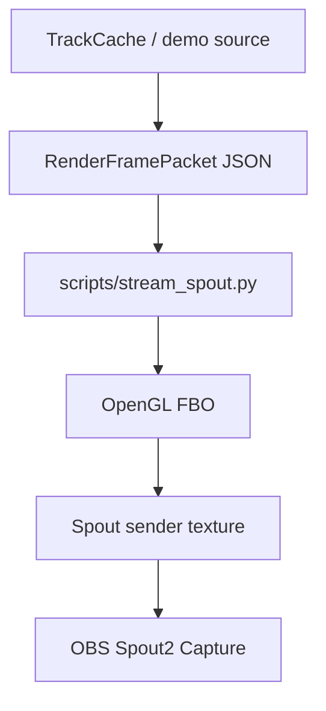

# OBS Spout Streaming

## Objective

Publish the live visual fusion state as a named GPU texture that OBS can receive through the Spout2 plugin.

This is the deadline stream surface. It is not a preview window and it is not a desktop-capture workaround. LocalCastBridge emits a typed render-frame packet; the Spout sink turns that packet into a GPU texture named for OBS.

## Current Mechanism



Aquarium Engine remains the intended authority for dense brush/splat rendering. The useful boundary is `RenderFramePacket`: Aquarium can replace the OpenGL renderer behind the same packet contract without changing capture, fusion, timing, or OBS ingestion.

## Run

Install calibration/runtime dependencies once:

```powershell
.\.venv\Scripts\python.exe -m pip install -r .\requirements-calibration.txt
```

Start the Spout sender:

```powershell
.\.venv\Scripts\python.exe .\scripts\stream_spout.py `
  --frame-json .\calibration\runs\live-render-frame.json `
  --demo-if-missing `
  --sender-name "LocalCastBridge Point Cloud" `
  --width 1920 `
  --height 1080 `
  --fps 60 `
  --status .\calibration\runs\stream-spout-status.json
```

For OBS, add a Spout2 Capture source and select `LocalCastBridge Point Cloud`.

## Status

The sender writes a heartbeat JSON file:

```powershell
Get-Content .\calibration\runs\stream-spout-status.json
```

Fields:

- `sender_name`: the Spout sender OBS should see.
- `frames_sent`: count of successful `sendTexture` calls.
- `point_count`: number of packet points in the last status update.
- `frame_path`: packet source path.
- `last_error`: `null` during healthy output.

## Invariants

- OBS receives a named Spout texture.
- The Spout sink owns presentation only; it does not own camera calibration, fusion, or scene truth.
- JSON packet polling is a deadline ABI. The field contract survives; the transport can become shared memory or Aquarium runtime state later.
- Latency is explicit in the packet timestamps. The renderer may buffer, but it may not silently erase the visual/audio alignment fields.

## Aquarium Cut

The next renderer cut is to move the `RenderFramePacket` consumer into Aquarium Engine:

```text
RenderFramePacket
-> Aquarium typed runtime state
-> GPU splat/brush buffers
-> D3D render target
-> Spout2 sender texture
-> OBS Spout2 Capture
```

That is the coherent route to millions of splats. The current OpenGL sender exists so the stream has a live OBS texture today while preserving the boundary Aquarium needs tomorrow.
