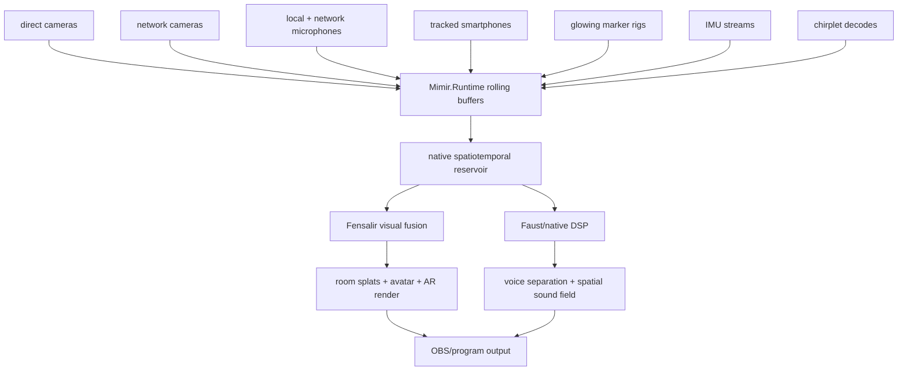

# The Perfect Machine Full Field

There is a version of Mimir that stops looking like a stream rig.

Not because it has more cameras. More cameras are only more mouths. More
microphones are only more lies arriving on different clocks. The Perfect
Machine begins when every sensor is forced to say what it saw, when it saw it,
where it was, how sure it is, and what authority is allowed to believe it.

That is the well. Not storage. Memory with teeth.

## The Room As Instrument

The full Mimir setup treats the room as one instrument with many pickups:

- direct local cameras on the host machine;
- network cameras from other machines and smartphones;
- local and network microphones;
- speaker and loopback references;
- tracked smartphones used as scanning probes;
- glowing tracked marker rigs for bodies, props, and calibration wands;
- IMU streams from phones and small controllers;
- Fensalir as the 3D engine that resolves visual space;
- Faust/native DSP as the engine that resolves the sound field.

The output is not "camera 1 plus camera 2 plus mic 3." That is still a pile.
The output is a timestamped, confidence-bearing spatiotemporal field: a live
room whose visual, acoustic, and motion evidence can be queried, rendered,
separated, and trusted within known bounds.

OBS only receives the final program surfaces and stems. OBS does not become the
judge of time. That office stays upstream, where the evidence still has names.

## Every Sensor Is A Witness, Not A World

The Perfect Machine can accept `n` cameras and `n` microphones, but it must not
confuse abundance with coherence.

A directly connected camera may have stable cadence but poor color. A phone may
have excellent RGB and IMU data but ugly OS audio processing. A PS3 Eye may be a
fast tracking witness but a poor texture camera. A network feed may arrive late
while still preserving useful device timestamps. A microphone may hear the room
well in one band and lie in another.

Each stream therefore enters Mimir with a contract:

- source identity;
- device or capture timestamp;
- arrival timestamp;
- clock quality;
- calibration profile;
- payload handle or encoded packet;
- confidence state;
- owner of the next interpretation step.

No stream is allowed to crown itself reality. Reality is the solved field after
calibration, timing, geometry, and confidence have done their unpleasant work.

## The Spatiotemporal Reservoir

The core memory is a rolling reservoir of correlated samples.

It holds camera frames, audio blocks, marker detections, phone poses, IMU
measurements, chirplet decodes, feature tracks, surface claims, splat
candidates, and audio response estimates inside one bounded live window. The
window exists to preserve enough recent time for the machine to line up clocks,
match evidence across devices, and lower raw observations into resolved field
claims.

This is not an archive. Old private history does not get to haunt the machine.
The reservoir keeps what can still affect the live field, then lets it die.

For each sample, Mimir wants timestamps as close to the physical event as the
hardware allows. The target is nanosecond-class timestamp discipline where the
platform can earn it: hardware counters, driver timestamps, shared clock
domains, PTP-like network sync, ASIO callback timing, GPU fences, and explicit
offset/drift estimates. When nanosecond precision cannot be earned, Mimir keeps
the error visible instead of painting gold leaf over drift.

The invariant is simple:

```text
sample + time + pose + calibration + confidence + owner
```

Without all six, the sample is only raw material.

## Cameras: Direct, Networked, And Tracked

The local camera rig is the fixed root of visual evidence. Direct cameras feed
native capture drivers with device timestamps and payload handles. PS3 Eyes
provide high-rate tracking witnesses. Leap stereo IR provides a timing/depth
candidate. RGB cameras provide texture and context.

Networked cameras extend the field. A phone camera, another PC, or a remote
co-streamer rig can all contribute useful evidence if they carry timing,
calibration, and confidence metadata. They are not clock kings. They are
producers into the same rolling field.

The phone is especially dangerous in the productive sense. It has a camera,
microphone, speaker, IMU, display, processor, hardware encoders, and network
link in one moving body. With the right app, it becomes a tracked calibration
wand:

- camera frames build or refine the static room splat map;
- IMU fills short motion gaps;
- microphone records chirplet response;
- speaker can emit coded probes when allowed;
- network transport returns decoded local evidence to Mimir;
- external marker tracking corrects phone pose drift.

The phone's internal SLAM is useful. External multi-camera tracking is better.
If the phone case carries an asymmetric cluster of glowing markers, the fixed
camera rig can solve the phone's pose while the phone scans the room. The phone
then stops being a wandering consumer device and becomes a measured probe with
known transforms:

```text
marker rig pose
-> phone body pose
-> phone camera pose
-> phone microphone position
-> phone speaker position
```

Every camera frame and every chirplet response from that phone now lands in the
room coordinate frame. The well remembers where the signal stood.

## Glowing Markers And Dual-Eye Positioning

Glowing ping pong balls are not a joke. They are cheap diffuse optical beacons.
Put them on a phone, a hand, a foot, a headband, a prop, or the star of the
show, and the camera rig gets high-contrast points it can triangulate.

The Perfect Machine wants every visible dot seen by at least two cameras when
possible. Dual-eye positioning gives the dot depth. More views give the dot a
trial: if the cameras disagree, the marker does not get promoted to truth
without a confidence cost.

Marker identity can come from several layers:

- color for coarse class;
- geometry for rigid-body cluster shape;
- motion continuity for short-term tracking;
- optical modulation for exact identity and phase.

The RP2040-class marker controller belongs here. It can drive LED markers with
deterministic blink codes. A de Bruijn-style optical code means any short
observed sequence can identify the marker and its code phase, much as the audio
chirplet timeline uses short coded windows to recover timeline position.

The cameras do not merely see a bright dot. They see marker 17, on this phase,
at this time, with this brightness confidence, triangulated from these views.

That is the difference between decoration and evidence.

## Full-Body Tracking And Avatar Rendering

Once glowing marker clusters exist, full-body tracking is no longer a separate
fantasy. It is the same evidence pipeline with a body model attached.

A performer can wear asymmetric marker clusters:

- head;
- chest;
- pelvis;
- wrists;
- elbows if needed;
- knees if needed;
- ankles and feet.

The cameras triangulate marker positions. Fensalir solves rigid clusters,
skeleton constraints, inverse kinematics, and smoothing. The avatar rig moves in
the same 3D engine that owns the room reconstruction. The acoustic field and
the visual field share time, so the voice, body, avatar, and rendered space do
not have to meet later in a compositor and pretend they were always friends.

This is where AR stops being a sticker. The avatar can stand in a room that has
already been scanned. It can be occluded by known geometry. It can cast and
receive spatial audio from a calibrated field. Its mouth and hands can line up
with the sound because the same timing law governs them.

## Chirplets: The Acoustic Runes

Audio calibration uses coded chirps because a chirp can carry identity through
time and frequency. A chirplet decoder can tell which sweep arrived, when it
arrived, and how the path changed it.

For each microphone or receiver, Mimir can estimate:

- delay relative to the reference;
- sample-rate offset and drift;
- usable frequency bands;
- confusing bands;
- phase and group-delay behavior;
- confidence of direct-path versus reflected evidence.

That supports three pieces of the final machine.

First, synchronization: every microphone can be aligned to the canonical
timeline before voice separation or spatial rendering begins.

Second, frequency-response normalization: one microphone's dullness, another
path's room coloration, and a phone mic's hostile processing become measured
calibration problems instead of hidden sabotage.

Third, acoustic mapping: a tracked phone moving through the room can record
chirplet responses at known poses. Fixed speakers emit coded probes. The phone
hears the room from many positions. Mimir accumulates a spatial map of delay,
attenuation, reflection, and band reliability.

The same phone can later emit chirps as a moving source once the receive-side
map earns trust. First it listens. Then it speaks. The well does not hand a
torch to a witness that cannot yet name its own shadow.

## The Static Splat Map And The Living Field

The phone scan can build the static room map while the audio scan builds the
acoustic field. Camera frames, IMU, external marker pose, and chirplet responses
arrive in the same coordinate system.

Fensalir can use that evidence to build the visual prior:

- feature tracks;
- sparse structure;
- dense or semi-dense surfaces;
- 3D Gaussian splats;
- material and confidence claims;
- known occluders and anchors.

The "4D" part arrives when that static prior is no longer frozen. Live cameras,
body markers, phone probes, and audio events update the field across time. A
splat is not just a pretty dot in space; it is evidence with age, confidence,
source history, and a reason to survive the next frame.

Reservoir sampling matters because the machine cannot keep every possible
sample hot. It must keep representative, useful, confidence-bearing evidence
under budget. Reuse is allowed only when the sample still belongs to the domain
being solved. Otherwise the reservoir becomes nostalgia with a math accent.

## The Signal Path

The complete machine looks like this:



The hard rule: raw streams enter; solved claims leave.

Fensalir should not ingest folklore about "camera 3 saw something." It should
receive bounded visual claims with source, pose, time, and confidence.
Faust/native DSP should not be handed "six mics" as if the channel count were a
sound field. It should receive aligned blocks, drift state, calibration models,
and actuator targets.

## What The Machine Can Do When It Earns It

When this is coherent, Mimir can support:

- realtime voice separation from a calibrated microphone field;
- spatial audio rendering tied to actual room geometry;
- localization of emitters and receivers by coded chirplet timing;
- static room scanning with tracked smartphone cameras;
- pose-anchored acoustic response mapping;
- full-body marker-based motion capture;
- AR avatar rendering inside a known room;
- live "4D" Gaussian splatting from synchronized cameras;
- networked co-streamer cameras and mics entering the same timing law.

None of this is granted by naming the features. Each one is a branch that may
only fire when the evidence contract is satisfied.

If a phone loses pose, its samples become weaker. If a marker is seen by only
one camera, it loses depth authority. If a microphone hears chirps but cannot
produce stable anchors, it becomes response evidence before it becomes timing
evidence. If a network camera arrives late, it can still refine the field only
while the rolling window can legally accept it.

This is what coherence means. Not confidence as mood. Confidence as a number
with scars.

## The Perfect Machine Version

The Perfect Machine is not a single device. It is a custody chain for signals.

A glowing marker says who it is. Two cameras place it in space. A phone camera
sees the room from a known pose. A chirplet response measures what the room did
to sound at that pose. A microphone stream admits its delay and drift. A
reservoir keeps only the evidence still alive enough to matter. Fensalir lowers
the visual evidence into splats, surfaces, avatars, and AR anchors.
Faust/native DSP lowers the acoustic evidence into aligned voices, separated
stems, and a spatial bed. OBS receives the rendered surface after the argument
has already happened.

That is the machine worth building.

Not a wall of sensors.

A room that can testify.
