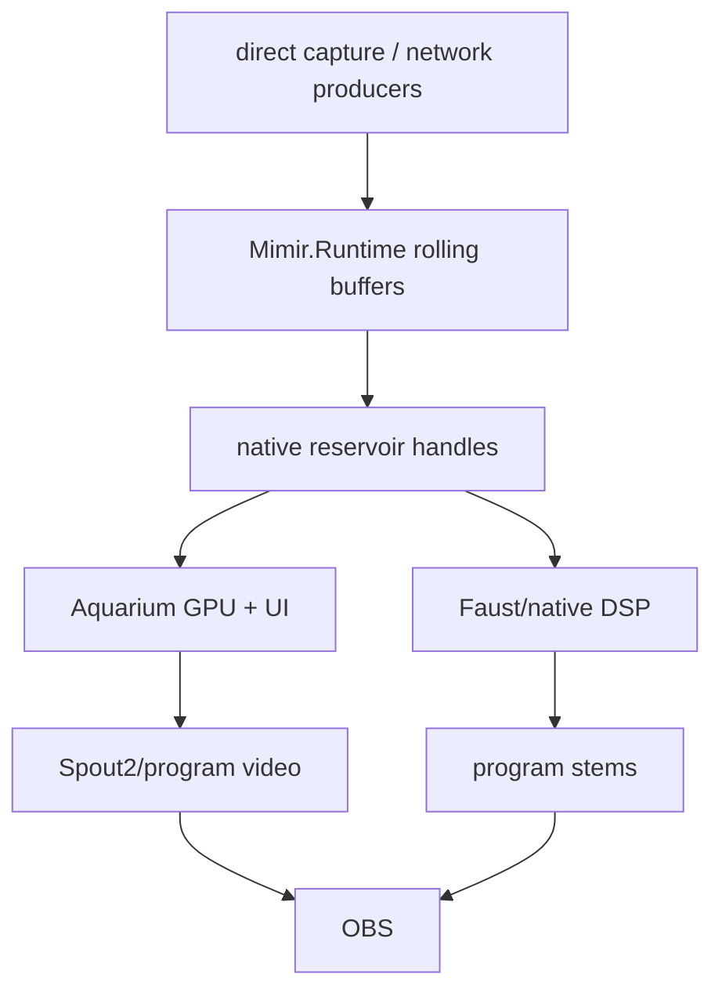

# Perfect Machine

## Objective

Build one synchronized spatial stream machine from six cameras, six microphones,
two speakers, Leap timing, Aquarium GPU rendering, Faust DSP, and OBS output.

The product is not a pile of bridge scripts. The product is a coherent live
field with explicit owners.

## Current Mechanism

## Invariants

- One five-second live window is the timing authority.
- Every stream has a bounded rolling buffer.
- Missing data is absence, not a stale substitute.
- Late data can refine the live window only while it remains inside the window.
- Aquarium owns dense visual fusion, temporal accumulation, material fitting,
  rendering, D3D12 interop, UI, and Spout publication.
- Faust/native DSP owns hot audio alignment, suppression, voice separation,
  spatialization, and stem generation.
- Mimir owns configuration, calibration truth, runtime contracts, launch,
  status, and persistence.

## Reservoir Contract

The native reservoir stores time-ordered sample handles with typed views. It
owns retention and lookup, not payload memory. Producers append. Optimizers
refine. Aquarium/Faust consume.

Required sample kinds include camera frames, camera features, scene rays,
surface claims, material claims, audio blocks, phase claims, event claims, and
render packets.

`LocalcastRuntime` and `LocalcastProducer` are the lower native boundary.
`Mimir.Runtime` is the app-level synchronization surface that Aquarium hosts and
debugs.

## Visual Fusion

Camera fusion is cross-view evidence across the rolling window, not
latest-frame display. Leap stereo IR is the timing ground-truth candidate. The
driver path should deliver frame descriptors with device timestamps and native
or GPU handles, then Aquarium should do feature extraction, flow, matching,
material estimation, brush/splat budgeting, and final presentation on GPU.

## Audio Fusion

The audio path aligns all microphones and loopbacks into one presentation
timeline, feeds Faust/native DSP with bounded blocks, and emits host voice,
co-streamer voice, ambient, transients, local loopback, co-streamer loopback,
and spatial bed as synchronized outputs.

Raw estimator detail stays inside the audio runtime. Meaning crosses the
boundary.

## Cut Line

Cut these from the hot path:

- file polling as a runtime API;
- process capture as the six-camera local foundation;
- OBS-side synchronization between raw sources;
- stale geometry clamped into looking current;
- probe scheduling against placeholder channels.

Keep PowerShell/FFmpeg/SRT only as bridge utility while native ingest matures.
