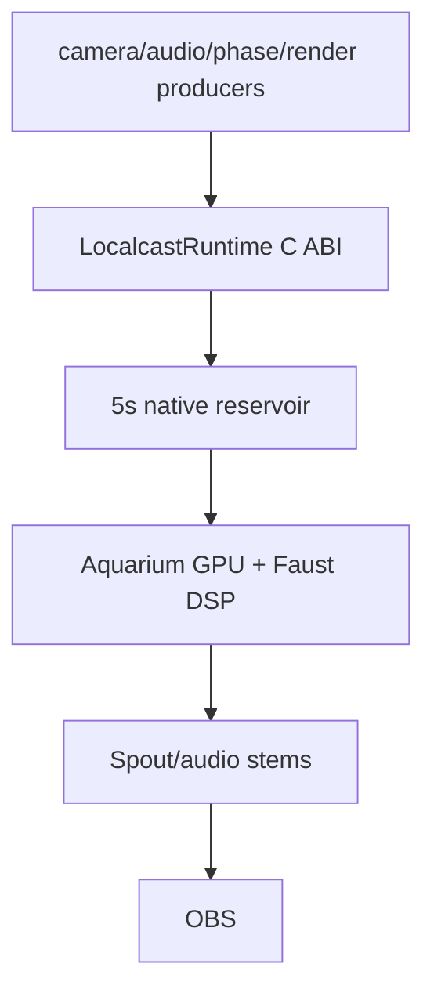
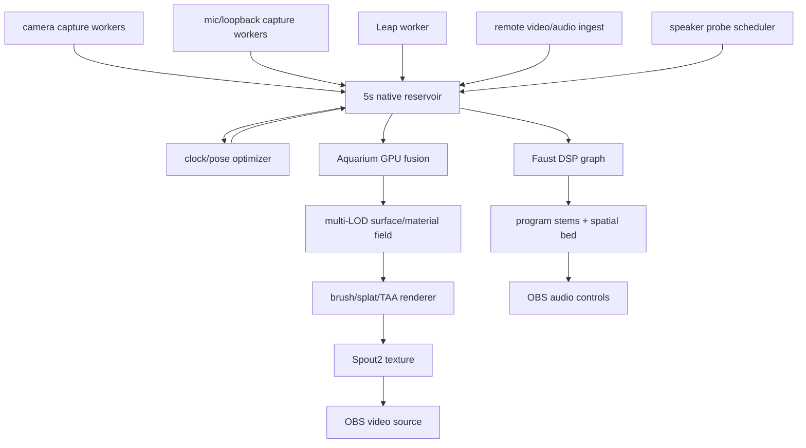

# Perfect Machine

## Objective

Build one synchronized spatial stream machine from six cameras, six microphones,
two speakers, Leap timing, Aquarium GPU rendering, Faust DSP, and OBS output.

The bridge scripts are not the product. They are scaffolding, launch surfaces,
calibration tools, and compatibility probes. The live hot path belongs to native
runtime code, GPU compute, and Faust.

## Current Mechanism

The repo currently proves the contracts:

The old CultCache/Python/Spout path remains a compatibility diagnostic. It is
not the runtime API.

## Invariants

- One five-second spatiotemporal reservoir is the live authority.
- The reservoir is keyed by one shared presentation clock.
- Every sample has sensor id, local hardware time if available, arrival time,
  calibrated world transform, confidence, and provenance.
- Missing data is absence, not a stale substitute.
- Late data can refine the reservoir while it is inside the five-second window.
- Anything older than the live reservoir is offline calibration evidence, not
  broadcast geometry.
- Audio clocks, camera clocks, Leap timing, remote video, and OBS presentation
  are reconciled before rendering.
- Aquarium owns dense visual fusion, temporal accumulation, material fitting,
  brush/splat generation, final render target, and Spout publication.
- Faust owns hot audio DSP: voice separation, room suppression, Ambisonic/HOA
  spatialization, and loopback/source stem generation.
- Mimir owns configuration, calibration, typed contracts, launch,
  status, persistence, and compatibility surfaces.

## Native Runtime Shape

## Reservoir Contract

The reservoir stores one time-ordered rolling buffer of sample handles, not one
giant JSON-ish object and not independent per-kind histories. Typed views over
that buffer expose the kinds consumers need.

Required sample kinds / typed views:

- `camera_frame`: raw or GPU-importable image handles plus timestamps.
- `camera_feature`: keypoints, descriptors, optical flow, confidence, sensor id.
- `scene_ray`: calibrated rays from feature observations.
- `surface_claim`: triangulated or depth-estimated world samples.
- `material_claim`: albedo, roughness, metallic/specular hints, view direction.
- `audio_block`: aligned mic/loopback samples and per-source clock state.
- `phase_claim`: delay/SRO/phase/coherence estimates from chirplets and program
  reference.
- `event_claim`: claps, transients, gestures, active illumination pulses.
- `render_packet`: selected brush/splat work for the current presentation frame.

The reservoir owns retention. Producers append. Optimizers refine. Renderers
sample. No stage owns a private history that can outlive the reservoir.

`LocalcastRuntime` is the first native owner above the raw reservoir. It exposes
typed producer calls for each sample kind so camera capture, audio capture,
phase estimation, material fitting, event detection, and render planning all
append into one shared five-second window without crossing a Python file cache.
It also exposes total and typed-view reads so Aquarium/Faust can consume that
same window without building private histories.

`LocalcastProducer` is the first native capture-worker boundary. It owns sample
kind, source identity, and sequence assignment before appending live handles into
`LocalcastRuntime`; hardware adapters should provide timestamps and payload
handles, not reservoir authority.

## Visual Fusion

Camera fusion is feature matching across the reservoir, not a latest-frame
operation.

The visual path should:

- ingest all cameras continuously into pinned/native buffers referenced by
  reservoir sample handles;
- extract features and flow on GPU where possible;
- match every plausible cross-view feature within time and epipolar bounds;
- use Leap as the strongest near-field timing/spatial witness when live;
- estimate surface points, normals, confidence, and material observations;
- keep multi-LOD cells resident for Aquarium compute reconciliation;
- emit only the frame budget needed for OBS while TAA accumulates detail.

The live target is not "points per frame." The live target is evidence per
reservoir window and how much of it Aquarium can reconcile before presentation.

## Audio Fusion

The audio path should:

- align all six microphones into one clocked field;
- use Focusrite dialogue mics as voice anchors;
- use camera mics as spatial/context witnesses;
- use loopback/program audio as ground truth where available;
- emit active probes only for channels that can observe them;
- continuously update delay, SRO, phase, frequency response, and confidence;
- feed Faust with aligned mic channels and control telemetry;
- produce host voice, co-streamer voice, ambient, transients, local loopback,
  co-streamer loopback, and spatial bed as synchronized outputs.

Raw phase is internal. Meaning crosses the boundary.

## Cut Line

Cut these from the hot path:

- Python dense rendering.
- Python camera feature extraction in the presentation loop.
- File polling as a native runtime API.
- OBS-side sync between independent raw sources.
- Stale geometry clamped into looking current.
- Probe scheduling against placeholder channels.

Keep these as tooling:

- Python calibration scripts.
- Python contract tests.
- Python device discovery.
- Compatibility Spout sender for diagnostics.
- Offline analysis and reproducible evidence ledgers.

## First Native Cut

1. Define the native reservoir ABI from `config/perfect-machine.example.json`.
2. Build a native reservoir process or Aquarium module that owns the five-second
   rolling buffer.
3. Move camera ingest into native capture workers that write reservoir samples.
4. Move audio ingest/phase claims into the same presentation-clock reservoir.
5. Let Aquarium consume reservoir surfaces/material claims directly on GPU.
6. Let Faust consume reservoir audio blocks and source controls directly.
7. Keep the old bridge only as a comparison and fallback surface.

## Native Work Started

`native/reservoir` is the first native crate. It implements the shared-edge
five-second rolling reservoir invariant:

- append samples into one rolling buffer with typed views;
- advance the reservoir edge from the newest sample;
- evict all sample kinds against the same edge;
- query the latest valid sample per sensor inside a typed view.

It now builds as `rlib`, `cdylib`, and `staticlib`, with a small C ABI declared
in `native/reservoir/include/localcast_reservoir.h`:

- create/destroy an opaque `LocalcastReservoir`;
- push timestamped sample metadata into a typed view of the rolling buffer;
- advance/query the shared edge and window start;
- query total length and typed-view length;
- read samples by total rolling-buffer index or typed-view index;
- query the latest sample for a sensor hash.
- reject diagnostic/probe/fallback and unknown-flagged samples at the live
  reservoir boundary via sample provenance flags.
- create/destroy an opaque `LocalcastRuntime`;
- create/destroy opaque `LocalcastProducer` ingress helpers;
- push live producer samples while the producer owns sequence/source metadata;
- append typed camera/audio/phase/event/render handles through producer calls;
- query a native runtime status struct with shared edge, window start, total
  count, and typed-view counts;
- read runtime samples by total rolling-buffer index, typed-view index, and
  latest sensor hash.

The ABI carries `payload_handle`, not payload bytes. Aquarium owns image,
feature, surface, material, and GPU memory interpretation. Faust/native DSP owns
audio buffer interpretation. The reservoir owns only retention, sample kind,
timestamp order, and the five-second shared-edge invariant.
