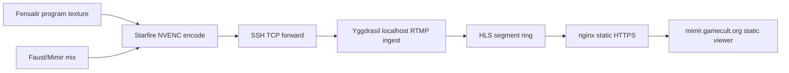

# Self-Hosted Live Edge

Mimir's self-hosted broadcast path keeps OBS optional. Starfire owns the final
program frame and audio mix; Yggdrasil owns public byte distribution.



## Authority Map

- Owner: `Mimir.Broadcast` owns the Starfire-side encoded push command.
- Inputs: final program media, FFmpeg/NVENC capability, and the SSH-forwarded
  RTMP endpoint.
- Outputs: one CBR H.264/AAC RTMP stream to Yggdrasil.
- Derived state: Yggdrasil's HLS playlist and segments are derived from that
  encoded stream. They do not own composition, timing, or transcoding.
- Forbidden writers: Yggdrasil must not transcode the program stream in the
  first live edge. OBS is not the primary broadcast owner.
- Shared paths: synthetic smokes and real program pushes use the same RTMP URL:
  `rtmp://127.0.0.1:11935/live/mimir`.
- Deletion line: if a later CDN or WebRTC edge appears, keep this path as the
  simple origin proof or delete it. Do not keep two public stream authorities.

## First Smoke

On Starfire, with an SSH local forward active to Yggdrasil's localhost RTMP
port:

```powershell
dotnet run --project .\src\Mimir.Broadcast\Mimir.Broadcast.csproj -- --smoke
dotnet run --project .\src\Mimir.Broadcast\Mimir.Broadcast.csproj -- --print-command
```

The default push target is:

```text
rtmp://127.0.0.1:11935/live/mimir
```

The public HLS playlist is:

```text
https://live.mimir.gamecult.org/hls/mimir.m3u8
```

The static viewer lives at:

```text
https://mimir.gamecult.org/live
```

## Scaling Rule

Viewer capacity is approximately:

```text
available Yggdrasil egress / encoded bitrate
```

Micro-optimizations count only when they improve target-host measurements:
served Mbps, p95 segment latency, CPU, memory, syscalls, or stall rate on
Yggdrasil. The first edge uses nginx static serving and kernel file paths so
the hot path is byte distribution, not application code.
