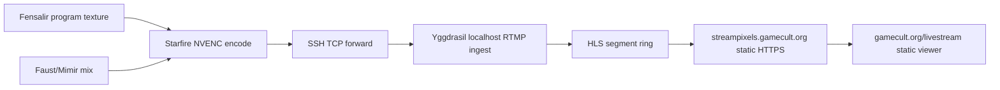

# Self-Hosted Live Edge

Mimir's self-hosted broadcast path keeps OBS optional. Starfire owns the final
program frame and audio mix; Yggdrasil owns public byte distribution.



## Authority Map

- Owner: `Mimir.Broadcast` owns the Starfire-side encoded push command.
- Inputs: final program media, FFmpeg/NVENC capability, and the SSH-forwarded
  RTMP endpoint.
- Outputs: one CBR H.264/AAC RTMP stream to Yggdrasil.
- Derived state: Yggdrasil's HLS playlist and segments are derived from that
  encoded stream. They do not own composition, timing, or transcoding.
- Forbidden writers: Yggdrasil must not transcode the program stream in the
  first live edge. OBS is not the primary broadcast owner.
- Shared paths: synthetic smokes and real program pushes use the same RTMP URL:
  `rtmp://127.0.0.1:11935/live/mimir`.
- Deletion line: if a later CDN or WebRTC edge appears, keep this path as the
  simple origin proof or delete it. Do not keep two public stream authorities.

## First Smoke

On Starfire, with an SSH local forward active to Yggdrasil's localhost RTMP
port:

```powershell
dotnet run --project .\src\Mimir.Broadcast\Mimir.Broadcast.csproj -- --smoke
dotnet run --project .\src\Mimir.Broadcast\Mimir.Broadcast.csproj -- --print-command
```

The default push target is:

```text
rtmp://127.0.0.1:11935/live/mimir
```

The public HLS playlist is served on the existing Yggdrasil-routed
StreamPixels domain:

```text
https://streampixels.gamecult.org/mimir/live/hls/mimir.m3u8
```

The static viewer lives on the root GameCult site:

```text
https://gamecult.org/livestream
```

## Local Recording Before Public Push

Before pushing a live program to Yggdrasil, record the same simple stream-proof
shape locally and judge sync from the artifact:

```powershell
powershell -ExecutionPolicy Bypass -File .\scripts\record-stream-proof-output.ps1 -StartRavenSender -DurationSeconds 20
```

The recording harness listens for a Raven muxed A/V SRT feed on a private test
port, overlays Kiyo Pro as picture-in-picture, mixes Raven Realtek loopback with
Starfire's Scarlett capture, applies conservative FFmpeg denoise filters, and
writes an MP4 under `artifacts\runtime\stream-proof\`.

The current routing contract is explicit:

- Starfire Realtek/default render is the chirp/speaker emission lane.
- Raven Realtek/default render loopback is the co-streamer game/program lane.
  It is packaged with Raven's NVENC video feed back to Starfire.
- Starfire Scarlett carries the hero mic capture and monitored local mix for
  judgment. Raven's Scarlett is only routing the remote shotgun into Starfire
  Scarlett, currently on channel 1.
- The proof recording is allowed to mix those lanes for human sync judgment, but
  it must not collapse their authority. Starfire Realtek proves chirp emission,
  Raven Realtek proves the co-streamer/game program path, and Scarlett proves
  the hero mic/shotgun capture path.

This is a bridge recording, not public broadcast truth. It exists so humans can
judge audio/video sync and tell Mimir which offsets to apply before the RTMP/HLS
edge is involved. Offset knobs are explicit:

```powershell
powershell -ExecutionPolicy Bypass -File .\scripts\record-stream-proof-output.ps1 `
  -StartRavenSender `
  -RavenOffsetSeconds 0.000 `
  -KiyoOffsetSeconds 0.000 `
  -MicOffsetSeconds 0.000
```

If Windows firewall blocks direct SRT/UDP during a local proof, run the Raven
leg through an SSH TCP tunnel instead:

```powershell
Start-Process ssh.exe -ArgumentList '-o ExitOnForwardFailure=yes -N -L 6204:127.0.0.1:5204 -l "madman''s lullaby" 192.168.1.84' -WindowStyle Hidden

powershell -ExecutionPolicy Bypass -File .\scripts\record-stream-proof-output.ps1 `
  -StartRavenSender `
  -RavenSenderListens `
  -RavenSenderTransport tcp-listener `
  -RavenInputOverride tcp://127.0.0.1:6204
```

That fallback keeps the proof private to the LAN/SSH path and avoids changing
machine firewall policy just to capture a judging artifact.

## Scaling Rule

Viewer capacity is approximately:

```text
available Yggdrasil egress / encoded bitrate
```

Micro-optimizations count only when they improve target-host measurements:
served Mbps, p95 segment latency, CPU, memory, syscalls, or stall rate on
Yggdrasil. The first edge uses nginx static serving and kernel file paths so
the hot path is byte distribution, not application code.
