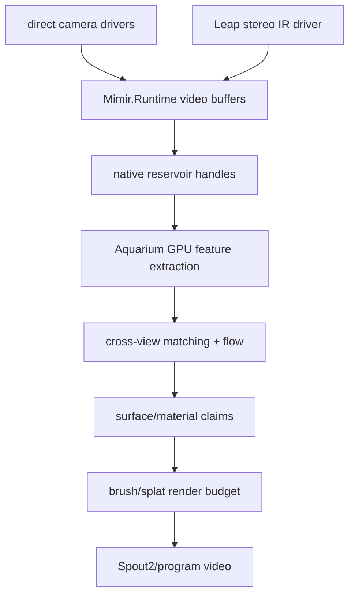

# Sensor Fusion Architecture

Visual fusion belongs in Aquarium over current Mimir runtime buffers.

## Live Flow

## Invariants

- Device timestamps beat arrival timestamps when available.
- Leap is the first timing-camera candidate.
- Process capture is a bridge edge, not the local six-camera foundation.
- Aquarium owns GPU extraction, fusion, material fitting, and render budgeting.
- Runtime buffers own retention and stream health, not scene reconstruction.

## Next Cut

Implement one concrete direct capture driver, feed `MimirVideoFrameDescriptor`
samples into `MimirVideoCaptureDriverSource`, and measure sustained cadence over
the default five-second window.
