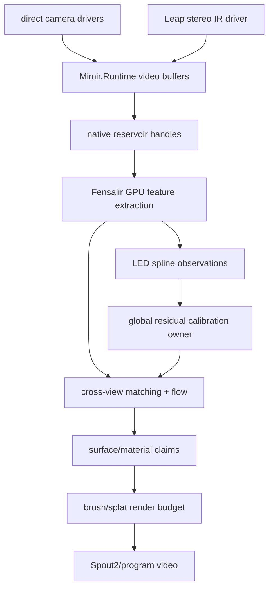

# Sensor Fusion Architecture

Visual fusion belongs in Fensalir over current Mimir runtime buffers.

## Live Flow

## Invariants

- Device timestamps beat arrival timestamps when available.
- Leap is the first timing-camera candidate.
- Process capture is a bridge edge, not the local six-camera foundation.
- Fensalir owns GPU extraction, fusion, material fitting, and render budgeting.
- Runtime buffers own retention and stream health, not scene reconstruction.
- LED strips are active calibration evidence. Cameras may publish ordered
  bright-curve observations, but only the global residual calibration owner may
  update camera intrinsics/extrinsics.
- Stable LED index identity requires temporal/color/address coding or another
  correspondence source; uncoded identical lights are spline constraints, not
  metric depth authority.

## Next Cut

Replace provisional Leap projection constants with calibrated intrinsics and
add the global residual owner that consumes Leap surface errors, LED spline
observations, and later PS3 Eye/Kiyo/Eve feature tracks through one calibration
commit path.
