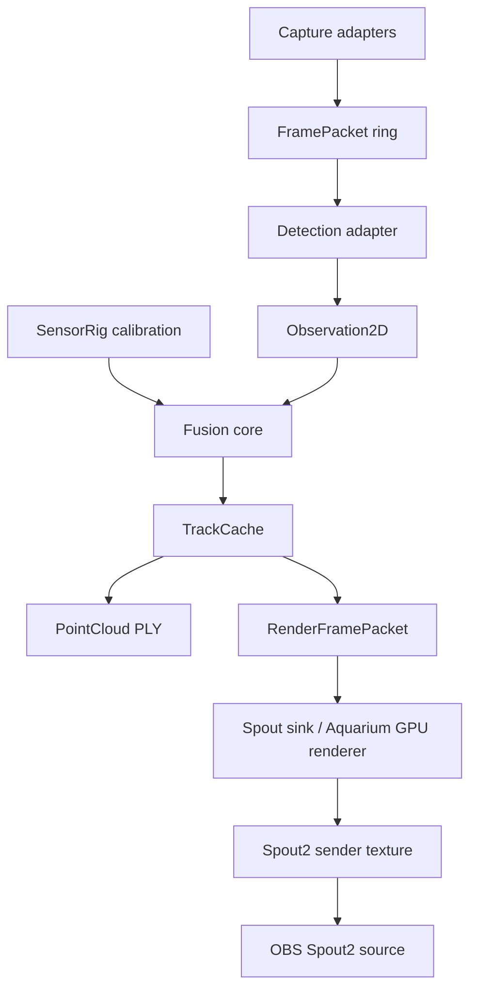

# Sensor Fusion Architecture

## Objective

Produce an aligned, timestamped point cloud from the local visual rig while allowing latency, buffering, and cache convergence. The live render path can lag behind capture; it may not lie about coordinate ownership.

## Current Mechanism

The rig currently has usable capture surfaces:

- PS3 Eyes through FFmpeg DirectShow device names `PS3 Eye Universal` and `PS3 Eye Universal2`, verified at dual `320x240@60`.
- Kiyo-class RGB cameras through OpenCV/DirectShow/MSMF for color evidence.
- LeapUVC raw IR through OpenCV for near-field evidence.
- ChArUco tooling for intrinsics capture, but no shared fusion state yet.

That is capture. Capture is not a world model.

## Invariants

- World coordinates own truth.
- Capture adapters emit timestamped observations; they do not own fusion semantics.
- Fusion core is pure and testable: calibrated camera models plus 2D observations in, 3D points/confidence out.
- Point clouds and later brush/splat packets are cached render lowerings, not the canonical scene.
- A missing high-detail update renders stale-but-bounded state until better evidence arrives.

## Intended Change

The first pipeline slice adds these boundaries:



## Ownership

- `localcast.sensor_fusion.core` owns calibrated camera models, 2D observations, DLT triangulation, reprojection gating, confidence scoring, point-cloud export, and track cache expiry.
- `localcast.sensor_fusion.adapters` owns driver-facing frame ingress. Its first concrete adapter is an FFmpeg raw BGR reader for the PS3 Eye DirectShow path.
- `localcast.sensor_fusion.render_bridge` owns the render-frame ABI: cached point claims plus target dimensions, Spout sender name, source timestamp range, intended visual presentation time, and ambisonic/audio alignment time.
- `localcast.sensor_fusion.spout_output` owns the deadline OBS publication sink: render-frame packet in, GPU texture plus Spout sender heartbeat out.
- `scripts/sensor_fusion.py` owns CLI composition for offline observation files.
- `scripts/stream_spout.py` owns the live Spout sender loop for OBS.
- `config/sensor-fusion.example.json` owns the declarative rig shape: capture hints, intrinsics, extrinsics, latency, and fusion thresholds.

## Cache Discipline

This follows the same architectural lesson as `fractal-domains-cache-that-bites.md`: state begins as semantic claims in a named domain, then lowers into cheaper packets.

For this project:

```text
sensor observation
-> calibrated world ray
-> triangulated marker claim
-> cached track
-> render frame packet
-> Aquarium brush/splat packet
-> Spout sender texture
-> OBS source
```

The cache is not a bucket. `TrackCache` has a TTL and confidence update rule so the system can buffer and converge without pretending stale points are fresh. Later GPU buffers should mirror this shape: observation SoA, track SoA, brush packet SoA.

## Test Boundaries

The core can be tested without cameras:

- synthetic cameras triangulate a known point
- timestamp windows reject stale pairs
- track cache expiry is deterministic
- raw-frame adapter can be tested from an in-memory byte stream

Those tests matter because camera drivers are not unit-test dependencies. They are weather.

## OBS And Spout Boundary

OBS should see a named Spout sender, not a camera window, file tail, or desktop capture. Current references confirm the ordinary Windows path: the Off World Live OBS Spout2 plugin receives Spout shared textures, while the Spout2 SDK is the app-side texture sharing surface.

The intended production handoff is:

```text
LocalCastBridge TrackCache
-> RenderFramePacket JSON/binary stream
-> Aquarium Engine typed runtime state
-> GPU point/brush/splat buffer
-> D3D render target
-> Spout2 sender named "LocalCastBridge Point Cloud"
-> OBS Spout2 Capture source
```

`RenderFramePacket` is a scaffold ABI, not the final hot path. JSON is useful for inspection, tests, and handoff. Once Aquarium consumes the shape, switch the transport to a binary or shared-memory ring with the same fields. The invariant is the packet contract, not JSON.

The current streamable cut is:

```text
RenderFramePacket JSON
-> OpenGL FBO point renderer
-> SpoutGL sendTexture
-> OBS Spout2 Capture source
```

This is deliberately a sink boundary, not a competing world model. Aquarium should replace the renderer body, not the capture/fusion/timing contract.

## Latency Contract

Latency is allowed. Drift is not.

Each render frame carries:

- `source_time_min_ns` and `source_time_max_ns`: the observation window that produced the cached points.
- `present_time_ns`: when the visual frame wants to be presented after visual buffering.
- `audio_alignment_time_ns`: the corresponding ambisonic output time.

That lets the final stream compositor buffer point-cloud visuals until they align with the bounded audio-field cache. The renderer may show a slightly older world if the packet is coherent and labeled. It may not quietly mix fresh audio with stale visual geometry and call that sync.

## Next Cut

1. Add detector adapters that turn PS3 Eye frames into `Observation2D` marker detections.
2. Load real ChArUco intrinsics/extrinsics into `config/sensor-fusion.json`.
3. Record an observation JSONL/JSON run from the two PS3 Eyes.
4. Generate a live sparse PLY stream or debug preview.
5. Feed `RenderFramePacket` into Aquarium Engine.
6. Add Aquarium-side GPU point/brush rendering to a D3D render target.
7. Publish the render target as a Spout2 sender and receive it in OBS.
8. Replace JSON packet transport with a binary/shared-memory ring once the contract is stable.

## References

- OpenCV multi-camera calibration and triangulation are the geometry spine. See `research/visual-spatial-map/summary.md`.
- Jacob and Haeb-Umbach 2015 motivates audio-visual coordinate alignment. See `research/visual-spatial-map/mirrors/krekovic-2015-audio-visual-geometry-calibration.pdf`.
- Kerbl et al. 2023 and RTG-SLAM motivate splats as render packets, not state ownership. See `research/visual-spatial-map/summary.md` and `research/gpu-fusion-splatting/summary.md`.
- Spout2 and the OBS Spout2 plugin are the Windows/OBS texture-sharing bridge. See `research/spout-obs-bridge/summary.md`.
- `E:\Projects\gamecult-site\GameCult\Blog\fractal-domains-cache-that-bites.md` supplies the cache discipline: semantic authority first, backend packet lowering second.
