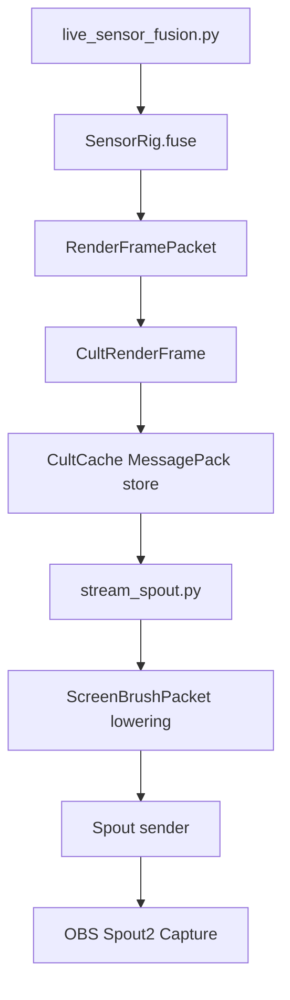

# Typed Visual State

## Objective

Keep visual fusion state as typed CultCache documents and expose the boundary as CultNet document messages.

JSON is no longer the authority for live visual state. The renderer consumes `calibration/runs/visual-state.msgpack`, which stores a `localcast.visual.render_frame` CultCache document.

## Current Mechanism



Live files:

- `calibration/runs/visual-state.msgpack`: typed live visual frame state.
- `calibration/runs/visual-stream-status.msgpack`: typed stream status state.
- `calibration/runs/stream-spout-status.json`: compatibility heartbeat for quick terminal checks.

## Document Types

`localcast.visual.render_frame`

- schema id: `gamecult.localcast.visual.render_frame.v1`
- key: `localcast.visual.render-frame.live`
- payload: MessagePack array, decoded as `CultRenderFrame`
- owns: frame timing, Spout sender identity, target size, and render points

`localcast.visual.stream_status`

- schema id: `gamecult.localcast.visual.stream_status.v1`
- key: `localcast.visual.stream-status.live`
- payload: MessagePack array, decoded as `CultStreamStatus`
- owns: sender heartbeat and renderer health

## CultNet Boundary

The API boundary is CultNet document replication, not ad hoc file polling:

```text
CultNetDocumentPut(localcast.visual.render_frame)
-> CultCache local store
-> renderer frame source
```

For the deadline rig, both producer and renderer share the local CultCache file. The boundary is still the document contract: a future camera process, Aquarium process, or remote sensor node should publish the same document through CultNet `document_put` messages rather than inventing another transport shape.

## Cut Line

- Keep: typed CultCache document contracts and MessagePack payloads.
- Keep temporarily: JSON heartbeat for human shell checks.
- Cut next: JSON render-frame polling once no script depends on it.
- Do not add a second scene authority. Sensor fusion owns world claims; renderer owns pixels.
