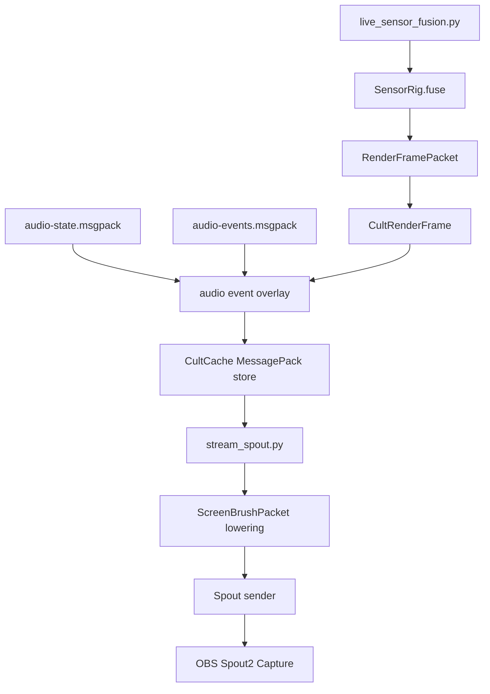

# Typed Visual State

## Objective

Keep visual fusion state as typed CultCache documents and expose the boundary as CultNet document messages.

JSON is no longer the authority for live visual state. The renderer consumes `calibration/runs/visual-state.msgpack`, which stores a `localcast.visual.render_frame` CultCache document.

## Current Mechanism



Live files:

- `calibration/runs/visual-state.msgpack`: typed live visual frame state.
- `calibration/runs/visual-stream-status.msgpack`: typed stream status state.
- `calibration/runs/stream-spout-status.json`: compatibility heartbeat for quick terminal checks.
- `calibration/runs/av-sync-status.json`: visual/audio sync heartbeat from the Spout/Aquarium publisher.

## Document Types

`localcast.visual.render_frame`

- schema id: `gamecult.localcast.visual.render_frame.v1`
- key: `localcast.visual.render-frame.live`
- payload: MessagePack array, decoded as `CultRenderFrame`
- owns: frame timing, Spout sender identity, target size, and render points

`localcast.visual.stream_status`

- schema id: `gamecult.localcast.visual.stream_status.v1`
- key: `localcast.visual.stream-status.live`
- payload: MessagePack array, decoded as `CultStreamStatus`
- owns: sender heartbeat and renderer health

## CultNet Boundary

The API boundary is CultNet document replication, not ad hoc file polling:

```text
CultNetDocumentPut(localcast.visual.render_frame)
-> CultCache local store
-> renderer frame source
```

For the deadline rig, both producer and renderer share the local CultCache file. The boundary is still the document contract: a future camera process, Aquarium process, or remote sensor node should publish the same document through CultNet `document_put` messages rather than inventing another transport shape.

The live visual frame may contain multiple claim families. `dense-rgb:*` claims
are calibrated two-camera RGB surface samples from the debug CPU stereo
reference or, in the intended production path, Aquarium/GPU dense stereo and
flow. `room-rgb:*` claims are camera-resolved room/background surface samples;
`host-rgb:*` and `deru-rgb:*` claims are fallback RGB body/object surface
samples; and `leap-motion:*` claims are high-rate LeapUVC packed-channel motion
samples. Leap packed maps are split into explicit green, magenta, red, and blue
channels before publication so the downstream accumulator can use Leap as the
strongest timing/motion witness without pretending the packed image is one
ordinary RGB camera.

LocalCastBridge does not own the final splat budget. It publishes dense typed
claims with stable keys and timestamps; Aquarium owns temporal accumulation,
renderer residency, and any GPU-side reduction needed to make million-splat
frames presentable.

## Audio Synchronization

`stream_spout.py` can now read `calibration/runs/audio-state.msgpack` and `calibration/runs/audio-events.msgpack` while it renders the visual frame. It selects source events against `RenderFramePacket.audio_alignment_time_ns`, adds synchronized audio-event points to the render packet, and writes `calibration/runs/av-sync-status.json` with the active visual frame id, audio frame id, audio delta, event count, overlay count, and remote video sync status.

The audio bed still travels as `localcast.audio.spatial_frame`; the visual render packet only receives renderer-visible transient geometry. That keeps the machine legible: audio owns sound, source-event analysis owns acoustic facts, Aquarium owns the final pixel/audio package for OBS.

The neighbor SRT video feed is also a timed media artifact. For the deadline path, `stream_spout.py` records its URL and expected SRT latency in the sync status:

```powershell
.\.venv\Scripts\python.exe .\scripts\stream_spout.py `
  --source cultcache `
  --frame-cache .\calibration\runs\visual-state.msgpack `
  --audio-cache .\calibration\runs\audio-state.msgpack `
  --audio-events-cache .\calibration\runs\audio-events.msgpack `
  --remote-video-url "srt://0.0.0.0:5100?mode=listener&latency=120000&timeout=5000000" `
  --remote-video-latency-ms 250
```

That does not make the SRT feed disappear into the point renderer. It makes the dependency honest: OBS/Aquarium must delay or present the remote video according to the same presentation clock as the Spout texture and AmbiX bed. This value is presentation delay, not only the SRT socket's `latency` parameter.

## Cut Line

- Keep: typed CultCache document contracts and MessagePack payloads.
- Keep temporarily: JSON heartbeat for human shell checks.
- Cut next: JSON render-frame polling once no script depends on it.
- Do not add a second scene authority. Sensor fusion owns world claims; renderer owns pixels.
- Do not make OBS synchronize separate sources. Aquarium receives synchronized visual/audio documents and emits the OBS-facing package.
- Do not treat the neighbor SRT video feed as untimed scenery. It is a presentation artifact and belongs in the same sync status as audio and render frames.
