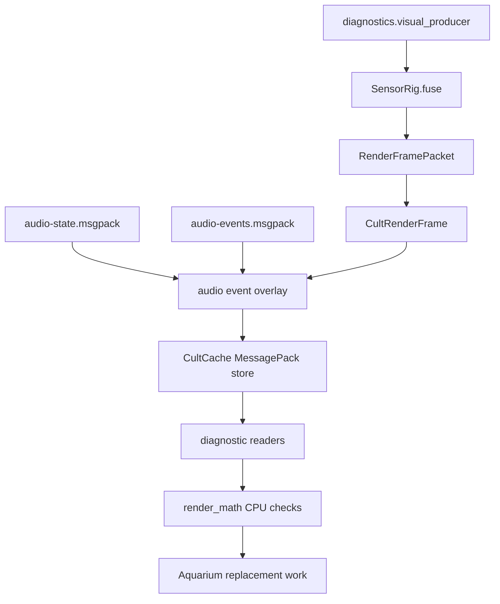

# Diagnostic Typed Visual State

## Objective

Keep the diagnostic visual file shape as typed CultCache documents and expose
the production boundary as native CultNet document messages.

JSON is no longer the authority for visual state. The diagnostic renderer
consumes `calibration/runs/visual-state.msgpack`, which stores a
`localcast.visual.render_frame` CultCache document. Production visual state must
not be owned by this Python file adapter.

## Current Mechanism



Diagnostic files:

- `calibration/runs/visual-state.msgpack`: typed diagnostic visual frame state.
- `calibration/runs/visual-stream-status.msgpack`: typed diagnostic stream
  status state.
- `calibration/runs/stream-spout-status.json`: legacy heartbeat shape for quick
  terminal checks when a diagnostic publisher exists.
- `calibration/runs/av-sync-status.json`: visual/audio sync heartbeat shape for
  Aquarium/native publishers.

## Document Types

`localcast.visual.render_frame`

- schema id: `gamecult.localcast.visual.render_frame.v1`
- key: `localcast.visual.render-frame.live`
- payload: MessagePack array, decoded as `CultRenderFrame`
- owns: frame timing, Spout sender identity, target size, and render points

`localcast.visual.stream_status`

- schema id: `gamecult.localcast.visual.stream_status.v1`
- key: `localcast.visual.stream-status.live`
- payload: MessagePack array, decoded as `CultStreamStatus`
- owns: sender heartbeat and renderer health

`localcast.calibration.clap_events`

- schema id: `gamecult.localcast.calibration.clap_events.v1`
- key: `localcast.calibration.clap-events.live`
- payload: MessagePack array, decoded as `CultClapEventsFrame`
- owns: deliberate clap calibration events aligned against the audio timing oracle
- fields: stable key, world position, acoustic oracle timestamp, visual observed timestamp, timing uncertainty in microseconds, visual/acoustic confidence, and contributing camera motion peaks

## CultNet Boundary

The API boundary is CultNet document replication, not ad hoc file polling:

```text
CultNetDocumentPut(localcast.visual.render_frame)
-> CultCache local store
-> renderer frame source
```

For the deadline rig, both producer and renderer share the local CultCache file.
That arrangement is diagnostic scaffolding. Aquarium, native capture, and remote
sensor nodes should publish the same typed document through CultNet
`document_put` messages rather than treating a Python-polled file as live
authority.

The live visual frame may contain multiple claim families. `dense-rgb:*` claims
are calibrated two-camera RGB surface samples from the debug CPU stereo
reference or, in the intended production path, Aquarium/GPU dense stereo and
flow. `room-rgb:*` claims are camera-resolved room/background surface samples;
`host-rgb:*` and `deru-rgb:*` claims are fallback RGB body/object surface
samples; and `leap-motion:*` claims are high-rate LeapUVC packed-channel motion
samples. Leap packed maps are split into explicit green, magenta, red, and blue
channels before publication so the downstream accumulator can use Leap as the
strongest timing/motion witness without pretending the packed image is one
ordinary RGB camera.

LocalCastBridge does not own the final splat budget. It publishes dense typed
claims with stable keys and timestamps; Aquarium owns temporal accumulation,
renderer residency, and any GPU-side reduction needed to make million-splat
frames presentable.

## Audio Synchronization

The deleted Python/OpenGL sender used to read `calibration/runs/audio-state.msgpack`
and `calibration/runs/audio-events.msgpack` while rendering the diagnostic
visual frame. That responsibility now belongs in Aquarium/native code: select
source events against `RenderFramePacket.audio_alignment_time_ns`, add
synchronized renderer-visible transient geometry, and write/publish sync status
with visual frame id, audio frame id, audio delta, event counts, and remote
video status.

The audio bed still travels as `localcast.audio.spatial_frame`; the visual render packet only receives renderer-visible transient geometry. That keeps the machine legible: audio owns sound, source-event analysis owns acoustic facts, Aquarium owns the final pixel/audio package for OBS.

The neighbor SRT video feed is also a timed media artifact. OBS/Aquarium must
delay or present the remote video according to the same presentation clock as
the Spout texture and AmbiX bed. This value is presentation delay, not only the
SRT socket's `latency` parameter.

## Cut Line

- Keep: typed CultCache document contracts and MessagePack payloads.
- Keep temporarily: JSON heartbeat for human shell checks.
- Cut next: JSON render-frame polling now that it is isolated under diagnostics.
- Do not add a second scene authority. Sensor fusion owns world claims; renderer owns pixels.
- Do not make OBS synchronize separate sources. Aquarium receives synchronized visual/audio documents and emits the OBS-facing package.
- Do not treat the neighbor SRT video feed as untimed scenery. It is a presentation artifact and belongs in the same sync status as audio and render frames.
