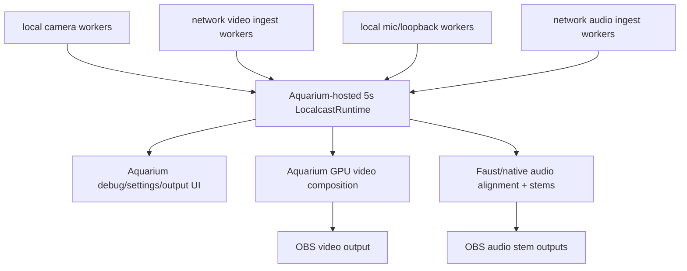

# Viable Stream App

## Objective

Build the smallest live Mimir application that can ingest multiple local or
networked video and audio feeds, hold a short synchronized window in memory,
and emit coherent OBS-facing program outputs while Aquarium provides the
operator UI.

The default reservoir horizon is five seconds. That delay is not decoration. It
is the budget that lets late network packets, independent capture clocks,
audio/video alignment, and debug controls converge before OBS sees the result.

## Current Mechanism

Today the repo has two partial machines:

- FFmpeg/SRT bridge scripts can capture sender video/audio and expose stable OBS
  Media Source endpoints.
- The native `LocalcastRuntime` reservoir ABI can hold typed live sample handles,
  and Aquarium can consume native render packets for GPU fusion.

Those parts are useful, but they are not yet the viable app. The viable app is
the join: ingest workers append live sample handles into one Aquarium-hosted
runtime window, Aquarium renders video from that window, Faust/native audio
builds synchronized stems from the same window, and OBS receives only the
program outputs.

## Invariants

- One in-memory reservoir owns the live timing edge and expiry.
- Aquarium owns the running app, UI, debug state, settings changes, output
  management, GPU fusion/rendering, and Spout/video publication.
- Faust/native DSP owns audio alignment, voice separation, suppression, stems,
  and spatial bed generation.
- OBS receives synchronized program surfaces. Raw unsynchronized feeds may be
  diagnostic inputs, not broadcast truth.
- Networked feeds are producers into the same reservoir. They do not own clocks,
  private buffers, or a parallel synchronization model.
- Missing feeds become explicit absence or silent/blank placeholders inside the
  program model. Stale samples do not get stretched into looking current.
- Python may inspect, calibrate, and test. It does not run the live hot path.

## First Viable Cut

The first cut should be deliberately boring:

1. Build Mimir as its own C# solution in this repo.
2. Reference Aquarium Engine as the windowing/rendering library and D3D12
   bridge; do not copy engine host code into Mimir.
3. Start an Aquarium `LocalCastRuntime` app with a five-second native runtime.
4. Create one producer per configured feed using native source-id hashing.
5. Ingest video feeds as timed camera-frame or render-packet handles.
6. Ingest audio feeds as timed `LocalcastAudioBlockDescriptor` handles.
7. Expose Aquarium UI readouts for reservoir edge, window start, per-kind
   counts, feed health, delay estimate, output status, and current settings.
8. Render one synchronized program video output from the reservoir.
9. Emit separately controllable OBS audio stems from the same reservoir window.
10. Keep the existing FFmpeg/SRT scripts as edge utilities for network capture
    and OBS compatibility, not as the stream authority.

## Repo Shape

`Mimir.slnx` owns the Mimir app surface:

- `src/Mimir.App` launches Aquarium Engine and points it at the Mimir runtime
  assembly.
- `src/Mimir.Runtime` implements the Aquarium client runtime factory and uses
  Aquarium's LocalCast runtime until Mimir-specific ingest workers replace the
  remaining diagnostic source.

## Synchronization Runtime

`Mimir.Runtime` now owns the first synchronization spine:

- `MimirRuntime` is the Aquarium client runtime. It wraps the current
  Aquarium `LocalCastRuntime` visual path and adds a Mimir-owned synchronization
  hub.
- `MimirSynchronizationHub` owns stream source polling and appends samples into
  bounded buffers.
- `MimirRollingStreamBuffer` owns one stream's short history and evicts samples
  outside the configured window.
- `IMimirStreamSource` is the adapter seam for local devices and network feeds.
- `MimirNativeIngestStreamSource` is the low-overhead push seam for native
  camera/audio adapters that already own buffers or handles.
- `MimirProcessStreamSource` is a compatibility adapter for network or
  diagnostic command sources. It is not the six-camera local capture foundation.

The default buffer duration is five seconds. It can be overridden with
`MIMIR_SYNC_BUFFER_SECONDS` or `MIMIR_RESERVOIR_SECONDS`.

Configured stream ids can be declared with comma- or semicolon-separated
environment variables:

- `MIMIR_LOCAL_VIDEO_STREAMS`
- `MIMIR_LOCAL_AUDIO_STREAMS`
- `MIMIR_NETWORK_VIDEO_STREAMS`
- `MIMIR_NETWORK_AUDIO_STREAMS`

These create buffers immediately. Capture adapters still need to register
`IMimirStreamSource` implementations to feed live samples into those buffers.

For local cameras, prefer native adapters that push sample handles directly
through `MimirNativeIngestStreamSource`. Process-backed FFmpeg ingest is allowed
for remote SRT/diagnostic edges, but local six-camera ingest should stay close
to the driver, GPU, and capture APIs.

## Cut Line

Do not add a new registry, bridge daemon, JSON live store, OBS plugin, or
per-feed buffer manager to make this happen. If the app needs one of those,
first move the missing authority into `LocalcastRuntime`, Aquarium, or
Faust/native DSP.

The app exists to make the live system coherent, not to preserve every
deadline-era surface. Deadline fossils may be used as diagnostic witnesses. They
do not get promoted because they still twitch.
