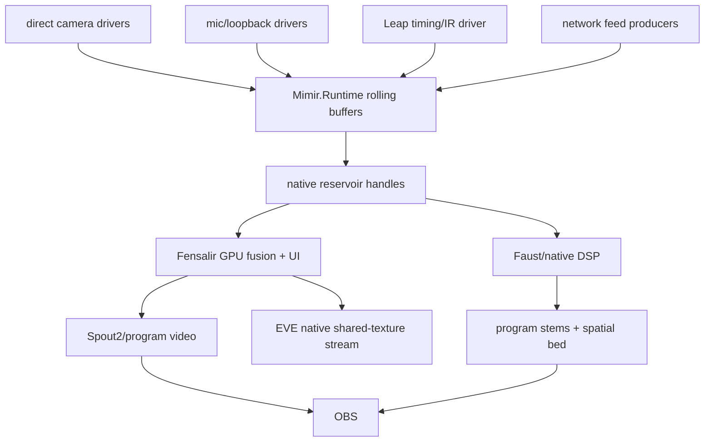
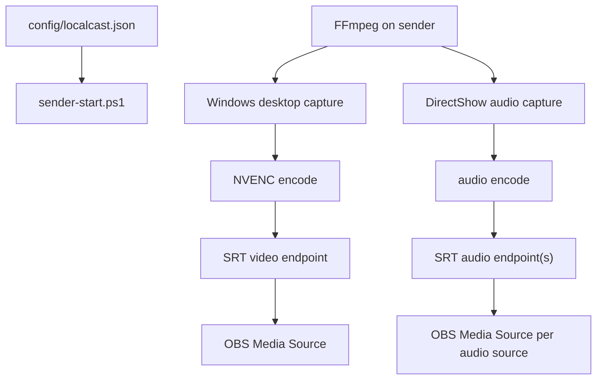

# Current System Map

Source-level code ownership is mapped in [[docs/code-algorithm-map|Code Algorithm Map]].
The indexed problem-domain map is
[[docs/perfect-machine-domain-index|Perfect Machine Domain Index]]; the
current architecture/optimization/sample-code study lives under
`research/perfect-machine-study-2026-05-23/`.

Mimir is the public Face and product name for this repo. A few lower native ABI
names still use `localcast` until a deliberate rename cut exists.

The live target is the native rolling field machine described in
[[docs/native-rebuild-plan|Native Rebuild Plan]],
[[docs/perfect-machine|Perfect Machine]], and
`config/perfect-machine.example.json`.

## Perfect Machine Target

Ownership:

- Mimir owns configuration, calibration truth, launch, status, persistence, and
  runtime contracts.
- Mimir is a CultMesh app: typed state surfaces for codebooks, schedules,
  calibration receipts, path response, and offload work must be mesh-syncable so
  phones, microcontrollers, Raven, and Starfire can participate without
  becoming independent clock authorities.
- `Mimir.Runtime` owns app-level stream buffers and synchronization.
- Native capture workers own device reads.
- Fensalir owns dense visual fusion, material/brush/splat reconciliation,
  D3D12 interop, runtime UI, Spout2 publication, and the completed backbuffer
  texture copied into the EVE shared D3D12 program-output surface.
- Faust/native DSP owns hot audio alignment, suppression, separation,
  spatialization, and stem generation.
- OBS owns broadcast controls.
- EVE owns native decode/composite for its fullscreen display path; it does not
  own layout, WebKit compatibility, or timing authority.

Invariant: the live window is bounded, in memory, and has one timing authority.
No private history outlives the rolling buffer.

## Viable Stream App

[[docs/viable-stream-app|Viable Stream App]] defines the near-term app target.
Fensalir hosts the running Mimir app, keeps the default five-second runtime in
memory, exposes debug/settings/output controls, and emits synchronized OBS
program video plus separately controllable audio stems.

`Mimir.Runtime` currently provides:

- `MimirSynchronizationHub`;
- `MimirRollingStreamBuffer`;
- stream descriptors/settings;
- `IMimirStreamSource`;
- `MimirNativeIngestStreamSource`;
- `MimirProcessStreamSource`;
- `MimirFrameEventProcessStreamSource`;
- `MimirVideoFrameDescriptor`;
- `MimirAudioSynchronizationAnalyzer`;
- `IMimirVideoCaptureDriver`;
- `MimirVideoCaptureDriverSource`.

Process-backed sources are bridge/network edges. Local cameras should feed
native descriptors with device timestamps and optional native/GPU handles.
The `frame-events`/`json-lines` adapter is a diagnostic witness only: native
probes can emit per-frame JSON metadata so Fensalir sees real sensor cadence in
the rolling buffers while the direct ABI driver is being cut. It does not carry
pixels and does not own the final six-camera hot path. Multi-camera probes are
one process with declared accepted source ids, not one process per camera.

## OBS Bridge Utility

The bridge is useful because it is inspectable and already speaks OBS. It does
not become the synchronized program authority.

## Audio Field

The six-microphone path is separate from the bridge. Scarlett speaker loopback
is the current timing authority when active calibration is playing, but Scarlett
production capture belongs on ASIO rather than WASAPI shared mode.
`MimirBioacousticTimeline` owns the active runtime watermark described in
[[docs/bioacoustic-timeline-watermark|Bioacoustic Timeline Watermark]]: a
low-gain birdsong-like word language with 128 self-identifying word positions,
left-speaker and right-speaker variants, four formant-rich syllables per word,
rhythm variation, and direct word identity. Any correctly decoded word identifies
the event index inside the current operating horizon. Mimir queues the left
vocabulary to the left speaker and the right vocabulary to the right speaker
through Fensalir audio, then decodes timing as `bioacoustic` evidence.
`MimirAudioSynchronizationSettings.Mode` chooses whether active calibration is
allowed: `chirp-only` emits the active bioacoustic witness, `passive` stays silent
and uses program-audio phase correlation, and `hybrid` uses passive evidence by
default while emitting active pilot chunks only when passive confidence is weak.
Active decoding does not inherit the passive two-second analysis floor: passive
still needs a longer program-audio window, while the bioacoustic witness can
decode once at least one self-identifying song word is present. The active
decoder is a song-contour anchor machine, not a de Bruijn sequence receiver:
one call carries enough contour, syllable timing, formant, payload, rhythm, and
speaker-tint evidence to identify canonical time inside the operating horizon
and pin multiple time/frequency anchors at once. The bioacoustic detector now
uses bounded motif proposals, matched motif scoring, direct word anchors,
source clock fitting, and fractional waveform refinement.
Pairwise sync compares matched anchors first, then only accepts independent
clock-fit offsets inside the live latency horizon so period aliases do not
become absurd reports. The old chirp-bin detector remains as a
calibration/reference artifact: it carries the full dechirped bin-energy surface
and aggregates decodes into a `MimirChirpBinCalibrationModel` with measured
usable bands, expected-symbol versus observed-bin confusion observations,
timing residuals, delay hypotheses, phase summaries, and an adaptive codebook
plan. The analyzer keeps raw profiles even when no timing report is accepted,
so physical mic failures can still guide bioacoustic motif weighting. Reports/states
expose `delayUs` next to fractional sample delay.
`Mimir.BufferSmoke --bioacoustic-self-test` proves direct word anchors.
`--standalone-bioacoustic-self-test --sample-rate 48000 --delay-samples 1269.5`
proves a receiver with only codebook/schedule state can recover delayed source
time to below printed microsecond precision. `--chirp-only-sync-self-test
--sample-rate 48000` recovers a 317.375-sample synthetic delay with printed
0.000 us error using `evidence=bioacoustic`.
`--bioacoustic-train` is now the receipt-backed tuning harness: it runs
multiple indexed cepstral decoder hypotheses across mel-cepstral warp/blur
degradations and writes typed CultCache results plus pre-warp, post-warp, and
reconstructed-from-detections WAV artifacts. The latest local receipt under
`artifacts/bioacoustic-training/bioacoustic-20260524-103438/` shows identity
survives many degradations, but timing still fails under warped domains, so the
next receiver cut is a global delay/clock/path hypothesis over detected words.
Reports now carry fractional delay and per-band matched energy. The older
`MimirChirpletSymbolCodebook` / `MimirChirpletStreamDecoder` path remains a
diagnostic reference for constrained chirplet-transform work. The active
receiver is the bioacoustic motif timeline; the analyzer only emits active
timing reports from matched canonical anchors. The hub also owns cached reports
plus smoothed per-source sync state with delay-slope/SRO in ppm.
`MimirRuntime` runs analysis
online as a bounded rotating service and can print live telemetry with
`MIMIR_SYNC_TELEMETRY_SECONDS`. UI and telemetry are passive readers of cached
sync state; they must not invoke the analyzer. Current app testing proves
loopback wakeup, live mic buffers, and confident online sync states, but the
next proof is stable canonical anchors through real mic streams. Camera mics are
spatial/context witnesses; Focusrite devices are dialogue anchors. Fractional
delay and the hot resampler belong in Faust/native DSP.

The WASAPI cadence probe is now a format/state diagnostic: it can request
shared or exclusive sample rates, bit depths, channel counts, and float/PCM
formats, then report the selected or closest format. The Focusrite driver stack
is now installed and registers `Focusrite USB ASIO`. The Scarlett Solo 4th Gen
is attached to Starfire and exposes 4 ASIO inputs / 2 outputs: `Input 1`,
`Input 2`, `Loopback 1`, and `Loopback 2`. `native/probes/asio_audio_cadence`
can instantiate that driver, verify 44.1-192 kHz support, and capture nonzero
4-channel `Int32LSB` callbacks at 192 kHz with 192-frame preferred buffers. The
runtime analyzer accepts Float32, Int16, Int24, and Int32 PCM windows so
ASIO/native capture can preserve the interface format. Raven also has a
loopback-capable Scarlett ASIO path at 192 kHz for co-streamer/game timing
evidence; Starfire still owns the heavy soundfield and sensor-fusion work.
The ASIO probe can now play raw mono Float32 timeline audio through the
Focusrite outputs while capturing every ASIO input as raw interleaved Float32.
`Mimir.BufferSmoke --analyze-asio-f32` feeds those captured channels into the
same runtime analyzer. `--calibrate-chirp-bin-asio-f32` computes and persists
the response/confusion/delay model per output/mic path, and
`--analyze-asio-f32 --calibration ...` loads it into the chirp-bin reference
decoder.
`native/asio_capture` and `MimirAsioStreamSource` are now the runtime Scarlett
path: Focusrite ASIO callbacks feed sample-bearing 192 kHz Float32 blocks into
`Mimir.Runtime` in process, without the diagnostic JSON/stdout bridge. The
minimal `config/mimir-runtime.asio.example.json` proof ingested more than
12,000 sample-bearing 192 kHz blocks across `asio-ch0` through `asio-ch3` in
two seconds and retained 2,048 blocks per channel, all from the same ASIO
callback stream. A real
192 kHz chirp-bin Scarlett artifact decoded
`Loopback 1 -> Loopback 2` at exactly `0.000 us` with 12 matched anchors and
0.999 confidence. The same analyzer now prints calibration profiles for
decoded sources. Physical input 1 still fails pairwise timing in the stored
artifact, but it leaves a concrete response profile: 14 frames, 12 anchors,
0.865 clock confidence, and strongest bins around 4525, 4075, and 7225 Hz.
Acoustic robustness is now the open problem, not clean loopback timing,
standalone decoder shape, or basic response evidence.
`Mimir.BufferSmoke --calibrate-contestant-asio-f32` now owns the active
packet-song physical calibration receipt. It runs the canary packet decoder
against interleaved ASIO Float32 captures, performs a fast per-channel global
delay hypothesis search, then tight scheduled packet scoring with sub-sample
refinement. The latest persisted model at
`calibration/bioacoustic/scarlett-canary-packet-192k-rerun.json` ran at 10.7x
realtime across four 192 kHz channels and records per-channel polarity,
schedule offset, payload reliability, gain, response-normalization bands, and
pairwise propagation delay. Current physical precision is loopback 2.524 us
MAE, co-streamer shotgun 58.785 us MAE, and cardioid 90.558 us MAE; do not
claim physical microsecond sync until those mic MAEs collapse by another order
of magnitude.
A fresh 192 kHz room run after the song-contour authority cut is persisted at
`calibration/bioacoustic/scarlett-canary-packet-192k-contour-fresh.json`.
It clears the 10x realtime budget, keeps loopback at 2.524 us MAE, improves the
co-streamer shotgun to 37/37 payload with 34.083 us MAE, and improves the
cardioid event count to 31/37 while still measuring 92.996 us MAE. The next
precision cut must extract intra-call contour anchors, not only one offset per
packet word.
The first anchor-rich canary packet is persisted at
`calibration/bioacoustic/scarlett-canary-packet-anchor-rich-192k.json`.
It adds timing chips, formant pivots, harmonic-envelope notches, payload
ornaments, renderer-level template caching, and per-event intra-call anchor
measurements. It clears 10x realtime and improves loopback to about 2.23 us
MAE, but physical mics do not improve yet: shotgun is 36/37 payload at
56.365 us MAE and cardioid is 27/37 payload at 101.522 us MAE. Treat this as
anchor observability, not a finished anchor geometry. The next cut should learn
which anchor kinds survive each acoustic path and weight or reshape them.
Path-level loopback truth is now part of the calibration receipt: candidate mic
anchors are matched against loopback anchors, then event-local waveform
correlation against the captured loopback packet refines path delay. On the
stored anchor-rich capture this improves physical path precision to 7.576 us
for the cardioid and 6.578 us for the shotgun while Release runs at 21.1x
realtime. A fresh capture at
`calibration/bioacoustic/scarlett-canary-packet-anchor-rich-latest-192k.json`
keeps the shotgun around 5.916 us but worsens the cardioid to 18.930 us. The
rejected razor timing-chip mutation made the mics worse and should not be
revived without a better hypothesis. The remaining gap to one microsecond is
phase/group-delay correction or a more survivable direct-path anchor family.
A naive recursive waveform phase-lock pass was also rejected: it improved one
cardioid receipt but worsened the shotgun and locked a fresh cardioid run onto
a later reflection lobe. Recursive refinement remains a good architecture only
after the path model can distinguish direct arrival, phase/group delay, and room
reflection energy. The follow-up sonar/DSP research note at
`research/sonar-dsp-recursive-refinement-2026-05-25.md` maps that correction:
use complex matched filters, phase-slope/group-delay fitting, acquisition versus
tracking loop bandwidths, and sparse multipath residuals before attempting
another recursive fitter.
The first implementation slice now exists in
`MimirComplexContourMatchedFilterBank` and `MimirDirectPathTracker`: known
canary packet anchors become complex matched-filter responses with multiple
candidate lobes, then the tracker uses the current path prediction as authority,
selects the coherent direct-path cluster inside that gate, and reports later
clusters as reflection taps. Synthetic 192 kHz reflection smoke currently lands
about 5.249 us from the expected delay; stored Scarlett shotgun runs land within
about 5.860 us and 7.247 us of the seeded path fits, while cardioid runs land
within about 15.817 us and 8.963 us. This is the correct receiver shape, but
not yet the final phase/group-delay channel model. The tracker now emits
per-band delay/phase residual observations and has a
`MimirDirectPathChannelModel` correction surface for later multi-window
calibration; one-window self-correction is not allowed to become authority.
`calibration/bioacoustic/complex-contour-replay-panel.json` is the current
persisted receipt for this surface across stored/fresh shotgun/cardioid cases.
`MimirDirectPathChannelModel` now applies learned per-band delay and phase
correction when explicitly supplied, and downweights bands outside the learned
usable surface. `Mimir.BufferSmoke --learn-complex-contour-channel-model`
persists the current path-scoped model at
`calibration/bioacoustic/complex-contour-channel-model.json`; it learns three
usable cardioid bands and six usable shotgun bands from the four-case replay
receipt. `--evaluate-complex-contour-channel-model` writes
`calibration/bioacoustic/complex-contour-channel-model-evaluation.json`: the
model improves 3/4 absolute path-seed errors and lowers mean cluster MAE, with
the fresh cardioid reaching about 0.202 us from the seed, but the stored
cardioid still worsens to about 17.476 us. Treat the model as explicit
calibration evidence, not default runtime authority, until more captures prove
the path surface stable.
The complex contour receiver now has a live runtime lane instead of living only
inside BufferSmoke artifact replay. When `enableComplexContourRuntime` is true,
`MimirRuntime` emits the configured `bioacousticWitnessProfileId` through
`MimirBioacousticContestantRenderer`, `MimirSynchronizationHub` loads
`complexContourChannelModelPath`, and `MimirComplexContourRuntimeAnalyzer`
extracts Float32 windows from rolling audio buffers to publish
`evidence=complex-contour` reports. The synthetic runtime-shaped proof
`--complex-contour-runtime-self-test` at 192 kHz recovers a 693.5-sample delay
with about 0.219 us error from rolling buffers. The next real-world proof is to
run that lane through live Scarlett loopback and mics, not only stored ASIO
artifacts.
That real-world proof now has a first receipt:
`calibration/bioacoustic/complex-contour-live-20260525-063229.md`. A freshly
rendered canary-packet witness was played through Focusrite ASIO and captured
from all four 192 kHz Scarlett inputs. Loopback 1 to Loopback 2 measured
-0.014 us, the shotgun path landed -3.984 us from its prior path seed, and the
cardioid path landed +1.547 us from its prior path seed with the current
channel model loaded. This proves the contour/channel-model path survives a
fresh DAC/speaker/room/mic/ADC pass, but low physical confidence means the next
cut is stronger direct-path confidence and independently measured path truth,
not a victory lap.
The first actuator proof now exists: `faust/mimir_alignment_actuator.dsp` owns
six channels of bounded fractional delay/gain controls for Faust/native DSP,
and `Mimir.BufferSmoke --bioacoustic-actuator-self-test --sample-rate 48000
--delay-samples 317.375` proves the control loop shape by estimating a
bioacoustic delay, applying fractional correction, and remeasuring residual
below printed microsecond precision.

## Visual Fusion

Visual fusion belongs in Fensalir over current reservoir claims. Native capture
workers provide frames; Fensalir owns feature extraction, matching, material
fitting, render budgeting, and publication.

Fensalir must not be treated as a traditional rendering pipeline. Mimir does
not ask it to "draw a thing" and hope post-processing makes the result true.
Mimir submits evidence, buffers, constraints, and surface intent; Fensalir
lowers those into field claims with travel/depth, metadata, control, and
reservoir-guide lanes. If a path only paints pixels, it is a fallback/debug
draw, not the Perfect Machine surface.

The live payload boundary is now explicit. Mimir declares each live native/GPU
payload view as an `AquariumFieldResourceDeclaration` with resource key, kind,
residency, shader access, format, shape, valid time range, version, and native
handle metadata. Field claims and lowering requests reference those
`mimir:resource:*` keys. The handle string is only a name; Fensalir validation,
planning, and renderer-owned resource slots own typed resource resolution before
shader lowering. Mimir-declared rendering buffers are Fensalir GPU resources in
the same runtime; native/shared handle metadata is an import edge, not a
separate authority regime. Rendering-relevant buffers move to GPU residency as
early as possible and stay there; CPU readback/tessellation is diagnostic only.
The current smokes prove planning, not visible packet rendering:
`--fensalir-field-evidence-smoke` now produces one planned resource-backed
`TubeField` packet from Mimir's spectrum intent, and
`--fensalir-field-dsl-resource-smoke` proves the Fensalir DSL can bind the same
kind of declared resource directly. Fensalir now has the first D3D12 resolver
cut for structured/curve buffers: it imports shared GPU buffers by handle and
allocates engine-owned GPU slots only for Fensalir-produced resources. The DSL
can describe a 2D rolling float buffer as Catmull-Rom XY tubes with modulo
column addressing, amplitude power/normalization, radius, ramp texture path, and
emission scale. Fensalir now resolves the first non-buffer resource family too:
Texture2D local assets bind as TubeField ramps, surface pages and volume
textures allocate shader-readable GPU textures, and mesh packages own
`Mesh.Vertices`/`Mesh.Indices` GPU buffer shape under one resource key. The DSL
can plan generic resource-backed claims over those declarations. The next
blocker is no longer resolver ownership; it is selected render lowerings that
consume mesh/page/volume resources as geometry, height/SDF/material pages, or
density/extinction/SDF3D domains. Mesh layout authority is split by source:
imported/user meshes use the standard `PositionNormalUvColor` layout, and
generated meshes can be `PipelinePrivate` so each lowering owns the bytes it
emits and consumes. TubeField is the first concrete generated-mesh consumer:
its compute pass emits private vertex/index/indirect buffers and render binds
them as `D3D12PipelinePrivateGeneratedMesh` before applying source/ramp/material
state. The DrawIndexed indirect command signature has been lifted to the
generated-mesh lane instead of being TubeField-owned. TubeField expansion now
requires a planned TubeField backend packet for the lowering's claim, and
validation rejects TubeSpline metadata whose claim/resource authority is split.
Mimir's typed surface-intent lowering now emits the matching TubeSpline
lowering for audio spectrum/waveform Tube claims.

The current teardown/migration map is
`docs/fensalir-rendering-rebuild-migration.md`, paired with Fensalir's
`docs/rendering-teardown-rebuild-protocol.md`. The intended cut is explicit:
Mimir publishes typed physical observations, calibration constraints, and
surface intent; Fensalir owns field domains, field claims, candidate selection,
track/reservoir state, selected lowerings, temporal guide lanes, and
presentation.

The reservoir can resolve pixel-level claims without requiring pixel-sized
contents. Claim support belongs to the represented domain. A smooth flat surface
can be a few huge surface claims; a heightfield terrain belongs in a quadtree of
brush-painted surface tiles, subdivided only where projected footprint,
curvature, material/brush detail, silhouette risk, or temporal uncertainty make
larger claims dishonest. Fensalir's SDF probe/lowering stage should emit
surface splats at that detail-adaptive density, not one splat per pixel by
default.

The live debug spectrum view is a Fensalir spline-tube SDF surface. Mimir
submits rolling ASIO spectrum history as `AquariumSplineFrame` trails:
frequency lives on X, amplitude on Y, history on Z, and channels stack along
Y. `AquariumBufferFieldFrame` / fractal `ReservoirSplats` no longer own this
dashboard, because point splats were the wrong visible primitive for a surface
whose truth is a tube SDF.

Fensalir's spline shader owns visible coverage. Geometry is only the
conservative segment envelope; the pixel shader evaluates capsule/tube
distance, writes color/metadata/control, and emits `reservoirGuide` for the
scene temporal path. The direct spline fallback does not use stochastic
blue-noise perturbation; blue-noise sampling belongs in a real reservoir
producer, not in a direct debug surface where the viewer needs coherent lines.
Mimir must not rotate
which rows or bands exist per frame: that made the surface temporally
incoherent and impossible to follow. The live model stores timestamped spectrum
history frames with monotonically increasing sequence ids, computes Z from
continuous sample age, keeps source ordering stable across the whole history,
and keeps band selection stable. `MIMIR_SPECTRUM_SPLINE_BAND_STRIDE` and
`MIMIR_SPECTRUM_SPLINE_WINDOW_STRIDE` and `MIMIR_SPECTRUM_SPLINE_SUBDIVISIONS`
remain budget knobs, but they may only select by persistent frequency-bin or
history-sequence identity. Render-frame phase is forbidden as a visual owner.

## Known Risks

- Windows device names vary by driver and localization.
- Some FFmpeg builds omit SRT or NVENC.
- Separate bridge endpoints can drift.
- OBS SRT reconnection behavior can be fussy.
- Direct driver work must prove sustained cadence before it becomes timing
  authority.
- PS3 Eye audio endpoints are enumeration/runtime-fragile. A later replug made
  both mic buffers emit 480-frame WASAPI blocks again while both PS3 Eye camera
  buffers were live.
