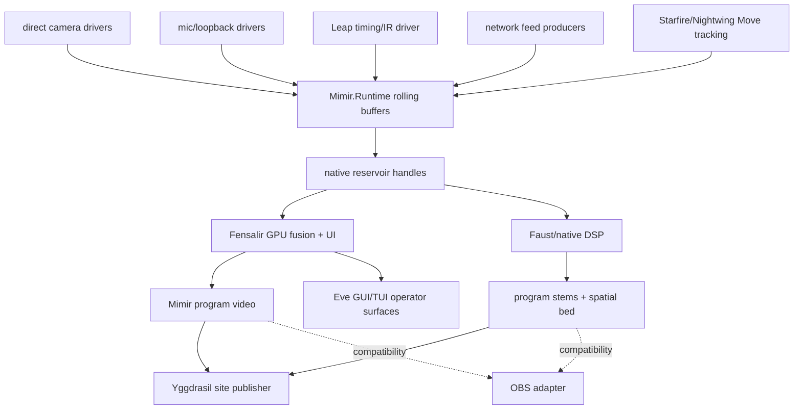
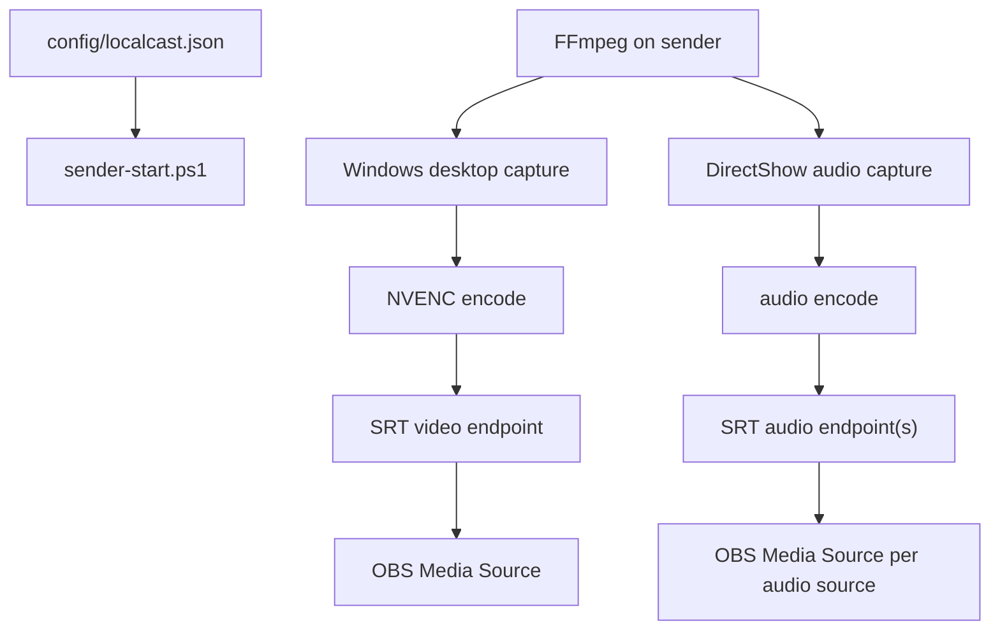
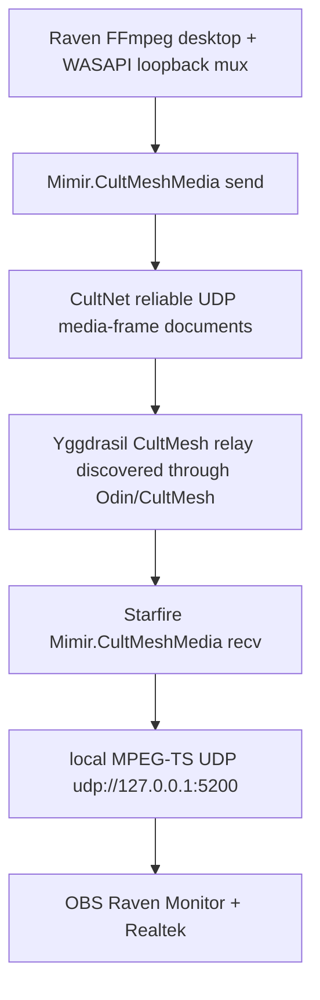

# Current System Map

Source-level code ownership is mapped in [[docs/code-algorithm-map|Code Algorithm Map]].
The indexed problem-domain map is
[[docs/perfect-machine-domain-index|Perfect Machine Domain Index]]; the
current architecture/optimization/sample-code study lives under
`research/perfect-machine-study-2026-05-23/`.

Mimir is the public Face and product name for this repo. A few lower native ABI
names still use `localcast` until a deliberate rename cut exists.

The live target is the native rolling field machine described in
[[docs/native-rebuild-plan|Native Rebuild Plan]],
[[docs/perfect-machine|Perfect Machine]], and
`config/perfect-machine.example.json`.

## Perfect Machine Target

Ownership:

- Mimir owns configuration, calibration truth, launch, status, persistence, and
  runtime contracts.
- Mimir is a CultMesh app: typed state surfaces for codebooks, schedules,
  calibration receipts, path response, and offload work must be mesh-syncable so
  phones, microcontrollers, Raven, and Starfire can participate without
  becoming independent clock authorities.
- `Mimir.Runtime` owns app-level stream buffers and synchronization.
- Native capture workers own device reads.
- Move tracking observations are stream samples, not program controls. Muninn
  daemons on Starfire and Nightwing publish source-local optical marker
  candidates plus controller/IMU/button state for USB-attached Moves. Odin owns
  discovery/schema projection for those streams. Mimir owns calibration,
  association, triangulation, IMU fusion, prediction, and the resolved
  Fensalir-facing wand pose stream.
- Mimir owns program composition, source subscription policy, preview/control
  state, stats, and publication intent.
- Mimir's old Eve dashboard broker is archived; it does not publish health,
  provider catalogs, or command surfaces while the socket path is cut. The
  browser reference remains a client lowering, not daemon truth. Dashboard state
  must return as typed CultMesh/Eve documents through Odin; product/debug render
  surfaces are client lowerings and compatibility evidence, not daemon truth.
- Fensalir owns dense visual fusion, material/brush/splat reconciliation,
  D3D12 interop, runtime UI lowering, and local program texture output.
- Faust/native DSP owns hot audio alignment, suppression, separation,
  spatialization, and stem generation.
- Eve GUI/TUI lowerers render Mimir's operator surfaces on any device without
  owning scene truth.
- The Yggdrasil-facing publisher daemon consumes Mimir program output and
  publishes it to the site without owning composition.
- OBS is a temporary compatibility sink, not a composition or broadcast
  authority.

Invariant: the live window is bounded, in memory, and has one timing authority.
No private history outlives the rolling buffer.

## Viable Stream App

[[docs/viable-stream-app|Viable Stream App]] defines the near-term app target.
Fensalir hosts the running Mimir app, keeps the default five-second runtime in
memory, exposes debug/settings/output controls, and emits synchronized Mimir
program video plus separately controllable audio stems.

`Mimir.Runtime` currently provides:

- `MimirSynchronizationHub`;
- `MimirRollingStreamBuffer`;
- stream descriptors/settings;
- `IMimirStreamSource`;
- `MimirNativeIngestStreamSource`;
- `MimirProcessStreamSource`;
- `MimirFrameEventProcessStreamSource`;
- `MimirVideoFrameDescriptor`;
- `MimirTrackingObservation`;
- `MimirAudioSynchronizationAnalyzer`;
- `IMimirVideoCaptureDriver`;
- `MimirVideoCaptureDriverSource`.

Process-backed sources are bridge/network edges. Local cameras should feed
native descriptors with device timestamps and optional native/GPU handles.
The `frame-events`/`json-lines` adapter is a diagnostic witness only: native
probes can emit per-frame JSON metadata so Fensalir sees real sensor cadence in
the rolling buffers while the direct ABI driver is being cut. It does not carry
pixels and does not own the final six-camera hot path. Multi-camera probes are
one process with declared accepted source ids, not one process per camera.

## Move Tracking

Starfire and Nightwing both have PS Move controllers directly attached over
USB. Muninn represents what each local body can honestly observe:
`muninn.move_marker_candidate.v1` for glowing orb candidates from cameras and
`muninn.move_controller_state.v1` for controller/IMU/button/battery state from
USB-attached Moves. Mimir drinks those feeds into `MimirStreamKind.Tracking`
buffers, admits them into the native `move_evidence` reservoir view as
compute-upload buffers, and publishes resolved `mimir.move_controller_pose.v1`
documents for Fensalir interaction once calibration and fusion have earned a
pose.

Authority:

- Starfire-local Move evidence is published by Muninn/Mimir local producers as
  typed observation streams.
- Nightwing Move evidence is emitted by Muninn on Nightwing over the typed
  observation path.
- Structured PS Move light pulses are Muninn output commands. Mimir requests
  them by sending `muninn.move_light_command.v1` over CultNet/CultMesh to the
  Muninn daemon on the host with the USB-attached Move; Mimir does not write
  remote HID directly except through temporary smoke scripts used to prove
  hardware behavior before Muninn is available on that host.
- Odin discovers and projects the stream/schema surface for operator and agent
  access.
- Mimir owns subscription, rolling retention, native Move evidence buffer
  layout, clock alignment, calibration, controller association, triangulation,
  IMU fusion, prediction, and resolved wand pose publication. OBS and
  dashboard summaries do not own this state.
- Fensalir consumes Mimir's resolved Move controller poses as interactive input
  for environments; it does not synthesize controller truth from raw Muninn
  evidence.

Smoke proof: `dotnet run --project .\src\Mimir.BufferSmoke\Mimir.BufferSmoke.csproj
-- --move-tracking-contract-smoke` consumes one Starfire Move and one Nightwing
Move observation into two tracking buffers.

Calibration preflight proof: `dotnet run --project
.\src\Mimir.BufferSmoke\Mimir.BufferSmoke.csproj --
--move-calibration-protocol-smoke --output
artifacts\move-calibration\protocol.cc` writes
`mimir.move_calibration_protocol.v1` for
`mimir-move-calibration-starfire-nightwing-v1`. The protocol requires
`muninn:starfire:move-evidence`, `muninn:nightwing:move-evidence`, and
`mimir:starfire:move-controller-poses`; optionally drinks Quest headset and
left/right controller poses over USB as an external VR reference; and requires
Mimir to derive rig calibration, IMU calibration, controller identity mapping,
and a calibration receipt before orientation can stop being
`orientation:imu-unresolved`.

Quest USB access belongs to Muninn, not Mimir. Starfire Muninn runs with
`--quest-adb --quest-serial 1WMHHB68PG1515` and publishes
`muninn.quest_access.v1`, including stream ids for Quest input, Quest poses, and
warp-corrected video input from Brokkr/Unity. On 2026-06-12, `adb devices -l`
reported authorized Quest 2 device `1WMHHB68PG1515` with product/device
`hollywood`. This proves Starfire can query the headset over USB; it does not
provide Quest headset/controller poses until a Quest/OpenXR witness bridge
publishes those pose samples through Muninn.

The old Nightwing bring-up path is archived:
`scripts/start-nightwing-move-tracking.ps1`, `Mimir.EveSensorReceiver`,
`Mimir.VerseRecorder`, and `nightwing_typed_witness_publisher.py` now fail
closed. Runtime structured light commands belong to Muninn. Eye/Move
observations must enter through typed CultMesh stream frames or
Odin-discovered CultMesh documents; they are optical witness evidence for the
later pose/fusion owner, not the final 6DoF pose authority.

Starfire-local Move illumination smoke uses `scripts/start-starfire-move-light.ps1`.
That launcher runs `Mimir.PsMoveProbe` against the local Windows HID col01
output collection and refreshes the PS Move LED report for hardware proof when
Muninn is not available on Starfire yet.

Starfire should have Muninn for source-local Move HID control and local sensor
publication. Some older Starfire audio/video paths still enter Mimir through
local Mimir producers or diagnostic process bridges while direct native drivers
mature. Same-host Move evidence and pose frames are CultMesh shared-memory byte
rings. Remote media is different: the current Raven media body bridge uses
CultNet/CultMesh documents over the mesh and lowers to local UDP for OBS
compatibility, so it is not same-machine zero-copy into Mimir/Fensalir yet.

Odin's Muninn organ owns the Move optical extraction stage for sensor stream
exposure. Its Rust crate lives in `E:\Projects\Odin\crates\muninn-move-tracker`
and publishes/feeds `muninn.move_marker_candidate.v1` records. Mimir consumes
those Muninn candidate streams into tracking buffers; it does not own raw
optical extraction. Mimir is now the explicit owner for stereo triangulation,
camera calibration, controller association, IMU fusion, prediction, and final
6DoF wand pose.
Muninn's `muninn:nightwing:move-evidence:<sequence>` shared-memory frame now
uses the canonical `muninn.move_marker_candidate.v1` document shape for optical
markers instead of a placeholder empty slice. A daemon unit proves that a bright
Y8 frame run through `muninn-move-tracker` serializes a non-empty marker
candidate into the Mimir-compatible evidence frame. The daemon now has a
source-local Y8 extraction/publish seam plus a first `serve` camera producer:
`--move-marker-camera <camera-id>=<device-path>` polls a Unix V4L2 YUYV frame,
converts it to compact Y8, and feeds that same seam. Nightwing hardware now
runs as one Muninn provider with two private per-eye PSMoveAPI subprocesses.
The parent alone owns lights, identity, commands, provider advertisement,
persistence, and the aggregate evidence stream; children exchange hue state
and camera-tagged observations over bounded MessagePack pipes.
`muninn.move_tracker_health.v1` exposes each worker's camera backend,
calibration, update/observation counters, RGB range, and expected-hue pixel
evidence. Live exposure is 0.3 for `nightwing-eye-0` and 0.1 for
`nightwing-eye-1`. Both eyes calibrate all four Moves and produce observations.
Muninn's dedicated evidence aggregator now owns sequence and transport outside
the 15-second CultCache telemetry loop. Cached controller state is bundled into
fresh optical frames but cannot create frames by itself, and a deadline clock
caps publication at the configured camera cadence. A 2026-07-13 Mimir field
window received 622 unique frames in 15 seconds, 2,647 observations, and 1,384
same-ID cross-camera correspondences while seeing all four stable Move IDs from
both eyes. The same parent PID survived the run; transport health reported
5,302 produced frames, 5,301 handoffs, 771 sends, and zero local-ring
admissions. Full stereo calibration is still not implied: intrinsics and
spatially diverse correspondences must earn the camera matrices.
`MimirMoveProofSurface` is the first Fensalir-visible proof surface for this
chain. It consumes the Mimir admission receipt and the Mimir-owned pose stream
frame, emits `mimir.move_proof_surface.v1`, and lowers an observer-only
`AquariumSplineFrame` probe with the explicit
`muninn:nightwing:move-evidence:<sequence> -> mimir:starfire:move-evidence:<sequence> -> mimir:starfire:move-pose:<sequence> -> fensalir:starfire:presented-frame:<sequence>`
chain. It does not decide pose. Single-ray fallback remains a visible
non-final verdict until calibrated multi-camera optical evidence earns full
pose.
`MimirMoveProofPipeline` is now the reusable commit primitive for that chain:
from one Muninn CultMesh shared-memory frame it performs native admission,
Mimir fusion, pose-frame creation, proof-surface creation, and Fensalir probe
lowering. Live Nightwing/Starfire wiring should call this owner path rather
than preserving separate manual actions and programmatic proof paths.
`MimirRuntime` now owns the actual Fensalir presentation attachment for the
proof surface: `PublishMoveProofSurface` stores the latest Mimir-owned
`mimir.move_proof_surface.v1`, and `CreateFrame` merges its observer-only
`move-proof-*` probe splines into `AquariumFrame.Scene.SplineFrame` beside the
audio spectrum preview. Fensalir renders this frame; it still does not decide
proof.
`MimirMoveProofRuntimeDriver` is the runtime bridge from a Muninn CultMesh
shared-memory evidence ring into that attachment point. It derives the
Mimir evidence, Mimir pose, and Fensalir frame ids from the actual Muninn frame
suffix, calls `MimirMoveProofPipeline`, suppresses duplicate frame admission,
and lets `MimirRuntime.Update` publish the resulting proof surface. This proves
the runtime-owned path for a ring frame; real Nightwing hardware and calibrated
camera witnesses are still the missing field proof.
`MimirMoveProofRuntimeConfiguration` is the typed selection and validation
surface for that bridge. An enabled source must name the Muninn evidence stream,
native reservoir path, Mimir evidence/pose frame prefixes, Fensalir
presented-frame prefix, fusion authority, consumer contract, and at least two
calibrated camera witnesses. It may create a runtime driver only when the
supplied CultMesh ring stream id matches the configured evidence stream.
`MimirRuntime` now owns activation for configured proof sources: on scene-ready
it asks an `IMimirMoveProofEvidenceRingProvider` for the evidence ring, opens
the configured native reservoir, registers the runtime driver, retains the
driver resources, and exposes an activation status. The default provider fails
explicitly because the current C# CultMesh ring is still in-process only;
`Mimir.BufferSmoke --move-proof-runtime-activation-smoke` injects an in-process
provider to prove the activation path without claiming live Nightwing field
evidence.
`mimir.move_proof_runtime_activation.v1` is the typed readiness/proof-spine
surface for configured Move proof sources. It reports the configured evidence
stream, provider kind, active/driver state, native reservoir path, calibrated
camera ids, latest same-stream proof ids, latest verdict, and the inactive
diagnostic when the default runtime lacks a live cross-process CultMesh ring
opener. `Mimir.BufferSmoke --move-proof-runtime-activation-surface-smoke`
proves both the active injected-ring document and the unavailable default
document; this is readiness/proof observation, not field evidence.
`mimir.move_proof_evidence_frame_snapshot.v1` is a one-copy, explicitly
non-final fallback for captured Muninn evidence frames while C# CultMesh lacks
a cross-process shared-memory opener. When `EvidenceSnapshotPath` is
configured, `MimirConfiguredMoveProofEvidenceRingProvider` validates snapshot
metadata against the encoded Muninn frame payload, publishes the payload into
an owned in-process ring, and then delegates to the same runtime proof driver
and pipeline. `Mimir.BufferSmoke --move-proof-runtime-snapshot-smoke` proves
the same named proof spine through that file boundary. This can support field
capture/replay, but live proof still requires the real Nightwing/Starfire ring
or CultMesh page producer.
Odin/Muninn can now write that artifact from the producer side with
`--move-evidence-snapshot <path>`. The snapshot is written by the same Muninn
Move evidence publisher that owns controller/marker frames, after the frame
payload is accepted by the stream ring. Its unit coverage decodes the
`mimir.move_proof_evidence_frame_snapshot.v1` tuple and re-decodes the embedded
Muninn payload, proving the artifact is shaped for Mimir's snapshot provider.
This is still one-copy field capture/replay; it does not replace the live ring
or a CultCache page body producer.
`MimirMoveProofDevSurface` is a dev-only bootstrap gated by
`MIMIR_MOVE_PROOF_DEV_SURFACE`. It publishes a synthetic calibrated proof
surface through the same `MimirRuntime.PublishMoveProofSurface` attachment so
`Mimir.BufferSmoke --move-proof-presented-frame-smoke` can run `Mimir.App`
headless, capture the actual Fensalir-presented PNG, and pixel-check that the
named proof probe is visible. This is a renderer/probe proof, not live hardware
evidence.

## Program Composition

[[docs/mimir-program-composition|Mimir Program Composition]] is the live
authority map for stream-program output. Muninn runs on Starfire, Nightwing, and
Raven-class capture hosts to publish local stream capabilities and selected
media bodies. Mimir consumes only the streams it needs for calibration and
composition, commits one typed scene graph, emits Eve GUI/TUI operator surfaces,
and publishes program output locally plus through a Yggdrasil-facing site
publisher.

The first typed program contracts live in `src/Mimir.Runtime/Synchronization`:

- `mimir.program_scene.v1`
- `mimir.program_output.v1`
- `mimir.eve_operator_surface.v1`

OBS scene JSON is import/mirror evidence for the initial crop/key/transform
layout. It is not the editor of record after Mimir owns the scene graph.
The current imported local scene state lives at
`state/mimir-program-composition.cc`.

## OBS Bridge Utility

The bridge is useful because it is inspectable and already speaks OBS. It does
not become the synchronized program authority.

## CultMesh Media Bridge

Owner: `src/Mimir.CultMeshMedia` owns the live Raven-to-Starfire media body
bridge over CultMesh/CultNet. FFmpeg still owns Raven capture and encoding.
Mimir owns composition. OBS may consume the Starfire-local MPEG-TS endpoint as a
compatibility sink while Mimir/Fensalir program output and site publication
mature.

Invariant: Raven media body state is live and bounded. Sender writes rolling
`mimir.cultmesh_media_frame` slot documents rather than an unbounded durable
video archive. Yggdrasil relays CultNet reliable UDP behind the logical
`cultmesh://asgard.yggdrasil.mimir/media/raven-primary-av` route discovered
through Odin/CultMesh. Starfire lowers the subscribed stream to local UDP for
compatibility sinks because OBS is not a CultMesh runtime.

Source audit correction resolved: `Mimir.CultMeshMedia` now uses explicit
CultLib RUDP helpers for the sender/receiver and a relay-owned RUDP
socket/session loop for multi-peer forwarding. The older
`CultMesh.StartNodeAsync` and `CultMesh.ConnectClient` path no longer owns this
media lane. The relay still persists received puts to CultCache as evidence and
for inspection; live network transit is the RUDP schema-document path.

Current deployment: Yggdrasil runs the relay from
`/opt/gamecult/mimir-cultmesh-media/Mimir.CultMeshMedia` with cache
`/var/lib/gamecult/mimir/cultmesh-media.cc` and log
`/var/log/gamecult/mimir-cultmesh-media.log`. Senders and receivers target
`cultmesh://asgard.yggdrasil.mimir/media/raven-primary-av`; concrete RUDP
bootstrap lives in the CultMesh resolver environment, not in daemon launch
arguments. Starfire writes `raven-primary-av` to `udp://127.0.0.1:5200`. OBS
source `Raven Monitor + Realtek` points at that local UDP endpoint.

`scripts/start-raven-cultmesh-av-sender.ps1` is the Mimir-owned CultMesh bridge
bootstrap for Raven media-body transit. It is not the actual Muninn OBS feed
owner. The real Raven OBS/SRT feed owner is Odin's Muninn:
`E:\Projects\Odin\scripts\activate-muninn-raven-av-srt.ps1` drives the
existing `GameCult-Muninn-Activate` hidden task and `muninn.exe activate`
body on Raven, and `scripts/start-raven-muninn-obs-feed.ps1` in this repo is
the thin local wrapper for that actuator. Keep `-LocalBootstrap` on the
CultMesh sender only as a staging/bootstrap edge when the separate body-bridge
lane needs direct local proof.

## Daemon Health And Idunn

Odin owns the accepted Verse/service map. Idunn owns continuity after a daemon
is known: boot recovery, crash recovery, deployment freshness, stale-health
watching, restart/deploy intent, and operator escalation. Mimir does not run a
private lifecycle supervisor for these surfaces.

CultLib's current direction is RUDP everywhere for typed CultNet/CultMesh
documents across runtimes. That means health, provider advertisements, command
boundaries, transport profiles, and selected program/media document lanes should
default to `cultnet.transport.rudp.v0`. Product/debug render surfaces are
lowerings, debug tools, or migration debt; they must not own daemon truth once
an RUDP contract exists.

Mimir's current daemon-health publishers are local RUDP witnesses:

- `src/Mimir.EveDashboard` is a fail-closed archive tombstone. It no longer
  starts a TCP listener, serves `/eve/deck`, accepts WebSocket commands, or
  publishes daemon health. `mimir.eve_dashboard_state` must return through Odin/
  CultMesh state publication before this service can be redeployed.
- `src/Mimir.EveBrowserReference` serves a static browser lowering and, when
  configured with `--idunn-rudp-health` or
  `MIMIR_EVE_BROWSER_REFERENCE_IDUNN_RUDP_HEALTH`, sends its own
  `idunn.daemon_health` record over the same RUDP document path.

Invariant: health publication is not ownership. The daemon reports what it can
honestly observe about itself; Idunn decides keepalive action through the
shared typed record path.

Source audit cut: `Mimir.EveSensorReceiver`, `Mimir.VerseRecorder`, the
Nightwing typed witness publisher, and `start-nightwing-move-tracking.ps1` are
archived. The old Nightwing/EVE witness lane no longer opens a renderer/client
subscription surface. Witness publication and recording must use typed
CultMesh/CultNet documents or CultMesh stream frames discovered through Odin.
The media-frame bridge is already on that side of the line.

## Audio Field

The six-microphone path is separate from the bridge. Scarlett speaker loopback
is the current timing authority when active calibration is playing, but Scarlett
production capture belongs on ASIO rather than WASAPI shared mode.
`MimirBioacousticTimeline` owns the active runtime watermark described in
[[docs/bioacoustic-timeline-watermark|Bioacoustic Timeline Watermark]]: a
low-gain birdsong-like word language with 128 self-identifying word positions,
left-speaker and right-speaker variants, four formant-rich syllables per word,
rhythm variation, and direct word identity. Any correctly decoded word identifies
the event index inside the current operating horizon. Mimir queues the left
vocabulary to the left speaker and the right vocabulary to the right speaker
through Fensalir audio, then decodes timing as `bioacoustic` evidence.
`MimirAudioSynchronizationSettings.Mode` chooses whether active calibration is
allowed: `chirp-only` emits the active bioacoustic witness, `passive` stays silent
and uses program-audio phase correlation, and `hybrid` uses passive evidence by
default while emitting active pilot chunks only when passive confidence is weak.
Active decoding does not inherit the passive two-second analysis floor: passive
still needs a longer program-audio window, while the bioacoustic witness can
decode once at least one self-identifying song word is present. The active
decoder is a song-contour anchor machine, not a de Bruijn sequence receiver:
one call carries enough contour, syllable timing, formant, payload, rhythm, and
speaker-tint evidence to identify canonical time inside the operating horizon
and pin multiple time/frequency anchors at once. The bioacoustic detector now
uses bounded motif proposals, matched motif scoring, direct word anchors,
source clock fitting, and fractional waveform refinement.
Pairwise sync compares matched anchors first, then only accepts independent
clock-fit offsets inside the live latency horizon so period aliases do not
become absurd reports. The old chirp-bin detector remains as a
calibration/reference artifact: it carries the full dechirped bin-energy surface
and aggregates decodes into a `MimirChirpBinCalibrationModel` with measured
usable bands, expected-symbol versus observed-bin confusion observations,
timing residuals, delay hypotheses, phase summaries, and an adaptive codebook
plan. The analyzer keeps raw profiles even when no timing report is accepted,
so physical mic failures can still guide bioacoustic motif weighting. Reports/states
expose `delayUs` next to fractional sample delay.
`Mimir.BufferSmoke --bioacoustic-self-test` proves direct word anchors.
`--standalone-bioacoustic-self-test --sample-rate 48000 --delay-samples 1269.5`
proves a receiver with only codebook/schedule state can recover delayed source
time to below printed microsecond precision. `--chirp-only-sync-self-test
--sample-rate 48000` recovers a 317.375-sample synthetic delay with printed
0.000 us error using `evidence=bioacoustic`.
`--bioacoustic-train` is now the receipt-backed tuning harness: it runs
multiple indexed cepstral decoder hypotheses across mel-cepstral warp/blur
degradations and writes typed CultCache results plus pre-warp, post-warp, and
reconstructed-from-detections WAV artifacts. The latest local receipt under
`artifacts/bioacoustic-training/bioacoustic-20260524-103438/` shows identity
survives many degradations, but timing still fails under warped domains, so the
next receiver cut is a global delay/clock/path hypothesis over detected words.
Reports now carry fractional delay and per-band matched energy. The older
`MimirChirpletSymbolCodebook` / `MimirChirpletStreamDecoder` path remains a
diagnostic reference for constrained chirplet-transform work. The active
receiver is the bioacoustic motif timeline; the analyzer only emits active
timing reports from matched canonical anchors. The hub also owns cached reports
plus smoothed per-source sync state with delay-slope/SRO in ppm.
`MimirRuntime` runs analysis
online as a bounded rotating service and can print live telemetry with
`MIMIR_SYNC_TELEMETRY_SECONDS`. UI and telemetry are passive readers of cached
sync state; they must not invoke the analyzer. Current app testing proves
loopback wakeup, live mic buffers, and confident online sync states, but the
next proof is stable canonical anchors through real mic streams. Camera mics are
spatial/context witnesses; Focusrite devices are dialogue anchors. Fractional
delay and the hot resampler belong in Faust/native DSP.

The WASAPI cadence probe is now a format/state diagnostic: it can request
shared or exclusive sample rates, bit depths, channel counts, and float/PCM
formats, then report the selected or closest format. The Focusrite driver stack
is now installed and registers `Focusrite USB ASIO`. The Scarlett Solo 4th Gen
is attached to Starfire and exposes 4 ASIO inputs / 2 outputs: `Input 1`,
`Input 2`, `Loopback 1`, and `Loopback 2`. `native/probes/asio_audio_cadence`
can instantiate that driver, verify 44.1-192 kHz support, and capture nonzero
4-channel `Int32LSB` callbacks at 192 kHz with 192-frame preferred buffers. The
runtime analyzer accepts Float32, Int16, Int24, and Int32 PCM windows so
ASIO/native capture can preserve the interface format. Raven also has a
loopback-capable Scarlett ASIO path at 192 kHz for co-streamer/game timing
evidence; Starfire still owns the heavy soundfield and sensor-fusion work.
The ASIO probe can now play raw mono Float32 timeline audio through the
Focusrite outputs while capturing every ASIO input as raw interleaved Float32.
`Mimir.BufferSmoke --analyze-asio-f32` feeds those captured channels into the
same runtime analyzer. `--calibrate-chirp-bin-asio-f32` computes and persists
the response/confusion/delay model per output/mic path, and
`--analyze-asio-f32 --calibration ...` loads it into the chirp-bin reference
decoder.
`native/asio_capture` and `MimirAsioStreamSource` are now the runtime Scarlett
path: Focusrite ASIO callbacks feed sample-bearing 192 kHz Float32 blocks into
`Mimir.Runtime` in process, without the diagnostic JSON/stdout bridge. The
minimal `config/mimir-runtime.asio.example.json` proof ingested more than
12,000 sample-bearing 192 kHz blocks across `asio-ch0` through `asio-ch3` in
two seconds and retained 2,048 blocks per channel, all from the same ASIO
callback stream. A real
192 kHz chirp-bin Scarlett artifact decoded
`Loopback 1 -> Loopback 2` at exactly `0.000 us` with 12 matched anchors and
0.999 confidence. The same analyzer now prints calibration profiles for
decoded sources. Physical input 1 still fails pairwise timing in the stored
artifact, but it leaves a concrete response profile: 14 frames, 12 anchors,
0.865 clock confidence, and strongest bins around 4525, 4075, and 7225 Hz.
Acoustic robustness is now the open problem, not clean loopback timing,
standalone decoder shape, or basic response evidence.
`Mimir.BufferSmoke --calibrate-contestant-asio-f32` now owns the active
packet-song physical calibration receipt. It runs the canary packet decoder
against interleaved ASIO Float32 captures, performs a fast per-channel global
delay hypothesis search, then tight scheduled packet scoring with sub-sample
refinement. The latest persisted model at
`calibration/bioacoustic/scarlett-canary-packet-192k-rerun.json` ran at 10.7x
realtime across four 192 kHz channels and records per-channel polarity,
schedule offset, payload reliability, gain, response-normalization bands, and
pairwise propagation delay. Current physical precision is loopback 2.524 us
MAE, co-streamer shotgun 58.785 us MAE, and cardioid 90.558 us MAE; do not
claim physical microsecond sync until those mic MAEs collapse by another order
of magnitude.
A fresh 192 kHz room run after the song-contour authority cut is persisted at
`calibration/bioacoustic/scarlett-canary-packet-192k-contour-fresh.json`.
It clears the 10x realtime budget, keeps loopback at 2.524 us MAE, improves the
co-streamer shotgun to 37/37 payload with 34.083 us MAE, and improves the
cardioid event count to 31/37 while still measuring 92.996 us MAE. The next
precision cut must extract intra-call contour anchors, not only one offset per
packet word.
The first anchor-rich canary packet is persisted at
`calibration/bioacoustic/scarlett-canary-packet-anchor-rich-192k.json`.
It adds timing chips, formant pivots, harmonic-envelope notches, payload
ornaments, renderer-level template caching, and per-event intra-call anchor
measurements. It clears 10x realtime and improves loopback to about 2.23 us
MAE, but physical mics do not improve yet: shotgun is 36/37 payload at
56.365 us MAE and cardioid is 27/37 payload at 101.522 us MAE. Treat this as
anchor observability, not a finished anchor geometry. The next cut should learn
which anchor kinds survive each acoustic path and weight or reshape them.
Path-level loopback truth is now part of the calibration receipt: candidate mic
anchors are matched against loopback anchors, then event-local waveform
correlation against the captured loopback packet refines path delay. On the
stored anchor-rich capture this improves physical path precision to 7.576 us
for the cardioid and 6.578 us for the shotgun while Release runs at 21.1x
realtime. A fresh capture at
`calibration/bioacoustic/scarlett-canary-packet-anchor-rich-latest-192k.json`
keeps the shotgun around 5.916 us but worsens the cardioid to 18.930 us. The
rejected razor timing-chip mutation made the mics worse and should not be
revived without a better hypothesis. The remaining gap to one microsecond is
phase/group-delay correction or a more survivable direct-path anchor family.
A naive recursive waveform phase-lock pass was also rejected: it improved one
cardioid receipt but worsened the shotgun and locked a fresh cardioid run onto
a later reflection lobe. Recursive refinement remains a good architecture only
after the path model can distinguish direct arrival, phase/group delay, and room
reflection energy. The follow-up sonar/DSP research note at
`research/sonar-dsp-recursive-refinement-2026-05-25.md` maps that correction:
use complex matched filters, phase-slope/group-delay fitting, acquisition versus
tracking loop bandwidths, and sparse multipath residuals before attempting
another recursive fitter.
The first implementation slice now exists in
`MimirComplexContourMatchedFilterBank` and `MimirDirectPathTracker`: known
canary packet anchors become complex matched-filter responses with multiple
candidate lobes, then the tracker uses the current path prediction as authority,
selects the coherent direct-path cluster inside that gate, and reports later
clusters as reflection taps. Synthetic 192 kHz reflection smoke currently lands
about 5.249 us from the expected delay; stored Scarlett shotgun runs land within
about 5.860 us and 7.247 us of the seeded path fits, while cardioid runs land
within about 15.817 us and 8.963 us. This is the correct receiver shape, but
not yet the final phase/group-delay channel model. The tracker now emits
per-band delay/phase residual observations and has a
`MimirDirectPathChannelModel` correction surface for later multi-window
calibration; one-window self-correction is not allowed to become authority.
`calibration/bioacoustic/complex-contour-replay-panel.json` is the current
persisted receipt for this surface across stored/fresh shotgun/cardioid cases.
`MimirDirectPathChannelModel` now applies learned per-band delay and phase
correction when explicitly supplied, and downweights bands outside the learned
usable surface. `Mimir.BufferSmoke --learn-complex-contour-channel-model`
persists the current path-scoped model at
`calibration/bioacoustic/complex-contour-channel-model.json`; it learns three
usable cardioid bands and six usable shotgun bands from the four-case replay
receipt. `--evaluate-complex-contour-channel-model` writes
`calibration/bioacoustic/complex-contour-channel-model-evaluation.json`: the
model improves 3/4 absolute path-seed errors and lowers mean cluster MAE, with
the fresh cardioid reaching about 0.202 us from the seed, but the stored
cardioid still worsens to about 17.476 us. Treat the model as explicit
calibration evidence, not default runtime authority, until more captures prove
the path surface stable.
The complex contour receiver now has a live runtime lane instead of living only
inside BufferSmoke artifact replay. When `enableComplexContourRuntime` is true,
`MimirRuntime` emits the configured `bioacousticWitnessProfileId` through
`MimirBioacousticContestantRenderer`, `MimirSynchronizationHub` loads
`complexContourChannelModelPath`, and `MimirComplexContourRuntimeAnalyzer`
extracts Float32 windows from rolling audio buffers to publish
`evidence=complex-contour` reports. The synthetic runtime-shaped proof
`--complex-contour-runtime-self-test` at 192 kHz recovers a 693.5-sample delay
with about 0.219 us error from rolling buffers. The next real-world proof is to
run that lane through live Scarlett loopback and mics, not only stored ASIO
artifacts.
That real-world proof now has a first receipt:
`calibration/bioacoustic/complex-contour-live-20260525-063229.md`. A freshly
rendered canary-packet witness was played through Focusrite ASIO and captured
from all four 192 kHz Scarlett inputs. Loopback 1 to Loopback 2 measured
-0.014 us, the shotgun path landed -3.984 us from its prior path seed, and the
cardioid path landed +1.547 us from its prior path seed with the current
channel model loaded. This proves the contour/channel-model path survives a
fresh DAC/speaker/room/mic/ADC pass, but low physical confidence means the next
cut is stronger direct-path confidence and independently measured path truth,
not a victory lap.
The first actuator proof now exists: `faust/mimir_alignment_actuator.dsp` owns
six channels of bounded fractional delay/gain controls for Faust/native DSP,
and `Mimir.BufferSmoke --bioacoustic-actuator-self-test --sample-rate 48000
--delay-samples 317.375` proves the control loop shape by estimating a
bioacoustic delay, applying fractional correction, and remeasuring residual
below printed microsecond precision.

## Visual Fusion

Visual fusion belongs in Fensalir over current reservoir claims. Native capture
workers provide frames; Fensalir owns feature extraction, matching, material
fitting, render budgeting, and publication.

The live debug spectrum view now has two separate authorities:

- `AquariumBufferFieldFrame` is the real Fensalir contract. Mimir expresses
  each rolling audio spectrum window as a buffer-backed spline tube field:
  frequency lives in the spline domain, amplitude shapes the tube path, and
  appearance/probe policy can reference tangent, curvature, normal, derivative,
  object domain, and parent-space transforms. This is the surface the future
  compute lowering consumes.
- `AquariumSplineFrame` is only the immediate preview witness. It renders the
  same spectrum windows as camera-facing Catmull-Rom tube ribbons so humans can
  sanity-check ASIO loopback and mic buffers before the reservoir path owns the
  draw. It must not become the final visual authority.

The intended Fensalir lowering is buffer field expression -> compute-generated
stochastic SDF splat probes -> spatiotemporal splat reservoir -> reservoir
sampling for temporally antialiased surface contribution. Splat density is a
function of visual contribution, not uniform polyline tessellation.

## Known Risks

- Windows device names vary by driver and localization.
- Some FFmpeg builds omit SRT or NVENC.
- Separate bridge endpoints can drift.
- OBS SRT reconnection behavior can be fussy.
- Direct driver work must prove sustained cadence before it becomes timing
  authority.
- PS3 Eye audio endpoints are enumeration/runtime-fragile. A later replug made
  both mic buffers emit 480-frame WASAPI blocks again while both PS3 Eye camera
  buffers were live.
