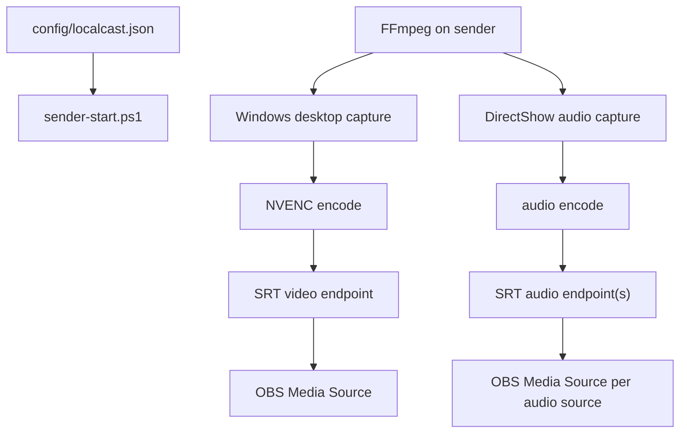

# Current System Map

Source-level code ownership is mapped in [[docs/code-algorithm-map|Code Algorithm Map]].
The indexed problem-domain map is
[[docs/perfect-machine-domain-index|Perfect Machine Domain Index]]; the
current architecture/optimization/sample-code study lives under
`research/perfect-machine-study-2026-05-23/`.

Mimir is the public Face and product name for this repo. A few lower native ABI
names still use `localcast` until a deliberate rename cut exists.

The live target is the native rolling field machine described in
[[docs/native-rebuild-plan|Native Rebuild Plan]],
[[docs/perfect-machine|Perfect Machine]], and
`config/perfect-machine.example.json`.

## Perfect Machine Target

Ownership:

- Mimir owns configuration, calibration truth, launch, status, persistence, and
  runtime contracts.
- `Mimir.Runtime` owns app-level stream buffers and synchronization.
- Native capture workers own device reads.
- Fensalir owns dense visual fusion, material/brush/splat reconciliation,
  D3D12 interop, runtime UI, and Spout2 publication.
- Faust/native DSP owns hot audio alignment, suppression, separation,
  spatialization, and stem generation.
- OBS owns broadcast controls.

Invariant: the live window is bounded, in memory, and has one timing authority.
No private history outlives the rolling buffer.

## Viable Stream App

[[docs/viable-stream-app|Viable Stream App]] defines the near-term app target.
Fensalir hosts the running Mimir app, keeps the default five-second runtime in
memory, exposes debug/settings/output controls, and emits synchronized OBS
program video plus separately controllable audio stems.

`Mimir.Runtime` currently provides:

- `MimirSynchronizationHub`;
- `MimirRollingStreamBuffer`;
- stream descriptors/settings;
- `IMimirStreamSource`;
- `MimirNativeIngestStreamSource`;
- `MimirProcessStreamSource`;
- `MimirFrameEventProcessStreamSource`;
- `MimirVideoFrameDescriptor`;
- `MimirAudioSynchronizationAnalyzer`;
- `IMimirVideoCaptureDriver`;
- `MimirVideoCaptureDriverSource`.

Process-backed sources are bridge/network edges. Local cameras should feed
native descriptors with device timestamps and optional native/GPU handles.
The `frame-events`/`json-lines` adapter is a diagnostic witness only: native
probes can emit per-frame JSON metadata so Fensalir sees real sensor cadence in
the rolling buffers while the direct ABI driver is being cut. It does not carry
pixels and does not own the final six-camera hot path. Multi-camera probes are
one process with declared accepted source ids, not one process per camera.

## OBS Bridge Utility

The bridge is useful because it is inspectable and already speaks OBS. It does
not become the synchronized program authority.

## Audio Field

The six-microphone path is separate from the bridge. Scarlett speaker loopback
is the current timing authority when calibration chirplets are playing, but
Scarlett production capture belongs on ASIO rather than WASAPI shared mode.
`MimirChirpletTimeline` owns the birdsong-like timeline fingerprint: an order-3
de Bruijn sequence over 32 time/frequency constellation symbols. Start band,
glide shape, duration, and following inter-chirp gap all carry code. Any three
consecutive correctly detected symbols identify the event index inside the
current operating horizon. Mimir continuously queues that timeline through
Fensalir audio and decodes timing through the constrained chirplet-transform
path.
`MimirAudioSynchronizationSettings.Mode` chooses whether active calibration is
allowed: `chirp-only` emits the active chirp-bin witness, `passive` stays silent
and uses program-audio phase correlation, and `hybrid` uses passive evidence by
default while emitting active pilot chunks only when passive confidence is weak.
Active decoding does not inherit the passive two-second analysis floor: passive
still needs a longer program-audio window, while the chirp-bin witness can decode
short pilot windows once at least a code-valid triplet is present. The chirp-bin
detector now uses cheap bounded energy/onset proposals, dechirp plus fixed
Goertzel bins, explicit time/frequency ambiguity candidates, and a constrained
scheduled-waveform correlation for standalone source-offset refinement. Pairwise
sync compares matched anchors first, then only accepts independent clock-fit
offsets inside the live latency horizon so period aliases do not become absurd
reports. Each classified chirp carries the full dechirped bin-energy surface,
and decodes aggregate that into a `MimirChirpBinCalibrationModel` with measured
usable bands, expected-symbol versus observed-bin confusion observations,
timing residuals, delay hypotheses, phase summaries, and an adaptive codebook
plan. The analyzer keeps raw profiles even when no timing report is accepted,
and the active decoder can consume a persisted model for learned response
weighting, phase-coherence weighting, first-order group-delay correction, and
joint global delay/bin-shift hypotheses. Runtime chirp-bin emission consumes the
same model's emission plan, so
the emitted timeline can use the measured reliable symbol set at a higher
de Bruijn order instead of continuing to spend code on dead bins. Reports/states
expose `delayUs` next to fractional sample delay.
`Mimir.BufferSmoke
--chirp-only-sync-self-test --sample-rate 192000` and `--hybrid-sync-self-test
--sample-rate 192000` both recover a 1269.5-sample synthetic delay with printed
0.000 us error. `--standalone-chirp-bin-self-test --sample-rate 192000
--delay-samples 96000` proves a receiver with only codebook/schedule state can
recover a 500 ms delayed stream to below printed microsecond precision.
Reports now carry fractional delay and per-band matched energy. The first
`MimirChirpletSymbolCodebook` owns separable symbol definitions; every symbol
has a unique chirp shape, with rhythm as additional evidence. `MimirChirpletStreamDecoder`
is the constrained chirplet-transform receiver: it turns a bounded PCM window
into transform frames with multiple phase-invariant symbol candidates and
refined per-candidate sample offsets, code-valid triplet anchors selected
through gap/clock coherence, and an affine source clock fit. The synthetic
`Mimir.BufferSmoke --chirplet-self-test` path renders canonical timeline audio
into memory and currently recovers events 0-12 with a 47999.999990 Hz clock fit
and 0.000014 sample MAE. The analyzer only emits timing reports from
matched canonical anchors. The hub also owns cached reports plus smoothed
per-source sync state with delay-slope/SRO in ppm. `MimirRuntime` runs analysis
online as a bounded rotating service and can print live telemetry with
`MIMIR_SYNC_TELEMETRY_SECONDS`. UI and telemetry are passive readers of cached
sync state; they must not invoke the analyzer. Current app testing proves
loopback wakeup, live mic buffers, and confident online sync states, but the
next proof is stable canonical anchors through real mic streams. Camera mics are
spatial/context witnesses; Focusrite devices are dialogue anchors. Fractional
delay and the hot resampler belong in Faust/native DSP.

The WASAPI cadence probe is now a format/state diagnostic: it can request
shared or exclusive sample rates, bit depths, channel counts, and float/PCM
formats, then report the selected or closest format. The Focusrite driver stack
is now installed and registers `Focusrite USB ASIO`. The Scarlett Solo 4th Gen
is attached to Starfire and exposes 4 ASIO inputs / 2 outputs: `Input 1`,
`Input 2`, `Loopback 1`, and `Loopback 2`. `native/probes/asio_audio_cadence`
can instantiate that driver, verify 44.1-192 kHz support, and capture nonzero
4-channel `Int32LSB` callbacks at 192 kHz with 192-frame preferred buffers. The
runtime analyzer accepts Float32, Int16, Int24, and Int32 PCM windows so
ASIO/native capture can preserve the interface format. Raven also has a
loopback-capable Scarlett ASIO path at 192 kHz for co-streamer/game timing
evidence; Starfire still owns the heavy soundfield and sensor-fusion work.
The ASIO probe can now play raw mono Float32 timeline audio through the
Focusrite outputs while capturing every ASIO input as raw interleaved Float32.
`Mimir.BufferSmoke --analyze-asio-f32` feeds those captured channels into the
same runtime active analyzer. `--calibrate-chirp-bin-asio-f32` computes and
persists the response/confusion/delay model per output/mic path, and
`--analyze-asio-f32 --calibration ...` loads it into the active decoder.
`native/asio_capture` and `MimirAsioStreamSource` are now the runtime Scarlett
path: Focusrite ASIO callbacks feed sample-bearing 192 kHz Float32 blocks into
`Mimir.Runtime` in process, without the diagnostic JSON/stdout bridge. The
minimal `config/mimir-runtime.asio.example.json` proof ingested more than
12,000 sample-bearing 192 kHz blocks across `asio-ch0` through `asio-ch3` in
two seconds and retained 2,048 blocks per channel, all from the same ASIO
callback stream. A real
192 kHz chirp-bin Scarlett artifact decoded
`Loopback 1 -> Loopback 2` at exactly `0.000 us` with 12 matched anchors and
0.999 confidence. The same analyzer now prints calibration profiles for
decoded sources. Physical input 1 still fails pairwise timing in the stored
artifact, but it leaves a concrete response profile: 14 frames, 12 anchors,
0.865 clock confidence, and strongest bins around 4525, 4075, and 7225 Hz.
Acoustic robustness is now the open problem, not clean loopback timing,
standalone decoder shape, or basic response evidence.

## Visual Fusion

Visual fusion belongs in Fensalir over current reservoir claims. Native capture
workers provide frames; Fensalir owns feature extraction, matching, material
fitting, render budgeting, and publication.

## Known Risks

- Windows device names vary by driver and localization.
- Some FFmpeg builds omit SRT or NVENC.
- Separate bridge endpoints can drift.
- OBS SRT reconnection behavior can be fussy.
- Direct driver work must prove sustained cadence before it becomes timing
  authority.
- PS3 Eye audio endpoints are enumeration/runtime-fragile. A later replug made
  both mic buffers emit 480-frame WASAPI blocks again while both PS3 Eye camera
  buffers were live.
