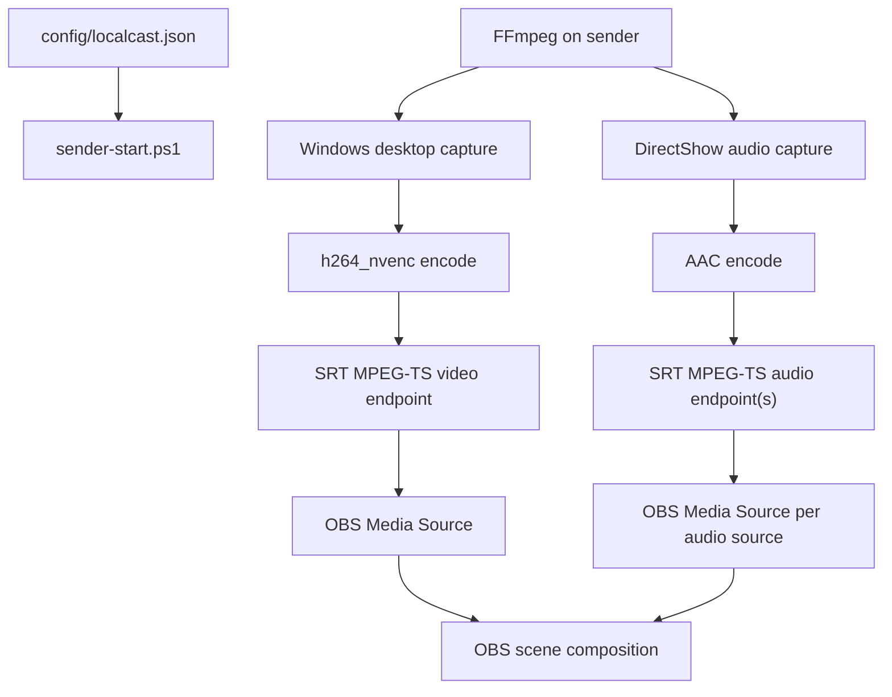
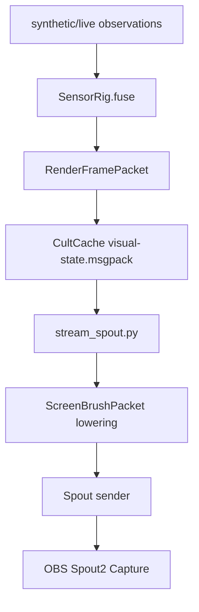
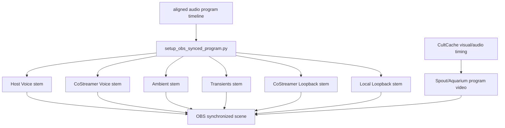

# Current System Map

LocalCastBridge is intentionally thin.

## Ownership

- Config owns source identity, receiver address, ports, and encoding knobs.
- FFmpeg owns capture, encoding, and network transport.
- OBS owns source activation, layout, filters, monitoring, and recording/streaming.
- This repo owns repeatability and memory.

## Why Not Plugin First

An OBS plugin would be justified if OBS could not ingest stable LAN streams, or if a plugin were needed to expose independent audio controls. V1 gets independent audio controls by making each source an OBS Media Source. That is boring. Boring is allowed to win when it is correct.

## Known Risks

- Windows audio source names vary by driver and localization.
- Some FFmpeg builds omit SRT or NVENC.
- Separate endpoints can drift; local latency should be tuned before adding a synchronization layer.
- OBS SRT reconnection behavior can be fussy. Use stable ports and source reactivation before treating port changes as a fix.

## Audio Field Sidecar

The six-microphone Ambisonic path is separate from the OBS endpoint path.

Ownership:

- `config/audio-field.json` owns mic/speaker identity, machine/device mapping, clock domains, field channel order, geometry, gain, delay, polarity, role/quality priority, capture policy, and Ambisonic bus format.
- `scripts/audio_field.py` owns profile validation, local device checks, calibration stimulus generation, clock-domain planning, shared-input capture helpers, and FOA encoding of already aligned six-channel WAVs.
- `audio_field/` owns unit-testable buffering, bounded-latency convergence, injectable port protocols, and pipeline orchestration.
- Runtime sync owns per-block chirplet observations from known speaker output and updates delay/SRO/phase estimates with confidence gates before alignment.
- `audio_field.phase_meaning` owns extracting usable meaning from internal phase/chirplet evidence. The live cache publishes delay correction, coherence, confidence, distance-equivalent delta, reference-bleed/suppression estimates, correction energy, and active-probe need; raw phase bands stay inside the estimator.
- Active probe optimization owns extra chirplet emission when confidence drops, bounded by level/spacing/audibility budget. `audio_field.active_probe` is the runtime join that converts phase-field confidence into emitted chirplet WAVs/manifests and optional default-device playback.
- The camera/sensor-fusion pipeline may publish world poses later; it does not own audio clocks or channel timing.
- OBS may ingest rendered output later; it is not the authority for the Ambisonic field.
- Aquarium/Faust owns hot voice separation after LocalCastBridge publishes `localcast.audio.mic_field`; LocalCastBridge owns alignment, timing, mic roles, graph id, and controls.

Invariant: distributed camera/Focusrite microphones must be aligned and resampled into one reference timeline before FOA encoding. Latency is allowed as bounded buffering, but cache depth must converge toward real-time. Speaker output chirplets are live telemetry; delay/SRO/phase state must update during runtime, not only during setup. Extra chirplets may be emitted automatically when confidence drops, but only under the active probe optimizer's budget. The local shielded cardioid and neighbor shotgun are the high-quality dialogue anchors; camera mics provide spatial/context evidence.

## Visual Fusion Sidecar

Ownership:

- `localcast.sensor_fusion.cultcache_docs` owns typed visual state documents.
- `scripts/live_sensor_fusion.py` currently owns the live producer and writes `localcast.visual.render_frame` into CultCache.
- `scripts/stream_spout.py` consumes typed CultCache state and publishes Spout.
- CultNet document replication is the intended API boundary for other producers/consumers.

Invariant: JSON is not the visual-state authority. The current renderer can still write a JSON heartbeat for human inspection, but live visual state lives in typed CultCache MessagePack documents.

## OBS Program Surface

OBS should not expose raw unsynchronized ingest as broadcast controls once a synchronized audio/video program is available.

Ownership:

- `scripts/setup_obs_synced_program.py` owns packaging aligned program audio into OBS-controllable stems and muting/disabling raw unsynchronized OBS inputs.
- `scripts/capture_co_streamer_surfaces.py` owns the late-arriving neighbor surface import: it captures neighbor Focusrite and neighbor loopback over SSH while recording local loopback, estimates the remote-family offset, and writes aligned co-streamer surfaces for the OBS stem packer.
- `scripts/wasapi-loopback-capture.ps1` owns the direct primary-playback loopback path. It bypasses virtual mixers and asks Windows Core Audio for the default render endpoint loopback stream. It must run in the neighbor's interactive console session to receive render packets.
- OBS owns final source volume, track assignment, filters, and stream/record output.
- Aquarium/Spout owns synchronized program video, not raw remote desktop capture.

Invariant: raw SRT ingest, Desktop Audio, Mic/Aux, and other non-program scene items may exist for diagnostics, but they must be disabled or muted when broadcasting the synchronized program. Missing synchronized feeds should appear as explicit silent placeholders, not as live unsynchronized substitutes. The co-streamer Focusrite, co-streamer loopback, and remote video are the latest-arriving surface family; their measured delay should set the presentation buffer horizon instead of being patched in after the local field. Do not reintroduce Voicemeeter as the loopback authority without a concrete invariant; prefer direct WASAPI loopback or a sender FFmpeg build with native WASAPI input.
