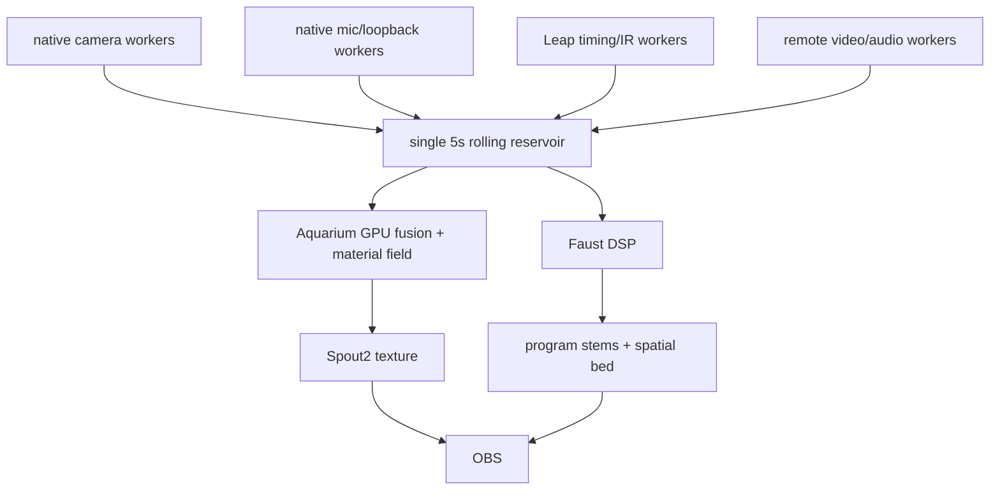
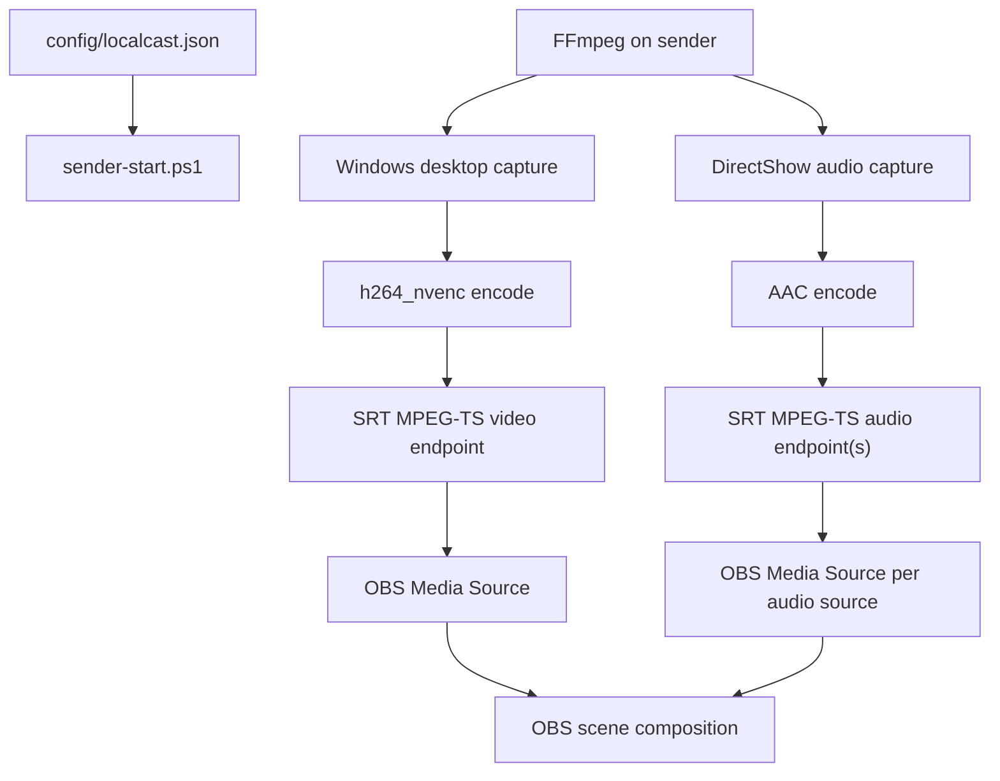
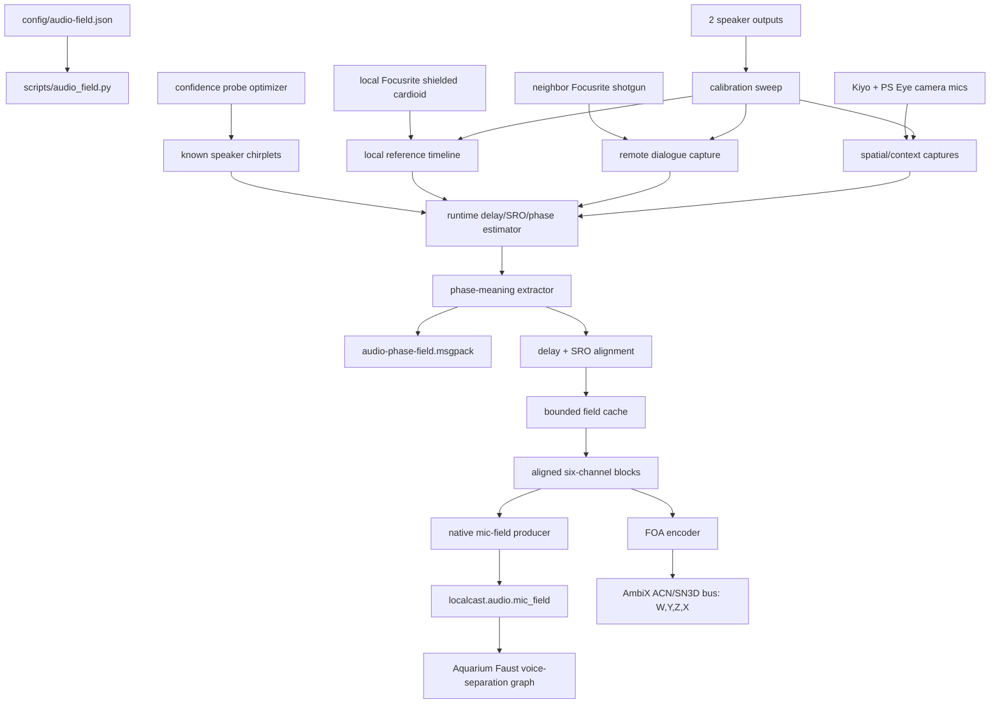
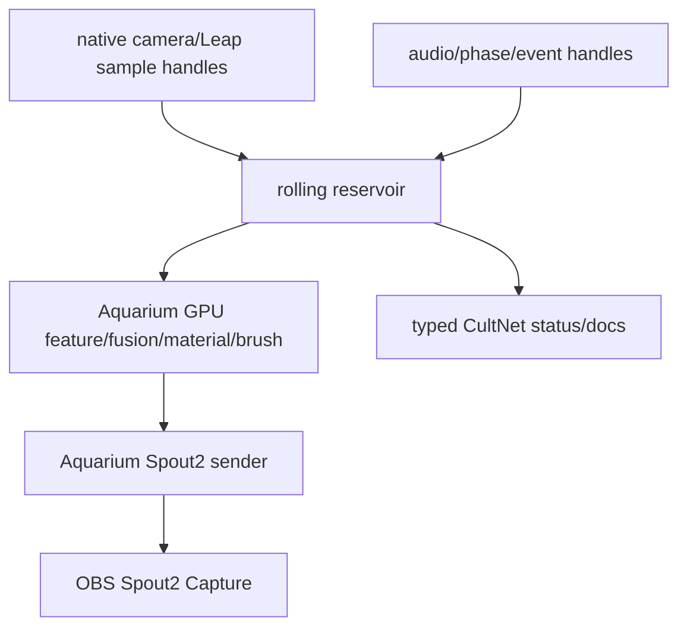
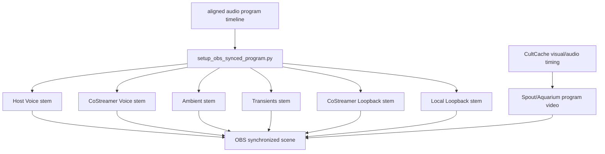

# Current System Map

Mimir is the public Face and product name for this repo. `localcast` remains
the implementation surface where existing scripts, paths, schemas, and ABIs
still use it.

The repo is intentionally thin. The target live machine is not the
deadline bridge; it is the native rolling reservoir described in
`docs/native-rebuild-plan.md`, `docs/perfect-machine.md`, and
`config/perfect-machine.example.json`.

Mimir's persistent Face state is part of the operating machine:

- `docs/mimir-face.md` owns the Face doctrine, jurisdiction, heartbeat behavior,
  and inherited memory packet.
- `.voidbot/voice/identity.json` and `.voidbot/voice/mimir.png` are the
  VoidBot-facing persona identity.
- `.voidbot/state/mimir.cc` is typed persistent Face memory. VoidBot is the
  transport layer; Mimir owns continuity and repo-progress pressure.

## Perfect Machine Target

Ownership:

- Mimir owns configuration, calibration, contract tests, launch, status, and persistence.
- Aquarium owns dense visual fusion, material/brush/splat reconciliation, final render target, and Spout publication.
- Faust owns hot audio DSP and program stem generation.
- OBS owns broadcast controls.
- Python remains tooling only: calibration, contract tests, device discovery,
  offline analysis, and diagnostics. It is not the stream hot path.
- OpenGL is not the production Spout sink. Aquarium owns production Spout2
  publication.
- `native/reservoir` is the first native crate. It now uses one time-ordered
  rolling buffer with typed views. Retention has one owner.

Invariant: the five-second spatiotemporal reservoir is the live authority.
Producers append sample handles through typed native calls, optimizers refine,
Aquarium/Faust sample and interpret the pointed-to payloads. No private history
outlives the reservoir, and typed views do not own retention. The reservoir does
not pretend to own GPU image memory or Faust audio buffers. Edge JSON may
declare schema or export diagnostics; live process/network data is typed
CultNet documents.

## Viable Stream App

`docs/viable-stream-app.md` defines the near-term app target while full native
capture work continues. Aquarium hosts the running Mimir app, keeps the default
five-second reservoir in memory, exposes debug/settings/output controls, and
emits synchronized OBS program video plus separately controllable audio stems.
Local and networked video/audio feeds are producers into that one runtime
window; they do not own clocks or private synchronization buffers. Mimir owns
`Mimir.slnx`; `src/Mimir.App` references Aquarium Engine as the host/windowing
and D3D12 bridge, while `src/Mimir.Runtime` provides the Aquarium client runtime.
`Mimir.Runtime` owns the first synchronization hub: one five-second default
rolling buffer per configured audio/video stream, source polling through
`IMimirStreamSource`, and runtime UI readouts for stream/buffer health.
Local six-camera ingest should push native handles through
`MimirNativeIngestStreamSource`; process-backed ingest remains a compatibility
edge for network SRT or diagnostics. `MimirVideoFrameDescriptor` carries
dimensions, pixel format, stride, device timestamp, and optional native/GPU
handle metadata so Leap stereo IR can enter Mimir without OpenCV owning timing.

## Ownership

- Config owns source identity, receiver address, ports, and encoding knobs.
- FFmpeg owns capture, encoding, and network transport.
- OBS owns source activation, layout, filters, monitoring, and recording/streaming.
- This repo owns repeatability and memory.

## Why Not Plugin First

An OBS plugin would be justified if OBS could not ingest stable LAN streams, or if a plugin were needed to expose independent audio controls. V1 gets independent audio controls by making each source an OBS Media Source. That is boring. Boring is allowed to win when it is correct.

The next gate is not taste, it is evidence. `scripts/obs_smoke_test.py` and
`localcast.obs_smoke` now define the v1 OBS smoke ledger:
`calibration/runs/obs-v1-smoke-ledger.json`. Receiver/plugin/native expansion is
blocked until each planned endpoint has `sender_capture`, `srt_receive`, and
`obs_present` timestamp evidence, plus bounded drift, end-to-end latency, and
confidence.

## Known Risks

- Windows audio source names vary by driver and localization.
- Some FFmpeg builds omit SRT or NVENC.
- Separate endpoints can drift; local latency should be tuned before adding a synchronization layer.
- OBS SRT reconnection behavior can be fussy. Use stable ports and source reactivation before treating port changes as a fix.

## Audio Field Sidecar

The six-microphone Ambisonic path is separate from the OBS endpoint path.

Ownership:

- `config/audio-field.json` owns mic/speaker identity, machine/device mapping, clock domains, field channel order, geometry, gain, delay, polarity, role/quality priority, capture policy, and Ambisonic bus format.
- `scripts/audio_field.py` owns profile validation, local device checks, calibration stimulus generation, clock-domain planning, shared-input capture helpers, and FOA encoding of already aligned six-channel WAVs.
- `audio_field/` owns unit-testable buffering, bounded-latency convergence, injectable port protocols, and pipeline orchestration.
- Runtime sync owns per-block chirplet observations from known speaker output and updates delay/SRO/phase estimates with confidence gates before alignment.
- `audio_field.phase_meaning` owns extracting usable meaning from internal phase/chirplet evidence. The live cache publishes delay correction, coherence, confidence, distance-equivalent delta, reference-bleed/suppression estimates, correction energy, and active-probe need; raw phase bands stay inside the estimator.
- `localcast.diagnostics.audio_live_field`, `localcast.diagnostics.audio_phase_field`, `localcast.diagnostics.faust_mic_field`, and `localcast.diagnostics.spatial_audio` preserve the old Python audio publisher experiments as diagnostics only. Production mic, loopback, phase, stem, and spatial-bed ingest belongs in native/Faust workers that append typed sample handles through `LocalcastProducer`.
- `audio-phase-field-status.json` is a diagnostic status export from the replay/experiment modules. The production phase runtime must report through typed CultNet/native status, not by making this JSON file the lifecycle authority.
- Active probe optimization owns extra chirplet emission when confidence drops, bounded by level/spacing/audibility budget. `audio_field.active_probe` is the runtime join that converts phase-field confidence into emitted chirplet WAVs/manifests and playback. Probe WAVs rotate through fixed slots and the manifest rotates at a byte cap; calibration may be dense, but artifacts must stay bounded.
- The camera/sensor-fusion pipeline may publish world poses later; it does not own audio clocks or channel timing.
- OBS may ingest rendered output later; it is not the authority for the Ambisonic field.
- Aquarium/Faust owns hot voice separation after Mimir publishes `localcast.audio.mic_field`; Mimir owns alignment, timing, mic roles, graph id, and controls.

Invariant: distributed camera/Focusrite microphones must be aligned and resampled into one reference timeline before FOA encoding. Latency is allowed as bounded buffering, but cache depth must converge toward real-time. Speaker output chirplets are live telemetry; delay/SRO/phase state must update during runtime, not only during setup. Extra chirplets may be emitted automatically when confidence drops, but only under the active probe optimizer's budget. The local shielded cardioid and neighbor shotgun are the high-quality dialogue anchors; camera mics provide spatial/context evidence.

## Visual Fusion Cut Line

Ownership:

- Native capture workers own device reads and append handles. They do not own
  scene reconstruction.
- The rolling reservoir owns the live edge, retention, ordering, and typed
  lookup.
- `LocalcastProducer` owns source identity and sequence assignment before native
  capture workers append sample handles into `LocalcastRuntime`.
- `LocalcastRuntime` owns the one live rolling window and exposes both producer
  pushes and consumer reads for Aquarium/Faust.
- Aquarium owns dense visual fusion, material fitting, point/brush/splat
  lowering, render budgeting, and Spout2 publication.
- CultNet typed documents carry status/control/process state. JSON is schema or
  diagnostic export only.
- `localcast.diagnostics.visual_producer` is now diagnostic orchestration only.
  Reservoir-window clipping, Leap packed transforms, RGB reference splats, and
  diagnostic clap calibration have named modules outside the producer monolith.
  Python fallback producers and diagnostic CultCache/JSON file adapters remain
  diagnostics/migration fossils. They must not be extended as production
  surfaces.
- `localcast.diagnostics.render_frame_json` and
  `localcast.diagnostics.lod_json` are explicit compatibility adapters; model
  modules do not own file serialization.
- `localcast.diagnostics.render_math` is the pure, testable diagnostic renderer
  math that survived deletion of the OpenGL publisher.

Invariant: fallback/demo evidence cannot enter ground-truth reservoir kinds.
Render packets, LOD cells, brush packets, and overlays are derived from reservoir
claims. The renderer cannot invent scene priority from string prefixes.

## OBS Program Surface

OBS should not expose raw unsynchronized ingest as broadcast controls once a synchronized audio/video program is available.

Ownership:

- `scripts/setup_obs_synced_program.py` owns packaging aligned program audio into OBS-controllable stems and muting/disabling raw unsynchronized OBS inputs.
- `scripts/capture_co_streamer_surfaces.py` owns the late-arriving neighbor surface import: it captures neighbor Focusrite and neighbor loopback over SSH while recording local loopback, estimates the remote-family offset, and writes aligned co-streamer surfaces for the OBS stem packer.
- `scripts/wasapi-loopback-capture.ps1` owns the direct primary-playback loopback path. It bypasses virtual mixers and asks Windows Core Audio for the default render endpoint loopback stream. It must run in the neighbor's interactive console session to receive render packets.
- OBS owns final source volume, track assignment, filters, and stream/record output.
- Aquarium/Spout owns synchronized program video, not raw remote desktop capture.

Invariant: raw SRT ingest, Desktop Audio, Mic/Aux, and other non-program scene items may exist for diagnostics, but they must be disabled or muted when broadcasting the synchronized program. Missing synchronized feeds should appear as explicit silent placeholders, not as live unsynchronized substitutes. The co-streamer Focusrite, co-streamer loopback, and remote video are the latest-arriving surface family; their measured delay should set the presentation buffer horizon instead of being patched in after the local field. Do not reintroduce Voicemeeter as the loopback authority without a concrete invariant; prefer direct WASAPI loopback or a sender FFmpeg build with native WASAPI input.

Smoke-test invariant: a visible stream in OBS is not proof of coherence. The v1
bridge must leave a witness ledger with per-stage timestamps, endpoint drift,
end-to-end latency, and confidence before the receiver surface grows new
machinery.
