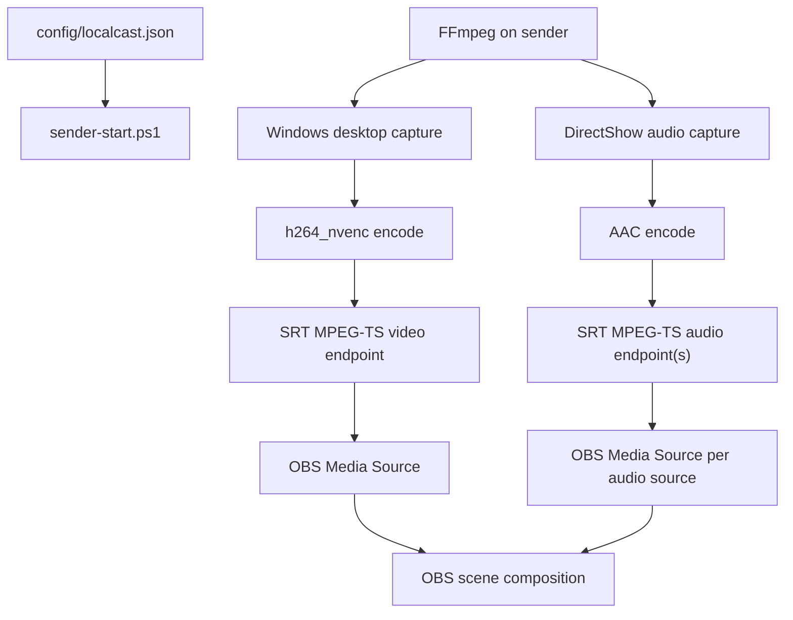
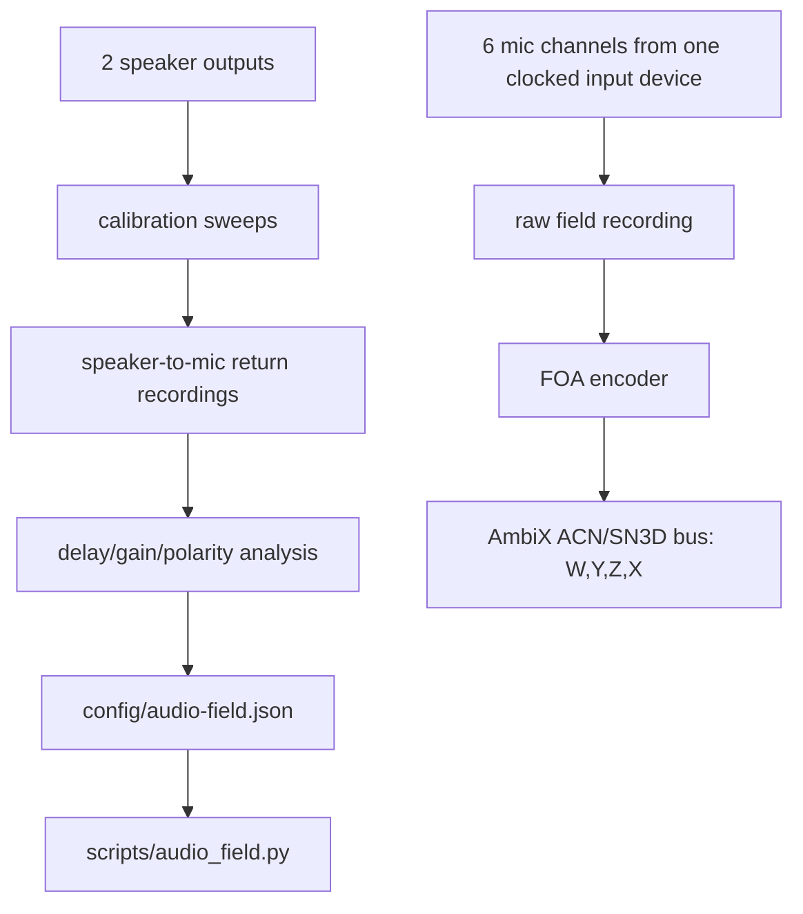

# Current System Map

LocalCastBridge is intentionally thin.

## Ownership

- Config owns source identity, receiver address, ports, and encoding knobs.
- FFmpeg owns capture, encoding, and network transport.
- OBS owns source activation, layout, filters, monitoring, and recording/streaming.
- This repo owns repeatability and memory.

## Why Not Plugin First

An OBS plugin would be justified if OBS could not ingest stable LAN streams, or if a plugin were needed to expose independent audio controls. V1 gets independent audio controls by making each source an OBS Media Source. That is boring. Boring is allowed to win when it is correct.

## Known Risks

- Windows audio source names vary by driver and localization.
- Some FFmpeg builds omit SRT or NVENC.
- Separate endpoints can drift; local latency should be tuned before adding a synchronization layer.
- OBS SRT reconnection behavior can be fussy. Use stable ports and source reactivation before treating port changes as a fix.

## Audio Field Sidecar

The six-microphone Ambisonic path is separate from the OBS endpoint path.

Ownership:

- `config/audio-field.json` owns mic/speaker identity, channel mapping, geometry, gain, delay, polarity, and Ambisonic bus format.
- `scripts/audio_field.py` owns hardware validation, calibration stimulus/return capture, offline calibration analysis, raw field recording, and FOA encoding.
- The camera/sensor-fusion pipeline may publish world poses later; it does not own audio clocks or channel timing.
- OBS may ingest rendered output later; it is not the authority for the Ambisonic field.

Invariant: the six field microphones must enter through one synchronized capture path before FOA encoding. If the actual rig uses independent USB microphone clocks, prove the adaptive sync path first; do not treat separate endpoints as raw Ambisonics.
