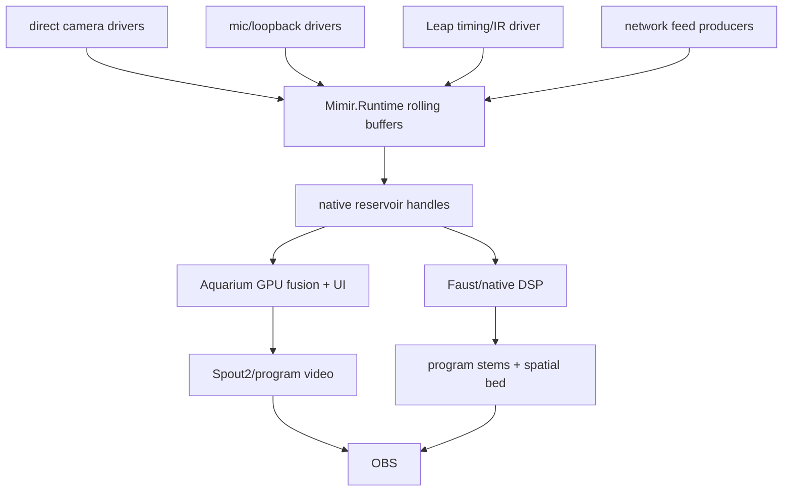
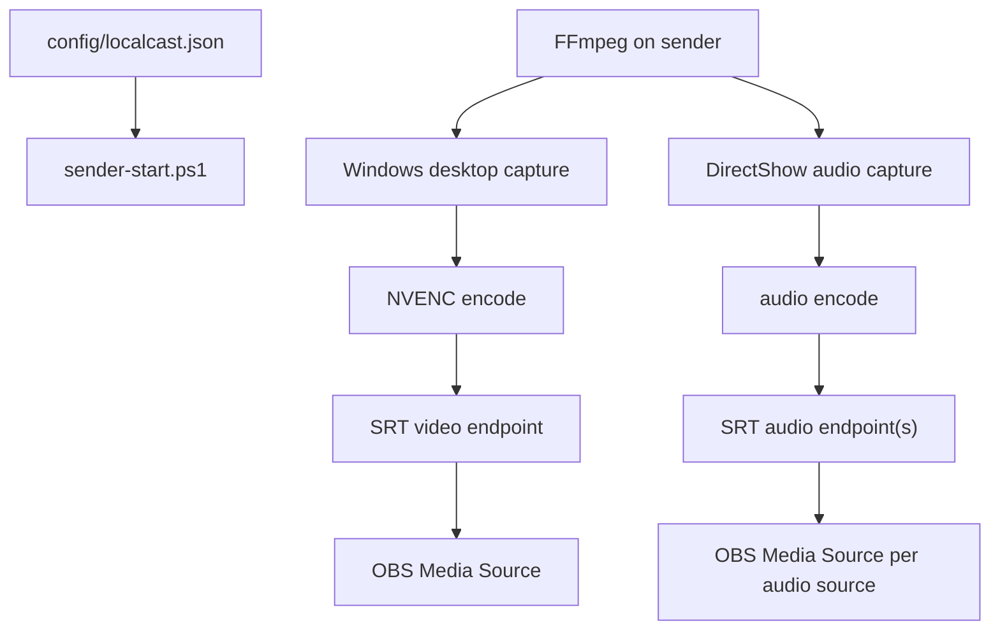

# Current System Map

Mimir is the public Face and product name for this repo. A few lower native ABI
names still use `localcast` until a deliberate rename cut exists.

The live target is the native rolling field machine described in
`docs/native-rebuild-plan.md`, `docs/perfect-machine.md`, and
`config/perfect-machine.example.json`.

## Perfect Machine Target

Ownership:

- Mimir owns configuration, calibration truth, launch, status, persistence, and
  runtime contracts.
- `Mimir.Runtime` owns app-level stream buffers and synchronization.
- Native capture workers own device reads.
- Aquarium owns dense visual fusion, material/brush/splat reconciliation,
  D3D12 interop, runtime UI, and Spout2 publication.
- Faust/native DSP owns hot audio alignment, suppression, separation,
  spatialization, and stem generation.
- OBS owns broadcast controls.

Invariant: the live window is bounded, in memory, and has one timing authority.
No private history outlives the rolling buffer.

## Viable Stream App

`docs/viable-stream-app.md` defines the near-term app target. Aquarium hosts the
running Mimir app, keeps the default five-second runtime in memory, exposes
debug/settings/output controls, and emits synchronized OBS program video plus
separately controllable audio stems.

`Mimir.Runtime` currently provides:

- `MimirSynchronizationHub`;
- `MimirRollingStreamBuffer`;
- stream descriptors/settings;
- `IMimirStreamSource`;
- `MimirNativeIngestStreamSource`;
- `MimirProcessStreamSource`;
- `MimirFrameEventProcessStreamSource`;
- `MimirVideoFrameDescriptor`;
- `MimirAudioSynchronizationAnalyzer`;
- `IMimirVideoCaptureDriver`;
- `MimirVideoCaptureDriverSource`.

Process-backed sources are bridge/network edges. Local cameras should feed
native descriptors with device timestamps and optional native/GPU handles.
The `frame-events`/`json-lines` adapter is a diagnostic witness only: native
probes can emit per-frame JSON metadata so Aquarium sees real sensor cadence in
the rolling buffers while the direct ABI driver is being cut. It does not carry
pixels and does not own the final six-camera hot path. Multi-camera probes are
one process with declared accepted source ids, not one process per camera.

## OBS Bridge Utility

The bridge is useful because it is inspectable and already speaks OBS. It does
not become the synchronized program authority.

## Audio Field

The six-microphone path is separate from the bridge. Scarlett speaker loopback
is the current timing authority when calibration chirplets are playing.
`MimirChirpletTimeline` owns the birdsong-like timeline fingerprint: an order-3
de Bruijn sequence over 32 time/frequency constellation symbols. Start band,
glide shape, duration, and following inter-chirp gap all carry code. Any three
consecutive correctly detected symbols identify the event index inside the
current operating horizon. Mimir continuously queues that timeline through
Aquarium audio and decodes timing through the constrained chirplet-transform
path.
Reports now carry fractional delay and per-band matched energy. The first
`MimirChirpletSymbolCodebook` owns separable symbol definitions; every symbol
has a unique chirp shape, with rhythm as additional evidence. `MimirChirpletStreamDecoder`
is the constrained chirplet-transform receiver: it turns a bounded PCM window
into transform frames with multiple phase-invariant symbol candidates and
refined per-candidate sample offsets, code-valid triplet anchors selected
through gap/clock coherence, and an affine source clock fit. The synthetic
`Mimir.BufferSmoke --chirplet-self-test` path renders canonical timeline audio
into memory and currently recovers events 0-12 with a 47999.999990 Hz clock fit
and 0.000014 sample MAE. The analyzer only emits timing reports from
matched canonical anchors. The hub also owns cached reports plus smoothed
per-source sync state with delay-slope/SRO in ppm. `MimirRuntime` runs analysis
online as a bounded rotating service and can print live telemetry with
`MIMIR_SYNC_TELEMETRY_SECONDS`. UI and telemetry are passive readers of cached
sync state; they must not invoke the analyzer. Current app testing proves
loopback wakeup, live mic buffers, and confident online sync states, but the
next proof is stable canonical anchors through real mic streams. Camera mics are
spatial/context witnesses; Focusrite devices are dialogue anchors. Fractional
delay and the hot resampler belong in Faust/native DSP.

## Visual Fusion

Visual fusion belongs in Aquarium over current reservoir claims. Native capture
workers provide frames; Aquarium owns feature extraction, matching, material
fitting, render budgeting, and publication.

## Known Risks

- Windows device names vary by driver and localization.
- Some FFmpeg builds omit SRT or NVENC.
- Separate bridge endpoints can drift.
- OBS SRT reconnection behavior can be fussy.
- Direct driver work must prove sustained cadence before it becomes timing
  authority.
- PS3 Eye audio endpoints are enumeration/runtime-fragile. A later replug made
  both mic buffers emit 480-frame WASAPI blocks again while both PS3 Eye camera
  buffers were live.
