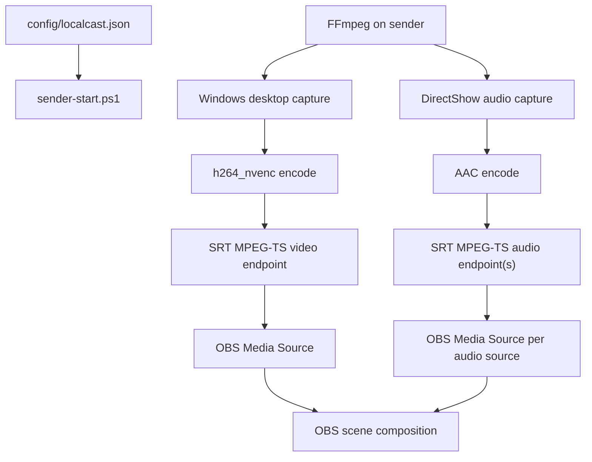

# Current System Map

LocalCastBridge is intentionally thin.

## Ownership

- Config owns source identity, receiver address, ports, and encoding knobs.
- FFmpeg owns capture, encoding, and network transport.
- OBS owns source activation, layout, filters, monitoring, and recording/streaming.
- This repo owns repeatability and memory.

## Why Not Plugin First

An OBS plugin would be justified if OBS could not ingest stable LAN streams, or if a plugin were needed to expose independent audio controls. V1 gets independent audio controls by making each source an OBS Media Source. That is boring. Boring is allowed to win when it is correct.

## Known Risks

- Windows audio source names vary by driver and localization.
- Some FFmpeg builds omit SRT or NVENC.
- Separate endpoints can drift; local latency should be tuned before adding a synchronization layer.
- OBS SRT reconnection behavior can be fussy. Use stable ports and source reactivation before treating port changes as a fix.
