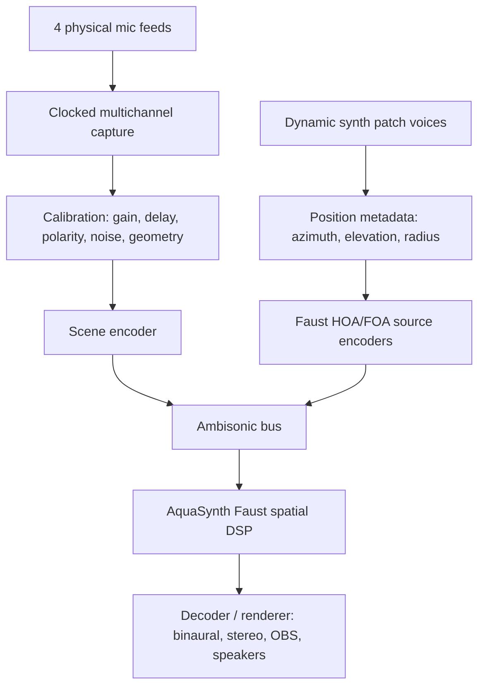

# Ambisonic AquaSynth Field: Distilled Research

## Objective

Consolidate four live microphones -- shielded cardioid, Deru shotgun, and two camera mics -- into one synchronized spatial audio scene that can feed an AquaSynth Faust DSP graph, while also placing dynamic synth patch outputs in 3D.

## Current Mechanism

Mimir currently treats audio as independent OBS-ingestable endpoints: one FFmpeg process per audio source, one SRT port per source, and OBS owns the mix. That is coherent for manual OBS mixing, but it is the wrong ownership model for a single spatial field. An ambisonic bus needs clocked multichannel audio before spatial encoding, then effects, then decode/render.

## Invariants

- Capture sync must be owned before spatial encoding. Drift correction after the fact can make playback tolerable, but it does not create a physically coherent sound field.
- The ambisonic representation must declare order, channel count, channel order, normalization, sample rate, and render target.
- The Faust graph should receive one declared spatial bus, not four unsynchronized mono stories wearing a coat.
- Microphone geometry and directivity must be explicit if microphone feeds are treated as a captured field.
- Synth outputs are easier: each synth voice is a mono or stereo source with explicit azimuth/elevation/radius metadata, then encoded into the same ambisonic bus.

## Main Finding

Four arbitrary microphones are not automatically a first-order ambisonic microphone. ICST distinguishes A-format as microphone-specific raw capsule output and B-format as the production/exchange sound-field representation; A-format must be converted before it is a usable ambisonic master [ICST]. A tetrahedral ambisonic mic works because capsule geometry and calibration are part of the device model. Your mic set is heterogeneous: cardioid, shotgun, and camera mics have different positions, directivities, gains, noise floors, latency, and likely clocks.

McCormack et al. show that arbitrary microphone arrays can be encoded into Ambisonics, but even conventional linear encoding is limited by geometry, sensor placement, regularization, spatial aliasing, and bandwidth; their proposed parametric method uses spatial analysis, filtering, source/ambient decomposition, and measured or modeled array behavior [McCormack 2022]. Translation: this is research-grade if we want "real recovered sound field," not a cute four-channel matrix.

## Recommended Architecture

## Practical Path

1. Capture all four microphones through one clock domain.
   Prefer one multichannel audio interface or a driver/server that exposes one synchronized device. RME's documentation for multiple cards is blunt that cards need a shared sync source or sync headers to remain synchronized [RME]. JACK's design centers synchronous client execution and low-latency inter-application routing, and on Windows it can bridge ASIO clients through JACK-Router [JACK API; JACK Windows]. FFmpeg DirectShow can open multiple devices and says opening them on the same input "should improve synchronism," but that is not the same as proving sample-accurate shared-clock capture [FFmpeg Devices].

2. Pick the honest spatial model.
   For v1, do source-based ambisonic scene building: treat each mic as a directional source at a measured position, with calibration delays and gains. This produces a usable spatial mix, not a physically exact reconstruction. For v2, investigate measured arbitrary-array encoding if the room-capture realism matters enough to justify calibration sweeps and signal analysis.

3. Use ambiX unless a tool forces otherwise.
   ICST and IEM both identify ambiX as ACN channel ordering with SN3D normalization, and IEM explicitly uses that convention [ICST; IEM Compatibility]. This should be the default interchange format for the bus.

4. Start with FOA, design the graph for HOA.
   First-order Ambisonics is 4 channels. Higher order uses `(order + 1)^2` channels and gives sharper spatial resolution at higher routing and CPU cost [ICST]. Faust `hoa.lib` provides encoders, decoders, rotators, optimizers, and 3D encoders; `encoder3D(N, x, a, e)` directly fits dynamic synth voices [Faust hoa.lib]. The graph should parameterize order so FOA can ship first without boxing out HOA.

5. Keep OBS as render target, not spatial authority.
   If this path becomes live, OBS should ingest the rendered output or selected post-DSP stems. OBS should not be asked to preserve the ambisonic field while separately mixing the pre-field microphones. That splits authority and invites drift.

## Cut Line

Cut or suspend the old one-port-per-audio-source model for any microphone that participates in the ambisonic field. It can remain for plain OBS monitor sources, but the spatial bus must be one synchronized capture path.

Do not build a bespoke arbitrary-array encoder first. Use Faust `hoa.lib` for source encoding and established tooling like IEM/SPARTA for verification. Only consider a custom array encoder after we have measured mic geometry, clock behavior, impulse responses, and proven that source-based encoding is not enough.

## Open Questions

- Are the two camera mics available as embedded channels from one capture device, or as separate USB/device clocks?
- Do we have a multichannel interface that can ingest all four mics into one ASIO device?
- Is AquaSynth currently a Faust host, a generated plugin target, or a separate graph compiler/runtime?
- Is the desired output binaural headphone monitoring, stereo OBS program audio, surround speakers, or a stored ambisonic master?
- Do we need the room itself reconstructed, or do we need a convincing controllable spatial mix for performance?

## Citations

- [ICST] ICST Ambisonics, "Ambisonics Formats Explained: A-Format, B-Format, FuMa, AmbiX, FOA and HOA." Mirror: `mirrors/icst-ambisonics-formats.html`.
- [RingBuffer] RingBuffer, "Understanding Ambisonics." Mirror: `mirrors/ringbuffer-understanding-ambisonics.html`.
- [McCormack 2022] McCormack, Politis, Gonzalez, Lokki, and Pulkki, "Parametric Ambisonic Encoding of Arbitrary Microphone Arrays," IEEE/ACM TASLP, 2022. Mirror: `mirrors/mccormack-2022-parametric-ambisonic-encoding.pdf`.
- [Faust hoa.lib] Faust Libraries, `hoa.lib`. Mirror: `mirrors/faust-hoa-lib.html`.
- [IEM] IEM Plug-in Suite. Mirror: `mirrors/iem-plugin-suite.html`.
- [IEM Compatibility] IEM Plug-in Suite, "Compatibility with other Suites." Mirror: `mirrors/iem-compatibility.html`.
- [SPARTA] SPARTA, "Overview." Mirror: `mirrors/sparta-overview.html`.
- [FFmpeg Devices] FFmpeg Devices Documentation. Mirror: `mirrors/ffmpeg-devices.html`.
- [JACK API] JACK Audio Connection Kit API Overview. Mirror: `mirrors/jack-api-overview.html`.
- [JACK Windows] JACK Audio Connection Kit, "Using JACK on Windows." Mirror: `mirrors/jack-on-windows.html`.
- [RME] RME Manuals, "Using multiple HDSPe AoX cards." Mirror: `mirrors/rme-multiple-cards-sync.html`.
