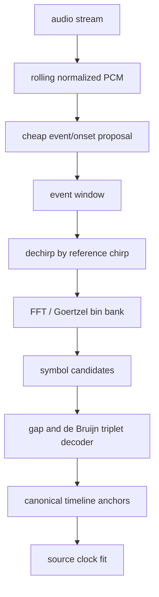

# Chirplet Sync Decoder: Distilled Research

## Objective

Find the right receiver architecture for Mimir's continuous acoustic timing
beacon. The immediate question was whether the current `BuildChirpletEnergyTrace`
and per-symbol matched scoring path is canonical, or whether a standard chirp
decoder trick is missing.

## Current Mechanism

The live code currently behaves like a dense sliding matched-filter bank:

```text
for every audio window:
  for every time hop:
    for every chirplet symbol:
      compute normalized dot product against that symbol kernel
  keep peaks
  classify symbols around peaks
  search code-valid triplets
  fit source clock
```

This is legal chirplet analysis, but it is not the machine we want. The expensive
chirplet projection is being used as broad discovery. That spends CPU before the
timeline/codebook constraints get a vote.

## Main Finding

For a controlled synchronization beacon, the better trick is usually **dechirp
then FFT**, not brute-force symbol scoring.

Chirp communication systems, especially LoRa-family decoders, exploit the fact
that multiplying a received chirp by the conjugate/reference chirp turns a
frequency-shifted chirp into a near-stationary tone. One FFT then reveals the
symbol as a peak bin. That changes classification from:

```text
32 full chirplet dot products per event candidate
```

to:

```text
one dechirp multiply + one FFT per event candidate
```

If symbols use a shared duration, window, and chirp rate, and encode identity as
frequency offset or bin, the receiver can classify the whole codebook at once.

## What The Sources Say

- Chirplet-transform and matching-pursuit literature supports projection onto
  chirplet atoms, but that path is general signal analysis. It is expressive and
  expensive.
- Fast chirplet-transform work exists because naive chirplet dictionaries are
  costly.
- Practical chirp communication systems avoid exhaustive chirp-shape scoring by
  designing the waveform so the receiver can dechirp and FFT.
- ChirpMu explicitly contrasts simpler FFT-band chirp symbol decoding with
  heavier chirp-parameter methods such as STFT/Hough-style approaches.

## Design Correction

The codebook should be redesigned to be receiver-cheap.

Current shape:

```text
symbol identity = arbitrary chirp shape:
  start band
  glide shape
  duration
  following gap

receiver = score every symbol kernel
```

Better shape:

```text
symbol identity = FFT-decodable chirp bin:
  common chirp duration
  common chirp rate
  common window
  symbol encoded as frequency offset/bin

receiver = dechirp + FFT peak
```

Rhythm/gap can still carry timeline evidence, but it should not be the only
reason symbol identity survives bad microphones. The acoustic symbol should be
cheap and robust by construction.

## Intended Decoder Machine



For Mimir's realtime path, the FFT stage can probably be replaced by a fixed
Goertzel/sliding DFT bank over the 32 symbol bins if the symbol spacing is fixed
and small. That keeps the same invariant: one common dechirp, many cheap bins.

## What To Cut

`BuildChirpletEnergyTrace` should not remain the primary acquisition path. It
uses the most expensive operation as the first broad scan.

The next coherent implementation cut is:

1. Add a new FFT-decodable chirp-bin codebook beside the current codebook.
2. Render a deterministic de Bruijn timeline with common chirp slope/window and
   per-symbol frequency bin.
3. Add a synthetic self-test where dechirp+FFT decodes every emitted symbol and
   recovers the same triplet anchors the current matcher recovers.
4. Only then swap live runtime decoding over.

## Non-Goals

- Do not keep optimizing dense sliding dot products and call that the final
  transform. SIMD helped, but the structure is still wrong.
- Do not add outlier filters to hide weak symbol identity.
- Do not preserve the arbitrary-shape codebook just because it exists. The
  transmitter is ours. Make it serve the receiver.

## Open Questions

- Best event proposal: amplitude/onset novelty, broadband high-frequency energy,
  one reference dechirp energy trace, or a small slope bank.
- FFT size/bin spacing at 44.1 kHz and 48 kHz so all mics can decode without
  resampling artifacts creating bin ambiguity.
- Whether to keep one chirp slope or use a tiny slope bank for robustness.
- How musical the emitted pattern can remain when symbol identity is constrained
  to FFT bins.
- Whether Goertzel bins beat full FFT for the expected symbol count and event
  cadence.
