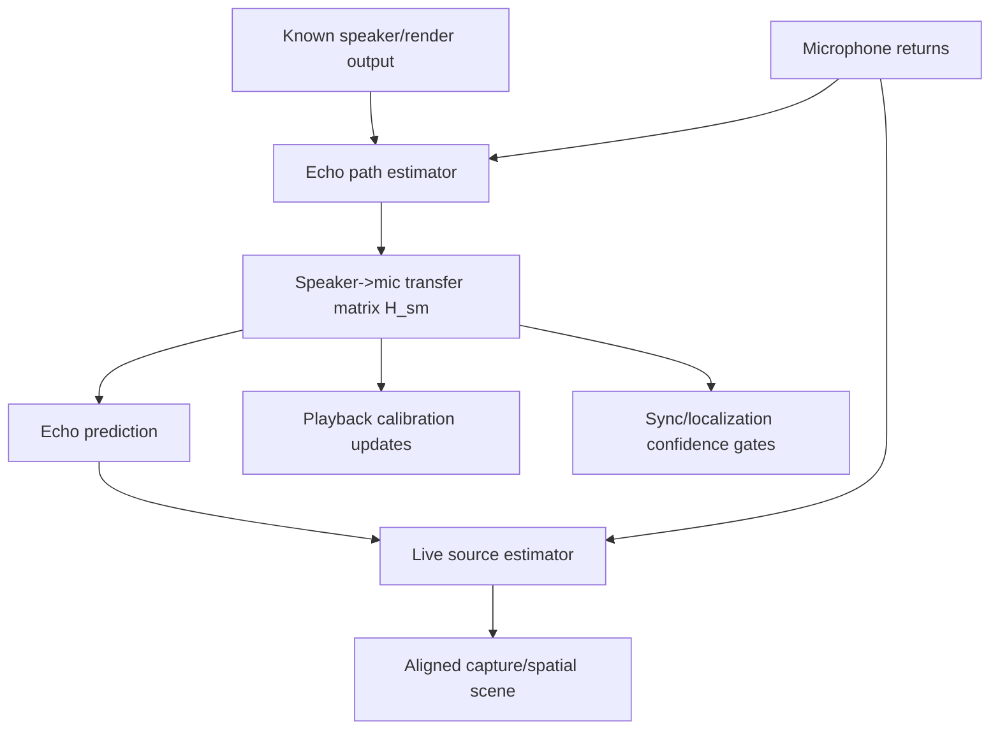

# Feedback As Continuous Calibration

## Objective

Treat speaker-to-microphone feedback as a useful measurement stream, not merely noise to suppress, so the system can continuously learn the playback-room-microphone transfer paths while running.

## Current Mechanism

The playback calibration note treats speaker measurements as an explicit calibration pass. The live adaptive sync note warns that speaker bleed can corrupt mic sync/localization. Both are true, but incomplete: because the emitted speaker signal is known, the bleed is also an online system-identification signal.

## Main Finding

This is the territory of acoustic echo cancellation, adaptive feedback cancellation, and online acoustic system identification. The useful model is:

```text
mic_signal = live_sources + speaker_output convolved with room/speaker/mic paths + noise
```

If the system knows `speaker_output`, an adaptive filter can estimate the transfer path from each speaker output channel to each microphone. Goetze et al. explicitly connect acoustic echo cancellation to listening-room compensation and note that room impulse responses are time-varying and must be identified adaptively, while also warning that equalizer design should account for the echo canceller's convergence state [Goetze 2008]. That warning matters: a half-converged estimator is not truth; it is a drunk ruler.

Nikunen and Virtanen describe online estimation of time-varying room impulse responses when isolated source signals are available, including playback material output through loudspeakers in a live performance recorded for 3D spatial audio [Nikunen/Virtanen 2018]. That is nearly our shape: known synth/playback streams, observed far-field mic mixtures, and spatial reconstruction.

Haubner et al. frame online acoustic impulse response estimation as a Kalman/system-identification problem and target faster convergence under correlated excitation and interfering noise [Haubner 2021]. Multichannel AEC work, including Apple ML's MIMO least-squares framing, addresses the harder version where multiple speakers and multiple microphones are coupled and "double-talk" or near-end sound is present [Apple 2020].

## Required Ownership

Feedback mining should be its own subsystem:



It should not be hidden inside the drift loop or the ambisonic encoder. The transfer matrix `H_sm` owns "what our speakers currently sound like at our microphones." The clock loop owns sampling-rate mismatch. The localization loop owns external source position. The decoder owns speaker rendering. Four authorities. No soup.

## Design Implications

- Continuous feedback is a calibration signal when the outgoing audio is known and time-aligned.
- It is also an interference signal for voice capture, so the system should predict and optionally subtract or downweight it.
- Adaptation must be gated during strong unknown near-field speech, heavy clipping, nonlinear speaker behavior, or low coherence.
- Each speaker-to-mic path is a filter, not just one delay. Early taps are useful for direct-path timing and geometry; later taps describe room reflections.
- In multichannel playback, the estimator is MIMO: every speaker can leak into every mic.
- The estimator should publish confidence, convergence, residual error, and last-change time. Do not let downstream systems treat a stale or diverging filter as a fact.

## Candidate V1

1. Start offline/controlled:
   - play one speaker at a time with chirp/noise
   - estimate fixed speaker-to-reference-mic impulse responses
   - store speaker delay, gain, polarity, and early reflection sketch

2. Add online passive tracking:
   - feed known speaker output and mic input into an adaptive filter
   - start with two paths: left speaker -> reference mic, right speaker -> reference mic
   - estimate residual echo and convergence

3. Add live gating:
   - freeze or slow adaptation during strong unknown speech
   - adapt faster during known probe/noise windows or synth-only output
   - reject updates when residual/error spikes indicate nonlinearity or movement

4. Scale to MIMO:
   - speaker channels x microphone channels
   - use the resulting transfer matrix to improve playback correction, echo prediction, and confidence in mic localization

## How It Helps AquaSynth

- The system can tell whether a synth voice rendered to "front left" actually arrives front-left-ish at the mic array.
- Speaker leakage can be subtracted or modeled before estimating external voice position.
- The room response can update slowly as people move, doors open, or speaker volume changes.
- Calibration pings become optional accelerators rather than the only source of truth.

## Risks

- Adaptive echo filters can diverge under double-talk unless gated or made robust.
- Loudspeakers are nonlinear at high levels; a linear impulse response will not explain distortion.
- Correlated stereo/ambisonic speaker feeds make MIMO echo identification harder because the system has trouble deciding which speaker caused which mic energy.
- If we use the estimator to aggressively cancel feedback, we may remove useful spatial ambience. The goal is not sterile cancellation; it is intelligible ownership of the signal.

## Citations

- [Goetze 2008] S. Goetze, M. Kallinger, A. Mertins, and K. Kammeyer, "System Identification for Multi-Channel Listening-Room Compensation Using an Acoustic Echo Canceller." Mirror: `mirrors/goetze-2008-aec-listening-room-compensation.html`.
- [Lindstrom 2007] F. Lindstrom, C. Schueldt, and I. Claesson, "Efficient Multichannel NLMS Implementation for Acoustic Echo Cancellation." Mirror: `mirrors/lindstrom-2007-efficient-multichannel-nlms.html`.
- [Valin 2016] J.-M. Valin, "A New Robust Frequency Domain Echo Canceller With Closed-Loop Learning Rate Adaptation." Mirror: `mirrors/valin-2016-frequency-domain-echo-canceller-learning-rate.pdf`.
- [EUSIPCO 2021] "Double-Talk Robust Acoustic Echo Cancellation." Mirror: `mirrors/eusipco-2021-double-talk-robust-aec.pdf`.
- [Apple 2020] Apple Machine Learning Research, "Double-talk Robust Multichannel Acoustic Echo Cancellation Using Least Squares MIMO Adaptive Filtering." Mirror: `mirrors/apple-mimo-adaptive-echo-cancellation.html`.
- [Nikunen/Virtanen 2018] J. Nikunen and T. Virtanen, "Estimation of Time-Varying Room Impulse Responses of Multiple Sound Sources from Observed Mixture and Isolated Source Signals." Mirror: `mirrors/nikunen-virtanen-2018-time-varying-rir.pdf`.
- [Haubner 2021] T. Haubner, A. Brendel, and W. Kellermann, "Online Acoustic System Identification Exploiting Kalman Filtering and an Adaptive Impulse Response Subspace Model." Mirror: `mirrors/haubner-2021-online-acoustic-system-identification.pdf`.
