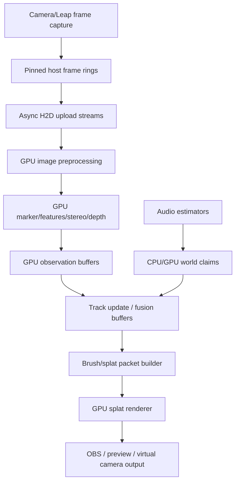

# GPU Fusion And Live Splat Rendering

## Objective

Design the implementation path for fusing live camera/Leap/audio observations and rendering a Dreams-like volumetric brushstroke or Gaussian-splat field with the hot path on GPU compute.

## Current Mechanism

The visual-spatial map now says the world model owns truth, while brushstroke/splat packets are render lowerings. This note adds the GPU implementation constraint:

```text
capture ingress
-> pinned host staging
-> async GPU upload / CUDA streams
-> GPU feature/marker/depth work
-> GPU-friendly track/claim buffers
-> splat/brush packet generation
-> CUDA/Vulkan/OpenGL renderer interop
```

The CPU remains the conductor: device enumeration, calibration files, graph scheduling, small control decisions, logging, and fallback. It should not be the pixel furnace.

## Key Findings

The original 3D Gaussian Splatting implementation is CUDA-backed and includes a real-time viewer requiring CUDA-capable hardware for its real-time path [GraphDeco]. Kerbl et al. use anisotropic Gaussians, adaptive density control, and a fast visibility-aware renderer to avoid wasting work on empty space [Kerbl 2023].

NVIDIA's `vk_gaussian_splatting` sample is useful because it treats 3DGS as a real-time visualization testbed and compares graphics-pipeline approaches for splat rendering, including mesh-shader and vertex-shader paths [NVIDIA vkGS]. That suggests we should not blindly force every render step through CUDA if Vulkan/D3D mesh/compute stages do the final raster work better. GPU compute is the goal; CUDA is one implementation authority, not a religion with a tiny hat.

`gsplat` is the strongest practical CUDA library reference. Its documentation describes CUDA-accelerated Gaussian rasterization, and the JMLR paper frames it as a PyTorch front-end with highly optimized CUDA kernels, intended to be faster, more memory-efficient, and easier to modify than the original backend [gsplat Docs; Ye 2025]. Nerfstudio's Splatfacto uses gsplat as its rasterization backend [Nerfstudio].

For sensor processing, NVIDIA VPI matters because it exposes computer vision operations across hardware backends, including CUDA, and includes building blocks such as stereo disparity, KLT feature tracking, and perspective warp [NVIDIA VPI]. OpenCV's CUDA module provides GPU-accelerated computer vision primitives [OpenCV CUDA]. NVIDIA's Optical Flow SDK exposes hardware acceleration for optical flow and stereo disparity on supported GPUs [NVIDIA OFA].

CUDA streams and asynchronous execution are the runtime spine. NVIDIA's CUDA guide defines streams as ordered work queues for memory copies and kernels; separate streams can express overlap between capture upload, feature extraction, track update, and render prep when the hardware supports it [CUDA Async].

## Proposed GPU Ownership Model



## Data Model

Prefer structure-of-arrays buffers for CUDA kernels:

```text
SensorState:
  intrinsics[]
  extrinsics_world_from_sensor[]
  latency_model[]
  clock_model[]

ObservationBuffer:
  sensor_id[]
  timestamp_ns[]
  uv_or_xyz[]
  confidence[]
  marker_id[]

TrackBuffer:
  id[]
  position[]
  velocity[]
  covariance[]
  confidence[]
  last_update_time[]

BrushPacketBuffer:
  stable_key[]
  position[]
  orientation_or_quat[]
  scale[]
  color[]
  opacity[]
  confidence[]
  source_track_id[]
```

Do not start with a generic object graph on the GPU. That path becomes pointer soup with a profiler attached.

## Pipeline Proposal

1. Capture ingress.
   Each camera writes into a small ring of pinned host buffers. Use one capture thread per physical device if the driver requires it, but keep frame metadata uniform: device id, sequence, host timestamp, exposure/gain, and intended world transform version.

2. Async upload.
   Copy frames into GPU memory on per-device or per-class CUDA streams. Use CUDA events to timestamp stage completion. CPU blocks only on bounded ring pressure, not on per-frame processing.

3. GPU image work.
   PS3 Eyes: threshold/blob/marker extraction.  
   LeapUVC: stereo rectification, close-range disparity or marker extraction.  
   Kiyos: downsampled feature/color projection path; keep full-res RGB for texture/projection only when budget allows.

4. Fusion.
   First implementation can run track updates on CPU if observation counts are tiny, but keep buffers GPU-shaped from day one. Move Kalman/EKF batch updates to CUDA once there are enough tracks or per-pixel/depth observations to justify it.

5. Packet generation.
   Convert tracks and local surfaces into brush/splat packets on GPU or with a CPU fallback writing the same SoA buffer. This packet buffer is the render ABI.

6. Render.
   Use an existing CUDA 3DGS/gsplat path for experiments, but the production live renderer may be Vulkan/D3D compute/mesh shader with CUDA interop depending on OBS/preview integration. The invariant is GPU-resident packet data, not a specific API logo.

7. Readback discipline.
   Read back metrics and small debug summaries only: counts, residuals, confidence, dropped frames, GPU timings. Do not read back full frames or point clouds during live operation unless recording/debugging.

## Gaussian vs Brushstroke

Classic 3DGS wants optimized radiance-field Gaussians from posed images. Our live scene wants expressive, sensor-driven volumetric strokes. Use 3DGS machinery where it helps:

- anisotropic splat parameterization
- tile/bin/sort/raster kernels
- packed GPU buffers
- visibility-aware culling
- LOD/density control ideas

But do not require full offline radiance-field training before the live rig can show anything. V1 brush packets can be directly emitted from tracks and RGB projections. Later, local regions can be optimized into Gaussian fields when the data is stable enough.

## First GPU Slice

1. GPU-upload one PS3 Eye frame and one Kiyo frame using pinned host rings.
2. Run a CUDA threshold/blob extraction kernel on the PS3 Eye frame.
3. Emit one `ObservationBuffer` entry for a bright marker.
4. Triangulate on CPU or GPU from two PS3 Eye observations.
5. Write one `BrushPacketBuffer` entry.
6. Render one translucent anisotropic splat/brush from that GPU buffer.
7. Expose timings: capture, upload, detect, fuse, packetize, render.

That proves the GPU memory path before the larger system starts wearing a cape.

## Cut Line

Cut any plan that:

- captures frames, processes pixels on CPU, then uploads final pretty geometry only
- requires CPU readback of dense point clouds every frame
- starts with full 4D Gaussian training before sparse live tracking works
- makes CUDA kernels own calibration semantics
- ties the world model to one renderer backend
- ignores USB/capture bandwidth and upload overlap

## Citations

- [CUDA Guide] NVIDIA CUDA C++ Programming Guide. Mirror: `mirrors/nvidia-cuda-programming-guide.pdf`.
- [CUDA Async] NVIDIA CUDA C++ Programming Guide, asynchronous/concurrent execution. Mirror: `mirrors/nvidia-cuda-async-concurrent-execution.html`.
- [NVIDIA VPI] NVIDIA Vision Programming Interface. Mirror: `mirrors/nvidia-vpi-main.html`.
- [NVIDIA OFA] NVIDIA Optical Flow SDK Programming Guide. Mirror: `mirrors/nvidia-optical-flow-programming-guide.pdf`.
- [OpenCV CUDA] OpenCV CUDA-accelerated Computer Vision module. Mirror: `mirrors/opencv-cuda-module.html`.
- [GraphDeco] GraphDeco/Inria `gaussian-splatting`. Mirrors: `mirrors/graphdeco-gaussian-splatting-github.html`, `mirrors/graphdeco-gaussian-splatting-readme.md`.
- [NVIDIA vkGS] NVIDIA Developer Blog, `vk_gaussian_splatting`. Mirror: `mirrors/nvidia-vk-gaussian-splatting-blog.html`.
- [gsplat Docs] gsplat documentation. Mirror: `mirrors/gsplat-docs.html`.
- [Ye 2025] M. Ye et al., "gsplat: An Open-Source Library for Gaussian Splatting." Mirror: `mirrors/ye-2025-gsplat.pdf`.
- [Nerfstudio] Nerfstudio, "Splatfacto." Mirror: `mirrors/nerfstudio-splatfacto.html`.
- [Kerbl 2023] Bernhard Kerbl et al., "3D Gaussian Splatting for Real-Time Radiance Field Rendering." Mirror: `mirrors/kerbl-2023-3d-gaussian-splatting.pdf`.
- [Wu 2024] Guanjun Wu et al., "4D Gaussian Splatting for Real-Time Dynamic Scene Rendering." Mirror: `mirrors/wu-2024-4d-gaussian-splatting.pdf`.
- [Peng 2024] Zhexi Peng et al., "RTG-SLAM." Mirror: `mirrors/peng-2024-rtg-slam.pdf`.
