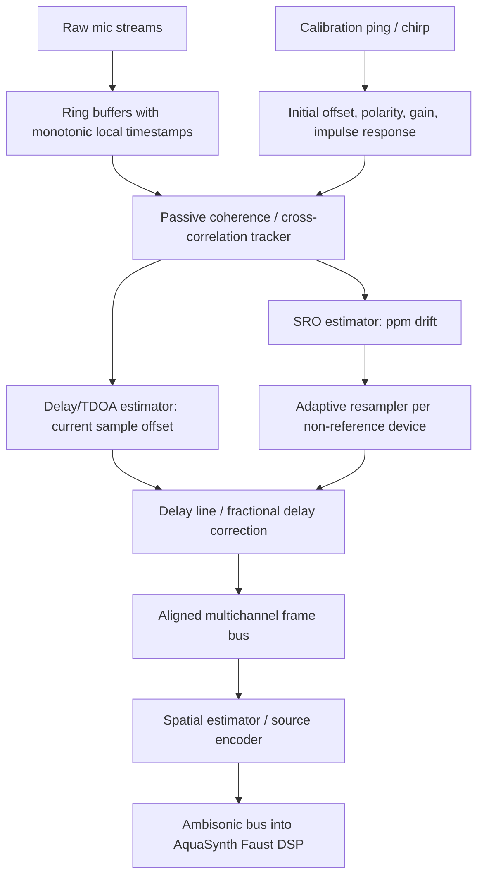

# Live Adaptive Sync: Distilled Research

## Objective

Find prior work that supports synchronizing independent live microphone feeds well enough to build a coherent spatial bus for AquaSynth/Ambisonics.

## Current Mechanism

Mimir currently launches separate FFmpeg capture processes and SRT endpoints. That preserves OBS mix control but does not give us one clocked multichannel stream. For Ambisonics, independent device clocks create two separate problems:

- initial offset: one stream starts late or has more device/buffer latency
- sampling-rate offset: one device runs slightly faster/slower, so offset grows over time

The research literature calls the second problem **sampling-rate offset** or **SRO**, often measured in parts per million.

## Main Finding

Live adaptive sync is a known problem in wireless/distributed acoustic sensor networks. The common model is:

1. estimate clock drift/SRO between independent nodes
2. compensate by resampling, STFT-domain phase correction, or clock control when hardware permits
3. estimate current TDOA/delay separately for localization or beamforming

Wang and Doclo model SRO as linear phase drift in the STFT domain and note that independent microphone nodes have their own ADC/clock sources; because oscillator tolerances differ, sampling-rate mismatch is inevitable [Wang/Doclo 2016]. They also spell out the practical compensation options: time-domain resampling, interpolation filters, sinc/Lagrange-style correction, or STFT-domain compensation [Wang/Doclo 2016].

Didier et al. report SROs up to hundreds of ppm in common heterogeneous devices and emphasize that SRO causes increasing time drift, breaking coherent signal processing [Didier 2023]. Their method estimates SRO from coherence drift and compensates with frequency-domain phase shifts, while also detecting full-sample drifts in a WOLA/STFT processing chain [Didier 2023].

Schmalenstroeer and Haeb-Umbach show the control-loop version: timestamp exchange gives a first clock-frequency estimate, a Kalman filter smooths it, and then one node's sampling frequency is adjusted; their long-term tests kept oscillator deviation under half a sample, enabling cross-device TDOA estimation [Schmalenstroeer 2013]. That is closest to "lock them into sync," but it requires either controllable clocks or an equivalent software resampling actuator.

## Architecture We Can Steal Without Shame

## Design Implications

- Pick one reference stream.
  One mic/interface becomes the local time authority. Every other stream is resampled toward it. This is not philosophical. Somebody has to be the clock or the whole room starts freelancing.

- Separate the slow and fast loops.
  SRO is a slow ppm-level estimate. Current TDOA/delay is a frame-level estimate. If one loop owns both, it will overreact to speech movement and reverberation.

- Use pings for initialization and health checks, not as the only sync.
  A chirp/MLS/pulse can estimate fixed latency, polarity, gain, and rough impulse response. It does not prevent future drift. Periodic pings can re-anchor the system, but they are intrusive unless hidden in a controlled band and supported by the microphones/signal path.

- Prefer passive SRO tracking during speech.
  Coherence-drift and STFT phase-drift methods are designed for exactly this: estimate rate mismatch from live audio without requiring dedicated sync tones [Wang/Doclo 2016; Didier 2023].

- Use GCC-PHAT for TDOA/localization, not clock locking.
  GCC-PHAT is a standard TDOA/DOA tool and has real-time variants studied for close microphone pairs [Grondin/Glass 2018]. It estimates arrival-time differences; it does not by itself distinguish source movement from clock drift over long windows.

- Resampling is the actuator.
  If hardware clocks cannot be controlled, the software actuator is adaptive sample-rate conversion. FFmpeg's `aresample` can stretch/squeeze audio to match timestamps, and libsoxr supports variable-rate resampling via `SOXR_VR` [FFmpeg Filters; SoXR]. For this project, a custom live engine will probably need an explicit variable-ratio resampler rather than hoping FFmpeg guesses the right timestamps.

## Candidate V1 Algorithm

1. Capture every mic into its own ring buffer at nominal 48 kHz.
2. Select the shielded cardioid or a stable interface channel as reference.
3. Run startup calibration:
   - play/capture broadband chirp or sharp pulse
   - estimate fixed delay per mic by cross-correlation
   - estimate polarity and gain
   - store confidence and impulse-response sketch
4. Process live in frames, probably 10-20 ms with overlap for analysis.
5. For each non-reference stream:
   - estimate short-window delay with GCC-PHAT/cross-correlation
   - estimate longer-window SRO from phase/coherence drift
   - smooth SRO with a Kalman/PLL-style filter
   - drive a variable-rate resampler plus fractional delay line
6. Emit aligned multichannel frames into the spatial encoder.
7. Track health:
   - estimated ppm
   - residual delay error
   - correlation/coherence confidence
   - dropouts and buffer pressure
   - "sync lost" state when confidence collapses

## Failure Modes

- Moving speakers can look like drift if the estimator uses the wrong window.
- Reverberation and camera mic processing can corrupt phase/TDOA estimates.
- USB/camera mics may apply AGC, noise suppression, compression, or hidden resampling.
- Bluetooth paths are probably disqualified for coherent spatial work.
- Ultrasonic pings may be eaten by mic frequency response, codecs, driver filtering, or camera audio processing.
- Separate FFmpeg processes may not expose enough timing authority for tight adaptive control.

## Recommended Next Cut

Do not start with a full arbitrary-array ambisonic encoder. First build a sync harness:

- two live mic inputs
- startup chirp calibration
- live SRO estimate in ppm
- adaptive resampler correction
- residual delay meter
- recorded before/after WAV evidence

Once two mics can stay aligned for 20-30 minutes, expand to four. Only then should the output feed the Ambisonic/AquaSynth graph. Spatial DSP built on drifting channels is just a confident hallucination with XLR cables.

## Citations

- [Wang/Doclo 2016] L. Wang and S. Doclo, "Correlation Maximization-Based Sampling Rate Offset Estimation for Distributed Microphone Arrays." Mirror: `mirrors/wang-doclo-2016-correlation-maximization-sro.pdf`.
- [Schmalenstroeer 2013] J. Schmalenstroeer and R. Haeb-Umbach, "Sampling Rate Synchronisation in Acoustic Sensor Networks with a Pre-Trained Clock Skew Error Model." Mirror: `mirrors/schmalenstroeer-haeb-umbach-2013-pretrained-clock-skew.pdf`.
- [Didier 2023] P. Didier, T. van Waterschoot, S. Doclo, and M. Moonen, "Sampling Rate Offset Estimation and Compensation for Distributed Adaptive Node-Specific Signal Estimation in Wireless Acoustic Sensor Networks." Mirror: `mirrors/didier-2023-sro-estimation-compensation-wasn.pdf`.
- [Time-varying SRO] "On Synchronization of Wireless Acoustic Sensor Networks in the Presence of Time-varying Sampling Rate Offsets and Speaker Changes." Mirror: `mirrors/synchronization-time-varying-sro-speaker-changes.pdf`.
- [Online SRO 2021] "Online Estimation of Sampling Rate Offsets." Mirror: `mirrors/online-estimation-sampling-rate-offsets-2021.pdf`.
- [Google Sync] A. Shrestha et al., "Temporal Synchronization of Multiple Audio Signals." Mirror: `mirrors/google-temporal-synchronization-multiple-audio.html`.
- [Grondin/Glass 2018] F. Grondin and J. Glass, "A Study of the Complexity and Accuracy of Direction of Arrival Estimation Methods Based on GCC-PHAT for a Pair of Close Microphones." Mirror: `mirrors/grondin-glass-2018-gcc-phat-close-mics.pdf`.
- [FFmpeg Filters] FFmpeg Filters Documentation. Mirror: `mirrors/ffmpeg-filters.html`.
- [SoXR] SoX Resampler library / libsoxr wiki. Mirror: `mirrors/soxr-wiki-home.html`.
