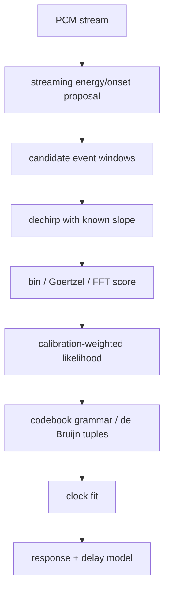

# Chirplet Transform And Controlled Chirp Codebook Deep Dive

## Core Distinction

There are two different machines that share similar math:

1. A general chirplet transform asks: "what chirp-like atoms exist in this
   signal?"
2. Mimir's active receiver asks: "which known emitted atom arrived when, through
   which distorted path?"

The second machine is much cheaper because the codebook, slopes, timing plan,
and symbol grammar are known.

## Uses For Mimir

### Timing Synchronization

Each decoded code-valid chirp tuple can become a canonical timeline anchor.
With enough anchors, fit:

- offset;
- sample-rate offset;
- confidence;
- jitter/residual.

### Frequency Response Normalization

Each classified chirp yields observed energy across bins. Aggregated over time:

- reliable bands;
- dead bands;
- alias/confusion bands;
- path coloration.

### Phase / Group Delay

If phase is coherent enough, dechirped complex bin responses can estimate:

- per-bin phase;
- phase slope across frequency;
- group delay correction;
- reflection/path stability.

### Localization

Known emitted time plus observed receiver time gives a distance constraint when
the source and receiver clocks are modeled. Multiple receivers turn this into a
position estimate. Multiple emitters/receivers turn it into room calibration.

### Watermarking

Hybrid mode can embed low-gain coded chirps under program audio. The watermark
should be:

- sparse enough not to annoy;
- deterministic enough to identify time;
- adaptive enough to avoid dead acoustic bands;
- continuous enough to track drift.

## Decoder Pipeline

## What The Current Code Has

- Fixed-slope chirp-bin renderer.
- De Bruijn codebook plan.
- Energy/onset proposals.
- Dechirp/bin scoring.
- Ambiguity candidates.
- Global bin-shift hypotheses.
- Clock fit and source-offset refinement.
- Calibration model with response/confusion/delay/phase/adaptive codebook.

## What Is Missing

- Streaming candidate state.
- Calibration-weighted likelihood before path selection as the default physical
  path, not just optional model support.
- Better group-delay model.
- Reduced reliable-bin physical proof.
- Native/SIMD/GPU scoring path after correctness is proven.

## Algorithm Options

### Option A: Goertzel Bank

Best when:

- bin count is small;
- sample window is short;
- CPU SIMD is available;
- frequencies are fixed.

Pros:

- No FFT plan overhead.
- Easy to weight per bin.
- Simple to port to AVX2.

Cons:

- Repeats work per bin.
- Less attractive if bin count/window count grows.

### Option B: Dechirp + FFT

Best when:

- many bins;
- many candidates;
- batching is possible.

Pros:

- Canonical CSS receiver shape.
- Good fit for GPU/native FFT batches.

Cons:

- FFT overhead and memory motion can dominate small cases.

### Option C: Chirp Z Transform

Best when:

- only a narrow frequency band is needed at high resolution;
- arbitrary frequency grid matters.

Pros:

- Efficient zoomed spectral analysis.

Cons:

- More complex than current fixed bins.
- Might be premature unless physical data shows bin boundaries are the problem.

### Option D: Matched Chirplet Atoms

Best when:

- emitted atoms are varied and not reducible to one common slope.

Pros:

- General.

Cons:

- Too expensive and too unconstrained for the current controlled beacon.

## Implementation Rule

Build the controlled CSS-like receiver first. Pull in full chirplet machinery
only when the codebook stops being controlled or when a research proof shows a
specific invariant the controlled receiver cannot protect.

